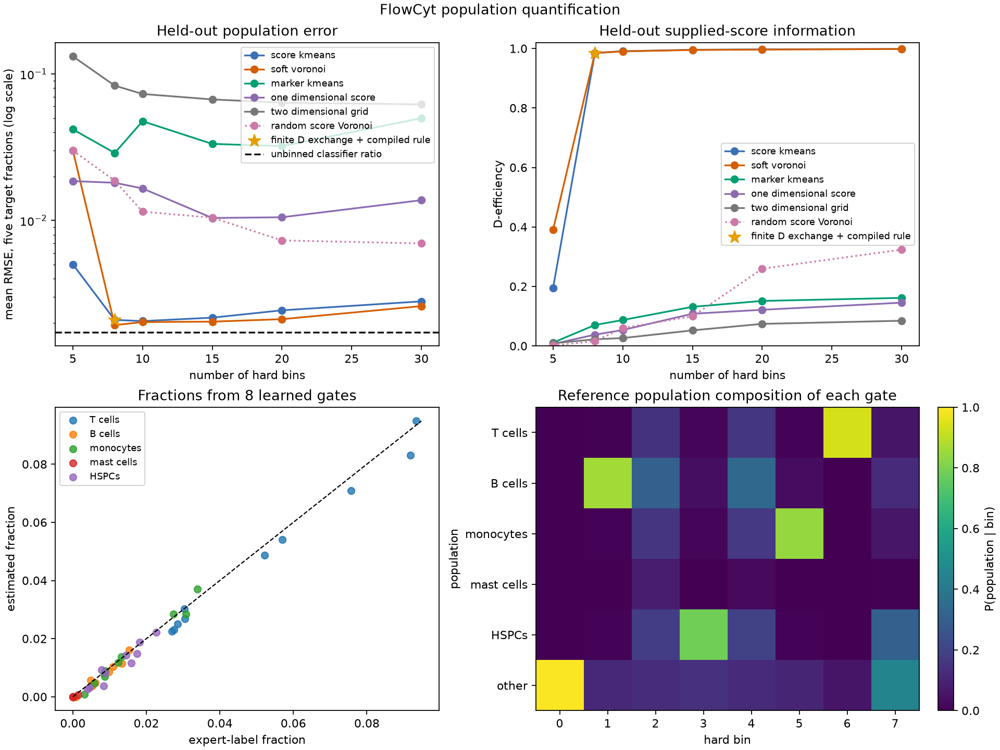

# ScoreQuant

**Turn continuous or high-dimensional events into a small histogram designed for parameter estimation.**

[](https://github.com/VitalyVorobyev/scorequant/actions/workflows/ci.yml)
[](https://vitalyvorobyev.github.io/scorequant/)

Many analyses start with thousands or millions of events and end by estimating
an unknown parameter vector. The events may be cells with twelve marker
measurements, collisions with many reconstructed variables, or samples from a
simulator. The final likelihood may still need a small set of hard bins.

An ordinary grid preserves geometry in the measured variables. That is not
necessarily the geometry that matters for inference. Two nearby events can
support different parameter values, while two distant events can carry the same
statistical evidence. ScoreQuant learns bins from that evidence.

## The core idea

For each event, the **score** measures how the log likelihood changes when a
parameter changes:

\[
s(x)=\nabla_\theta\log p(x\mid\theta)\big|_{\theta_0}.
\]

Events with similar scores affect the parameter fit in similar ways. ScoreQuant
partitions score space, assigns every event to one hard bin, and reports how much
local Fisher information the resulting counts retain.

```text
measured event -> statistical score -> learned hard bin -> bin counts
```

The library does not invent the statistical model and does not run the final
parameter fit. It builds the information-aware hard interface between them.

## Install

Add ScoreQuant directly from GitHub:

```bash
uv add "scorequant @ git+https://github.com/VitalyVorobyev/scorequant.git"
```

## A complete first partition

For a Gaussian location model, \(x\sim\mathcal N(\mu,1)\), the score at
\(\mu_0=0\) is simply \(s(x)=x\). This gives a useful first example because the
score is exact and needs no classifier or density estimator.

<!-- quickstart-test:start -->
```python
import numpy as np
import scorequant as fb

rng = np.random.default_rng(7)
reference = rng.normal(size=20_000)

partition = fb.fit_scores(
    reference[:, None],
    n_bins=4,
    config=fb.KMeansConfig(seed=7, n_init=8),
)

observed = rng.normal(loc=0.3, size=2_000)
observed_bins = partition.predict(observed[:, None])
counts = np.bincount(np.asarray(observed_bins), minlength=partition.n_bins)

print(counts.tolist())
print(f"retained information: {partition.train_report.geometric_mean_retention:.3f}")
```
<!-- quickstart-test:end -->

The deterministic output is:

```text
[768, 200, 547, 485]
retained information: 0.882
```

`partition.predict(...)` is the frozen event-to-bin map. The four counts can now
feed a count likelihood for \(\mu\). In this one-parameter example, the reported
retention means that the four-bin likelihood keeps about 88.2% of the local
Fisher information available in the supplied exact scores.

## Choose the input you already have

ScoreQuant keeps the path to score vectors explicit:

| You have | Use | The fitted result predicts from |
| --- | --- | --- |
| Physical variables and callable linear components | `fit` | physical variables |
| Evaluated component values | `fit_components` | component values |
| Statistical scores | `fit_scores` | scores |
| Classifier posteriors for a finite mixture | `mixture_scores_from_posteriors`, then `fit_scores` | scores |

The [workflow guide](https://vitalyvorobyev.github.io/scorequant/user-workflow/)
explains these representations and their contracts. The
[classifier-mixture tutorial](https://vitalyvorobyev.github.io/scorequant/tutorials/classifier-mixtures/)
shows how calibrated class probabilities become mixture-fraction scores without
making classifier training part of the library.

## When ScoreQuant is a good fit

Use it when:

- the downstream analysis requires hard bins, gates, categories, or template counts;
- you can supply credible local scores, analytic components, or classifier posteriors;
- preserving parameter sensitivity matters more than preserving geometric locality.

There is no required ordering between the observation dimension and the number
of parameters. Once scores have been constructed, ScoreQuant works in the
parameter-score space and no longer depends on the dimension of the original
observations. The common high-dimensional-event/few-parameter setting is an
important use case, not a mathematical assumption.

Use the exact unbinned likelihood when it is available, validated, and cheap
enough. Use ordinary geometric bins when spatial locality or human-readable
rectangular cuts are the primary requirement. A high Fisher retention also does
not prove that an approximate classifier or simulator is unbiased; upstream
model closure must be checked separately.

## Evidence on real high-dimensional events

The FlowCyt study starts from 600,000 real cells, learns a five-dimensional score
representation for six population fractions, and compresses each held-out
patient to eight integer counts. The frozen eight-bin partition retains 98.2%
of the supplied-score Fisher information and reaches a macro fraction RMSE of
0.00196. The selected unbinned classifier-ratio fit reaches 0.00173.



This result has an important limitation. ScoreQuant measures compression loss
for the supplied scores; it cannot remove bias in the learned likelihood ratios.
The complete study therefore reports classifier closure, fixed-total
identifiability, patient-level shift, hard-bin occupancy, downstream convergence,
and boundary behavior separately.

Read the [complete FlowCyt study](https://vitalyvorobyev.github.io/scorequant/usecases/cellpopulation/)
or browse the reproducible [synthetic gallery](https://vitalyvorobyev.github.io/scorequant/gallery/).

## Learn the method

The documentation starts from basic statistical estimation and does not assume
prior knowledge of score compression:

- [The estimation problem](https://vitalyvorobyev.github.io/scorequant/learn/estimation-problem/)
- [Likelihood and score](https://vitalyvorobyev.github.io/scorequant/learn/likelihood-and-score/)
- [What binning loses](https://vitalyvorobyev.github.io/scorequant/learn/binning-loss/)
- [First analytic tutorial](https://vitalyvorobyev.github.io/scorequant/tutorials/first-partition/)
- [API guide](https://vitalyvorobyev.github.io/scorequant/api/)
- [Generated reference](https://vitalyvorobyev.github.io/scorequant/reference/)
- [Bibliography](https://vitalyvorobyev.github.io/scorequant/bibliography/)

The executable notebooks show the same ideas without hiding the work behind an
experiment wrapper:

- [Gaussian location](examples/notebooks/gaussian_location.ipynb): derive an exact score and learn the first partition;
- [linear components](examples/notebooks/linear_workflow.ipynb): follow physical variables through components and scores to bins;
- [spectral templates](examples/notebooks/spectral_templates.ipynb): understand non-contiguous information-aware bins;
- [spatial sources](examples/notebooks/spatial_sources.ipynb): compare physical and score geometry;
- [FlowCyt](examples/notebooks/cell_population.ipynb): inspect data, build classifier scores, learn gates, and fit count templates step by step.

ScoreQuant is available under the [MIT license](LICENSE).
