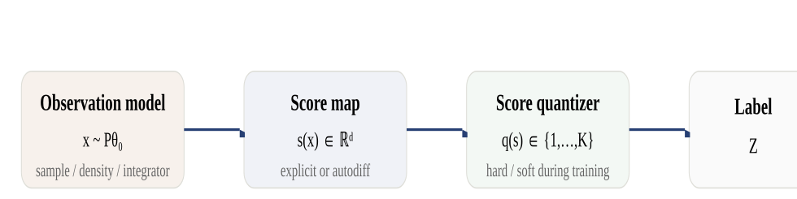
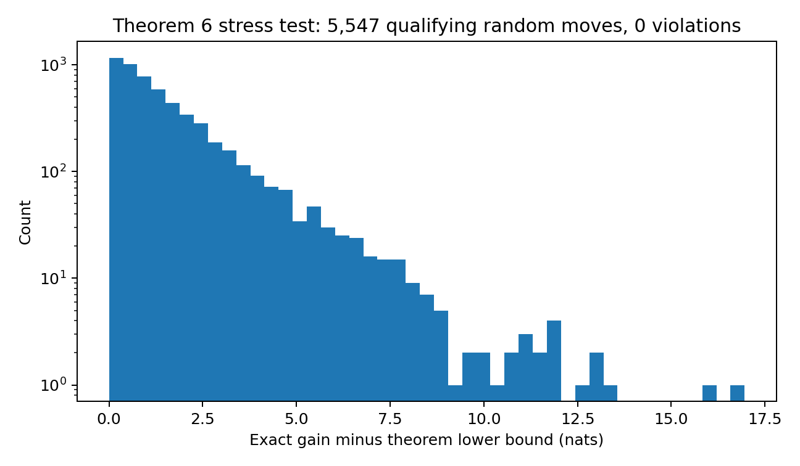
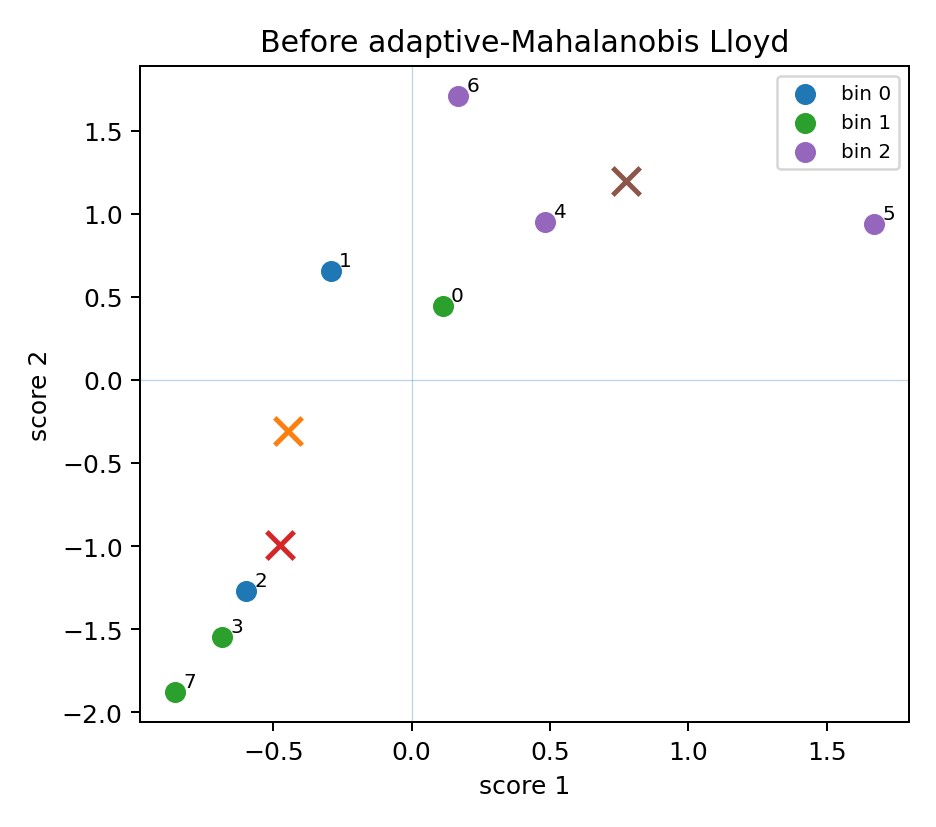
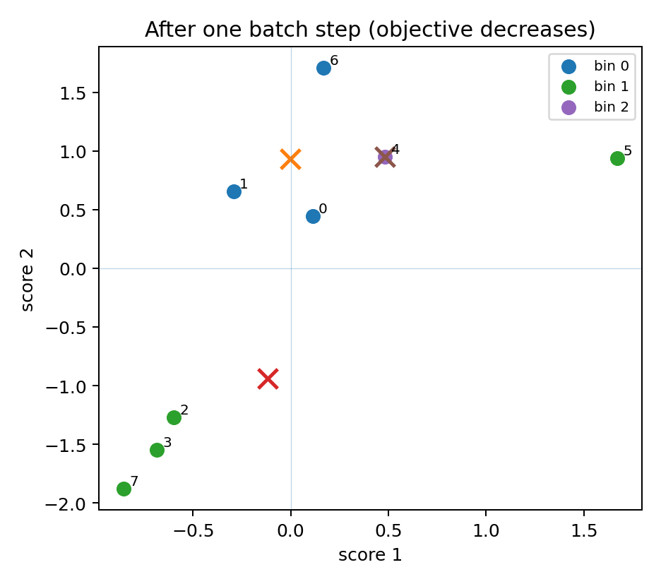
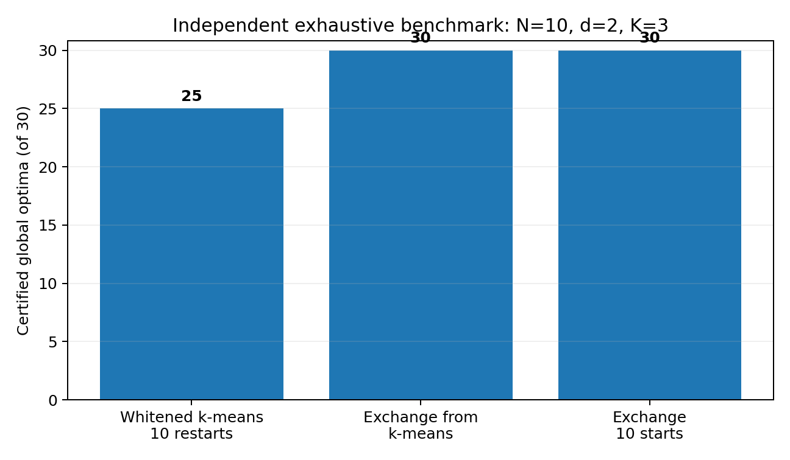
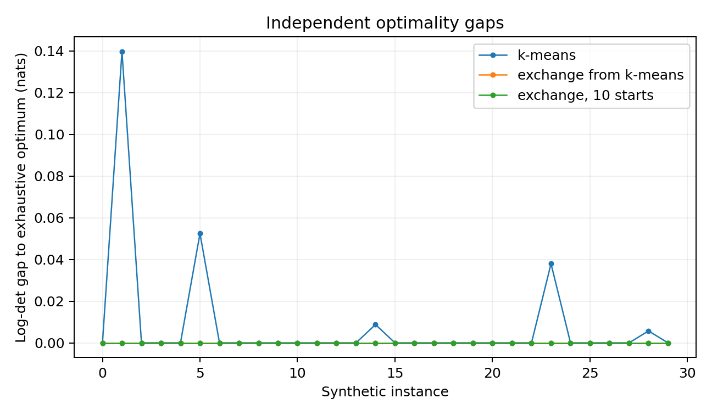

<header markdown="1">
<div class="kicker">Research manuscript draft · September 2026</div>
<h1>Information-optimal hard quantization of multivariate score space</h1>
<div class="subtitle">Exchange stability compiles finite D-optimal partitions into deployable quantizers; for profiled \(D_s\) the bridge is conditional, priced, and certified only by a closed bracket.</div>
<div class="meta">
<span class="tag">Fisher information</span><span class="tag">score-space quantization</span><span class="tag">hard binning</span><span class="tag">D-optimality</span><span class="tag">profiled \(D_s\)</span><span class="tag">finite-to-population bridge</span><span class="tag">margins and stable basins</span><span class="tag">certified brackets</span><span class="tag">A-optimality</span><span class="tag">E-optimality</span><span class="tag">information efficiency</span>
</div>
</header>

## Abstract

Let \(S\) be the score of a regular parametric model at a reference parameter. We compress \(S\) into \(K\) hard labels retaining as much Fisher information as possible; the retained information is the between-cell scatter of the conditional mean score. Three problems are kept apart: labelling a fixed sample, fitting a quantizer for future scores, and designing one under the score law. For D-optimality an exact rank-two relocation identity and a leverage inequality show that every one-point-exchange-stable partition of merged score atoms into exactly \(K\) nonempty cells, at zero gain tolerance, is a strict self-consistent Mahalanobis Voronoi partition, so a finite D solution compiles into a deployable rule. For profiled \(D_s\) the same implication fails at global finite optima. We characterize population stationarity as nearest-projected-centroid assignment in the binned efficient score, bound first-order violations at exchange-stable states by a leverage factor, and prove a conditional finite-to-population bridge under five margins. On conditionally centered laws with a scalar nuisance the margins are not free: global finite optima converge to the nuisance-degenerate interval quantizer of the efficient score, the conditioning margin fails along them, every margin costs a definite amount of information, and the margin-certified exchange-stable branch is almost surely eventually empty; one law outside the class admits a transfer through global selection. A tilt dynamic-programming dual brackets the finite profiled optimum with a set-valued saddle closure test; strong duality can fail by order one. A- and E-optimality, differentiable randomized quantizers, and density-ratio access to the score complete the framework.

## 1. Introduction

Many statistical pipelines end by replacing a high-dimensional observation with a small categorical symbol: a histogram bin, an event category, a codeword. At a fixed reference parameter the local inferential content of an observation is its score, the gradient of the log likelihood, so the design problem is direct: partition multivariate score space into \(K\) cells so that the label retains as much Fisher information as possible. The label's information is the between-cell scatter of the conditional mean score, so this is a clustering problem with a matrix-valued objective.

The choice of scalar summary changes the mathematics. Fisher-normalized trace reduces after whitening to weighted \(k\)-means [1], [29], [3], [4] [novelty: known; ledger V8-03], whereas D-optimality depends on the determinant of the whole retained matrix and couples all directions through a metric the partition itself determines; profiled \(D_s\) couples them through a projection the partition also determines after subtracting a nuisance block.

Optimizing the labels of observations already in memory is not the same task as learning a function that labels the next observation: a finite labeling underdetermines its extension outside the observed score vectors, while a deployable quantizer is a function on score space, hence an estimator learned from finite data. The distinction is immaterial for classical quantizers posed over centers or boundaries, unavoidable for exact label-exchange methods.

| Problem | Object optimized | Semantics of the result |
|---|---|---|
| A. Population design | measurable \(q\) under the score law \(P_S\): \(\sup_q F(I_P(q))\) | inherently a rule for future scores |
| B. Empirical inductive fitting | \(q_\eta\) in an explicit class \(\mathcal Q\) maximizing \(F(I_{P_n}(q_\eta))\) | a prediction rule, validatable on new samples |
| C. Finite assignment | arbitrary labels \(z_1,\ldots,z_N\) of a weighted score table | a transductive partition; no unique extension off the observed rows |

These problems need not share a finite optimum, and each is legitimate. The distinction follows the empirical-versus-population analysis of Pollard [12] and the terminal-versus-Voronoi analysis of Telgarsky and Vattani [8]; it is a framing, not a theorem [novelty: known; ledger V8-02]. When does a theorem connect the levels? For D-optimality one does, exactly and at finite \(N\); for profiled \(D_s\), A, and E no exact finite bridge exists, and for \(D_s\) the levels are reconnected only conditionally, through margins that turn out to be priced rather than free.

**Contributions.** (i) Theorem 2: on merged distinct score atoms, with exactly \(K\) nonempty cells and zero gain tolerance, one-point exchange stability for D forces strict self-consistent \(I^{-1}\)-Mahalanobis Voronoi geometry; the converse fails and split duplicate atoms are a genuine boundary. We found no direct precedent, and the nearest prior art [8] concludes the opposite for squared error. (ii) Theorem 8, the \(D_s\) dichotomy on conditionally centered scalar-nuisance laws. (iii) Theorems 9 and 10: every conditioning margin costs a definite amount of information, and conditional centering empties the margin-certified exchange-stable branch. (iv) Theorem 11: an explicit off-class law with an isolated population optimum to which global finite optima transfer at a computable rate. (v) Theorem 12: a tilt dynamic-programming dual bracketing the finite profiled optimum, with a set-valued saddle closure test and exact order-one duality gaps. Around these sit the rank-two relocation identity, the population efficient-Voronoi characterization (Theorem 5), the profiled leverage bound (Proposition 6), and the conditional bridge under (M1)–(M5) (Theorem 7).

**Map.** The main text reads without the appendices: Appendix A catalogues access to the score law, Appendix B auxiliary D results, Appendix C the \(D_s\) proofs, Appendix D bracket complexity, Appendix E the E and A propositions, Appendix F differentiable quantizers, Appendix G fixtures, Appendix H ledger placement.

## 2. Prior work

**Fisher-information quantization.** Score-function quantizers for distributed estimation were introduced by Venkitasubramaniam, Tong, and Swami [1], [29]; Farias and Brossier analyzed Fisher-optimal scalar quantization [2]. Barnes, Han, and Özgür showed that the Fisher information of a quantized observation is the scatter of the conditional score means and derived trace bounds [3]; Dülek proved that trace-optimal sufficient-statistic quantizers in exponential families have polytopal cells [4]. Zhang, Blum, Kaplan, and Lu established the alphabet-size obstruction on the rank of quantized Fisher information [30]. Valassi's weight-derivative regression states the scalar retained-information ratio [23]. They supply the score representation and trace geometry used here; our focus is the full-matrix criteria, the finite relocation structure, and the finite-to-population question.

**Determinant clustering, exchange methods, and Voronoi structure.** Determinant-based clustering criteria go back to Friedman and Rubin [5] and Scott and Symons [6], with the determinant of within-cluster scatter; above dimension one, minimizing \(\det W\) is not equivalent to maximizing \(\det B\). Exact point-relocation search has a long history: Hartigan's local search [7], Späth's exchange method [24], [25], and the exchange algorithms for discrete D-optimal designs [71] in the tradition of Fedorov [70], resting on rank-one inverse updates [68], [69] and monotone weight algorithms [40]. Telgarsky and Vattani showed Hartigan stability to be stronger than Lloyd stationarity for \(k\)-means [8]. Inaba, Katoh, and Imai used Voronoi realizability and arrangement enumeration for fixed-parameter exact clustering [9]. Theorem 2 has the flavor of these comparisons but rests on a determinant-specific leverage identity, and the template of [9] gives the algorithm of §4.3.

**Population quantization and consistency.** Centroidal Voronoi tessellations give the population picture for squared-error quantization and Lloyd-type algorithms [13], [14]; [33] gives existence and stationarity of optimal quantizers. Pollard's strong consistency theorem for \(k\)-means [12], its quantization form [50], and Sabin and Gray's generalized-Lloyd consistency [51] are the empirical-to-population templates, with the uniform laws of empirical-process theory [52], [53] as the engine; [54] shows \(k\)-means consistency failing and restored by constraints, and Rakhlin and Caponnetto give the rigidity of almost-minimizing codebooks [56]. In one dimension Fisher's contiguity theorem [43] and the dynamic programmes of [44], [45] solve the grouping problem exactly, and [31], [32] give uniqueness of locally optimal quantizers for log-concave laws; [58] treats the nonregular univariate case. Levrard's margin condition [34] is a hypothesis for fast rates; §5 finds an analogous margin failing at global optima. Self-consistency [57], principal points of elliptical laws [60], the principal-curve origin of the term [61], and the generalized principal-subspace theorem [62] are the comparators for §5.8's coincident-centroid phenomena. None optimizes a hard-partition matrix information criterion.

**Density-ratio estimation and learned scores.** Direct density-ratio estimation fits \(p_1/p_0\) from samples without estimating either density [22]; calibrated probabilistic classifiers recover the same ratio up to known prior odds [21]. Differentiating a ratio between nearby hypotheses gives the local score, the principle of score-based likelihood-free inference [17]. Nuisance-hardened compression [27] and information-maximizing neural summaries [28] are the continuous-summary precedents. Inference-aware methods learn summaries or categories by differentiating through an inference objective [18], [19], [20]. Neither density-ratio estimation nor differentiable binning is claimed here; what is claimed is the information-quantization problem and its structure given a score.

**Profiled designs, Schur complements, and tilt duality.** Optimal-design equivalence theory gives the convex-analytic language for D, \(D_s\), A and E: Kiefer [41], Whittle [38], Wynn [37], Silvey and Titterington [39], Näther and Reinsch's \(D_s\) equivalence theorem [16], Pukelsheim's monograph with the nondifferentiable E criterion and the matrix means \(\phi_p\) [15], the duality theory of Pukelsheim and Titterington [63], and the efficiency conventions of [72]. Silvey's singular \(D_s\)-optimal design measures [35] and information-based subdata selection [36] frame the design-side reading of §5's nuisance-degenerate limits. The profiled information is a Schur complement, whose extremal characterization is due to Krein [46] and Anderson [47], [48] in the form of Li and Mathias [26]; Haynsworth's inertia formula [55] gives rank additivity; the statistical reading is the efficient score [42], [49]. Purification of randomized rules under atomless laws is the Dvoretzky–Wald–Wolfowitz theorem [10], [11]. The tilt dual of §6 is the partition-side form of design duality, computed through Megiddo's parametric search [64], Toledo's fixed-dimension concave maximization [65], and parametric-envelope lower bounds [67], [66]; Chebyshev's covariance inequality [59] enters the centering obstruction of §5.8.

## 3. Setting

### 3.1 Score space and the information retained by a label

Let \(P_\theta\) be a regular parametric model on \((\mathcal X,\mathcal A)\) with \(\theta\in\mathbb R^d\). At a reference point \(\theta_0\) define
\[
S=s(X)=\nabla_\theta\log p(X\mid\theta)\big|_{\theta_0},\qquad \mathbb E[S]=0,\qquad I_{\rm full}=\mathbb E[SS^\top]\succ0 .
\]
A hard quantizer is a map \(q:\mathbb R^d\to\{1,\ldots,K\}\), \(Z=q(S)\), with observation-space compressor \(Q(x)=q(s(x))\). The optimization depends on the model only through the push-forward score law \(P_S=s_\#P_{\theta_0}\): a finite table, a simulator output, a score sampler, or an analytic integral.

<div class="diagram">
<figure><figcaption>Observations are mapped to scores at the reference parameter, the quantizer assigns one of \(K\) labels, and the retained information is the between-cell scatter of the label.</figcaption></figure>
</div>

For cell \(b\) let \(W_b=P(q(S)=b)\), \(m_b=\mathbb E[S\,1_{\{q(S)=b\}}]\), \(\mu_b=m_b/W_b\). The score of the label is its conditional mean score, hence
\[
I_q=\sum_{b=1}^K W_b\mu_b\mu_b^\top=\sum_{b=1}^K\frac{m_bm_b^\top}{W_b}=\operatorname{Var}(\mathbb E[S\mid Z]),
\qquad
I_{\rm full}=I_q+\mathbb E[\operatorname{Cov}(S\mid Z)] .
\tag{3.1}
\]
Every criterion below depends on \(q\) only through \((W_b,m_b)\). The identity (3.1) is the score-function quantization identity of [1], in the geometric form of [3], [4], with the scalar form of [23] [novelty: known; ledger V8-01]. Since \(\sum_bm_b=0\), \(\operatorname{rank}I_q\le\min(d,K-1)\), so \(K\ge d+1\) is necessary for a nonsingular full D criterion; refinement increases \(I_q\) in Loewner order; and D-optimal partitions are invariant under invertible reparameterization of \(\theta\). The rank ceiling is the alphabet-size obstruction of [30]; refinement monotonicity and D reparameterization invariance are standard [novelty: known; ledger V8-04]. Scores are never centered by the optimizer: the score-space origin carries statistical meaning, and exact sample centering appears only where a theorem says so.

### 3.2 First variation and common-metric stationarity

Moving mass \(d\varepsilon\) at score \(s\) from cell \(a\) to \(b\) changes \(I_q\) by \([(s-\mu_a)(s-\mu_a)^\top-(s-\mu_b)(s-\mu_b)^\top]d\varepsilon\), so for a differentiable \(F\) with symmetric gradient \(G=\nabla_IF(I)\),
\[
\frac{dF}{d\varepsilon}=(s-\mu_a)^\top G(s-\mu_a)-(s-\mu_b)^\top G(s-\mu_b),
\tag{3.2}
\]
so a regular atomless population local optimum satisfies the nearest-cell rule \(q(s)\in\arg\min_b(s-\mu_b)^\top G(s-\mu_b)\) a.e., provided \(F\) is differentiable at \(I_q\) and ties null. This is the Gateaux derivative of (3.1): the first variation of centroidal Voronoi energies [13] with the directional derivatives of design criteria [15] [novelty: direct corollary; ledger V8-07].

<div class="proposition" markdown="1">
<div class="box-title" markdown="span">Proposition 1 — affine form of a common-metric stationary partition</div>

If the same symmetric matrix \(G\) is used for all cells, pairwise comparisons cancel the common term \(s^\top Gs\). Thus every cell is an intersection of affine halfspaces. For \(G\succeq0\) the rule is a Mahalanobis Voronoi diagram, possibly cylindrical when \(G\) is singular. Equivalently it is an affine-max classifier \(q(s)=\arg\max_b(a_b^\top s+c_b)\). [novelty: adaptation; ledger V8-08]

</div>

Proposition 1 transfers the Lloyd/CVT necessary condition [13] to a partition-dependent Mahalanobis metric; polyhedral cells for trace-type criteria are already in [3], [4]. It is stationarity, not optimality.

### 3.3 The criteria

*D-optimality.* \(F_D(I)=\log\det I\), \(G_D=I^{-1}\). Regular population stationary quantizers are self-consistent Mahalanobis Voronoi partitions, \(q(s)=\arg\min_b(s-\mu_b)^\top I_q^{-1}(s-\mu_b)\), the metric determined by the partition itself; the D specialization of Proposition 1, stating stationarity only.

*Profiled \(D_s\)-optimality.* Split \(\theta=(\psi,\lambda)\) into interest \(\psi\in\mathbb R^{d_\psi}\) and nuisance \(\lambda\in\mathbb R^{d_\lambda}\), write \(I=\begin{pmatrix}A&B\\B^\top&C\end{pmatrix}\), \(S_\psi(I)=A-BC^{-1}B^\top\), and
\[
F_s(I)=\log\det S_\psi(I)=\log\det I-\log\det C ,
\tag{3.3}
\]
the profiled information when both parameters are estimated from the binned label. The Schur-complement form is the classical \(D_s\) criterion of optimal design [37], [38], [41], [39], [16], [15], with the nuisance-hardened reading of [27] [novelty: known; ledger V8-21]; its feasible set of probability measures differs from the hard-partition set, so the equivalence theorems do not transfer. The gradient is
\[
G_s=I^{-1}-E_\lambda C^{-1}E_\lambda^\top=L^\top S_\psi(I)^{-1}L\succeq0,\qquad L=[\,I_{d_\psi},-BC^{-1}\,],
\tag{3.4}
\]
of rank \(d_\psi\), where \(E_\lambda\) selects the nuisance coordinates (\(E_\lambda^\top IE_\lambda=C\)), so a regular population stationary quantizer is Voronoi in the projected *binned efficient score* \(e_q(s)=s_\psi-BC^{-1}s_\lambda\), cells being cylindrical along the nuisance directions annihilated by \(L\). This is the Schur-complement derivative, the \(D_s\) sensitivity function of [16], [15], with (3.2) [novelty: direct corollary; ledger V8-22]. Section 5 sharpens it and shows that stationarity alone does not separate projected centroids.

*A-optimality.* \(F_A(I)=-\operatorname{tr}(I^{-1})\), \(G_A=I^{-2}\), differentiable and concave on the cone.

*E-optimality.* \(F_E(I)=\lambda_{\min}(I)\), concave and Loewner-monotone but nonsmooth at eigenvalue multiplicities. At a simple smallest eigenvalue with unit eigenvector \(v\), \(G_E=vv^\top\) and stationarity is the rank-one rule \(q(s)=\arg\min_b(v^\top(s-\mu_b))^2\): only the least-informed projection matters to first order.

Throughout \(\Phi_{D_s}(q)=\log\det S_\psi(I_q)\); at \(d_\psi=1\) we also write \(\Phi_s(q)=S_\psi(I_q)\), which orders quantizers identically, and \(\hat\Phi_s\) for its empirical value.

### 3.4 Access to the score law

Nothing above requires stored densities: the local score is the parameter derivative of a log density ratio, \(s(x)=\nabla_\theta\log[p(x\mid\theta)/p(x\mid\theta_0)]|_{\theta_0}\). Analytic ratio functions, direct ratio estimators, and calibrated classifiers are interchangeable upstream routes; a classifier estimates the ratios, is not part of the quantization method, and a ranking-only discriminant is insufficient. These are bridges over published identities [17], [21], [22] [novelty: known; ledger V8-05]. When estimated ratios yield \(\hat s\ne s\), the optimized matrix \(\operatorname{Var}(\mathbb E[\hat s\mid q(\hat s)])\) is a surrogate for the true retained information \(\operatorname{Var}(\mathbb E[s\mid q(\hat s)])\), and score-estimation error separates from quantization error [17], [27], [28] [novelty: known; ledger V8-06]. A score provider is not a training distribution: population optimization also needs the reference measure, a sample, importance weights, or an integration oracle. Appendix A catalogues the admissible inputs, the linear-component case, and the classifier and mixture formulas.

## 4. D-optimality: exchange stability closes the bridge

### 4.1 Exact finite relocation

Move a point \((s,w)\) of a weighted score table from a non-singleton cell \(a\) to \(b\), and let
\[
u_a=s-\mu_a,\quad u_b=s-\mu_b,\quad
\alpha=\frac{wW_a}{W_a-w},\quad
\beta=\frac{wW_b}{W_b+w}.
\tag{4.1}
\]
The exact change of retained information is one positive and one negative rank-one update,
\[
\Delta I=\alpha u_au_a^\top-\beta u_bu_b^\top .
\tag{4.2}
\]
The \(ss^\top\) contributions cancel; derivation in Appendix B.

With \(H=I^{-1}\), \(q_{aa}=u_a^\top Hu_a\), \(q_{bb}=u_b^\top Hu_b\), \(q_{ab}=u_a^\top Hu_b\), the matrix determinant lemma gives the closed gain
\[
\Delta F_D=\log\!\left[(1+\alpha q_{aa})(1-\beta q_{bb})+\alpha\beta q_{ab}^2\right],
\tag{4.3}
\]
so a candidate move costs three inverse-metric inner products. Identities (4.2)–(4.3) adapt the exchange-method scatter updates of Späth [24], [25], in the determinant-clustering tradition of [5], [6], from within-cluster scatter to the between-cell information matrix with centroid-coupled \(\alpha,\beta\) [novelty: adaptation; ledger V8-09].

### 4.2 Exchange stability forces self-consistent geometry

The bridge rests on one inequality. For a nonsingular partition,
\[
(\mu_a-\mu_b)^\top I^{-1}(\mu_a-\mu_b)\le\frac1{W_a}+\frac1{W_b},
\tag{4.4}
\]
the hat-matrix leverage inequality on the columns \(\sqrt{W_b}\mu_b\) (Lemma B.1); it bridges infinitesimal D geometry to exact finite gains [novelty: known; ledger V8-10].

<div class="theorem" markdown="1">
<div class="box-title" markdown="span">Theorem 2 — finite D exchange stability forces self-consistent Voronoi geometry</div>

Let \(s_1,\ldots,s_N\in\mathbb R^d\) be the distinct score atoms obtained after merging coincident score rows, with strictly positive weights \(w_i>0\), partitioned into exactly \(K\) nonempty cells. Assume \(I\succ0\). Let the only constraint on a one-atom relocation be that its source cell remain nonempty, and let exchange stability mean that no admissible relocation has strictly positive exact \(\log\det I\) gain, with zero gain tolerance. For an admissible move \(a\to b\) between distinct centroids, if the atom is no closer to its own centroid than to \(b\) in the current D metric, \(q_{aa}\ge q_{bb}\), then
\[
\Delta F_D\ge\log\!\left(1+\frac{\alpha\beta}4q_\delta^2\right)>0,
\qquad
q_\delta=(\mu_a-\mu_b)^\top I^{-1}(\mu_a-\mu_b).
\tag{4.5}
\]
Distinct centroids are a consequence of stability, not an additional hypothesis: coincident centroids either admit a strictly improving relocation or force duplicate atoms, excluded by merging. A singleton atom is then strictly nearest to its own centroid. Hence every one-point-exchange-stable finite D partition under these hypotheses is a strict self-consistent \(I^{-1}\)-Mahalanobis Voronoi partition on the merged atoms,
\[
(s_i-\mu_{z_i})^\top I^{-1}(s_i-\mu_{z_i})<(s_i-\mu_b)^\top I^{-1}(s_i-\mu_b)\qquad\text{for every }i\text{ and every }b\ne z_i .
\]
[novelty: apparently new; ledger V8-11]

</div>

*Proof sketch.* By (4.3) the determinant ratio is \(1+E\) with \(E=\alpha q_{aa}-\beta q_{bb}-\alpha\beta(q_{aa}q_{bb}-q_{ab}^2)\); eliminating \(q_{ab}\) through \(q_\delta=q_{aa}+q_{bb}-2q_{ab}\) and using \((\alpha-\beta)/(\alpha\beta)=1/W_a+1/W_b\) from (4.1) lets the leverage bound (4.4) meet the gain exactly, leaving \(E\ge\frac{\alpha\beta}4q_\delta^2\) when \(q_{aa}\ge q_{bb}\). Full proof in Appendix B. \(\square\)

<div class="remark" markdown="1">
<div class="box-title" markdown="span">Boundary of Theorem 2: split duplicate atoms</div>

The merged-atom hypothesis cannot be dropped. Scalar scores \((1,1,-1)\) with weights \((1/4,1/4,1/2)\), each in its own singleton cell with \(K=3\), admit no nonempty-preserving relocation, so the labeling is vacuously exchange-stable; yet two centroids coincide and no deterministic score-only rule reproduces the split labels (fixture G3). The resolution is to merge coincident atoms before optimization, after which the theorem forces distinct centroids. [novelty: unresolved; ledger V8-12]

</div>

The converse fails: self-consistent nearest-centroid assignment under the current D metric is strictly weaker than exchange stability. An exact \(N=4\), \(d=1\), \(K=2\) D-Voronoi fixed point admits a strictly improving relocation (fixture G2), as did 35 of 100 random Lloyd/Voronoi fixed points, the determinant analogue of Lloyd fixed points that are not Hartigan-stable [8]; the chain global optimum \(\Rightarrow\) exchange-stable \(\Rightarrow\) strict D-Voronoi is strict in both arrows [novelty: unresolved; ledger V8-13].

The theorem closes the finite-assignment/quantizer gap for D: at exact one-point stability the terminal state has the canonical inductive extension
\[
\widehat q_D(s)=\arg\min_b(s-\mu_b)^\top\widehat I^{-1}(s-\mu_b),
\tag{4.6}
\]
which reproduces every merged-atom training label strictly, without a tie breaker, while a solver stopping at tolerance \(\varepsilon>0\) has only the tolerance-stamped guarantee that no geometric disagreement gains more than \(\varepsilon\) [novelty: direct corollary; ledger V8-14]. Every positive-definite global finite D optimum on merged atoms is exchange-stable, hence realizable in the form (4.6), so unrestricted finite D assignment and optimization over realizable affine-max labelings share the same optimum value, though not every D-Voronoi fixed point is globally optimal [novelty: direct corollary; ledger V8-15].

<figure>

<figcaption>
Among 5,547 moves satisfying the premise of Theorem 2, drawn from 15,000 random \(N=12,d=2,K=3\) configurations, no violation of the exact bound (4.5) was found.
</figcaption>
</figure>

### 4.3 Exchange, Lloyd proposals, and global search

Accepting only positive-gain moves is strict ascent, terminating at a one-point exchange-stable state that by Theorem 2 compiles to (4.6) [24], [7], [40] [novelty: direct corollary; ledger V8-16]. The batch iteration that freezes \(I^{-1}\), reassigns every point to its nearest centroid, and recomputes \(I\) is not monotone, because the tangent inequality of concave \(\log\det\) is an upper bound rather than a minorizer; batch proposals must be guarded by exact evaluation. The non-monotonicity is a witness, not a novelty, adaptive-metric Lloyd steps not having been prior-art searched [8] [novelty: unresolved; ledger V8-17].

<div class="figure-pair" markdown="1">
<figure>

<figcaption>An \(N=8,K=3,d=2\) state before the adaptive batch step (fixture G1); crosses mark Euclidean centroids only.</figcaption>
</figure>
<figure>

<figcaption>After one adaptive-Mahalanobis Lloyd reassignment: on the rounded coordinates reproduced here, \(\log\det I\) falls by \(0.136521\) nat. [novelty: unresolved; ledger V8-18]</figcaption>
</figure>
</div>

Because global optima are affine-max labelings, arrangement enumeration gives, for fixed \((d,K)\), an \(N^{O(Kd)}\) exact algorithm [9], XP and not known to be FPT (§9) [novelty: adaptation; ledger V8-19]. Refinement monotonicity supplies a branch-and-bound bound: treating every unassigned point as a singleton Loewner-dominates every completion, and the bound serves any Loewner-monotone criterion, E included [novelty: direct corollary; ledger V8-20]. Enumeration details in Appendix B.

<div class="figure-pair" markdown="1">
<figure>

<figcaption>
Exhaustive benchmark over all \(S(10,3)=9{,}330\) nonempty unlabeled partitions of centered, Fisher-whitened clouds. Ten-restart Euclidean \(k\)-means was globally D-optimal on 25/30 instances; exact exchange repaired every miss. A small benchmark, not a guarantee.
</figcaption>
</figure>
<figure>

<figcaption>
Log-determinant gaps to the exhaustive optimum for the same 30 instances; the largest \(k\)-means gap was \(0.1397\) nat, and exact exchange closed every gap.
</figcaption>
</figure>
</div>

## 5. Profiled \(D_s\): the bridge fails, then what survives

The determinant criterion owes Theorem 2 to a cancellation the profiled criterion lacks. Notation follows §3.3: \(B_q^*=I_{\psi\lambda}I_{\lambda\lambda}^{-1}\) for the binned blocks of \(I_q\), \(e_b=\mu_{b\psi}-B_q^*\mu_{b\lambda}\) the projected centroids, and \(\widehat S=S_\psi-B^*S_\lambda\), \(B^*=I^{\rm full}_{\psi\lambda}(I^{\rm full}_{\lambda\lambda})^{-1}\), the *full-data* efficient score.

### 5.1 Exact exchange survives, the D mechanism does not

The rank-two update (4.2) holds for any criterion, so for \(D_s\) the exact finite gain is a difference of two determinant-lemma gains, \(\Delta F_s=\Delta\log\det I-\Delta\log\det I_{\lambda\lambda}\), evaluable by low-rank algebra when both blocks stay nonsingular [novelty: direct corollary; ledger V8-23]; positive-gain exchange stays strictly monotone and terminates, as for D [24], [7], [40] [novelty: direct corollary; ledger V8-16]. A relocation is admissible only if its source cell stays nonempty and its destination keeps a nonsingular binned nuisance block, the *in-bin* convention (§5.9 shows the conventions differing). What fails is the step from a first-order violation to a positive finite gain: the nuisance determinant can offset the full determinant invisibly to the efficient semimetric, leaving an approximate version.

<div class="proposition" markdown="1">
<div class="box-title" markdown="span">Proposition 3 — approximate finite efficient-Voronoi geometry</div>

At a one-point-exchange-stable \(D_s\) partition with nonsingular blocks, let \(s_{aa}=u_a^\top G_su_a\), \(s_{bb}=u_b^\top G_su_b\), and \(q_{aa}=u_a^\top I^{-1}u_a\). For any admissible move of a point of weight \(w_i\),
\[
\left[s_{aa}-s_{bb}\right]_+\le w_iq_{aa}\Bigl(\frac1{W_a}+\frac1{W_b}\Bigr).
\]
Under uniform weights \(w_i=1/N\) and cell masses of order \(1/K\), the relative violation is \(O(K/N)\). [novelty: unresolved; ledger V8-24]

</div>

Proof in Appendix C; Proposition 6 needs neither balanced masses nor a mass floor.

The failure is not a local-search artifact. On a centered equal-weight \(N=8\), \(d=2\), \(K=3\) table, exhaustive enumeration of all 966 three-cell partitions gives a unique global \(D_s\) optimum violating the nearest-cell rule of its own \(G_s\) semimetric (fixture G4): unrestricted finite \(D_s\) assignment and self-consistent inductive \(D_s\) fitting are genuinely different problems, a counterexample, not a novelty claim [novelty: unresolved; ledger V8-25]. A second witness has a unique non-geometric optimum (fixture G5) [novelty: unresolved; ledger DS12-4].

### 5.2 The variational form and the domination bound

Let \(S_\psi^+(I)=I_{\psi\psi}-I_{\psi\lambda}I_{\lambda\lambda}^+I_{\lambda\psi}\), with the Moore–Penrose pseudo-inverse, which is the Schur complement when \(I_{\lambda\lambda}\succ0\).

<div class="lemma" markdown="1">
<div class="box-title" markdown="span">Lemma 4 — variational form of the generalized profiled information (classical)</div>

For any partition \(Z=q(S)\) with centered scores,
\[
S_\psi^+(I_q)=\min_B\operatorname{Var}\!\bigl(\mathbb E[S_\psi-BS_\lambda\mid Z]\bigr)
=\min_B\sum_bW_b(\mu_{b\psi}-B\mu_{b\lambda})(\mu_{b\psi}-B\mu_{b\lambda})^\top,
\tag{5.1}
\]
a Loewner minimum over \(d_\psi\times d_\lambda\) matrices, attained exactly at the solutions of \(BI_{\lambda\lambda}=I_{\psi\lambda}\), in particular at \(B_q^*=I_{\psi\lambda}I_{\lambda\lambda}^+\) [46], [47], [26]. [novelty: known; ledger DS11-1]

</div>

This is the extremal characterization of the generalized Schur complement [46], [47], [48], [26], read statistically as in [49], [42]; only the binned transfer is the project's. At a singular nuisance block the pseudo-inverse value can strictly exceed the feasible in-bin optimum.

Evaluating (5.1) at \(B^*\) gives the *domination bound*: for every quantizer,
\[
S_\psi(I_q)\preceq\operatorname{Var}\!\bigl(\mathbb E[\widehat S\mid q(S)]\bigr),
\qquad
\operatorname{Var}\!\bigl(\mathbb E[\widehat S\mid q]\bigr)-S_\psi^+(I_q)=(B^*-B_q^*)\,I^q_{\lambda\lambda}\,(B^*-B_q^*)^\top\succeq0 ,
\tag{5.2}
\]
so the best profiled value is at most the best D value from quantizing the efficient score, the binned transfer of [26] read through the efficient-score variance [42] and nuisance-hardened compression [27] [novelty: direct corollary; ledger V8-27]. Proposition C.1 adds the rest: the gap vanishes iff \((B^*-B_q^*)I^q_{\lambda\lambda}=0\), and along any refining sequence generating the Borel \(\sigma\)-field with \(I^{\rm full}_{\lambda\lambda}\succ0\) [26] [novelty: direct corollary; ledger DS11-3]; \(S_\psi^+\) never decreases under refinement, and a split is neutral iff some minimizer of the merged problem equalizes the sub-cell projected means [novelty: direct corollary; ledger DS11-2]. Neutral splits identify a finite global optimum only up to its reduced configuration \(\{(W_b,e_b)\}\): an exact centered \(N=8\), \(K=3\) sample attains its optimum at 31 labelings (fixture G6), so uniqueness fails, an atomic-grid artifact [novelty: unresolved; ledger DS11-4, DS11-5].

For \(d_\psi=1\), D-optimal quantization of an atomless scalar efficient score has ordered interval cells [43] and is solved exactly by dynamic programming in \(O(KN)\) time after sorting [44], [45]; exact ties among tilted values need the tie lemma of Appendix D.1 [novelty: known; ledger V8-29]. Two objects recur from here on. Write \(J^*\) for the optimal \(K\)-interval quantizer of \(\widehat S\), and
\[
v_K=\sup_q S_\psi^+(I_q),
\]
the best profiled value over all measurable \(K\)-cell quantizers. By (5.2), \(v_K\) is at most the between-cell variance \(\operatorname{Var}(\mathbb E[\widehat S\mid J^*(\widehat S)])\) of the efficient score under \(J^*\), its *between-value*; Theorem 8 shows when the two coincide. The interval programme that computes the empirical between-value \(\hat v_K\) on a sample is therefore an initializer and an upper certificate for the profiled problem, not a solution of it.

### 5.3 Population stationary geometry

Let \(P\) be atomless with \(\mathbb E[S]=0\), \(\mathbb E\|S\|^2<\infty\), and \(q\) have \(W_b>0\), \(I_q\succ0\). Relabeling \(E\subseteq A_a\) of mass \(\varepsilon\) and barycenter \(\bar s\) changes \(I_q\) as the rank-two relocation (4.2) at \((\bar s,\varepsilon)\). Call \(q\) *bounded-packet stationary* if for every \(a\ne b\) and \(R>0\)
\[
\limsup_{E\subseteq A_a\cap B(0,R),\ P(E)\to0}\ \frac{\Phi_{D_s}(q_{E\to b})-\Phi_{D_s}(q)}{P(E)}\le0 .
\tag{5.3}
\]

<div class="theorem" markdown="1">
<div class="box-title" markdown="span">Theorem 5 — population stationarity is efficient-Voronoi geometry</div>

\(q\) is bounded-packet stationary iff for every \(a\), \(P\)-a.e. \(s\in A_a\) and every \(b\),
\[
(s-\mu_a)^\top G_s(s-\mu_a)\le(s-\mu_b)^\top G_s(s-\mu_b),
\qquad
G_s=C^\top S_\psi(I_q)^{-1}C,\quad C=[\,\mathrm{Id}_{d_\psi},-B_q^*\,],
\tag{5.4}
\]
that is, nearest projected centroid in the \(S_\psi(I_q)^{-1}\) metric with \(e(s)=Cs\). Sufficiency holds for every \(P\); necessity needs atomlessness. The nearest-projected-centroid correspondence is a.e. single-valued and reproduces \(q\) up to null sets iff (i) the \(e_b\) are pairwise distinct and (ii) \(P\) charges no tie hyperplane. Stationarity does not force (i). [novelty: adaptation; ledger DS12-1]

</div>

Proof in Appendix C; it is the first-variation template of optimal design [15] in a solution-dependent semimetric, with [12], [33] as the \(k\)-means analogues; the witness of §5.1 violates (5.4). The theorem's last sentence is the population difference from D: under a nuisance-sign-symmetric law a \(\psi\)-threshold partition split by \(\operatorname{sign}(s_\lambda)\) is stationary with pairwise-coincident projected centroids and profiled-information-free cells (fixture G7) [novelty: unresolved; ledger DS12-2, DS12-3]. No efficient-semimetric rule separates coincident cells, whereas finite D forces distinct centroids (Theorem 2); a deployable rule must merge them first.

### 5.4 The profiled leverage bound

The finite input to the bridge is an exact inequality needing no balance.

<div class="proposition" markdown="1">
<div class="box-title" markdown="span">Proposition 6 — exact profiled leverage bound at exchange-stable states</div>

Finite level, positive weights, \(I\) and \(I_{\lambda\lambda}\) nonsingular. At a one-point exchange-stable profiled \(D_s\) state, for every \((s_i,w_i)\) in a non-singleton cell \(a\) with \(W_a>w_i\) and every \(b\ne a\),
\[
s_{aa}-s_{bb}\le\beta_i\,q_{aa}q_{bb}\le w_i\,q_{aa}q_{bb},
\qquad
\beta_i=\frac{w_iW_b}{W_b+w_i},
\tag{5.5}
\]
with \(s_{xx}=u_x^\top G_su_x\), \(q_{xx}=u_x^\top I^{-1}u_x\), \(u_x=s_i-\mu_x\). No merged-atom, balancedness or mass-margin hypothesis is used; moves with a singular destination are covered. [novelty: apparently new; ledger DS13-1]

</div>

We found no direct precedent; the nearest cousin is the leverage inequality (4.4). Proof in Appendix C. Unlike Proposition 3, (5.5) surfaces ill-conditioned cells through leverage factors rather than a mass floor; exact moves at 171 stable states gave no violation.

### 5.5 The conditional bridge

With the population geometry (Theorem 5) and the leverage bound (Proposition 6) in hand, the finite-to-population question can be posed conditionally: which hypotheses on a sequence of exchange-stable labelings make its companion rules converge to that geometry? The five margins below are exactly the quantities the proof needs to control; §5.6–§5.8 then ask what they cost. Let \(S_1,\ldots,S_N\) be i.i.d. from \(P\) with equal weights, \(z^{(N)}\) one-point exchange-stable \(K\)-cell labelings, and \(\rho_N\) the companion nearest-projected-centroid rule from the labeling's own binned quantities. The margins are (M1) \(P\) atomless, \(\mathbb E[S]=0\), \(\mathbb E\|S\|^2<\infty\); (M2) \(\min_b\hat W_b\ge c_0>0\); (M3) \(\lambda_{\min}(\hat I_N)\ge\kappa>0\); (M4) \(\sup_{\|v\|=1,c}P(|v^\top S-c|\le t)\le\varphi(t)\downarrow0\); (M5) \(\min_{b\ne b'}\|\hat e_b-\hat e_{b'}\|\ge\gamma>0\); (M2), (M3), (M5) along the sequence almost surely eventually.

<div class="theorem" markdown="1">
<div class="box-title" markdown="span">Theorem 7 — conditional finite-to-population bridge under (M1)–(M5)</div>

Almost surely: (1) \(P_N(z^{(N)}\ne\rho_N)\to0\); (2) along any subsequence with converging rule parameters, \(\rho_N\to q^*\) \(P\)-a.e., \(q^*\) a self-consistent efficient-Voronoi quantizer, hence bounded-packet stationary by Theorem 5, with \(\hat I_N\to I_{q^*}\) and \(\hat\Phi_s(z^{(N)})\to\Phi_s^{\rm pop}(q^*)\); (3) if each \(z^{(N)}\) is a global finite optimum, \(\hat\Phi_s(z^{(N)})\to v^*\), the supremum over the compact class of efficient-Voronoi rules compatible with \((c_0,\kappa,\gamma)\), attained by every subsequential limit. Without (M5) the same holds for the reduced rule obtained by merging cells whose projected-centroid separation vanishes. [novelty: adaptation; ledger DS14-1]

</div>

Proof in Appendix C. The skeleton is Pollard's uniform law plus argmin continuity [12], [50], [51], [33], [52], [53]; what changes is the semimetric, the Schur self-consistency step, and the leverage route of Proposition 6. Lemma 4 through Theorem 7 were independently re-derived without change [novelty: n/a — audit record; ledger DS14-2]. The margins are hypotheses an optimizer cannot satisfy on the simplest class: (M3) fails at free global optima, leaving Theorem 7 to govern margin-certified, suboptimal solutions.

### 5.6 The scalar dichotomy at global optima

Let \(d_\psi=d_\lambda=1\), \(\mathbb E S=0\), \(I\succ0\), \(\hat s=S_\psi-B^*S_\lambda\), and consider (L) conditional centering, \(\mathbb E[S_\lambda\mid\hat s]=0\) a.s. (Gaussian and elliptical laws); (S) scalar regularity, \(\operatorname{law}(\hat s)\) atomless with positive density near the optimal boundaries and a unique optimal \(K\)-point squared-error quantizer \(J^*\) (log-concavity suffices [31], [32]); (R) swap richness, both nuisance signs of bounded magnitude available there. With \(J^*\) and \(v_K\) as in §5.2, samples are exactly centered, weights equal, and \(K\ge3=d_\lambda+2\), which is load-bearing.

<div class="theorem" markdown="1">
<div class="box-title" markdown="span">Theorem 8 — margins dichotomy at global finite \(D_s\) optima (\(d_\psi=d_\lambda=1\))</div>

Let \(z^{(N)}\) be exact global finite \(D_s\) optima over feasible \(K\)-cell labelings of i.i.d. samples from \(P\) satisfying (L)+(S)+(R). Almost surely: (1) \(\hat\Phi_s(z^{(N)})\to v_K=\sup_qS_\psi^+(I_q)\), the supremum over all measurable \(K\)-cell quantizers, attained at \(J^*\) and at nothing else, and \(J^*\) is fully nuisance-degenerate, hence in-bin infeasible; (2) \(\min_b\hat W_b\to\min_bw_b^*>0\): (M2) holds and singleton cells die out; (3) \(\hat I_{\lambda\lambda},\hat I_{\psi\lambda}\to0\), hence \(\lambda_{\min}(\hat I_N)\to0\): (M3) fails for every \(\kappa>0\) and every law in the class; (4) \(v^*(\kappa)=\sup\{\Phi_s(q):\lambda_{\min}(I_q)\ge\kappa\}<v_K\) for every \(\kappa>0\); (5) the gap (5.2) at \(z^{(N)}\) tends to \(0\). [novelty: apparently new; ledger DS15-1]

</div>

We found no direct precedent; the nearest prior art is scalar quantizer consistency and uniqueness [12], [31], [33], [32], Levrard's margin-as-hypothesis viewpoint [34], and singular \(D_s\)-optimal designs [35], [36]. The theorem is stated for \(d_\lambda=1\) only, its (M3) failure not extended beyond (L). Proof in Appendix C. The upper half is an exact empirical sandwich \(\hat\Phi_s(z)\le\mathrm{btw}(\hat s_N;z)\le\hat v_K\), where \(\mathrm{btw}(\hat s_N;z)\) is the empirical between-cell variance of the efficient scores under the labeling \(z\) and \(\hat v_K\) its maximum over \(K\)-cell labelings, with \(\hat v_K\to v_K\) a.s. [43], [12], [26] (Proposition C.2) [novelty: direct corollary; ledger DS15-3]; the lower half is achievability, feasible labelings almost surely reaching \(\hat v_K-O\bigl(N^{-3/4}\sqrt{\log\log N}\bigr)\) by single-point swaps steering the binned nuisance moment onto the constraint plane (Proposition C.3) [novelty: unresolved; ledger DS15-2]. Global optimality squeezes \(z^{(N)}\), and rigidity forces the cells toward \(J^*\). The condition \(K\ge d_\lambda+2\) is sharp [55] (fixture G8) [novelty: direct corollary; ledger DS15-4]. The restriction to \(d_\lambda=1\) is the outcome of an independent re-derivation [novelty: n/a — audit record; ledger DS15-6].

The limit \(J^*\) is the optimal binning of the projected efficient score, with exactly singular binned nuisance block: the free optimizer sheds its own feasibility margin [35]. On class (L) at \(d_\psi=1\) the theorem-backed target is the scalar efficient-score interval rule with the nuisance estimated unbinned, a margin-certified in-bin rule costing at least \(\delta(\kappa)=v_K-v^*(\kappa)>0\).

### 5.7 The margin price

The next theorem prices the margin for every labeling at once, so Theorem 8's degeneracy belongs to the value, not the optimizer. The setting of §5.6 continues, feasible labelings having \(\hat I_{\lambda\lambda}>0\).

<div class="theorem" markdown="1">
<div class="box-title" markdown="span">Theorem 9 — margin price, value funnel, and floor</div>

Under (L)+(S), \(d_\psi=d_\lambda=1\), \(K\ge3\), equal weights, on one probability-one event, simultaneously over every labeling at every \(N\):

(Price) for every \(\kappa>0\) there is \(\delta(\kappa)>0\), depending only on \((P,K,\kappa)\), with
\[
\limsup_N\ \sup\bigl\{\hat\Phi_s(z):z\ \text{feasible},\ \hat I_{\lambda\lambda}(z)\ge\kappa\bigr\}
\le\limsup_N\ \sup\bigl\{\mathrm{btw}(\hat s_N;z):\hat I_{\lambda\lambda}(z)\ge\kappa\bigr\}
\le v_K-\delta(\kappa),
\tag{5.6}
\]
the supremum of an empty set being \(-\infty\); since \(\lambda_{\min}(\hat I_N)\le\hat I_{\lambda\lambda}\), the same cap holds under (M3). The hypothesis is a margin, not stability or optimality.

(Funnel) any feasible sequence with \(\hat\Phi_s(z^{(N)})\to v_K\), stable or not, has cells converging in sample measure to \(J^*\), \(\min_b\hat W_b\to\min_bw_b^*>0\), and \(\hat I_{\lambda\lambda},\hat I_{\psi\lambda},\lambda_{\min}(\hat I_N)\to0\); the degeneracy of Theorem 8 is value-topological.

(Floor) for every fixed measurable \(q\) with \(W_b>0\) and \(I_{q,\lambda\lambda}>\kappa\), labeling raw rows by \(q(S_i)\) gives eventually feasible labelings with \(\hat I_{\lambda\lambda}\ge\kappa\) and \(\hat\Phi_s\to\Phi_s(q)\); hence the supremum in (5.6) is asymptotically at least \(v^{*+}(\kappa)=\sup\{\Phi_s(q):I_{q,\lambda\lambda}>\kappa\}\), and \(v^*(\kappa)\le v^{*+}(\kappa)\le v_K-\delta(\kappa)\). Neither attainment nor one-sided continuity in \(\kappa\) of either constrained value is asserted. [novelty: apparently new; ledger DS16-1]

</div>

We found no direct precedent; the load-bearing ingredient is almost-minimizer codebook rigidity [56], with [12], [33], [35]. Proof in Appendix C; the conclusion is pathwise, covering any data-dependent selection. The reportable quantity is the gap \(\hat v_K-\hat\Phi_s\); \(\delta(\kappa)\) is existential. The distinction between \(v^{*+}\) and \(v^*\) came out of an independent re-derivation [56], [8], [54] [novelty: direct corollary; ledger DS16-4].

Which regime a solver occupies is measured, not proved. An exact full-lattice census at \(N=10\)–\(14\), \(K=3\) finds exchange-stable states plentiful, overwhelmingly non-global, and margin-retaining in every instance of a centered grid law at a \(\Theta(1)\) price, with near-coincident projected centroids, so (M5) must be checked; larger runs terminate at the \(K/N\) nuisance scale there and at \(\lambda_{\min}\approx1.7\) on a non-centered law; these are observations, not a basin-selection law [novelty: unresolved; ledger DS16-2]. Two exact \(N=8\), \(K=3\) witnesses: an exchange-stable non-global state \(7.7\%\) below \(\hat v_K\) shows that exchange stability prices the degeneracy of Theorem 8 rather than forcing it (fixture G9) [novelty: apparently new; ledger DS16-5]; and the efficient-score interval labeling is not exchange-stable, so the interval dynamic programme is an initializer and an upper certificate, never a terminal state (fixture G10) [novelty: apparently new; ledger DS16-6]. We found no direct precedent for either witness.

### 5.8 The centering obstruction

For \(\beta\in\mathbb R\) write \(T_\beta=S_\psi-\beta S_\lambda\); a *strip rule* at tilt \(\beta\) is a \(K\)-cell interval partition of \(T_\beta\) with positive masses. Neither (S) nor (R) is assumed, and (L) does not authorize centering of sample rows. Lemma C.4 supplies the gate: regular self-consistency of a strip rule decomposes into Lloyd stationarity of the cuts for \(\operatorname{law}(T_\beta)\) plus the *root equation* \(\mathbb E[h(T_\beta)S_\lambda]=0\), \(h\) the step function of cell means; as a necessary condition only, exchange-stable sequences inhabiting the full margin triple on an atomless law with (M4) require a population root meeting \((c_0,\kappa,\gamma)\) [57], [58], [59] [novelty: direct corollary; ledger DS17-3]. A root never implies empirical inhabitation.

<div class="theorem" markdown="1">
<div class="box-title" markdown="span">Theorem 10 — conditional centering empties the margin-certified branch</div>

Let \(P\) be atomless, in class (L), with \(\mathbb E S=0\), \(\mathbb E\|S\|^2<\infty\), \(I\succ0\). (Population) Every root-consistent strip rule has \(I_{q,\lambda\lambda}=0\), at every tilt and every \(K\ge2\); equivalently no regular tilt-consistent strip rule exists, and no full-rank bounded-packet stationary rule has pairwise-distinct projected centroids. (Empirical) If (M4) also holds, then almost surely, for every rational \(\kappa,c_0,\gamma>0\) there is \(N_0<\infty\) such that for all \(N\ge N_0\) no one-point exchange-stable \(K\)-cell labeling of the sample satisfies (M2)+(M3)+(M5) at \((c_0,\kappa,\gamma)\). [novelty: apparently new; ledger DS17-1]

</div>

No direct precedent was found for the compound statement; its ingredients are efficient-score orthogonality [42], Chebyshev's covariance inequality [59], and self-consistency [57]. Proof in Appendix C: conditionally on \(\hat s\) an association inequality signs \(\mathbb E[h(T_\beta)S_\lambda\mid\hat s]\), (L) kills the product of conditional means, and a root forces \(\hat s\)-measurable cells with zero nuisance means. Gaussian and atomless elliptical laws satisfy (L) and (M4).

What remains when (M5) is dropped is a merged branch. On atomless laws with tie-nullity and linear conditional means, a bounded-packet stationary \(q\) with \(I_q\succ0\) has non-distinct projected centroids; merging coincident groups yields a \(T_{B_q^*}\)-interval rule with at most \(K-1\) cells, vanishing nuisance margin and \(\Phi_s(q)\le v_K\); on \(N(0,I_2)\) the sign-split family is stationary with \(\lambda_{\min}\) up to \(1/\pi\), so the class defining \(v^*(\kappa)\) is nonempty for \(\kappa\le1/\pi\) [57], [60], [61], [62] (Proposition C.5) [novelty: known; ledger DS17-2]. An exact 8-atom \(K=3\) sign-split rule shows margins surviving only as wasted cells (fixture G11) [novelty: adaptation; ledger DS17-7]; the \(N=K=3\) boundary is the algebraic minimum (fixture G12) [novelty: direct corollary; ledger DS17-8]. Off (L) the gate is a diagnostic only: scans found no gate-admissible root on eight (L)-laws, while a non-centered control had one root matching the efficient interval optimum, so a margin may cost little on a particular law [novelty: unresolved; ledger DS17-4]. All four statements were independently re-derived under these hypotheses [42], [59], [60], [57], [62] [novelty: known; ledger DS17-6].

### 5.9 An exact off-class transfer

Two gaps remain off class (L): a regular root with fixed margins, and an empirical sequence inhabiting it. Both close on one law. Let \(X,Z\) be i.i.d. uniform on \([-1,1]\) and
\[
S_\psi=X,\qquad S_\lambda=3X^2-1+Z,\qquad
I_{\rm full}=\operatorname{diag}(1/3,\,17/15),\qquad B^*=0,\qquad \hat s=X .
\tag{5.7}
\]
The law is atomless, bounded, satisfies (M4), and lies outside (L) since \(\mathbb E[S_\lambda\mid\hat s]=3X^2-1\). Let \(q^*\) be the three-cell \(X\)-interval rule with cuts \(\pm1/3\),
\[
I_{q^*}=\operatorname{diag}(8/27,\,32/81),\qquad \Phi_s(q^*)=8/27,\qquad \eta_{D_s}=8/9 .
\tag{5.8}
\]
Lloyd-stationary for \(T_0=X\), it is a regular root at \(\beta=0\) with margins \((1/3,\,8/27,\,2/3)\).

<div class="theorem" markdown="1">
<div class="box-title" markdown="span">Theorem 11 — exact off-class global basin and empirical transfer through global optima</div>

(1) Among all measurable three-cell quantizers of (5.7), \(q^*\) is the unique population \(D_s\) maximizer, almost surely up to labels and null sets, and it is strictly isolated: for every \(\varepsilon>0\) there is \(\delta(\varepsilon)>0\) with \(\min_\pi\sum_bP(A_b\triangle A^*_{\pi(b)})\ge\varepsilon\Rightarrow\Phi_s(q)\le8/27-\delta(\varepsilon)\). (2) For i.i.d. equal-weight samples without sample centering, on one selection-independent probability-one event, every sequence \(z^{(N)}\) of exact global maximizers of in-bin profiled \(D_s\) over labelings with three nonempty cells satisfies, after relabeling, \(P_N(z^{(N)}\ne q^*)\to0\), \(\hat I_N\to I_{q^*}\), \(\hat\Phi_s\to8/27\), at the computable rate \(P_N(z^{(N)}\ne q^*)\le3\Delta_N/\eta+P_N(|X\mp1/3|\le\eta)\) with \(\Delta_N=\hat v_{3,N}-\hat\Phi_s(z^*_N)\); every such optimum is exact ordinary one-point exchange-stable under the in-bin feasibility convention, and satisfies (M2)+(M3)+(M5) at \((1/4,1/4,1/2)\) eventually, with (M3) read as \(\lambda_{\min}(\hat I_N)\ge\kappa\). [novelty: adaptation; ledger DS18-1]

</div>

Uniqueness and isolation rest on [31], [32], consistency on Pollard [12], rigidity on [56], one-point stability on [8]. Proof in Appendix C: \(\Phi_s(q)\le I_{\psi\psi}(q)\le v_3=8/27\) under both conventions, equality forcing the codebook \(\{-2/3,0,2/3\}\), and empirically the uncentered sandwich squeezes every global optimum. It is existential through exact global optimizers: it does not prove that exchange ascent finds the basin, and carries no deployment consequence. Two fixtures mark its edges: on a support-minimal \(N=4\) sample the raw \(q^*\) labels admit an improving relocation, so boundary effects at scale \(1/N\) are real, bypassed by global selection [8] (fixture G13) [novelty: direct corollary; ledger DS18-4]; and on four exactly centered rows of the law's support the global regular optimum reaches a nuisance-singular labeling by one relocation, not exchange-stable under the pseudo-inverse domain of Lemma 4 and infeasible in-bin, so the convention must be named (fixture G14) [novelty: apparently new; ledger DS18-5]. We found no direct precedent for this witness. The self-contained proof in Appendix C was independently re-derived [31], [32], [12], [56], [18] [novelty: direct corollary; ledger DS18-3].

## 6. Certified brackets

What can be certified about a finite profiled optimum from the sample alone? By Lemma 4 the finite profiled value is a minimum over nuisance tilts of a maximum over labelings; exchanging the two operations gives a dual that is a plain scalar interval problem at each tilt, hence computable, and weak duality makes its value a ceiling. Take \(d_\psi=1\), a score table with positive rational weights, exactly \(K\) nonempty cells, and moments about the origin. For \(\beta\in\mathbb R^{d_\lambda}\) put
\[
T_{\beta i}=s_{\psi i}-\beta s_{\lambda i},\qquad
V_z(\beta)=\sum_b\frac{\bigl(\sum_{i:z_i=b}w_iT_{\beta i}\bigr)^2}{\sum_{i:z_i=b}w_i},\qquad
v_K(\beta)=\max_zV_z(\beta),
\tag{6.1}
\]
so Lemma 4 reads \(\Phi^+(z)=\min_\beta V_z(\beta)\). The generalized domain uses \(\Phi^+\), the in-bin domain its subset with nonsingular binned nuisance block; labelings, roots and optima in that subset are called *regular*. Let \(g^+=\max_z\Phi^+(z)\), \(g_{\rm reg}\) the in-bin global value, \(d=\min_\beta v_K(\beta)\) the dual value (the bare letter \(d\) means this value throughout §6 and Appendix D; dimensions keep their subscripts \(d_\psi,d_\lambda\)), and, with \(\mathcal D(\beta)\) the labelings optimal at tilt \(\beta\), \(p^+=\max_{\beta,z\in\mathcal D(\beta)}\Phi^+(z)\), \(p_{\rm reg}\) its regular restriction. By scalar contiguity [43], \(v_K(\beta)\) is the exact interval dynamic programme on the sorted \(T_\beta\), so the dual is computable.

### 6.1 The bracket and its closure gate

<div class="theorem" markdown="1">
<div class="box-title" markdown="span">Theorem 12 — valid two-sided brackets and exact saddle closure</div>

On the generalized domain \(p^+\le g^+\le d\); on the in-bin domain \(p_{\rm reg}\le g_{\rm reg}\le g^+\le d\). The dual \(d\) is attained after quotienting the common nuisance-null directions, and a singular interval-DP state is a generalized but not an in-bin lower bound. The generalized bracket closes, \(p^+=g^+=d\), iff there are \((\beta^*,z^*)\) with
\[
z^*\in\mathcal D(\beta^*),\qquad \beta^*I_{\lambda\lambda}(z^*)=I_{\psi\lambda}(z^*),
\tag{6.2}
\]
a saddle pair; if moreover \(I_{\lambda\lambda}(z^*)\succ0\), (6.2) certifies \(z^*\) as an in-bin global optimum. The gate is set-valued: a closure certificate must exhibit the concrete labeling whose normal equation is checked. For a supplied rational \(\beta\), \(v_K(\beta)\), one active labeling and the primal values cost \(O(KN)\) rational operations after sorting, tolerating exact ties in every order. [novelty: adaptation; ledger DS19-1]

</div>

The certificate is the partition-side form of design duality [63], [39] on the fixed-partition minimization of [26]; the fixed-tilt evaluation is the classical grouping programme [44], [45], [64], [65]. Proof in Appendix D. The gate applies to a set: an \(N=3\), \(K=2\) table has a closing bracket, yet a deterministic tie policy returns a non-closing member of \(\mathcal D(\beta^*)\) in 362 of 6,688 integer tables (fixture G17) [novelty: direct corollary; ledger DS19-10].

### 6.2 The bracket is not generically exact

<div class="remark" markdown="1">
<div class="box-title" markdown="span">Strong duality fails by order one</div>

Minimax interchange fails on the finite nonconvex feasible set [63]; the contribution is the witnesses. On an equal-weight \(N=4\), \(K=3\) table with all six partitions regular, a mixture of two active partition quadratics certifies
\[
d-g\ge\frac{105329256}{154014175}>0.68 ,
\tag{6.3}
\]
at \(\beta^*=-8/23\); since \(p^+\le g\), the bracket has at least this gap. The witness is support-minimal for \(K=3\), and an augmentation family with vanishing added mass keeps the gap \(\Theta(1)\) (fixture G15). [novelty: direct corollary; ledger DS19-2, DS19-8] The support minimum is \(N=3\), \(K=2\), with \(g^+=1/3\), \(d=1/2\); 884 of 2,300 integer tables show gaps (fixture G16). [novelty: direct corollary; ledger DS19-9]

</div>

The gap falsifies strong duality, not the ceiling; Appendix D records what is computable. On the off-class law (5.7) the \(\beta=0\) interval labeling is almost surely regular eventually with \(\Delta_N\to0\), so the finite-\(N\) bound of Theorem 11 applies [12], [43], [45] (Proposition D.1), a value statement implying neither stability nor deployment [novelty: direct corollary; ledger DS19-3]. Rational bounds on \(d\) of width \(\varepsilon\) cost time polynomial in the input bits and \(\log(1/\varepsilon)\); exact minimization is bit-polynomial at \(d_\lambda=1\) and arithmetically polynomial for fixed \(d_\lambda\ge2\) [65], [45], [64], [66] (Proposition D.2) [novelty: direct corollary; ledger DS19-5]. For \(d_\psi>1\) weak duality persists but the outer log-determinant map need not be quasiconvex, killing convex outer minimization though the ceiling stays valid [26] (fixture G18) [novelty: direct corollary; ledger DS19-4, DS19-11]. The bracket was checked exhaustively over 125,491 partitions [64], [45], [65], [44] [novelty: adaptation; ledger DS19-7].

### 6.3 What a profiled terminal state establishes

Five observable states follow, with no novelty of their own [27], [39], [26], [56]. [novelty: direct corollary; ledger DS16-3]

| Observed state | What is established |
|---|---|
| exhibited regular saddle pair (6.2) | finite global in-bin optimality of that labeling; a singular saddle certifies only the generalized problem |
| open reported bracket | the interval \([p_{\rm reg},d]\) or \([p^+,d]\); neither optimality nor a gap |
| projected efficient-score interval rule (§5.2) | the only established unconditional route, with nuisance information supplied externally |
| companion rule of Theorem 7 | backed only along sequences satisfying (M1)–(M5) |
| any other profiled terminal | no inductive rule is asserted |

"Established" is an inventory, not an impossibility theorem: on (L) Theorems 9 and 10 keep the companion branch priced and eventually empty, and off (L) Theorem 11 gives a value transfer, not a deployment authorization.

## 7. Other criteria and learned quantizers

### 7.1 E-optimality

At a minimum eigenspace with orthonormal basis \(V\), the superdifferential of the concave \(\lambda_{\min}\) is \(\{VHV^\top:H\succeq0,\ \operatorname{tr}H=1\}\) [15] [novelty: known; ledger V8-30]: there is no unique metric. For a transfer \(\Delta I=aa^\top-bb^\top\), \(d\lambda_{\min}(I;\Delta I)=\lambda_{\min}(V^\top\Delta IV)\le0\) whenever \(r\ge2\), so first-order stability is automatic where E-optimality equalizes weak directions [15] [novelty: direct corollary; ledger V8-31]. The finite D bridge fails even at a simple eigenvalue: on a mean-centered \(N=8\), \(d=2\), \(K=3\) example a global E-optimal partition's own \(vv^\top\) rule disagrees with a training label (fixture G19) [novelty: unresolved; ledger V8-33]; and a positive first-order E margin can accompany a negative exact eigenvalue change, both witnesses without a novelty claim [novelty: unresolved; ledger V8-32]. Concavity gives a safe screen: for any supergradient \(G\), \(F_E(I+\Delta I)-F_E(I)\le\operatorname{tr}(G\Delta I)=\alpha u_a^\top Gu_a-\beta u_b^\top Gu_b\), so a nonpositive weighted tangent gain certifies that a move cannot improve; the inequality holds for every concave criterion, so the same rule screens D (§4.3), \(D_s\) with \(G_s\), and A with \(I^{-2}\) [15] [novelty: direct corollary; ledger V8-34]. Details in Appendix E.

### 7.2 A-optimality

The finite theory splits for A as for E. With \(H=I^{-1}\), \(U=[u_a,u_b]\), \(C=\operatorname{diag}(\alpha,-\beta)\), the exact gain \(\Delta F_A=\operatorname{tr}[(C^{-1}+U^\top HU)^{-1}U^\top H^2U]\) is a \(2\times2\) capacitance identity costing \(O(d^2)\) per candidate [68], [69], [70] (Proposition E.1) [novelty: direct corollary; ledger A1-1], and positive-gain exchange terminates [24], [71] [novelty: direct corollary; ledger A1-2]. The D-style implication from a first-order \(I^{-2}\) violation to a positive exact gain fails: on an exact-rational \(N=6\), \(d=2\), \(K=3\) table one move has \(I^{-2}\) margin \(567/20>0\) and exact A gain \(-999/250\), a move-level witness, not an exchange-stable non-Voronoi state (fixture G20) [novelty: unresolved; ledger A2-1, A2-2]. Since \(-\operatorname{tr}(I^{-1})\) is concave, the tangent screen rejects safely and tangent stability certifies exchange stability, with the unique gradient \(I^{-2}\) [15], [38], [70] (Proposition E.2) [novelty: direct corollary; ledger A3-1]. No A criterion is implemented.

### 7.3 Randomized quantizers and the efficient-score problem

For an atomless score law the Dvoretzky–Wald–Wolfowitz theorem replaces every randomized quantizer by a deterministic one preserving all \((W_b,m_b)\) [10], [11] [novelty: known; ledger V8-28]; randomization therefore does not raise the population optimum of any moment-based criterion, and the upper problem in (5.2) may be taken over deterministic quantizers of \(\widehat S\) when its law is atomless; finite empirical laws are atomic and outside this result. For \(K\le d\), in-bin profiling is singular since \(\operatorname{rank}I_q\le K-1\), while efficient-score compression can stay well posed with nuisance information supplied externally.

On a finite sample the hard objective \(F(I_{P_n}(q_\eta))\) is piecewise constant in \(\eta\), so ordinary gradients vanish almost everywhere, the motivation for soft binning [18], [20] [novelty: direct corollary; ledger V8-35]; shape derivatives can exist for absolutely continuous laws [13], [14], but no differentiability-and-convergence theorem for the four objectives has been established, and Theorem 5 is not one [novelty: known; ledger V8-36]. Replacing hard assignments by probabilities \(r_b(s;\eta)\) gives \(I_{\rm soft}=\sum_bm_bm_b^\top/W_b\) with \(W_b=\sum_iw_ir_{ib}\), \(m_b=\sum_iw_ir_{ib}s_i\), which, with the randomization rule fixed in \(\theta\), is exactly the Fisher information of the randomized quantizer by (3.1) [3], [18], [20] [novelty: direct corollary; ledger V8-37]; its assignment gradient \(\partial F/\partial r_{ib}=w_i(2s_i^\top G\mu_b-\mu_b^\top G\mu_b)\) is the negative squared \(G\)-distance to the centroid up to a bin-independent term [18] [novelty: direct corollary; ledger V8-38]. Fixed-temperature affine-softmax D and \(D_s\) objectives are smooth away from empty cells and singular matrices, so line-search ascent converges to stationary points, not hard local optima [18] [novelty: known; ledger V8-39]; the zero-temperature limit is open (§9). Appendix F gives parameterizations.

### 7.4 Restricted-class consistency

For a compact class of \(K\)-cell affine-max quantizers with bounded scores, cell masses bounded below, and a uniform conditioning margin \(\lambda_{\min}\ge\kappa>0\), empirical cell probabilities and first moments converge uniformly, so the four objectives converge uniformly on the regular subset, approximate empirical maximizers are value-consistent, and with an isolated population maximizer the argmax theorem gives decision consistency up to label permutations; the proof is standard empirical-process theory [12], the mass margin echoing [54] (Proposition F.1) [novelty: adaptation; ledger V8-40].

## 8. Implementation and verification

The theory supports two output types. A *finite partition result* takes a weighted score table and returns labels, cell moments, criterion value, exchange stability, move diagnostics, efficiency outputs, and an optional global certificate; it carries no prediction semantics unless a criterion-specific theorem or extension rule supplies one. A *quantizer result* takes a score-law representation or training source plus a geometric family and returns a serializable \(q(s)\) predicting in score space, composed with a supplied score function for observations. A reference library separates source model, score provider, optimization target, criterion, and solver, so score coordinates may come from exact functions, automatic differentiation, or a ratio estimator (Appendix A).

The criterion-specific bridges decide what compiles. For D, every terminal exact zero-tolerance one-exchange-stable state on merged atoms compiles to its self-consistent Mahalanobis predictor (4.6) by Theorem 2; at positive tolerance the compile guarantee is tolerance-stamped. For profiled \(D_s\) the exchange solver is monotone under the in-bin convention and useful as a sample optimizer, and the tilt bracket of §6 certifies a finite global labeling when its saddle test closes, but the profiled route ships no compiled rule: the efficient-score interval seed is an initializer and an upper certificate, not a terminal state, because it is not exchange-stable (fixture G10, §5.7), and a profiled companion rule is theorem-backed only along margin-certified sequences, which are priced and, on conditionally centered scalar-nuisance laws, eventually empty. Profiled compilation therefore proceeds only through the projected efficient-score rule with nuisance information supplied externally. For A and E no finite bridge exists and nothing is compiled.

Every fitted result reports retained information in normalized form. The retention operator \(R=I_{\rm full}^{-1/2}I_qI_{\rm full}^{-1/2}\) has eigenvalues in \([0,1]\), by the law of total covariance in (3.1) [1], [3] and nothing more [novelty: known; ledger I1-2]. The D-efficiency \(\eta_D=(\det I_q/\det I_{\rm full})^{1/d}=(\det R)^{1/d}\) is the standard design efficiency [15], [72], the geometric mean of retained information over normalized directions; [23] is prior art for \(d=1\) only [novelty: known; ledger I1-1]. The profiled \(\eta_{D_s}=(\det S_\psi(I_q)/\det S_\psi(I_{\rm full}))^{1/d_\psi}\) is the parameter-subsystem efficiency of design theory [16], [37], [15], [27]; it needs nonsingular nuisance blocks of both matrices [novelty: known; ledger I2-1]. Because D does not equalize directions, the spectrum of \(R\) is reported with \(\lambda_{\min}(R)\le\eta_D\le\operatorname{tr}R/d\), Kiefer's matrix means ordered by the arithmetic–geometric mean inequality [41], [15]; a diagnostic, not a theorem [novelty: known; ledger I3-1]. Singular directions of \(I_{\rm full}\) are projected out before whitening, never repaired by a ridge; estimated scores carry no exact Fisher semantics.

Verification checks exact algebra against recomputation and hunts counterexamples. The rank-two identity was checked on thousands of random moves and the Theorem 2 bound survived every move tried (fig-02); the fixtures cited in §4–§7 are the survivors of the hunt, each an exact instance on which a plausible rule fails; and terminal D labels matched the compiled predictor in every nonsingular zero-tolerance case. Appendix G lists every fixture and the verification runs.

## 9. Discussion and open problems

### 9.1 What the bridges say

Finite assignment and quantizer learning are both legitimate; the architecture exposes both, and the criterion decides their relation. D is exceptional: the identity \((\alpha-\beta)/(\alpha\beta)=1/W_a+1/W_b\) meets the leverage bound (4.4) exactly and turns an infinitesimal Voronoi violation into a guaranteed finite improvement, so D exchange is at once an exact sample optimizer and a constructor of inductive geometry. \(D_s\) keeps the population semimetric but not the finite implication; A loses it too; E loses uniqueness of the metric at eigenvalue multiplicity. For \(D_s\) the levels join only through an observable certificate state (§6.3).

The core theory needs only a representation of the score law, the classifier route belonging upstream. This separates score-estimation from quantization error: the theorems concern the supplied vectors, and reading their matrix as Fisher information requires those vectors to equal or consistently estimate the true score.

The finite-to-population question for \(D_s\) is answered on one class only: on conditionally centered laws with \(d_\psi=d_\lambda=1\) and \(K\ge d_\lambda+2\), global finite optima converge in value to \(v_K\) and to the nuisance-degenerate efficient-score interval quantizer; the mass margin holds automatically and the conditioning margin fails (Theorem 8), a nondegenerate population optimum is approached only by margin-certified labelings paying a definite price, and that branch is almost surely eventually empty; one off-class law admits a transfer through exact global optimizers only; the \(d_\lambda\ge2\) branch, laws with \(d_\psi>1\), exchange-ascent selection, and the E case remain open [novelty: unresolved; ledger V8-41].

### 9.2 Open problems

The list covers the theory-side open entries of the project's claim registry. Thirteen further registry entries lie outside this paper's scope: applied modelling questions, asymptotic-rate questions, and solver engineering such as stronger branch-and-bound bounds and richer local neighbourhoods [novelty: unresolved; ledger V8-42].

- **\(D_s\) beyond class (L) (OP29).** For non-centered laws the margins may hold, as in §5.9; the vector branches need rigidity for \(d_\psi>1\) and vector-(R) steering for \(d_\lambda\ge2\) [novelty: unresolved; ledger DS15-5], and the vector dichotomy must not be inferred from the scalar results [novelty: unresolved; ledger DS18-2].
- **Stable basins (OP30).** Whether exchange-stable sequences can track (M5)-free wasted-cell configurations, and whether \(v^*(\kappa)\), \(v^{*+}(\kappa)\) are attained or one-sided continuous [novelty: unresolved; ledger DS17-5].
- **Bit complexity of the tilt dual (OP31).** A polynomial bit bound for fixed \(d_\lambda\ge2\) with variable \(K\), and any hardness obstruction for variable \(d_\lambda\); the lower bounds of [67], [66] do not transfer [novelty: unresolved; ledger DS19-6].
- **E consistency and geometry.** Whether non-geometric finite E discrepancies vanish asymptotically, and whether a population E optimum admits one minimum-eigenspace supergradient supporting all cell inequalities a.e.
- **D consistency and complexity.** Whether unrestricted empirical D optima converge to population optima, and the parameterized complexity of global finite D quantization, XP but not known FPT.
- **Criterion characterization (OP1).** Which concave criteria admit the finite exchange-to-geometry implication: true for D, false for A, \(D_s\) and E, screening holding for all four; D is not claimed unique [novelty: unresolved; ledger A2-3]. **A bound (OP2).** No A analogue of Proposition 3 has been derived or disproved [novelty: unresolved; ledger A4-1].
- **Soft-to-hard limits, atomic laws, estimated scores.** When softened stationary points converge to hard ones as \(\tau\to0\); whether splitting an atom can beat every deterministic quantizer; how score-estimation error propagates to retained information.
- **Efficiency versus bin count (OP14, OP16).** Bounds on \(\eta_D(K)\) and inversion rules for the bin count at a target efficiency; none is stated here [novelty: unresolved; ledger I1-3]. Whether \(\eta_D\) controls the worst direction beyond §8's ordering [novelty: unresolved; ledger I3-2].

## 10. Conclusion

Hard quantization of multivariate score space has three levels: population design, empirical learning of an inductive rule, and label optimization on a fixed sample. Keeping them apart resolves a conflict between exact exchange optimization and deployability. For D-optimality the conflict disappears at exact one-point stability on merged atoms: the rank-two exchange algebra and a leverage inequality force the terminal partition to be the training realization of a self-consistent Mahalanobis Voronoi quantizer, while the converse fails. For profiled \(D_s\), A, and E finite closure fails even at global sample optima. For \(D_s\) the levels are reconnected conditionally: margin-carrying exchange-stable labelings converge to population-stationary efficient-Voronoi quantizers, but on conditionally centered laws with a scalar nuisance the conditioning margin fails at global optima, margins are priced, and the certified branch is eventually empty; one off-class law transfers through global selection, and a tilt dual brackets the finite optimum, certifying it when the saddle test closes. Profiled compilation is therefore routed through the projected efficient-score rule. The input is a representation of the score law, reachable through exact scores, density ratios, or calibrated classifiers, with score-estimation error kept distinct from quantization error.

## References

1. <span id="ref-1">P. Venkitasubramaniam, L. Tong, and A. Swami. “Score-Function Quantization for Distributed Estimation.” CISS, 2006. <a href="https://doi.org/10.1109/CISS.2006.286494">doi:10.1109/CISS.2006.286494</a>.</span>
2. <span id="ref-2">R. C. Farias and J.-M. Brossier. “Optimal Scalar Quantization for Parameter Estimation.” 2013. <a href="https://arxiv.org/abs/1310.6945">arXiv:1310.6945</a>.</span>
3. <span id="ref-3">L. P. Barnes, Y. Han, and A. Özgür. “A Geometric Characterization of Fisher Information from Quantized Samples with Applications to Distributed Statistical Estimation.” Allerton, 2018, 16–23. <a href="https://doi.org/10.1109/ALLERTON.2018.8635899">doi:10.1109/ALLERTON.2018.8635899</a>.</span>
4. <span id="ref-4">B. Dülek. “On the Optimality of Sufficient Statistics-Based Quantizers.” IEEE TPAMI 45(3), 3567–3573, 2023. <a href="https://doi.org/10.1109/TPAMI.2022.3172282">doi:10.1109/TPAMI.2022.3172282</a>.</span>
5. <span id="ref-5">H. P. Friedman and J. Rubin. “On Some Invariant Criteria for Grouping Data.” JASA 62(320), 1159–1178, 1967. <a href="https://doi.org/10.1080/01621459.1967.10500923">doi:10.1080/01621459.1967.10500923</a>.</span>
6. <span id="ref-6">A. J. Scott and M. J. Symons. “Clustering Methods Based on Likelihood Ratio Criteria.” Biometrics 27(2), 387–397, 1971. <a href="https://doi.org/10.2307/2529003">doi:10.2307/2529003</a>.</span>
7. <span id="ref-7">J. A. Hartigan. <em>Clustering Algorithms</em>. Wiley, 1975.</span>
8. <span id="ref-8">M. Telgarsky and A. Vattani. “Hartigan’s Method: k-means Clustering without Voronoi.” AISTATS, PMLR 9, 820–827, 2010. <a href="https://proceedings.mlr.press/v9/telgarsky10a.html">PMLR</a>.</span>
9. <span id="ref-9">M. Inaba, N. Katoh, and H. Imai. “Applications of weighted Voronoi diagrams and randomization to variance-based k-clustering.” SoCG, 332–339, 1994. <a href="https://doi.org/10.1145/177424.178042">doi:10.1145/177424.178042</a>.</span>
10. <span id="ref-10">A. Dvoretzky, A. Wald, and J. Wolfowitz. “Elimination of Randomization in Certain Statistical Decision Procedures and Zero-Sum Two-Person Games.” Annals of Mathematical Statistics 22(1), 1–21, 1951. <a href="https://doi.org/10.1214/aoms/1177729689">doi:10.1214/aoms/1177729689</a>.</span>
11. <span id="ref-11">M. A. Khan, K. P. Rath, and Y. Sun. “The Dvoretzky-Wald-Wolfowitz theorem and purification in atomless finite-action games.” International Journal of Game Theory 34, 91–104, 2006. <a href="https://doi.org/10.1007/s00182-005-0004-3">doi:10.1007/s00182-005-0004-3</a>.</span>
12. <span id="ref-12">D. Pollard. “Strong Consistency of K-Means Clustering.” Annals of Statistics 9(1), 135–140, 1981. <a href="https://www.stat.yale.edu/~pollard/Papers/Pollard81AS.pdf">PDF</a>.</span>
13. <span id="ref-13">Q. Du, V. Faber, and M. Gunzburger. “Centroidal Voronoi Tessellations: Applications and Algorithms.” SIAM Review 41(4), 637–676, 1999. <a href="https://doi.org/10.1137/S0036144599352836">doi:10.1137/S0036144599352836</a>.</span>
14. <span id="ref-14">Q. Du, M. Emelianenko, and L. Ju. “Convergence of the Lloyd Algorithm for Computing Centroidal Voronoi Tessellations.” SIAM J. Numer. Anal. 44(1), 102–119, 2006. <a href="https://doi.org/10.1137/040617364">doi:10.1137/040617364</a>.</span>
15. <span id="ref-15">F. Pukelsheim. <em>Optimal Design of Experiments</em>. SIAM Classics in Applied Mathematics. See Ch. 7, General Equivalence Theorem. <a href="https://doi.org/10.1137/1.9780898719109.ch7">doi:10.1137/1.9780898719109.ch7</a>.</span>
16. <span id="ref-16">W. Näther and V. Reinsch. “D_s-optimality and Whittle’s equivalence theorem.” Series Statistics 12(3), 307–316, 1981. <a href="https://doi.org/10.1080/02331888108801591">doi:10.1080/02331888108801591</a>.</span>
17. <span id="ref-17">J. Brehmer, G. Louppe, J. Pavez, and K. Cranmer. “Mining gold from implicit models to improve likelihood-free inference.” PNAS 117(10), 5242–5249, 2020. <a href="https://doi.org/10.1073/pnas.1915980117">doi:10.1073/pnas.1915980117</a>.</span>
18. <span id="ref-18">P. de Castro and T. Dorigo. “INFERNO: Inference-Aware Neural Optimisation.” Computer Physics Communications 244, 170–179, 2019. <a href="https://doi.org/10.1016/j.cpc.2019.06.007">doi:10.1016/j.cpc.2019.06.007</a>.</span>
19. <span id="ref-19">K. T. Matchev and P. Shyamsundar. “Optimal event selection and categorization in high energy physics. Part I. Signal discovery.” JHEP 03, 291, 2021. <a href="https://doi.org/10.1007/JHEP03(2021)291">doi:10.1007/JHEP03(2021)291</a>.</span>
20. <span id="ref-20">J. Erdmann, N. K. Kasaraguppe, and F. Mausolf. “Learning to bin: differentiable and Bayesian optimization for multi-dimensional discriminants in high-energy physics.” 2026. <a href="https://arxiv.org/abs/2601.07756">arXiv:2601.07756</a>.</span>
21. <span id="ref-21">K. Cranmer, J. Pavez, and G. Louppe. “Approximating Likelihood Ratios with Calibrated Discriminative Classifiers.” 2015. <a href="https://arxiv.org/abs/1506.02169">arXiv:1506.02169</a>.</span>
22. <span id="ref-22">M. Sugiyama, T. Suzuki, and T. Kanamori. <em>Density Ratio Estimation in Machine Learning</em>. Cambridge University Press, 2012. <a href="https://doi.org/10.1017/CBO9781139035613">doi:10.1017/CBO9781139035613</a>.</span>
23. <span id="ref-23">A. Valassi. Optimising HEP parameter fits via Monte Carlo weight derivative regression. EPJ Web of Conferences 245 (CHEP 2019), 06038, 2020; arXiv:2003.12853.</span>
24. <span id="ref-24">H. Späth. “Computational experiences with the exchange method: Applied to four commonly used partitioning cluster analysis criteria.” European Journal of Operational Research 1(1), 23–31, 1977.</span>
25. <span id="ref-25">H. Späth. <em>Cluster Dissection and Analysis: Theory, FORTRAN Programs, Examples</em>. Ellis Horwood, Chichester, 1985.</span>
26. <span id="ref-26">C.-K. Li and R. Mathias. Extremal characterizations of the Schur complement and resulting inequalities. SIAM Review 42(2), 233–246, 2000.</span>
27. <span id="ref-27">J. Alsing and B. Wandelt. Nuisance hardened data compression for fast likelihood-free inference. Monthly Notices of the Royal Astronomical Society 488(4), 5093–5103, 2019.</span>
28. <span id="ref-28">T. Charnock, G. Lavaux, and B. D. Wandelt. “Automatic physical inference with information maximizing neural networks.” Physical Review D 97, 083004, 2018.</span>
29. <span id="ref-29">P. Venkitasubramaniam, L. Tong, and A. Swami. “Quantization for Maximin ARE in Distributed Estimation.” IEEE Transactions on Signal Processing 55(7), 3596–3605, 2007.</span>
30. <span id="ref-30">J. Zhang, R. S. Blum, L. M. Kaplan, and X. Lu. “A Fundamental Limitation on Maximum Parameter Dimension for Accurate Estimation With Quantized Data.” IEEE Transactions on Information Theory 64(9), 6180–6195, 2018.</span>
31. <span id="ref-31">J. C. Kieffer. Uniqueness of locally optimal quantizer for log-concave density and convex error weighting function. IEEE Transactions on Information Theory 29(1), 42–47, 1983.</span>
32. <span id="ref-32">D. Mease and V. N. Nair. Unique optimal partitions of distributions and connections to hazard rates and stochastic ordering. Statistica Sinica 16(4), 1299–1312, 2006.</span>
33. <span id="ref-33">S. Graf and H. Luschgy. Foundations of Quantization for Probability Distributions. Lecture Notes in Mathematics 1730, Springer, 2000.</span>
34. <span id="ref-34">C. Levrard. Nonasymptotic bounds for vector quantization in Hilbert spaces. Annals of Statistics 43(2), 592–619, 2015.</span>
35. <span id="ref-35">S. D. Silvey. Optimal design measures with singular information matrices. Biometrika 65(3), 553–559, 1978.</span>
36. <span id="ref-36">H. Wang, M. Yang and J. Stufken. Information-based optimal subdata selection for big data linear regression. Journal of the American Statistical Association 114(525), 393–405, 2019.</span>
37. <span id="ref-37">H. P. Wynn. Results in the theory and construction of D-optimum experimental designs. Journal of the Royal Statistical Society, Series B 34(2), 133–147, 1972.</span>
38. <span id="ref-38">P. Whittle. Some general points in the theory of optimal experimental design. Journal of the Royal Statistical Society, Series B 35(1), 123–130, 1973.</span>
39. <span id="ref-39">S. D. Silvey and D. M. Titterington. A geometric approach to optimal design theory. Biometrika 60(1), 21–32, 1973.</span>
40. <span id="ref-40">S. D. Silvey, D. M. Titterington and B. Torsney. An algorithm for optimal designs on a finite design space. Communications in Statistics — Theory and Methods 7(14), 1379–1389, 1978.</span>
41. <span id="ref-41">J. Kiefer. General equivalence theory for optimum designs (approximate theory). Annals of Statistics 2(5), 849–879, 1974.</span>
42. <span id="ref-42">P. J. Bickel, C. A. J. Klaassen, Y. Ritov, and J. A. Wellner. <em>Efficient and Adaptive Estimation for Semiparametric Models</em>. Johns Hopkins University Press, Baltimore, 1993.</span>
43. <span id="ref-43">W. D. Fisher. On grouping for maximum homogeneity. Journal of the American Statistical Association 53(284), 789–798, 1958.</span>
44. <span id="ref-44">H. Wang and M. Song. Ckmeans.1d.dp: optimal k-means clustering in one dimension by dynamic programming. The R Journal 3(2), 29–33, 2011.</span>
45. <span id="ref-45">A. Grønlund, K. G. Larsen, A. Mathiasen, J. S. Nielsen, S. Schneider, and M. Song. “Fast Exact k-Means, k-Medians and Bregman Divergence Clustering in 1D.” 2017. arXiv:1701.07204.</span>
46. <span id="ref-46">M. G. Krein. The theory of self-adjoint extensions of semi-bounded Hermitian transformations and its applications. I. Matematicheskii Sbornik 20(62), 431–495, 1947.</span>
47. <span id="ref-47">W. N. Anderson, Jr. Shorted operators. SIAM Journal on Applied Mathematics 20(3), 520–525, 1971.</span>
48. <span id="ref-48">W. N. Anderson, Jr. and G. E. Trapp. Shorted operators. II. SIAM Journal on Applied Mathematics 28(1), 60–71, 1975.</span>
49. <span id="ref-49">A. W. van der Vaart. Asymptotic Statistics. Cambridge University Press, 1998 (§25.4).</span>
50. <span id="ref-50">D. Pollard. Quantization and the method of k-means. IEEE Transactions on Information Theory 28(2), 199–205, 1982.</span>
51. <span id="ref-51">M. J. Sabin and R. M. Gray. Global convergence and empirical consistency of the generalized Lloyd algorithm. IEEE Transactions on Information Theory 32(2), 148–155, 1986.</span>
52. <span id="ref-52">A. W. van der Vaart and J. A. Wellner. Weak Convergence and Empirical Processes. Springer, 1996 (Theorem 2.4.3).</span>
53. <span id="ref-53">D. Pollard. Convergence of Stochastic Processes. Springer, 1984.</span>
54. <span id="ref-54">M. Blanchard, A. Jaffe and N. Zhivotovskiy. Consistency and inconsistency in k-means clustering. arXiv:2507.06226, 2025.</span>
55. <span id="ref-55">E. V. Haynsworth. Determination of the inertia of a partitioned Hermitian matrix. Linear Algebra and its Applications 1(1), 73–81, 1968.</span>
56. <span id="ref-56">A. Rakhlin and A. Caponnetto. Stability of K-means clustering. Advances in Neural Information Processing Systems 19, MIT Press, 2007 (NIPS 2006).</span>
57. <span id="ref-57">T. Tarpey and B. Flury. Self-consistency: a fundamental concept in statistics. Statistical Science 11(3), 229–243, 1996.</span>
58. <span id="ref-58">R. J. Serinko and G. J. Babu. Weak limit theorems for univariate k-mean clustering under a nonregular condition. Journal of Multivariate Analysis 41(2), 273–296, 1992.</span>
59. <span id="ref-59">A. Jakubowski. A complement to the Chebyshev integral inequality. Statistics & Probability Letters, 2021.</span>
60. <span id="ref-60">T. Tarpey, L. Li and B. Flury. Principal points and self-consistent points of elliptical distributions. Annals of Statistics 23(1), 103–112, 1995.</span>
61. <span id="ref-61">T. Hastie and W. Stuetzle. Principal curves. Journal of the American Statistical Association 84(406), 502–516, 1989.</span>
62. <span id="ref-62">T. Tarpey and N. Loperfido. Self-consistency and a generalized principal subspace theorem. Journal of Multivariate Analysis 133, 27–37, 2015.</span>
63. <span id="ref-63">F. Pukelsheim and D. M. Titterington. General differential and Lagrangian theory for optimal experimental design. Annals of Statistics 11(4), 1060–1068, 1983.</span>
64. <span id="ref-64">N. Megiddo. Applying parallel computation algorithms in the design of serial algorithms. Journal of the ACM 30(4), 852–865, 1983.</span>
65. <span id="ref-65">S. Toledo. Maximizing non-linear concave functions in fixed dimension. In Complexity in Numerical Optimization (P. M. Pardalos, ed.), World Scientific, 429–447, 1993 (extended abstract: FOCS 1992).</span>
66. <span id="ref-66">K. Gajjar and J. Radhakrishnan. Parametric shortest paths in planar graphs. Proceedings of the 60th IEEE Symposium on Foundations of Computer Science (FOCS), 876–895, 2019.</span>
67. <span id="ref-67">P. J. Carstensen. Complexity of some parametric integer and network programming problems. Ph.D. thesis, University of Michigan, 1983.</span>
68. <span id="ref-68">J. Sherman and W. J. Morrison. Adjustment of an inverse matrix corresponding to a change in one element of a given matrix. Annals of Mathematical Statistics 21(1), 124–127, 1950.</span>
69. <span id="ref-69">M. A. Woodbury. Inverting modified matrices. Memorandum Report 42, Statistical Research Group, Princeton University, 1950.</span>
70. <span id="ref-70">V. V. Fedorov. Theory of Optimal Experiments. Academic Press, 1972.</span>
71. <span id="ref-71">N.-K. Nguyen and A. J. Miller. A review of some exchange algorithms for constructing discrete D-optimal designs. Computational Statistics & Data Analysis 14(4), 489–498, 1992.</span>
72. <span id="ref-72">A. C. Atkinson, A. N. Donev and R. D. Tobias. Optimum Experimental Designs, with SAS. Oxford University Press, 2007.</span>

## Appendix A. Computational access to the score law

This appendix collects the computational material that §3 and §8 summarize: which inputs determine the score law, why density ratios suffice for the local score, how ratios are estimated, the interface catalogue of the reference implementation, and the information-efficiency outputs every fitted result reports. Throughout, \(S=s(X)=\nabla_\theta\log p(X\mid\theta)|_{\theta_0}\), \(Z=q(S)\), and the retained information is \(I_q=\sum_bW_b\mu_b\mu_b^\top=\operatorname{Var}(\mathbb E[S\mid Z])\) with \(I_q\preceq I_{\rm full}=\mathbb E[SS^\top]\), as in §3.

### A.1 Oracle taxonomy

The optimization depends on the original statistical model only through the push-forward score law \(P_S=s_\#P_{\theta_0}\), which may be represented by a finite table, generated from an observation-space simulator, sampled directly in score space, or integrated analytically. The table lists the inputs that determine it and what each supports.

| Available input | What can be computed | Natural use |
|---|---|---|
| Weighted scores \((s_i,w_i)\) | Empirical \(W_b,m_b,I_q\) | Finite assignment and empirical inductive fitting |
| Observations \((x_i,w_i)\) + exact/autodiff `score(x)` | Scores are evaluated once, then the same empirical problems | Model-aware datasets with evaluable local likelihood derivatives |
| **Density-ratio oracle** \(r(x;\theta,\theta_0)\) + reference source | Exact or estimated local score without evaluating either density separately | Analytic ratios, simulator-based inference, learned ratio models |
| Component density ratios \(\phi_\alpha/\phi_{\rm ref}\) + reference coefficients | Exact mixture/intensity score coordinates | Template/component models where only relative shapes are available |
| Samples + direct density-ratio estimator | Estimated ratios, then estimated score coordinates | High-dimensional models where separate density estimation is undesirable |
| Observations or simulator + classifier ratio estimator | Estimated likelihood/component ratios and score table | Implicit models, detector-level simulation, data/MC components |
| Sampler \(X\sim P_{\theta_0}\) + score/ratio provider | Monte-Carlo estimates of population moments, stochastic gradients | Simulation-based population quantizer learning |
| Proposal sampler \(X\sim G\) + importance ratio \(dP_{\theta_0}/dG\) | Reference expectations by weighted Monte Carlo | Reuse of off-reference or component-wise samples |
| Direct score sampler \(S\sim P_S\) | Same as above without materializing observation space | Models whose score law is directly available |
| Density/integrator + score map | Quadrature or analytic cell moments; potentially deterministic population objective | Low-dimensional analytic models |
| Moment oracle for a proposed quantizer | Returns \(W_b,m_b\) directly, optionally derivatives | Specialized analytic backends |

<div class="remark" markdown="1">
<div class="box-title" markdown="span">A score or ratio provider alone is not a training distribution</div>

Knowing \(s(x)\), or enough density ratios to construct it, is sufficient to apply an already learned score-space quantizer. Population optimization additionally requires the reference measure \(P_{\theta_0}\), a sample from it, importance weights relative to a proposal measure, or an equivalent integration oracle.

</div>

### A.2 Density ratios are sufficient for the local score

The full likelihood is more information than this framework needs. Fix a reference parameter \(\theta_0\) and define
\[
r(x;\theta,\theta_0)=\frac{p(x\mid\theta)}{p(x\mid\theta_0)}.
\]
Because the denominator is independent of \(\theta\),
\[
s(x)=\nabla_\theta\log p(x\mid\theta)\big|_{\theta_0}
=\nabla_\theta\log r(x;\theta,\theta_0)\big|_{\theta_0}.
\tag{A.1}
\]
Thus an exact local family of density ratios is an exact score oracle. Neither density needs to be available separately. For coordinate \(j\), one may use a central derivative of the log ratio, or directly estimate the ratio between the two nearby hypotheses \(\theta_0\pm\delta e_j\). This makes **density-ratio estimation**, rather than density estimation, the natural upstream inference problem. Direct ratio methods explicitly exploit this asymmetry: estimating \(p/q\) from samples can be preferable to estimating \(p\) and \(q\) independently and dividing the estimates [22].

The statement is especially strong for the linear component model
\[
\lambda(x;\theta)=\sum_{\alpha=1}^d\theta_\alpha\phi_\alpha(x).
\]
Choose a reference component \(0\) and define only
\[
r_\alpha(x)=\frac{\phi_\alpha(x)}{\phi_0(x)},\qquad r_0(x)=1.
\]
For the eventwise extended-intensity score,
\[
s_\alpha(x)=\frac{\phi_\alpha(x)}{\lambda(x;\theta_0)}
=\frac{r_\alpha(x)}{\sum_\beta\theta_{0\beta}r_\beta(x)}.
\tag{A.2}
\]
The unknown common factor \(\phi_0(x)\) cancels exactly. Hence a programmatic PDF for every component is unnecessary: ratios to one reference component, or any connected set of pairwise component ratios, are sufficient. Normalized mixtures require the usual normalization or constrained-weight correction, but this correction also depends only on ratios plus known component normalizations. These are bridges over published identities: the local score as the derivative of a log likelihood ratio is the basis of score-based likelihood-free inference [17], the classifier route is the calibrated-classifier likelihood-ratio trick [21], and direct ratio estimation is surveyed in [22] [novelty: known; ledger V8-05] (`RATIO-LOCAL-SCORE`, `MIXTURE-RATIO-SCORE`).

<div class="remark" markdown="1">
<div class="box-title" markdown="span">Ratios, not arbitrary classifier scores</div>

The cancellation is a statement about numerical density ratios, not arbitrary monotone discriminants. A ranking-only classifier output is generally insufficient for Fisher-optimal quantization. The output must be calibrated to posterior odds / likelihood ratios, or replaced by a direct ratio estimator.

</div>

### A.3 Estimating density ratios: classifiers and direct methods

A probabilistic classifier is one convenient density-ratio estimator, but not the only one. If \(D(x)\) distinguishes samples from \(p_1\) and \(p_0\) with training priors \(\pi_1,\pi_0\), then at the Bayes optimum
\[
\frac{p_1(x)}{p_0(x)}=\frac{D(x)}{1-D(x)}\frac{\pi_0}{\pi_1}.
\]
This is the likelihood-ratio trick used in likelihood-free inference [21]. For nearby hypotheses,
\[
\hat s_j(x)=\frac{1}{2\delta_j}
\left[\operatorname{logit}D_j(x)-\log\frac{\pi_1}{\pi_0}\right],
\tag{A.3}
\]
with central finite-difference bias \(O(\delta_j^2)\) before ratio-estimation error.

For a multiclass component classifier with posterior probabilities \(\eta_\alpha(x)=P(C=\alpha\mid x)\) and training priors \(\pi_\alpha\), Bayes' rule gives
\[
\frac{\phi_\alpha(x)}{\phi_\beta(x)}=
\frac{\eta_\alpha(x)/\pi_\alpha}{\eta_\beta(x)/\pi_\beta}.
\]
Combining this with the mixture-score formula (A.2) avoids reconstructing any component density:
\[
s_\alpha(x)=
\frac{\eta_\alpha(x)/\pi_\alpha}
{\sum_\beta\theta_{0\beta}\,\eta_\beta(x)/\pi_\beta}.
\tag{A.4}
\]
When \(\pi_\alpha\propto\theta_{0\alpha}\), this simplifies to \(s_\alpha(x)=\eta_\alpha(x)/\theta_{0\alpha}\) for the extended-intensity parameterization. This is the direct mathematical basis of the component-classifier workflow. Calibration error of the classifier is not propagated to the Fisher loss in this manuscript; that propagation is an open problem (§9).

Classifier odds are only one backend. Direct density-ratio estimators such as KLIEP or uLSIF fit \(p_1/p_0\) from samples without estimating either density separately [22]. Analytic ratio callbacks, parameterized neural ratio estimators trained elsewhere, and pairwise component-ratio functions are equally valid inputs. The software should expose one ratio-provider abstraction and convert ratios to score coordinates through model-specific algebra.

<div class="remark" markdown="1">
<div class="box-title" markdown="span">Exact score versus estimated ratio/score</div>

The retained-information identity \(I_q=\operatorname{Var}(\mathbb E[S\mid q(S)])\) of §3 is exact for the true score \(s\). If estimated ratios produce \(\hat s\neq s\), then \(\operatorname{Var}(\mathbb E[\hat s\mid q(\hat s)])\) is a surrogate objective; the true retained Fisher information is \(\operatorname{Var}(\mathbb E[s\mid q(\hat s)])\), and score-estimation error separates from quantization error. This is the estimated-summary reading of Brehmer et al. [17], Alsing and Wandelt [27], and Charnock, Lavaux, and Wandelt [28] [novelty: known; ledger V8-06] (`PROXY-TRUE-RETAINED-FI`, `REPRESENTATION-QUANTIZATION-LOSS`). Ratio-estimator provenance, class priors, calibration/direct-ratio validation, and held-out or cross-fitted evaluation should therefore be retained. Quantitative propagation of score error to retained information is open (§9).

</div>

Density ratios have a second, independent role. If population moments are evaluated from a proposal law \(G\neq P_{\theta_0}\), reference expectations can be obtained with importance weights \(dP_{\theta_0}/dG\). Again the absolute reference density is unnecessary; only its ratio to the sampling law is required.

### A.4 Interface catalogue

The theory naturally supports two top-level output types and several interchangeable sources of score information.

<div class="remark" markdown="1">
<div class="box-title" markdown="span">Finite partition result</div>

Input: a fixed weighted score table. Output: labels, cell moments, criterion value, exchange stability, exact move diagnostics, information-efficiency outputs, and optional global certificate. No prediction semantics are implied unless a criterion-specific theorem or an explicit extension rule is requested.

</div>

<div class="remark" markdown="1">
<div class="box-title" markdown="span">Quantizer result</div>

Input: a score law representation or finite training source plus a geometric/functional quantizer family. Output: a serializable \(q(s)\) with `predict_score`; observation-space prediction composes it with a supplied score function.

</div>

A reference library should therefore separate the *observation/source model*, *score provider*, *optimization target*, *criterion*, and *solver*. The same criterion can be applied to a finite partition or to a parameterized quantizer, while score coordinates may come from exact functions, automatic differentiation, or a trained classifier-based estimator. Quantizer training can then consume an empirical score table, an observation sampler plus score provider, a direct score sampler, or a moment oracle. This avoids embedding assumptions about analytic probability densities into the core algorithms and keeps score-estimation uncertainty distinct from quantization error.

| Criterion | Finite assignment | Inductive quantizer | Theory-backed relationship |
|---|---|---|---|
| D | Exact rank-two exchange; exhaustive/B&B options (Appendix B.6) | Mahalanobis or affine/soft fitting | Every terminal exact zero-tolerance one-exchange-stable finite state on merged atoms compiles to its final self-consistent Mahalanobis predictor (Theorem 2); at positive tolerance the compile guarantee is tolerance-stamped (Appendix B.5) |
| Profiled \(D_s\) | Exact exchange is monotone under the in-bin feasibility convention and useful as a sample optimum/oracle (Appendix C.1); tilt-DP bracket with saddle closure test (Theorem 12, Appendix D) | Efficient-semimetric/affine soft fitting; efficient-score interval initialization, which is an initializer and upper certificate but not a terminal state and not seed-stable (fixture G10, `CE-DS-INTERVAL-SEED-UNSTABLE-001`) | Finite geometry only approximate in general; global finite optimum can be non-geometric; compilation is routed through the projected efficient-score rule with nuisance information supplied externally (Appendix C.2), and a profiled companion rule is certificate-gated: theorem-backed only along sequences satisfying the margins (M1)–(M5) of Theorem 7, which are priced and, on conditionally centered scalar-nuisance laws, eventually empty at exchange-stable states (Theorems 9 and 10); a closed bracket certifies a finite global labeling only, and an open reported bracket certifies nothing (Theorem 12) |
| A | Exact rank-two exchange with an \(O(d^2)\) trace oracle; tangent screening (Appendix E.3) | Affine/soft fitting with \(G=I^{-2}\) | No exact finite bridge: the D-style exchange-to-geometry mechanism fails (Appendix E.3) |
| E | Exact eigenvalue exchange plus supergradient screening (Appendix E.2) | Subgradient/smooth spectral geometric fitting | No exact finite bridge; multiplicity makes first-order geometry nonunique (Appendix E.1) |

### A.5 Information-efficiency outputs

Every fitted result reports the retained information of §3 in normalized form. With \(I_{\rm full}\succ0\), the retention operator
\[
R=I_{\rm full}^{-1/2}I_qI_{\rm full}^{-1/2},\qquad 0\preceq R\preceq \mathrm{Id},
\tag{A.5}
\]
has every eigenvalue in \([0,1]\); this is the law of total covariance already used in §3 [1][3] and nothing more. [novelty: known; ledger I1-2] The \(D\)-efficiency
\[
\eta_D=\Bigl(\frac{\det I_q}{\det I_{\rm full}}\Bigr)^{1/d}=(\det R)^{1/d}
\]
is the standard design efficiency of \(I_q\) against \(I_{\rm full}\) [15][72], the geometric mean of retained Fisher information over normalized parameter directions. Valassi's scalar figure of merit [23] is prior art for the restriction \(d=1\) only; the determinant normalization is neither claimed as new nor attributed to that source. [novelty: known; ledger I1-1] For the profiled criterion the corresponding output is
\[
\eta_{D_s}=\Bigl(\frac{\det S_\psi(I_q)}{\det S_\psi(I_{\rm full})}\Bigr)^{1/d_\psi},
\]
the parameter-subsystem efficiency of design theory [16][37][15] in the nuisance-hardened reading of [27]. It requires nonsingular nuisance blocks of both matrices and is undefined for in-bin profiling at \(K\le d\), where \(\operatorname{rank}I_q\le K-1\) (Appendix C.2); it is not reported where the Schur complement is singular. [novelty: known; ledger I2-1] Theorem 8 gives the reading on class (L): the in-bin \(\eta_{D_s}\) of a margin-certified rule is bounded by \(1-\delta(\kappa)/v_K\) relative to the \(K\)-cell ceiling, and Theorem 11 records \(\eta_{D_s}=8/9\) for the off-class rule of Appendix C.10.

Because \(D\) optimization does not equalize directions, each result also reports the spectrum of \(R\) with three summaries, the minimum \(\lambda_{\min}(R)\), the geometric mean \((\det R)^{1/d}=\eta_D\), and the arithmetic mean \(\operatorname{tr}R/d\): the \(E\)-, \(D\)- and \(A\)-type matrix means \(\phi_{-\infty},\phi_0,\phi_1\) of Kiefer's criterion family [41][15], ordered \(\lambda_{\min}(R)\le\eta_D\le\operatorname{tr}R/d\) by the arithmetic–geometric mean inequality. The caution that \(D\) does not equalize directions is a diagnostic, not a theorem. [novelty: known; ledger I3-1]

All four outputs are computed from the whitened representation of §3, in which \(I_{\rm full}\) is the identity and \(R\) is the retained information itself, so no additional factorization is needed; numerically singular directions of \(I_{\rm full}\) are projected out before whitening and never repaired by a ridge, and the reported dimension is the rank of the informative subspace. When scores are estimated rather than exact, the same quantities are reported against the estimated reference and carry no exact Fisher semantics. For the profiled criterion the finite bracket of §6 and Appendix D supplements \(\eta_{D_s}\) with a train-sample value interval, \([p_{\rm reg},d]\) on the in-bin domain, which is a statement about the optimization, not about held-out or population retention.

Two questions attached to these outputs are open. OP14 asks for distribution-dependent or distribution-free bounds on \(\eta_D(K)=\sup_{|q|=K}(\det I_q/\det I_{\rm full})^{1/d}\) and for inversion rules giving the bin count required for a target efficiency; no required-\(K\) rule or rate is stated here, and the population-level high-rate question is its sibling. [novelty: unresolved; ledger I1-3] OP16 asks whether \(\eta_D\) controls the worst direction: only the trivial ordering above is available, and any sharper link between \(\eta_D\) and \(\lambda_{\min}(R)\) requires assumptions not yet formulated. [novelty: unresolved; ledger I3-2] Registry: `INFO-RETENTION-SPECTRUM`, `INFO-D-EFFICIENCY`, `INFO-DS-EFFICIENCY`, `INFO-DIRECTIONAL-DIAGNOSTICS`, `OPEN-D-EFFICIENCY-VS-K`, `OPEN-D-DIRECTIONAL-BOUND`.

## Appendix B. D-optimality: auxiliary results

This appendix supports §4: the exact relocation algebra it uses, the leverage lemma behind Theorem 2, the proof sketch of Theorem 2, its two boundary fixtures, the corollaries on the canonical extension and on global realizability, and the algorithmic details of exact exchange, guarded Lloyd proposals, enumeration and the exhaustive benchmark. The criterion is \(F_D(I)=\log\det I\) with gradient \(G_D=I^{-1}\).

### B.1 Exact finite relocation

For a weighted empirical score table, move a point \((s,w)\) from a non-singleton source cell \(a\) to destination \(b\). Let
\[
u_a=s-\mu_a,\quad u_b=s-\mu_b,\quad
\alpha=\frac{wW_a}{W_a-w},\quad
\beta=\frac{wW_b}{W_b+w}.
\tag{B.1}
\]
The exact change of retained information collapses to one positive and one negative rank-one update,
\[
\Delta I=\alpha u_au_a^\top-\beta u_bu_b^\top.
\tag{B.2}
\]
With \(H=I^{-1}\) and \(q_{aa}=u_a^\top Hu_a\), \(q_{bb}=u_b^\top Hu_b\), \(q_{ab}=u_a^\top Hu_b\), the determinant lemma gives
\[
\Delta F_D=\log\!\left[(1+\alpha q_{aa})(1-\beta q_{bb})+\alpha\beta q_{ab}^2\right].
\tag{B.3}
\]
The candidate move therefore requires only three inverse-metric inner products once the current factorization is available. Identities (B.2)–(B.3) adapt the exchange-method scatter updates of Späth [24], [25], in the determinant-clustering tradition of Friedman and Rubin [5] and Scott and Symons [6], from within-cluster scatter to the between-cell information matrix with centroid-coupled \(\alpha,\beta\); the determinant step is the matrix determinant lemma [novelty: adaptation; ledger V8-09] (`D-RANK2-MOVE`, `D-LOGDET-GAIN`). The identity \((\alpha-\beta)/(\alpha\beta)=1/W_a+1/W_b\), immediate from (B.1), is what couples the relocation algebra to the leverage bound below.

### B.2 The leverage bound

<div class="lemma" markdown="1">
<div class="box-title" markdown="span">Lemma B.1 — leverage bound</div>

For a nonsingular partition,
\[
(\mu_a-\mu_b)^\top I^{-1}(\mu_a-\mu_b)\le \frac1{W_a}+\frac1{W_b}.
\tag{B.4}
\]
It follows from the projection matrix associated with \([\sqrt{W_1}\mu_1,\ldots,\sqrt{W_K}\mu_K]\). This is the standard hat-matrix/projection leverage inequality applied to the columns \(\sqrt{W_b}\mu_b\); its role here is to bridge infinitesimal D geometry to exact finite gains. [novelty: known; ledger V8-10]

</div>

*Proof.* Let \(M=[\sqrt{W_1}\mu_1,\ldots,\sqrt{W_K}\mu_K]\in\mathbb R^{d\times K}\), so that \(I=\sum_bW_b\mu_b\mu_b^\top=MM^\top\succ0\). The matrix \(\Pi=M^\top I^{-1}M\in\mathbb R^{K\times K}\) is symmetric and idempotent, \(\Pi^2=M^\top I^{-1}(MM^\top)I^{-1}M=\Pi\), hence an orthogonal projection with \(\Pi\preceq\mathrm{Id}_K\). For the vector \(x=e_a/\sqrt{W_a}-e_b/\sqrt{W_b}\in\mathbb R^K\) one has \(Mx=\mu_a-\mu_b\), hence
\[
x^\top\Pi x=(Mx)^\top I^{-1}(Mx)=(\mu_a-\mu_b)^\top I^{-1}(\mu_a-\mu_b),
\]
while \(\|x\|^2=1/W_a+1/W_b\). Since \(x^\top\Pi x\le\|x\|^2\), (B.4) follows. \(\square\)

### B.3 Proof sketch of Theorem 2

Theorem 2 (§4) is stated for distinct score atoms obtained after merging coincident rows, strictly positive weights, exactly \(K\) nonempty cells, \(I\succ0\), one-atom relocations constrained only by nonemptiness of the source, and exchange stability with zero gain tolerance. It asserts that for an admissible move \(a\to b\) between distinct centroids with \(q_{aa}\ge q_{bb}\),
\[
\Delta F_D\ge \log\!\left(1+\frac{\alpha\beta}4q_\delta^2\right)>0,
\qquad
q_\delta=(\mu_a-\mu_b)^\top I^{-1}(\mu_a-\mu_b),
\tag{B.5}
\]
that distinct centroids are forced by stability rather than assumed, and consequently that every one-point-exchange-stable finite D partition under these hypotheses is a strict self-consistent \(I^{-1}\)-Mahalanobis Voronoi partition on the merged atoms, \((s_i-\mu_{z_i})^\top I^{-1}(s_i-\mu_{z_i})<(s_i-\mu_b)^\top I^{-1}(s_i-\mu_b)\) for every \(i\) and every \(b\ne z_i\). [novelty: apparently new; ledger V8-11]

*Proof sketch.* The first draft of this manuscript carries a sketch only, reproduced here. With \(\det(I+\Delta I)/\det I=1+E\), the exact algebra of (B.3) together with (B.4) gives \(E\ge\frac{\alpha\beta}{4}[q_\delta^2+(q_{aa}-q_{bb})^2]\) whenever \(q_{aa}\ge q_{bb}\); the identity \((\alpha-\beta)/(\alpha\beta)=1/W_a+1/W_b\) is what lets the leverage bound meet the determinant gain exactly. Distinct centroids are a consequence of stability: if \(\mu_a=\mu_b\) and either cell is non-singleton, moving a non-centroid atom between them has determinant ratio \(1+(\alpha-\beta)q_{aa}>1\); if both are singletons, equal centroids would mean duplicate atoms, excluded by merging. A singleton atom is then strictly nearest to its own centroid. The full proof, including the treatment of ties, singletons, and duplicates, is the audited registry statement `D-EXCHANGE-IMPLIES-VORONOI` (`D-EXCHANGE-VIOLATION-LOWER-BOUND`). \(\square\)

We found no direct precedent; the nearest prior art is the Hartigan-versus-Lloyd analysis of Telgarsky and Vattani [8], which for squared error reaches the opposite conclusion, together with the exchange traditions of Hartigan [7], Späth [24], and Friedman and Rubin [5]. A numerical stress test on 15,000 random \(N=12,d=2,K=3\) configurations found, among 5,547 moves satisfying the premise of Theorem 2, no violation of the exact lower bound (B.5); the smallest observed slack above the bound was \(2.04\times10^{-4}\) nat (fig-02 in §4).

### B.4 Boundary of Theorem 2

<div class="warning" markdown="1">
<div class="box-title" markdown="span">Split duplicate atoms: fixture G3</div>

The merged-atom hypothesis cannot be dropped. Take scalar scores \((1,1,-1)\) with weights \((1/4,1/4,1/2)\) and put each row in one of \(K=3\) singleton cells. Then \(I_q=1\), all cells are nonempty, and no nonempty-preserving relocation exists, so the labeling is vacuously exchange-stable; yet the first two centroids coincide, strict assignment fails, and no deterministic score-only rule can reproduce the split labels. This is the exact-rational fixture G3 (`CE-D-UNMERGED-DUPLICATES-001`, `D-UNMERGED-DUPLICATES-FAIL`). The resolution is to merge coincident score atoms before optimization, or to require labels to be constant on each duplicate class, after which the theorem forces distinct centroids and strict assignment. [novelty: unresolved; ledger V8-12]

</div>

<div class="remark" markdown="1">
<div class="box-title" markdown="span">The converse fails: fixture G2</div>

Self-consistent nearest-centroid assignment under the current D metric is strictly weaker than one-point exact exchange stability. An exact \(N=4\), \(d=1\), \(K=2\) witness is a D-Voronoi fixed point whose \(\det I\) rises from \(25/48\) to \(9/16\) under one admissible relocation (fixture G2, `CE-D-VORONOI-CONVERSE-001`, `D-VORONOI-NOT-EXCHANGE`); in a random suite, 35 of 100 Lloyd/Voronoi fixed points still admitted an exact improving one-point move. This is the analogue, for the determinant criterion, of Lloyd fixed points that are not Hartigan-stable in squared-error clustering [8]. The chain is therefore strict: global finite optimum \(\Rightarrow\) exchange-stable \(\Rightarrow\) strict D-Voronoi, with neither arrow reversible. [novelty: unresolved; ledger V8-13]

</div>

### B.5 Canonical extension and global realizability

Theorem 2 closes the finite-assignment/quantizer gap for D in a strong sense. An exchange solver may pass through arbitrary labelings, but once it reaches exact one-point stability the final state has the canonical inductive extension
\[
\widehat q_D(s)=\arg\min_b(s-\mu_b)^\top \widehat I^{-1}(s-\mu_b),
\tag{B.6}
\]
which reproduces every merged-atom training label strictly, without a tie breaker; original duplicate rows inherit the label of their merged atom. A numerical solver that stops at a positive gain tolerance \(\varepsilon>0\) has only the weaker, tolerance-stamped guarantee that no geometric disagreement has exact gain exceeding \(\varepsilon\); strict label reproduction need not hold [novelty: direct corollary; ledger V8-14] (`D-FINITE-INDUCTIVE-CLOSURE`). Every positive-definite global finite D optimum on merged atoms is exchange-stable and therefore geometrically realizable in the canonical form (B.6); consequently unrestricted finite D assignment and optimization over realizable affine-max/D-Voronoi labelings have the same optimum value. This does not say that every D-Voronoi fixed point is globally optimal [novelty: direct corollary; ledger V8-15] (`D-GLOBAL-GEOMETRIC-REALIZABILITY`). Nor does it imply population optimality or statistical consistency; it only proves that finite D optimization does not destroy the natural score-space geometry.

### B.6 Exact exchange, Lloyd proposals, enumeration, and the exhaustive benchmark

Accepting only moves with positive exact gain yields a strictly monotone finite algorithm. Since there are finitely many labelings, it terminates at a one-point exchange-stable state, which by Theorem 2 compiles to (B.6). This is strict ascent on a finite labeling set, as in Späth's exchange method [24], Hartigan's local search [7], and the monotone finite-design algorithms of Silvey, Titterington, and Torsney [40] [novelty: direct corollary; ledger V8-16] (`D-EXCHANGE-TERMINATES`). The tempting batch iteration that freezes \(I^{-1}\), reassigns all points to nearest current centroids, and recomputes \(I\) is not monotone: the tangent inequality for concave \(\log\det\) is an upper bound, not a minorizer. A batch proposal should therefore be guarded by exact objective evaluation. The non-monotonicity is presented as a witness, not as a novelty; adaptive-metric Lloyd steps have not been prior-art searched, and the squared-error analogue is the Lloyd-versus-Hartigan comparison of [8] [novelty: unresolved; ledger V8-17] (`D-LLOYD-NONMONOTONE`, `D-GUARDED-LLOYD`). The witness is fixture G1 (`CE-D-LLOYD-001`), an explicit \(N=8,K=3,d=2\) state in exact rationals (fig-03 and fig-04 in §4, where crosses mark Euclidean centroids only for visualization while the assignment itself uses the current \(I^{-1}\) metric): after one adaptive-Mahalanobis Lloyd reassignment, on the rounded coordinates reproduced there, \(\log\det I\) falls from \(-3.810643\) to \(-3.947164\), that is by \(0.136521\) nat. [novelty: unresolved; ledger V8-18]

The finite geometry also restricts global optima to affine-max labelings. For fixed \((d,K)\), arrangement enumeration therefore gives an \(N^{O(Kd)}\) exact algorithm, an application of the fixed-parameter Voronoi-enumeration template of Inaba, Katoh, and Imai [9] to the D criterion; it is XP, not known to be FPT, and the parameterized complexity remains open (§9) [novelty: adaptation; ledger V8-19] (`D-GLOBAL-XP`). A practical branch-and-bound upper bound follows from refinement monotonicity: treating every unassigned point as a singleton produces an information matrix that Loewner-dominates every completion, so \(\log\det\) of the partial-plus-singleton matrix bounds every completion; the same bound serves any Loewner-monotone criterion, E included (`E-BB-APPLIES`) [novelty: direct corollary; ledger V8-20] (`D-BB-SINGLETON-BOUND`).

The exhaustive small-sample benchmark of §4 (fig-05 and fig-06) was run as follows. Each point cloud was centered and Fisher-whitened; the exhaustive search enumerated all \(S(10,3)=9{,}330\) nonempty unlabeled partitions. Ten-restart Euclidean \(k\)-means was globally D-optimal on 25/30 instances. Exact exchange repaired every miss in this particular seed; ten exchange starts also reached 30/30. The largest \(k\)-means log-determinant gap to the exhaustive optimum over the 30 independent instances was \(0.1397\) nat, and exact exchange from the selected \(k\)-means initialization closed all gaps for this run. This is a small benchmark, not a general global-optimality guarantee.

## Appendix C. Profiled \(D_s\): proofs and auxiliary results

This appendix carries the proofs and auxiliary results behind §5. The parameter is \(\theta=(\psi,\lambda)\), \(\psi\in\mathbb R^{d_\psi}\) of interest and \(\lambda\) nuisance; the binned information is written in blocks
\[
I_q=\begin{pmatrix}I_{\psi\psi}&I_{\psi\lambda}\\ I_{\lambda\psi}&I_{\lambda\lambda}\end{pmatrix},\qquad
S_\psi(I)=I_{\psi\psi}-I_{\psi\lambda}I_{\lambda\lambda}^{-1}I_{\lambda\psi},\qquad
F_s(I)=\log\det S_\psi(I)=\log\det I-\log\det I_{\lambda\lambda},
\]
with matrix gradient \(G_s=I^{-1}-E_\lambda I_{\lambda\lambda}^{-1}E_\lambda^\top=L^\top S_\psi(I)^{-1}L\succeq0\), \(L=[\mathrm{Id}_{d_\psi},-I_{\psi\lambda}I_{\lambda\lambda}^{-1}]\), of rank \(d_\psi\), and binned efficient score \(e_q(s)=s_\psi-I_{\psi\lambda}I_{\lambda\lambda}^{-1}s_\lambda\) (§3). We write \(B_q^*=I_{\psi\lambda}I_{\lambda\lambda}^{-1}\) for the binned blocks of \(I_q\) and \(e_b=\mu_{b\psi}-B_q^*\mu_{b\lambda}\) for the projected centroids. Two feasibility conventions recur: the *in-bin* convention, under which a relocation is admissible only if its source cell stays nonempty and its destination keeps a nonsingular binned nuisance block, and the *pseudo-inverse* (generalized) convention of Appendix C.3, under which the value is \(S_\psi^+(I)=I_{\psi\psi}-I_{\psi\lambda}I_{\lambda\lambda}^+I_{\lambda\psi}\). Relocation quantities \(u_a,u_b,\alpha,\beta\) are those of (B.1). Appendices C.1–C.6 hold in the dimensions stated; C.7–C.10 are scalar, \(d_\psi=d_\lambda=1\).

### C.1 Finite exchange for \(D_s\) and the non-geometric global optimum

The rank-two update (B.2) remains valid for any criterion. For \(D_s\), the exact finite gain is the difference between two determinant-lemma gains, one for the full information matrix and one for the nuisance block,
\[
\Delta F_s=\Delta\log\det I-\Delta\log\det I_{\lambda\lambda},
\tag{C.1}
\]
each evaluable by low-rank determinant algebra provided both blocks remain nonsingular before and after the move [novelty: direct corollary; ledger V8-23] (`DS-EXACT-MOVE-ORACLE`). Positive-gain exchange is therefore still strictly monotone and terminates finitely on the finite labeling set, exactly as for D [24], [7], [40] [novelty: direct corollary; ledger V8-16] (`DS-EXCHANGE-TERMINATES`); the feasibility convention is load-bearing, and throughout we use the in-bin convention (`DS-PROJECTED-K-REQUIREMENT`; fixture G14 in Appendix C.10 is a witness that the pseudo-inverse and in-bin conventions differ). What fails is the D-specific implication from a first-order geometric violation to a positive finite gain: the nuisance determinant can improve enough to offset the full determinant in a way invisible to the efficient semimetric.

Proposition 3 (§5) states that at a one-point-exchange-stable \(D_s\) partition with nonsingular blocks, with \(s_{aa}=u_a^\top G_su_a\), \(s_{bb}=u_b^\top G_su_b\) and \(q_{aa}=u_a^\top I^{-1}u_a\), every admissible move of a point of weight \(w_i\) satisfies
\[
\left[s_{aa}-s_{bb}\right]_+
\le
w_i q_{aa}\left(\frac1{W_a}+\frac1{W_b}\right),
\tag{C.2}
\]
and that under uniform weights \(w_i=1/N\) and cell masses bounded below on the order of \(1/K\) the relative violation is \(O(K/N)\). [novelty: unresolved; ledger V8-24]

*Proof sketch of Proposition 3.* Routine from the exact oracle (C.1) and concavity of \(\log\det\) (`DS-OKN-BOUND`). \(\square\)

Proposition 6 gives an exact profiled leverage bound at exchange-stable states, \(s_{aa}-s_{bb}\le\beta_i\,q_{aa}q_{bb}\), which needs neither balanced masses nor a mass margin and supersedes (C.2) as the finite input to the bridge (Appendix C.5). The bound (C.2) explains how finite exchange-stable solutions can approach the population efficient-Voronoi geometry as individual observation weights vanish. It is not by itself a consistency theorem: convergence of global finite optima, control of cell masses, and stability of the profiled information blocks require additional assumptions, which are exactly the margins of Theorem 7 and the price and obstruction results of Theorems 9 and 10.

<div class="warning" markdown="1">
<div class="box-title" markdown="span">Exact finite counterexample: fixture G4</div>

There exists a centered equal-weight \(N=8,d=2,d_\psi=1,K=3\) score table for which exhaustive enumeration of all 966 unlabeled nonempty three-cell partitions produces a unique global \(D_s\) optimum that violates the nearest-cell rule induced by its own \(G_s\) semimetric. In one exact-rational construction the best profiled scalar information is \(6241/984\), the second-best value is \(4232/669\), and two observations have strictly positive self-induced efficient-Voronoi violation margins \(2862/3239\) and \(618/3239\). Therefore the discrepancy is not a local-search artifact: unrestricted finite \(D_s\) assignment and self-consistent inductive \(D_s\) quantizer fitting are genuinely different finite problems. The witness is presented as a counterexample, not as a novelty claim; no literature search for criterion-separation counterexamples has been recorded. [novelty: unresolved; ledger V8-25] (`DS-GLOBAL-NONGEOMETRIC`, `DS-FINITE-GEOMETRY-FAILS`)

Exact data of fixture G4 (`CE-DS-GLOBAL-GEOMETRY-001`). Before exact centering, take the eight score vectors

```
( 2,  1)
( 1,  7)
(-4,  5)
( 3, -8)
(-2,  6)
( 1, -8)
( 5,  4)
( 6, -6)
```

with equal weights and \(d_\psi=1\). "Centered" here means exact sample-mean subtraction in the construction of this fixture only. The unique optimum up to permutation of cell labels is `[0,0,1,0,0,1,2,2]`. The optimum-induced efficient projection is \(e_q(s)=s_1+(16/123)s_2\). [novelty: unresolved; ledger V8-26]

</div>

A second exact witness of a unique non-geometric global optimum, fixture G5, and a global optimum that is a 31-fold exact tie class with coincident projected centroids, fixture G6, are given in Appendices C.4 and C.3; both postdate fixture G4.

### C.2 Efficient-score domination and the projected problem

Let the *full-data* efficient score be
\[
\widehat S=S_\psi-B^*S_\lambda,\qquad
B^*=I_{\psi\lambda}^{\mathrm{full}}(I_{\lambda\lambda}^{\mathrm{full}})^{-1}.
\tag{C.3}
\]
For every quantizer \(q\), the extremal characterization of the Schur complement gives the pointwise matrix bound
\[
S_\psi(I_q)\preceq \operatorname{Var}\!\left(\mathbb E[\widehat S\mid q(S)]\right).
\tag{C.4}
\]
Inequality (C.4) is the binned transfer of the extremal (Loewner-minimum) characterization of the Schur complement, which is due to Krein and Anderson and is stated in the form used here by Li and Mathias [26]; its statistical reading is the efficient-score variance of semiparametric theory [42] and the nuisance-hardened compression of Alsing and Wandelt [27]. Only the binned transfer is the project's; the identity itself is not claimed [novelty: direct corollary; ledger V8-27] (`DS-EFFICIENT-SCORE-DOMINATION`, `DS-EFFICIENT-SCORE-GLOBAL-UPPER`, `DS-PROFILED-VARIATIONAL`). Consequently the best profiled \(D_s\) value is upper-bounded by the best D value obtainable by quantizing the lower-dimensional efficient score, allowing randomized quantization of \(\widehat S\). Proposition C.1(ii) gives the exact gap in (C.4), the equality condition, and the sense in which the gap vanishes along refining sequences. If the law of \(\widehat S\) is atomless, Dvoretzky–Wald–Wolfowitz purification reduces that upper problem to deterministic hard quantizers of \(\widehat S\) [10], [11] [novelty: known; ledger V8-28] (`SOFT-HARD-ATOMLESS-EQUIVALENCE`). The atomlessness condition belongs to the efficient-score law itself; atomlessness of the original score law does not automatically imply it under an arbitrary dimension-reducing projection.

For \(d_\psi=1\), deterministic D-optimal quantization of an atomless scalar efficient score has ordered interval cells, by the contiguity argument of Fisher [43], and can be solved exactly on a finite sample by dynamic programming in \(O(KN)\) time after sorting [44], [45]; exact ties among tilted values with unequal weights require the tie lemma of Appendix D.1 [novelty: known; ledger V8-29] (`DS-SCALAR-EFFICIENT-DP`). This makes (C.4) an initializer and an upper certificate for the profiled problem. It does not make the interval labeling a terminal state: an exact \(N=8\) witness, fixture G10 (`CE-DS-INTERVAL-SEED-UNSTABLE-001`, Appendix C.8), shows that the efficient-score interval seed admits a relocation with profiled gain \(0.447\) that grows the nuisance block 27-fold, so the interval initialization is not exchange-stable and not seed-stable. It also clarifies the case \(K\le d\): full in-bin profiling is singular because \(\operatorname{rank}I_q\le K-1\) (`DS-FULL-PROFILE-K-LE-D-SINGULAR`), while a lower-dimensional efficient-score compression may remain well posed if nuisance information is supplied externally (`DS-PROJECTED-K-REQUIREMENT`). These are different statistical formulations and should be exposed as such rather than conflated.

### C.3 The variational form, refinement, and the exact domination gap

Lemma 4 (§5) is the variational form of the generalized profiled information: for any partition \(Z=q(S)\) with centered scores,
\[
S_\psi^+(I_q)
=\min_B\operatorname{Var}\!\bigl(\mathbb E[S_\psi-BS_\lambda\mid Z]\bigr)
=\min_B\sum_bW_b(\mu_{b\psi}-B\mu_{b\lambda})(\mu_{b\psi}-B\mu_{b\lambda})^\top,
\tag{C.5}
\]
a Loewner minimum over \(d_\psi\times d_\lambda\) matrices, attained exactly at the solutions of \(BI_{\lambda\lambda}=I_{\psi\lambda}\), in particular at \(B_q^*=I_{\psi\lambda}I_{\lambda\lambda}^+\) [46][47][26]. [novelty: known; ledger DS11-1] This is the extremal characterization of the generalized Schur complement (Krein [46]; Anderson's shorted operator [47][48]; Li–Mathias, Theorem 2.2, with the Loewner order, pseudo-inverse and attainment set [26]), and its statistical reading is textbook semiparametrics [49][42]; the variance reading needs \(\mathbb E[S]=0\). Only the transfer to binned information and the consequences below are project-level. One caveat governs this appendix: at a singular nuisance block the pseudo-inverse value leaves the in-bin formulation of Appendix C.2 and can strictly exceed the feasible in-bin optimum.

<div class="proposition" markdown="1">
<div class="box-title" markdown="span">Proposition C.1 — refinement monotonicity, neutral splits, and the exact domination gap</div>

(i) Splitting a cell \(M\) into \((x,y)\), for every \(B\), with \(e_b(B)=\mu_{b\psi}-B\mu_{b\lambda}\) and \(V(B;\cdot)\) the minimand of (C.5),
\[
V(B;\text{split})=V(B;\text{merged})+\frac{W_xW_y}{W_M}\bigl(e_x(B)-e_y(B)\bigr)\bigl(e_x(B)-e_y(B)\bigr)^\top .
\tag{C.6}
\]
Hence \(S_\psi^+\) never decreases under refinement, and a split is profiled-information-neutral iff some minimizer of the merged problem equalizes \(e_x(B)=e_y(B)\); this holds for every \(d_\psi\ge1\) [26]. [novelty: direct corollary; ledger DS11-2]

(ii) With \(\widehat S\) and \(B^*_{\rm full}=B^*\) as in (C.3),
\[
\operatorname{Var}\!\bigl(\mathbb E[\widehat S\mid q]\bigr)-S_\psi^+(I_q)
=(B^*_{\rm full}-B^*_q)\,I^q_{\lambda\lambda}\,(B^*_{\rm full}-B^*_q)^\top\succeq0,
\tag{C.7}
\]
with equality for fixed \(q\) iff \((B^*_{\rm full}-B^*_q)I^q_{\lambda\lambda}=0\); along any refining sequence generating the Borel \(\sigma\)-field, provided \(I^{\rm full}_{\lambda\lambda}\succ0\), the gap vanishes [26]. [novelty: direct corollary; ledger DS11-3]

</div>

*Proof sketch.* Both parts evaluate (C.5) [26]: (i) is the classical between-group variance decomposition with Loewner sandwiching; (ii) evaluates at \(B^*_{\rm full}\) and sharpens the domination bound (C.4) to the exact cost of estimating the nuisance projection from bins, with Lévy upward martingale convergence for \(K\to\infty\). The nonsingular-limit hypothesis is load-bearing, the pseudo-inverse being discontinuous at rank drops. Vanishing of the gap at global optima is asserted only where Theorem 8 proves it. Registry: `DS-PROFILED-VARIATIONAL`, `OPEN-DS-DOMINATION-EQUALITY`. \(\square\)

By (C.6), if a merged configuration is entirely nuisance-degenerate (every \(\mu_{b\lambda}=0\)), every split with distinct sub-cell nuisance means is exactly neutral, whereas a split with equal nuisance means and distinct interest means increases \(S_\psi^+\) but keeps the nuisance block singular. The objective is invariant under neutral splits, so a finite global optimum is identified only up to the reduced configuration \(\{(W_b,e_b(B_q^*))\}\), where deployable content lives.

<div class="warning" markdown="1">
<div class="box-title" markdown="span">Exact tie witness: fixture G6</div>

Fixture G6 (`CE-DS-DEGENERATE-GLOBAL-TIE-001`): a centered equal-weight \(N=8,d=2,d_\psi=1,K=3\) sample whose exact global in-bin optimum \(1083/4096\) is attained by 31 distinct labelings, the feasible refinements of one reduced bipartition, each with two exactly coincident projected centroids; the unique nuisance-mean-equal refinement is infeasible, with generalized value \(1191/4096\). [novelty: unresolved; ledger DS11-4, DS11-5]

</div>

The witness refutes uniqueness, separation and reproducibility of finite global optima; zero first-order violations do not yield an inductive rule (`DS-GLOBAL-TIE-DEGENERACY`). The tie is an atomic-grid artifact: the fine-grid audit of Appendix C.7 found zero exact ties on atomless-emulating samples.

### C.4 Proof of Theorem 5: population stationarity is efficient-Voronoi geometry

Let \(P\) be atomless with \(\mathbb E[S]=0\), \(\mathbb E\|S\|^2<\infty\), and let \(q\) have \(W_b>0\) and \(I_q\succ0\). Relabeling a measurable \(E\subseteq A_a\) of mass \(\varepsilon\) and barycenter \(\bar s\) changes \(I_q\) exactly as the rank-two relocation (B.2) applied to \((\bar s,\varepsilon)\). Call \(q\) bounded-packet stationary if for every \(a\ne b\) and \(R>0\)
\[
\limsup_{E\subseteq A_a\cap B(0,R),\ P(E)\to0}\ \frac{\Phi_{D_s}(q_{E\to b})-\Phi_{D_s}(q)}{P(E)}\le0 .
\tag{C.8}
\]
Theorem 5 (§5) states that \(q\) is bounded-packet stationary iff for every \(a\), \(P\)-a.e. \(s\in A_a\) and every \(b\),
\[
(s-\mu_a)^\top G_s(s-\mu_a)\le(s-\mu_b)^\top G_s(s-\mu_b),
\qquad
G_s=C^\top S_\psi(I_q)^{-1}C,\quad C=[\,\mathrm{Id}_{d_\psi},-B_q^*\,],
\tag{C.9}
\]
that is, \(q(s)\in\arg\min_b(e(s)-e_b)^\top S_\psi(I_q)^{-1}(e(s)-e_b)\) a.e. with \(e(s)=Cs\); that sufficiency holds for every \(P\) while necessity needs atomlessness; and that the nearest-projected-centroid correspondence is a.e. single-valued and reproduces \(q\) up to null sets iff (i) the \(e_b\) are pairwise distinct and (ii) \(P\) charges no tie hyperplane, stationarity not forcing (i). [novelty: adaptation; ledger DS12-1]

*Proof sketch of Theorem 5.* The pairwise first-variation function is affine in \(s\) (Proposition 1, §3), \(\nabla F(I_q)=G_s\), and the packet gain is \(P(E)\,\delta_{ab}(\bar s)+O(P(E)^2)\); atomlessness supplies small packets inside any violating set. This is the first-variation template of optimal design [15] and the \(D\) population statement of Appendix F.2 adapted to the solution-dependent semimetric; the k-means analogues are [12][33]. For a finitely atomic law necessity is vacuous and the witness of Appendix C.1 (fixture G4) violates (C.9). Registry: `OPEN-DS-POP-COMMON-METRIC`. \(\square\)

<div class="warning" markdown="1">
<div class="box-title" markdown="span">Wasted cells: stationarity without a separating rule (fixture G7)</div>

Under a nuisance-sign-symmetric law, a \(\psi\)-threshold partition split by \(\operatorname{sign}(s_\lambda)\) is exactly stationary with pairwise-coincident projected centroids and profiled-information-free cells, and its coarsening has an exactly singular nuisance block. Fixture G7 (`CE-DS-POP-WASTED-CELLS-001`) verifies this in exact rational quadrature on an 8-atom symmetric law with \(K=4\): profiled information \(4\), zero violations, nuisance block \(9/4\) at \(K=4\) and exactly \(0\) at the \(K=2\) coarsening. [novelty: unresolved; ledger DS12-2, DS12-3]

</div>

No efficient-semimetric rule separates the coincident cells (`DS-POP-WASTED-CELLS`), in contrast to finite \(D\), where Theorem 2 forces distinct centroids; a deployable rule must merge coincident projected centroids first. A second exact witness of the phenomenon of Appendix C.1, fixture G5 (`CE-DS-GLOBAL-GEOMETRY-002`; row 6 violates the self-induced rule by \(8/195\)), lies in the same atomic-law boundary family and postdates the published instance. [novelty: unresolved; ledger DS12-4]

### C.5 Proof of Proposition 6: the profiled leverage bound

Proposition 6 (§5) is a finite-level statement with positive weights and \(I\), \(I_{\lambda\lambda}\) nonsingular: at a one-point exchange-stable profiled \(D_s\) state, for every \((s_i,w_i)\) in a non-singleton cell \(a\) with \(W_a>w_i\) and every \(b\ne a\),
\[
s_{aa}-s_{bb}\le\beta_i\,q_{aa}q_{bb}\le w_i\,q_{aa}q_{bb},
\qquad
\beta_i=\frac{w_iW_b}{W_b+w_i},
\tag{C.10}
\]
with \(s_{xx}=u_x^\top G_su_x\), \(q_{xx}=u_x^\top I^{-1}u_x\), \(u_x=s_i-\mu_x\); no merged-atom, balancedness or mass-margin hypothesis is used, and moves with a singular destination are covered. [novelty: apparently new; ledger DS13-1]

We found no direct precedent; the nearest cousin is the \(D\)-side leverage inequality, Lemma B.1. *Proof sketch of Proposition 6.* The exact gain is a difference of two determinant-lemma ratios (C.1); with \(s_{xx}=q_{xx}-r_{xx}\), \(r\) the nuisance-block inner products, non-positivity expands to \(\alpha s_{aa}-\beta s_{bb}\le\alpha\beta[(q_{aa}q_{bb}-q_{ab}^2)-(r_{aa}r_{bb}-r_{ab}^2)]\le\alpha\beta q_{aa}q_{bb}\), and \(\beta\le w_i\le\alpha\). A singular destination nuisance block forces singular \(I'\) (Fischer), where the inequality needs no stability input. Registry: `DS-EXCHANGE-LEVERAGE-BOUND`. \(\square\) In verification, 2,706 and, independently, 1,748 exact moves at all 171 stable states of five adversarial tables gave zero violations. Beside Proposition 3, (C.10) lets ill-conditioned cells surface through leverage factors rather than a mass floor.

### C.6 Proof of Theorem 7: the conditional bridge

Let \(S_1,\dots,S_N\) be i.i.d. from \(P\) with equal weights, \(z^{(N)}\) one-point exchange-stable \(K\)-cell labelings, and \(\rho_N(s)=\arg\min_b(\hat e(s)-\hat e_b)^\top S_\psi(\hat I_N)^{-1}(\hat e(s)-\hat e_b)\) the companion rule built from the labeling's own binned quantities. The margins are (M1) \(P\) atomless, \(\mathbb E[S]=0\), \(\mathbb E\|S\|^2<\infty\); (M2) \(\min_b\hat W_b\ge c_0>0\); (M3) \(\lambda_{\min}(\hat I_N)\ge\kappa>0\); (M4) \(\sup_{\|v\|=1,c}P(|v^\top S-c|\le t)\le\varphi(t)\downarrow0\); (M5) \(\min_{b\ne b'}\|\hat e_b-\hat e_{b'}\|\ge\gamma>0\); (M2), (M3), (M5) along the sequence almost surely eventually. Theorem 7 (§5) asserts, almost surely: (1) \(P_N(z^{(N)}\ne\rho_N)\to0\); (2) along any subsequence with converging rule parameters, \(\rho_N\to q^*\) \(P\)-a.e., \(q^*\) a self-consistent efficient-Voronoi quantizer, hence bounded-packet stationary by Theorem 5, with \(\hat I_N\to I_{q^*}\) and \(\hat\Phi_s(z^{(N)})\to\Phi_s^{\rm pop}(q^*)\); (3) if each \(z^{(N)}\) is a global finite optimum, \(\hat\Phi_s(z^{(N)})\to v^*\), the supremum over the compact class of efficient-Voronoi rules compatible with \((c_0,\kappa,\gamma)\), attained by every subsequential limit; and, without (M5), the same for the reduced rule obtained by merging cells whose projected-centroid separation vanishes. [novelty: adaptation; ledger DS14-1]

The skeleton is Pollard's uniform law plus argmin continuity [12][50] in the empirical-fixed-point shape of Sabin and Gray [51], with [33] and the VC Glivenko–Cantelli theorem [52][53]; the changes are the solution-dependent semimetric, the Schur self-consistency step, and the leverage route replacing the Voronoi geometry that fixture G4 forbids. *Proof sketch of Theorem 7.* Proposition 6 bounds every violation by \(q_{aa}q_{bb}/N\); the gap band lies in \(\binom K2\) members of a fixed VC class of slabs whose mass (M4) controls; moments identify over the compact affine-max class; the limit rule is built from its own centroids and metric; the global variant is a sandwich against every fixed margin-compatible rule. Registry: `OPEN-DS-FINITE-POP-BRIDGE`. \(\square\) The margins are hypotheses: Theorem 8 shows that on class (L) the conditioning margin (M3) fails at free global optima, so Theorem 7 governs margin-certified, necessarily \(\delta(\kappa)\)-suboptimal solutions there. Lemma 4 through Theorem 7 were independently re-derived and exhaustively attacked (1,748 moves at 171 stable states, 400 singular-block variational instances, an exact \(N=10\) margin scan); `AUDIT-DS-POPULATION-BRIDGE` is cited as verification evidence only. [novelty: n/a — audit record; ledger DS14-2]

### C.7 The scalar dichotomy: auxiliaries and proof of Theorem 8

Let \(d_\psi=d_\lambda=1\), \(\mathbb E S=0\), \(I=\mathbb E[SS^\top]\succ0\), \(\hat s=S_\psi-B^*S_\lambda\), and consider (L) conditional centering, \(\mathbb E[S_\lambda\mid\hat s]=0\) a.s. (jointly Gaussian and elliptical laws in particular); (S) scalar regularity, \(\operatorname{law}(\hat s)\) atomless with positive density near the optimal boundaries and a unique optimal \(K\)-point squared-error quantizer \(J^*\) (log-concavity suffices [31][32]); (R) swap richness, both nuisance signs of bounded magnitude available conditionally near those boundaries. Let \(v_K=\sigma_s^2-W_K\) be the between-value of \(J^*\). Samples are exactly centered, weights equal, and \(K\ge3=d_\lambda+2\), which is load-bearing (rank vacuity below).

Theorem 8 (§5) states, for exact global finite \(D_s\) optima \(z^{(N)}\) over feasible \(K\)-cell labelings of i.i.d. samples from \(P\) satisfying (L)+(S)+(R), almost surely: (1) \(\hat\Phi_s(z^{(N)})\to v_K=\sup_qS_\psi^+(I_q)\), the supremum over all measurable \(K\)-cell quantizers, attained at \(J^*\) and at nothing else, and \(J^*\) is fully nuisance-degenerate, hence in-bin infeasible; (2) \(\min_b\hat W_b\to\min_bw_b^*>0\): (M2) holds and singleton cells die out; (3) \(\hat I_{\lambda\lambda},\hat I_{\psi\lambda}\to0\), hence \(\lambda_{\min}(\hat I_N)\to0\): (M3) fails for every \(\kappa>0\) and every law in the class; (4) \(v^*(\kappa)=\sup\{\Phi(q):\lambda_{\min}(I_q)\ge\kappa\}<v_K\) for every \(\kappa>0\); (5) the gap (C.7) at \(z^{(N)}\) tends to \(0\). [novelty: apparently new; ledger DS15-1] We found no direct precedent; the nearest prior art is scalar quantizer consistency and uniqueness [12][31][33][32], scalar grouping [43], Levrard's margin-as-hypothesis viewpoint [34] (a contrast), and on the design side Silvey's singular \(D_s\)-optimal designs [35] with the extreme-point frame of [36]. The theorem is stated for \(d_\lambda=1\) only, its (M3) failure is not extended beyond class (L), and the nuisance stays unbinned at the limit.

<div class="proposition" markdown="1">
<div class="box-title" markdown="span">Proposition C.2 — exact empirical sandwich and bracket limits</div>

For every sample and feasible labeling \(z\), with \(\hat s_N\) built from the full-sample regression \(\hat B^*_N\),
\[
\hat\Phi_s(z)=\mathrm{btw}(\hat s_N;z)-\hat c(z)^\top\hat I^{z\,-1}_{\lambda\lambda}\hat c(z)\le\mathrm{btw}(\hat s_N;z)\le\hat v_K,
\tag{C.11}
\]
where \(\mathrm{btw}(x;z)=\sum_b(\sum_{i\in b}wx_i)^2/\hat W_b\), \(\hat c(z)\) is the binned cross-moment of \(\hat s\) and \(s_\lambda\), and \(\hat v_K\) is the exact optimal \(K\)-grouping value of \(\hat s_N\), attained by intervals of the sorted sample. Almost surely \(\hat v_K\to v_K\) [43][12][26]. [novelty: direct corollary; ledger DS15-3]

</div>

The identity is finite algebra from Lemma 4 at \(\hat B^*_N\) [26], contiguity is Fisher's [43], and value convergence needs no uniqueness [12], absorbing \(\hat B^*_N\to B^*\) through a uniform-in-labelings Lipschitz bound in the tilt. Verified in exact rational arithmetic on 112/112 and 20/20 exact optima; the original \(N\ge14\) trend instances remain uncertified.

<div class="proposition" markdown="1">
<div class="box-title" markdown="span">Proposition C.3 — achievability by swap steering</div>

Under (L)+(S)+(R), almost surely there are feasible labelings \(z'_N\) with \(\hat\Phi_s(z'_N)\ge\hat v_K-O\bigl(N^{-3/4}\sqrt{\log\log N}\bigr)\). [novelty: unresolved; ledger DS15-2]

</div>

The almost-sure rate carries \(\sqrt{\log\log N}\); \(O(N^{-3/4})\) holds only in probability. *Proof sketch.* In the coordinates \(x_b=m_{\hat s,b}/\hat W_b^{1/2}\), \(y_b=m_{\lambda,b}/\hat W_b^{1/2}\), (C.11) reads \(\hat\Phi_s=|x|^2-\langle x,y\rangle^2/|y|^2\); at the interval labeling both \(\langle x,y\rangle\) and \(|y|\) fluctuate at scale \(N^{-1/2}\), so the tax is a \(\Theta_p(1)\) ratio. Single-point swaps between adjacent cells, drawn from boundary slabs of width \(N^{-1/4}\) with prescribed nuisance sign, steer \(y\) in two directions of its constraint plane (nonempty for \(K\ge3\)) to a target with \(\langle x,y^*\rangle=0\), \(|y^*|=N^{-1/2}\); boundary consistency is argmin consistency under (S) [12], the swap budget a VC law of the iterated logarithm. No published swap-steering-to-constraint theorem was found; the nearest structure [54] is to be engaged before submission. \(\square\)

*Proof sketch of Theorem 8.* Upper bound by Proposition C.2, lower bound by global optimality against Proposition C.3. For every measurable \(q\), \(\Phi(q)\le\sum_bW_b\mathbb E[\hat s\mid b]^2\le v_K\) by (C.5) at \(B^*\) and nearest-mean reassignment; under (L) every \(\hat s\)-measurable partition has zero cell nuisance means, so \(J^*\) attains \(v_K\), uniquely by (S). A rigidity lemma (near-optimal between-value forces cells close to \(J^*\) in measure) yields (2)–(3), the data-dependent slope being absorbed by a Glivenko–Cantelli law over the fixed class of tilted half-planes with (S)-atomlessness, not (M4)–(M5); (4) is rigidity against a margin; (5) is the tax identity. Registry: `OPEN-DS-MARGINS-AT-OPTIMA`. \(\square\)

<div class="warning" markdown="1">
<div class="box-title" markdown="span">Rank vacuity at \(K=d_\lambda+1\): fixture G8</div>

Fixture G8 (`CE-DS-MARGINS-RANK-VACUITY-001`): \(N=4\), \(d_\lambda=2\), \(K=3\); all six feasible labelings have profiled value exactly \(0\) while \(v_K=81/50>0\). Exact centering gives \(\sum_bm_b=0\), hence \(\operatorname{rank}(I_z)\le K-1\), so a nonvacuous profiled value needs \(K\ge d_\lambda+2\); at \(d_\lambda=1\) this makes \(K=2\) vacuous [55]. [novelty: direct corollary; ledger DS15-4]

</div>

The mechanism is classical rank additivity of the Schur complement [55]; it refutes the theorem as originally registered for general \(d_\lambda\).

Theorem 8 says the free in-bin optimizer sheds its own feasibility margin: its limit \(J^*\) is the optimal binning of the projected efficient score of Appendix C.2, whose binned nuisance block is exactly singular; the two formulations Appendix C.2 keeps separate merge at the optimum, which is why the margins fail, the partition-side analogue of singular \(D_s\)-optimal designs [35]. On class (L) at \(d_\psi=1\) the theorem-backed deployment target is therefore the scalar efficient-score interval rule with the nuisance estimated unbinned, while a margin-certified in-bin rule under Theorem 7 costs at least \(\delta(\kappa)=v_K-v^*(\kappa)>0\).

The dichotomy beyond this class is open (OP29, `OPEN-DS-MARGINS-NONCENTERED`): for non-centered laws the tax has a \(\Theta(1)\) population component on \(\hat s\)-intervals and the margins may hold (Appendix C.10 exhibits one law); for \(d_\psi>1\) the uniqueness and rigidity theory of vector-\(D\) quantization of the efficient score is needed first; for \(d_\lambda\ge2\), \(K\ge d_\lambda+2\), a vector-(R) steering construction must be built or refuted. [novelty: unresolved; ledger DS15-5] As verification evidence, `AUDIT-DS-MARGINS-AT-OPTIMA` re-derived the theorem, closed Proposition C.3 from a sketch, refuted the \(d_\lambda\)-generality, corrected the Glivenko–Cantelli import in (3), and certified 20 exact global optima at \(N=12\)–\(16\) (about \(42.6\)M exact evaluations, zero full-lattice ties). [novelty: n/a — audit record; ledger DS15-6]

### C.8 Proof of Theorem 9: the margin price, and the stable-state census

Theorem 8 concerns exact global optima. An exchange solver returns one-point exchange-stable, generally non-global states, and the deployment question is what those states retain: whether the margins of Theorem 7 are priced, which regime the terminal states occupy, and whether the margin-certified branch is inhabited at all. Appendices C.8–C.9 answer the three questions on the scalar class of Appendix C.7 (\(d_\psi=d_\lambda=1\), \(K\ge3\), equal weights, exact scores) and Appendix C.10 exhibits one law outside that class on which the branch is inhabited. Throughout, empirical information is computed from exactly centered rows, feasible labelings have \(\hat I_{\lambda\lambda}>0\), and \(v_K\), \(J^*\), \(\hat v_K\), \(\mathrm{btw}\) are as in Proposition C.2. The cardinality \(K\ge3\) is the centered-sample condition \(K\ge d_\psi+d_\lambda+1\) of Appendix C.7 at \(d_\psi=1\).

Theorem 9 (§5) states, under (L)+(S), \(d_\psi=d_\lambda=1\), \(K\ge3\), equal weights, on one probability-one event, simultaneously over every labeling at every \(N\): (Price) for every \(\kappa>0\) there is \(\delta(\kappa)>0\), depending only on \((P,K,\kappa)\), with
\[
\limsup_N\ \sup\bigl\{\hat\Phi_s(z):z\ \text{feasible},\ \hat I_{\lambda\lambda}(z)\ge\kappa\bigr\}
\le\limsup_N\ \sup\bigl\{\mathrm{btw}(\hat s_N;z):\hat I_{\lambda\lambda}(z)\ge\kappa\bigr\}
\le v_K-\delta(\kappa),
\tag{C.12}
\]
the supremum of an empty set being \(-\infty\), the same cap holding under (M3) since \(\lambda_{\min}(\hat I_N)\le\hat I_{\lambda\lambda}\), the hypothesis being a margin rather than stability or optimality; (Funnel) any feasible sequence with \(\hat\Phi_s(z^{(N)})\to v_K\), from any seed, stable or not, has cells converging in sample measure to \(J^*\), \(\min_b\hat W_b\to\min_bw_b^*>0\), and \(\hat I_{\lambda\lambda},\hat I_{\psi\lambda},\lambda_{\min}(\hat I_N)\to0\), so the degeneracy of Theorem 8 is value-topological; (Floor) for every fixed measurable \(q\) with \(W_b>0\) and \(I_{q,\lambda\lambda}>\kappa\), labeling raw rows by \(q(S_i)\) gives eventually feasible labelings with \(\hat I_{\lambda\lambda}\ge\kappa\) and \(\hat\Phi_s\to\Phi(q)\), hence the supremum in (C.12) is asymptotically at least \(v^{*+}(\kappa)=\sup\{\Phi(q):I_{q,\lambda\lambda}>\kappa\}\), and \(v^*(\kappa)\le v^{*+}(\kappa)\le v_K-\delta(\kappa)\), neither attainment nor one-sided continuity in \(\kappa\) of either constrained value being asserted. [novelty: apparently new; ledger DS16-1]

We found no direct precedent; the load-bearing ingredient is the almost-minimizer rigidity of codebooks of Rakhlin and Caponnetto [56], with [12][33] and, on the design side, [35]. *Proof sketch of Theorem 9.* The first inequality is (C.11). Near-optimal between-value forces every grouping, not only measurable partitions, close to \(J^*\) in sample measure; the uniform step is a strong law over compact tilt-codebook sets, \(\sup_{\beta,C}|(P_N-P)\min_c(S_\psi-\beta S_\lambda-c)^2|\to0\), never a pointwise law at a data-dependent centroid limit. Cauchy–Schwarz over the symmetric differences and a signed weighted Glivenko–Cantelli law over all tilted half-planes, with (L), make the cell nuisance moments small, contradicting the margin; intersecting the uniform-law events over rational constants makes the conclusion pathwise over all labelings, so it covers any data-dependent selection. Registry: `DS-STABLE-MARGINS-PRICE`. \(\square\) The reportable quantity is the observable gap \(\hat v_K-\hat\Phi_s\); \(\delta(\kappa)\) is existential and cannot be reported numerically without a law-specific bound. Theorem 9 neither needs nor delivers the existence of margin-carrying exchange-stable sequences; that inhabitation question is Appendix C.9.

Which regime the solver actually occupies is a measured question (`DS-STABLE-STATE-SELECTION`). An exact full-lattice census at \(N=10\)–\(14\), \(K=3\), on a centered and a non-centered grid law finds exchange-stable states plentiful (5–944 per instance) and overwhelmingly non-global; on the centered law their nuisance blocks span \(10^{-5}\) to \(0.57\) with value gap and nuisance block anti-correlated (\(-0.27\) to \(-0.83\) per instance), margin-retaining non-global stable states occur in every instance at a \(\Theta(1)\) price, and near-coincident projected centroids occur, so (M5) must be checked. Small-\(N\) ascent is seed-dependent. In library runs at \(N=100\)–\(1000\) every seeding on the centered law terminates with the nuisance block at the \(K/N\) scale and near-optimal value (the reported \(0.004\)–\(0.046\) log-gaps to the interval-DP ceiling are an aggregate summary, and an independent seed reached \(0.075\)), while on the non-centered law every seeding keeps \(\lambda_{\min}\approx1.7\). These are observations, not an asymptotic basin-selection law. [novelty: unresolved; ledger DS16-2] The nearest published frame is one-point relocation for ordinary k-means [8] and the monotone weight algorithms of [40].

<div class="warning" markdown="1">
<div class="box-title" markdown="span">Two exact \(N=8\), \(K=3\) witnesses on the centered grid law: fixtures G9 and G10</div>

Fixture G9 (`CE-DS-STABLE-MARGIN-RETAINING-001`): an exchange-stable non-global state with \(\hat I_{\lambda\lambda}\approx0.523\), \(\lambda_{\min}\ge0.1397\), minimum mass \(1/4\), separation \(0.325\), and value \(7.7\%\) below \(\hat v_K\); exchange stability does not force the degeneracy of Theorem 8, it prices it. [novelty: apparently new; ledger DS16-5] We found no direct precedent for this witness.

Fixture G10 (`CE-DS-INTERVAL-SEED-UNSTABLE-001`): the efficient-score interval labeling is not exchange-stable; one relocation gains \(0.447\) by growing the nuisance block 27-fold. The interval DP is an initializer and an upper certificate, never a terminal state. [novelty: apparently new; ledger DS16-6] We found no direct precedent for this witness.

</div>

Both are pre-asymptotic atomic samples; Appendix C.9 shows the margin-retaining branch eventually empty on class (L). The relocation precedent is [8]. The audit `AUDIT-DS-STABLE-MARGINS-COMPILE` hardened all three statements of Theorem 9, supplied the uniform-law repair and the \(v^{*+}/v^*\) distinction, and corrected the census range; it is cited as verification only [56][8][54]. [novelty: direct corollary; ledger DS16-4]

### C.9 The conditional-centering obstruction: Lemma C.4, Theorem 10, Proposition C.5

For \(\beta\in\mathbb R\) write \(T_\beta=S_\psi-\beta S_\lambda\); a strip rule at tilt \(\beta\) is a \(K\)-cell interval partition of \(T_\beta\) with positive masses. Neither (S) nor (R) is assumed in this subsection; (L) is the population condition of Appendix C.7 and is not, and does not authorize, centering of sample rows.

<div class="lemma" markdown="1">
<div class="box-title" markdown="span">Lemma C.4 — tilt-residual identity and the fixed-point gate</div>

For any partition \(q\) with masses \(W_b>0\), centroids \((\mu_{\psi,b},\mu_{\lambda,b})\), and any \(\beta\), with \(t_b=\mu_{\psi,b}-\beta\mu_{\lambda,b}\),
\[
\sum_bW_bt_b\mu_{\lambda,b}=I_{\psi\lambda}(q)-\beta I_{\lambda\lambda}(q),
\tag{C.13}
\]
so \(B^*(I_q)-\beta\) is the left side divided by \(I_{\lambda\lambda}(q)\) whenever that block is positive, and only the numerator identity is meaningful when it is zero. For a strip rule the numerator is \(\mathbb E[h(T_\beta)S_\lambda]\) with \(h\) the non-decreasing step function of cell means; regular self-consistency decomposes into Lloyd stationarity of the cuts for \(\operatorname{law}(T_\beta)\) plus the root equation \(\mathbb E[h(T_\beta)S_\lambda]=0\). Necessity only: for any atomless law with (M4), inhabitation of the full margin triple at \((\kappa,c_0,\gamma)\) by exchange-stable sequences requires a population root with \(|\beta|\le2M/\kappa\), \(\lambda_{\min}(I_q)\ge\kappa\), masses \(\ge c_0\), and \(t\)-mean separation \(\ge\gamma\) [57][58][59]. [novelty: direct corollary; ledger DS17-3]

</div>

This is routine algebra from the normal equation of Lemma 4 and Lloyd self-consistency [57], with the scalar interval asymptotics of [58] and the covariance equality of [59] as comparators. A root never implies empirical inhabitation; the scan window must be tied to a declared \(\kappa\); finite root searches are probes, not decisions or uniqueness proofs.

Theorem 10 (§5) states, for \(P\) atomless, in class (L), with \(\mathbb E S=0\), \(\mathbb E\|S\|^2<\infty\), \(I\succ0\): (Population) every root-consistent strip rule has \(I_{q,\lambda\lambda}=0\), at every tilt and every \(K\ge2\); equivalently no regular tilt-consistent strip rule exists, and no full-rank bounded-packet stationary rule has pairwise-distinct projected centroids; (Empirical) if (M4) also holds, then almost surely, for every rational \(\kappa,c_0,\gamma>0\) there is \(N_0<\infty\) such that for all \(N\ge N_0\) no one-point exchange-stable \(K\)-cell labeling of the sample satisfies (M2)+(M3)+(M5) at \((c_0,\kappa,\gamma)\). [novelty: apparently new; ledger DS17-1]

We found no direct precedent for the compound statement; its ingredients are efficient-score orthogonality [42], the equality case of Chebyshev's covariance inequality [59], and self-consistency [57]. *Proof sketch of Theorem 10.* With \(\delta=\beta-B^*\), \(x\mapsto h(\hat s-\delta x)\) is monotone, so conditionally on \(\hat s\) the association inequality gives \(\mathbb E[h(T_\beta)S_\lambda\mid\hat s]\le0\) (or \(\ge0\)), with (L) killing the product of conditional means; a root forces equality, hence \(h(T_\beta)\) a.s. constant given \(\hat s\), hence \(\hat s\)-measurable cells and zero cell nuisance means. The root equation is valid at a singular nuisance block; \(B^*(I_q)=\beta\) needs \(I_{\lambda\lambda}>0\). The empirical half runs Theorem 7 pathwise on one selection-independent event (its uniform laws are over fixed classes) and uses its self-consistency identification, not bare Theorem 5, to exclude coincident centroids under (M5); at \(d_\psi=1\) the limit is a genuinely tilt-consistent strip rule, contradicting the population half. Registry: `DS-STABLE-BASINS-CENTERED-OBSTRUCTION`. \(\square\) Jointly Gaussian and atomless elliptical laws satisfy (L) and (M4), so the canonical law is covered; the population statement is about the law and never a permission to center samples.

<div class="proposition" markdown="1">
<div class="box-title" markdown="span">Proposition C.5 — merged branch on linear-conditional-mean laws</div>

Let \(P\) be atomless with tie-nullity and linear conditional means on the relevant tilt range, and let \(q\) be bounded-packet stationary with \(W_b>0\), \(I_q\succ0\) ((M5) dropped). Then (1) the projected centroids are not pairwise distinct; (2) the reduced rule obtained by merging coincident groups is a genuine \(T_{B_q^*}\)-interval rule with \(K'\le K-1\) cells and \(\operatorname{rank}(I_{\rm reduced})\le1\), so its nuisance margin vanishes; (3) \(\Phi(q)\) equals the between-value of \(e_q(S)=S_\psi-B_q^*S_\lambda\) on the reduced intervals, at most \(v_K\); (4) on \(N(0,I_2)\) the sign-split family (threshold cell \(\{S_\psi\ge0\}\) plus any nontrivial nuisance-measurable split of the left half) is stationary with \(B_q^*=0\), value exactly \(2/\pi\) for every member and \(\lambda_{\min}\) up to \(1/\pi\), so the population class \(\{\lambda_{\min}(I_q)\ge\kappa\}\) defining \(v^*(\kappa)\) is nonempty for \(\kappa\le1/\pi\). Under bare (L) only (1) is asserted [57][60][61][62]. [novelty: known; ledger DS17-2]

</div>

The non-distinct-centroid conclusion overlaps the self-consistency-to-eigenspace theorems of Tarpey and Flury [57][60], the term originating with Hastie and Stuetzle [61] and extended beyond elliptical laws by [62]; the profiled rank and value conclusions are project-level and scoped to linear conditional means. Nonemptiness proves neither attainment nor continuity of \(v^*(\kappa)\); the loss \(v_3-v_2\approx0.1732\) of the explicit Gaussian family is numerical, not universal. Registry: `DS-STABLE-BASINS-LCM-CLASSIFICATION`.

<div class="warning" markdown="1">
<div class="box-title" markdown="span">Sign-split boundaries: (M5) is load-bearing (fixtures G11 and G12)</div>

Fixture G11 (`CE-DS-LCM-SIGNSPLIT-MARGIN-001`): the exact 8-atom \(K=3\) sign-split sibling of the wasted-cell law of Appendix C.4, stationary with \(I_q=\operatorname{diag}(4,9/8)\), coincident projected centroids \((-2,-2,2)\), value \(4\) equal to the \(K'=2\) group between-value, and a merged rule with zero nuisance block: margins that survive only as wasted cells and never yield an inductive rule; its population version lives on \(N(0,I_2)\) with value \(2/\pi\). [novelty: adaptation; ledger DS17-7]

Fixture G12 (`CE-DS-LCM-SIGNSPLIT-MINIMAL-001`): the support-minimal \(N=K=3\) atomic boundary with the same mechanism; (M4) and (M5) fail and stability is vacuous on singleton atoms. It refutes nothing and is cited only as the algebraic wasted-cell minimum. [novelty: direct corollary; ledger DS17-8]

</div>

The first witness is a self-consistent configuration in the sense of [57]. Off class (L) the gate of Lemma C.4 is a necessary diagnostic only. Measured scans (`DS-STABLE-BASINS-GATE-SCANS`) found no gate-admissible root on eight (L)-laws in three structural families within \(\beta\in[-2.5,2.5]\) and at most three tracked Lloyd branches, windowed finite-search evidence rather than proof; on the non-centered control one root was found, at \(\beta=0\) with cuts \(\pm1.00476\), \(\lambda_{\min}\approx1.7364\), and value equal to the efficient interval optimum to the reported tolerance, so a margin may have negligible price on a particular law. Nothing here asserts free certification off (L). [novelty: unresolved; ledger DS17-4] The comparators are [58][62]. Two academic remainders are open (OP30, `OPEN-DS-STABLE-BASINS`): whether ordinary exchange-stable sequences can track (M5)-free wasted-cell configurations, and whether \(v^*(\kappa)\) and \(v^{*+}(\kappa)\) are attained or one-sided continuous under their distinct conventions. [novelty: unresolved; ledger DS17-5] The audit `AUDIT-DS-STABLE-BASINS` hardened all four statements of this subsection, separated the root equation from regular tilt consistency, narrowed the linear-conditional-mean scope, and added the three-atom boundary; it is cited as verification only [42][59][60][57][62]. [novelty: known; ledger DS17-6]

### C.10 The off-class law: proof of Theorem 11 and boundary fixtures

Theorem 10 leaves two gaps off class (L): exhibit a regular root with fixed margins, and show that an empirical sequence inhabits it despite boundary-scale one-point gains. Both close on one explicit law. Let \(X,Z\) be i.i.d. uniform on \([-1,1]\) and
\[
S_\psi=X,\qquad S_\lambda=3X^2-1+Z,\qquad
I_{\rm full}=\operatorname{diag}(1/3,\,17/15),\qquad B^*=0,\qquad \hat s=X .
\tag{C.14}
\]
The law is atomless, bounded, satisfies (M4) with \(\varphi(t)=\min(1,\sqrt{29}\,t/2)\), and is strictly outside (L) since \(\mathbb E[S_\lambda\mid\hat s]=3X^2-1\). Let \(q^*\) be the three-cell \(X\)-interval rule with cuts \(\pm1/3\): \(W_b=1/3\), \(\mu_{\psi,b}=(-2/3,0,2/3)\), \(\mu_{\lambda,b}=(4/9,-8/9,4/9)\),
\[
I_{q^*}=\operatorname{diag}(8/27,\,32/81),\qquad \Phi_s(q^*)=8/27,\qquad \eta_{D_s}=8/9 .
\tag{C.15}
\]
It is Lloyd-stationary for \(T_0=X\) with \(I_{\psi\lambda}(q^*)=0\), a regular root of Lemma C.4 at \(\beta=0\), with margins \((1/3,\,8/27,\,2/3)\).

Theorem 11 (§5) states: (1) among all measurable three-cell quantizers of (C.14), \(q^*\) is the unique population \(D_s\) maximizer, almost surely up to labels and null sets, and it is strictly isolated: for every \(\varepsilon>0\) there is \(\delta(\varepsilon)>0\) with \(\min_\pi\sum_bP(A_b\triangle A^*_{\pi(b)})\ge\varepsilon\Rightarrow\Phi_s(q)\le8/27-\delta(\varepsilon)\); (2) for i.i.d. equal-weight samples without sample centering, on one selection-independent probability-one event, every sequence \(z^{(N)}\) of exact global maximizers of in-bin profiled \(D_s\) over labelings with three nonempty cells satisfies, after relabeling, \(P_N(z^{(N)}\ne q^*)\to0\), \(\hat I_N\to I_{q^*}\), \(\hat\Phi_s\to8/27\), at the computable rate \(P_N(z^{(N)}\ne q^*)\le3\Delta_N/\eta+P_N(|X\mp1/3|\le\eta)\) with \(\Delta_N=\hat v_{3,N}-\hat\Phi_s(z^*_N)\); every such optimum is exact ordinary one-point exchange-stable under the in-bin feasibility convention, and satisfies (M2)+(M3)+(M5) at \((1/4,1/4,1/2)\) eventually, with (M3) read as \(\lambda_{\min}(\hat I_N)\ge\kappa\). [novelty: adaptation; ledger DS18-1]

The scalar uniqueness and isolation rest on Kieffer [31] and Mease–Nair [32] (the three-level uniform optimum has distortion Hessian \(\lambda_{\min}=1/6\)), selection-independent consistency on Pollard [12], rigidity on [56], and the one-point stability notion on [8]. *Proof sketch of Theorem 11.* At \(d_\lambda=1\), \(\Phi_s(q)\le I_{\psi\psi}(q)\le\sum_bW_b\mathbb E[X\mid b]^2\le v_3=8/27\) for arbitrary measurable cells, under both feasibility conventions; equality forces the codebook \(\{-2/3,0,2/3\}\) and nearest-codepoint cells. Empirically, the fixed-cut labeling attains \(8/27\) in the limit, the uncentered sandwich \(\hat\Phi_s\le\mathrm{btw}_N(X;z)\le\hat v_{3,N}\to8/27\) squeezes every global optimum, and own-codebook excess \(\le\Delta_N\) gives the disagreement bound. Regularity is almost surely vacuous because a zero binned nuisance block forces \(\sum_iS_{\lambda,i}=0\). Registry: `DS-NONCENTERED-GLOBAL-BASIN-TRANSFER`. \(\square\) The theorem is existential through exact global optimizers: it does not prove that raw population labels are finite terminals, that exchange ascent finds the basin, that every root persists, or robustness to law or score estimation, and it carries no deployment consequence.

<div class="warning" markdown="1">
<div class="box-title" markdown="span">Boundary fixtures of the transfer: G13 and G14</div>

Fixture G13 (`CE-DS-NONCENTERED-POPULATION-CUT-UNSTABLE-001`): on a support-minimal \(N=4\) sample the raw \(q^*\) labels admit an improving relocation of exact gain \(37/14608\); boundary effects at scale \(1/N\) are real, and Theorem 11 bypasses them by global selection. Precedent for the relocation notion: [8]. [novelty: direct corollary; ledger DS18-4]

Fixture G14 (`CE-DS-NONCENTERED-SINGULAR-DESTINATION-001`): on four exactly centered rows of the law's own support, \(X=(-1,0,\tfrac12,\tfrac12)\), \(Z=(-1,1,-\tfrac34,\tfrac14)\), the exact global regular value \(1/12\) is attained twice, and both attainers reach the nuisance-singular labeling by one relocation of pseudo-inverse value \(3/32\), gain \(1/96\); under the pseudo-inverse domain of Lemma 4 no global regular optimum is exchange-stable, under the in-bin convention the move is infeasible. Such tables are null under the law, but the convention must be named. [novelty: apparently new; ledger DS18-5] We found no direct precedent for this witness.

</div>

The audit `AUDIT-DS-NONCENTERED-GLOBAL-BASIN-TRANSFER` supplied the self-contained proof (no import of Theorem 8's lemmas, which are registered for class (L)), the explicit event, the finite-\(N\) bound and the exact Hessian, and repaired two attribution defects; verification, not promotion [31][32][12][56][18]. [novelty: direct corollary; ledger DS18-3] The vector-parameter branches of OP29 remain open: uniqueness and rigidity of vector-\(D\) quantization for \(d_\psi>1\), vector-(R) steering for \(d_\lambda\ge2\), always with \(K\ge d_\psi+d_\lambda+1\); the vector dichotomy is not to be inferred from the scalar results of this appendix. [novelty: unresolved; ledger DS18-2]

## Appendix D. Certified brackets: consistency and complexity

This appendix supports §6. Take \(d_\psi=1\), \(d_\lambda\ge1\), a finite score table with strictly positive rational weights, exactly \(K\) nonempty cells, and all second moments about the score-space origin (no sample centering). For \(\beta\in\mathbb R^{d_\lambda}\) put
\[
T_{\beta i}=s_{\psi i}-\beta s_{\lambda i},\qquad
V_z(\beta)=\sum_b\frac{\bigl(\sum_{i:z_i=b}w_iT_{\beta i}\bigr)^2}{\sum_{i:z_i=b}w_i},\qquad
v_K(\beta)=\max_zV_z(\beta),
\tag{D.1}
\]
so that Lemma 4, in the form (C.5), reads \(\Phi^+(z)=\min_\beta V_z(\beta)\). The generalized comparison domain uses the pseudo-inverse value \(\Phi^+\); the ordinary in-bin domain is its subset with nonsingular nuisance block. Let \(g^+=\max_z\Phi^+(z)\), \(g_{\rm reg}\) the in-bin global value, \(d=\min_\beta v_K(\beta)\), and, with \(\mathcal D(\beta)\) the set of labelings optimal at tilt \(\beta\), \(p^+=\max_{\beta,z\in\mathcal D(\beta)}\Phi^+(z)\) and \(p_{\rm reg}\) its regular restriction. By scalar contiguity [43], \(v_K(\beta)\) is the value of the exact interval dynamic programme on the sorted \(T_\beta\).

### D.1 The bracket and its closure gate: proof sketch of Theorem 12

Theorem 12 (§6) states: on the generalized domain \(p^+\le g^+\le d\); on the in-bin domain \(p_{\rm reg}\le g_{\rm reg}\le g^+\le d\); the dual \(d\) is attained after quotienting the common nuisance-null directions; a singular interval-DP state is a generalized lower bound but not an in-bin lower bound; the generalized bracket closes, \(p^+=g^+=d\), iff there are \((\beta^*,z^*)\) with
\[
z^*\in\mathcal D(\beta^*),\qquad \beta^*I_{\lambda\lambda}(z^*)=I_{\psi\lambda}(z^*),
\tag{D.2}
\]
a saddle pair; if moreover \(I_{\lambda\lambda}(z^*)\succ0\), (D.2) certifies \(z^*\) as an in-bin global optimum; the gate is set-valued, so a closure certificate must exhibit the concrete labeling whose normal equation is checked; and for a supplied rational \(\beta\), \(v_K(\beta)\), one active labeling, its exact one-sided derivatives and the primal values cost \(O(KN^2)\) rational operations, \(O(KN)\) after sorting, and tolerate exact ties in every tie order. [novelty: adaptation; ledger DS19-1]

The certificate is the partition-side form of design duality [63][39] built on the fixed-partition minimization of [26]; the fixed-tilt evaluation is the classical one-dimensional grouping programme [44][45], and the parametric-search background is [64][65]. *Proof sketch of Theorem 12.* \(\Phi^+(z)\le V_z(\beta)\le v_K(\beta)\) for every \(z,\beta\); maxima and minimum give weak duality; if \(g^+=d\) then a primal maximizer is optimal at a dual minimizer and the attainment set of Lemma 4 gives (D.2). The tie lemma (each mixed cell's term is convex in the tied mass it receives) makes the interval value tie-order independent. Registry: `DS-TILT-DUAL-CERTIFICATE`. \(\square\) The bracket is weak only: an open reported interval certifies nothing about the gap.

<div class="warning" markdown="1">
<div class="box-title" markdown="span">A reported open bracket is not a gap certificate: fixture G17</div>

Fixture G17 (`CE-DS-TILT-DUAL-TIE-MASK-001`): an \(N=3\), \(K=2\) table with pairwise-distinct tilted values on which the bracket closes, \(g^+=d=2/9\), yet a deterministic tie policy of the dynamic programme returns a non-closing member of \(\mathcal D(\beta^*)\); 362 of 6,688 integer tables show the effect. [novelty: direct corollary; ledger DS19-10]

</div>

### D.2 The bracket is not generically exact

<div class="warning" markdown="1">
<div class="box-title" markdown="span">Strong duality fails by order one: fixtures G15 and G16</div>

Minimax interchange fails on the finite nonconvex feasible set, as expected from the convex-set duality of [63]; the contribution is the exact witnesses. Fixture G15 (`CE-DS-TILT-DUAL-GAP-001`): the equal-weight \(N=4\), \(K=3\) table \((-11/2,39/8),(3/2,-65/8),(7/2,31/8),(9/2,-49/8)\), all six partitions regular, so the two domains coincide; \(g=116805/11816\), while a convex mixture of two active partition quadratics with weight \(14/25\) certifies \(d\ge61717893/5839400\), whence
\[
d-g\ge\frac{105329256}{154014175}>0.68 ,
\tag{D.3}
\]
the exact dual minimum being \(44729/4232\) at \(\beta^*=-8/23\). Since \(p^+\le g\), the primal-dual bracket has at least this gap. The witness is support-minimal for \(K=3\); a positive-weight augmentation family with vanishing added mass keeps the gap bounded below, so it is \(\Theta(1)\). [novelty: direct corollary; ledger DS19-2, DS19-8]

Fixture G16 (`CE-DS-TILT-DUAL-GAP-002`): the overall support minimum, \(N=3\), \(K=2\), rows \((-1,0),(0,-1),(1,0)\) with equal weights; \(g^+=1/3\) and \(d=1/2\) exactly at \(\beta^*=0\) by the mixture \(\tfrac16\beta^2+\tfrac12\), gap \(1/6\); 884 of 2,300 integer tables show gaps. [novelty: direct corollary; ledger DS19-9]

</div>

Registry: `DS-TILT-DUAL-STRONG-DUALITY-FAILS`. The gap falsifies universal strong duality, not the validity of the ceiling.

### D.3 Value consistency of the interval programme on the off-class law

<div class="proposition" markdown="1">
<div class="box-title" markdown="span">Proposition D.1 — \(\Delta\)-consistency of the \(\beta=0\) interval programme on the law (C.14)</div>

On the law (C.14) of Appendix C.10 let \(\tilde z_N\) be the exact three-interval labeling of the uncentered values \(X_i=T_{0,i}\), computable in polynomial time. Almost surely \(\tilde z_N\) is regular eventually and
\[
0\le\Delta_N=\hat v_{3,N}(X)-\hat\Phi_{D_s}(\tilde z_N)=\frac{\hat I_{\psi\lambda}(\tilde z_N)^2}{\hat I_{\lambda\lambda}(\tilde z_N)}\longrightarrow0,
\tag{D.4}
\]
so the finite-\(N\) disagreement bound of Theorem 11 applies to \(\tilde z_N\) [12][43][45]. [novelty: direct corollary; ledger DS19-3]

</div>

This follows from Theorem 11 and empirical three-means consistency [12]: the uncentered between-value equals the centered one plus \(\bar x^2\), so \(\tilde z_N\) is the empirical three-means labeling of the \(X_i\) [43][45] and the selection-independent event of Appendix C.10 applies. It is a value statement only: it implies no exchange stability (the interval seed can be unstable, fixture G10), no selection by ascent, no robustness, and no deployment authorization. Verified exactly on dyadic samples up to \(N=4096\). Registry: `DS-STRIP-DP-DELTA-CONSISTENCY`.

### D.4 Complexity and the multivariate outer problem

<div class="proposition" markdown="1">
<div class="box-title" markdown="span">Proposition D.2 — what is polynomial</div>

With rational input and a requested rational tolerance \(\varepsilon\), certified rational bounds on \(d\) of width \(\varepsilon\) are computable in time polynomial in the input bits and \(\log(1/\varepsilon)\), by a subgradient separation oracle on the convex map \(v_K\) with an observable coercivity radius and a cutting-plane lower certificate. Exact minimization of \(d\) is polynomial in bit complexity at \(d_\lambda=1\) for every \(K\) (root-separation bisection on the one-sided derivatives; output rational or quadratic-irrational), and polynomial in arithmetic operations for fixed \(d_\lambda\ge2\) with variable \(K\) by parametric search. Exact computation is not described as fixed-\((K,d_\lambda)\) only [65][45][64][66]. [novelty: direct corollary; ledger DS19-5]

</div>

The fixed-tilt programme is \(O(KN)\) after sorting [45]; the fixed-dimension arithmetic bound is Toledo's [65] building on Megiddo [64]; the warning that the parametric envelope must not be materialized is [66]. Registry: `OPEN-DS-PRACTICAL-CERTIFIED-SOLVER`, an umbrella carrying no independent novelty. What remains is OP31 (`OPEN-DS-TILT-DUAL-EXACT-COMPLEXITY`): a polynomial bit bound for fixed \(d_\lambda\ge2\) with variable \(K\), and any exact statement or hardness obstruction for variable \(d_\lambda\); parametric-envelope lower bounds [67][66] do not transfer automatically to the scalar grouping programme, and Megiddo–Toledo search shows the envelope need not be materialized. [novelty: unresolved; ledger DS19-6]

<div class="warning" markdown="1">
<div class="box-title" markdown="span">The matrix-tilt outer ceiling need not be quasiconvex: fixture G18</div>

For \(d_\psi>1\) weak duality persists, but the outer log-determinant map need not be convex or even quasiconvex. Fixture G18 (`CE-DS-MATRIX-TILT-NONQUASICONVEX-001`): eight centered equal-weight rows \(\pm2e_j\), \(d_\psi=d_\lambda=2\), \(K=N=8\), so the singleton partition is the only one and
\[
f(B)=\log\det(I_2+BB^\top),\qquad
\det:\ 17,\ 17,\ 25\ \text{at}\ B_0=\operatorname{diag}(4,0),\ B_1=\operatorname{diag}(0,4),\ \tfrac12(B_0+B_1).
\tag{D.5}
\]
The fixed-partition inner value is the minimization of Lemma 4 [26]. [novelty: direct corollary; ledger DS19-4, DS19-11]

</div>

The witness kills convex or quasiconvex outer minimization only; the ceiling remains valid (680 exact checks), and no approximation follows [26]. Registry: `DS-MATRIX-TILT-NONQUASICONVEX`. The audit `AUDIT-DS-PRACTICAL-CERTIFIED-SOLVER` verified the bracket with hardened assumptions over 125,491 canonical partitions with zero violations, supplied the tie lemma and the \(d_\lambda=1\) bit-polynomial algorithm, and corrected the minimality wording; verification only [64][45][65][44]. [novelty: adaptation; ledger DS19-7]

## Appendix E. E- and A-optimality

This appendix carries the E and A material summarized in §7. Relocation quantities \(u_a,u_b,\alpha,\beta\) and the rank-two update \(\Delta I=\alpha u_au_a^\top-\beta u_bu_b^\top\) are those of (B.1)–(B.2).

### E.1 E-optimality: gradient and repeated minimum eigenvalues

For \(F_E(I)=\lambda_\min(I)\) the objective is concave and Loewner-monotone but nonsmooth at eigenvalue multiplicities. If the smallest eigenvalue is simple with unit eigenvector \(v\), one gradient is \(G_E=vv^\top\), so regular population stationarity reduces locally to a rank-one semimetric,
\[
q(s)=\arg\min_b\big(v^\top(s-\mu_b)\big)^2 .
\]
Only the current least-informed projection matters to first order.

If the minimum eigenspace has orthonormal basis \(V\in\mathbb R^{d\times r}\), then the superdifferential of the concave function \(\lambda_\min\) is
\[
\partial^+\lambda_\min(I)=\{VHV^\top:H\succeq0,\ \operatorname{tr}H=1\}.
\tag{E.1}
\]
The gradient \(vv^\top\) in the simple case and the superdifferential (E.1) at multiplicity are standard convex analysis of \(\lambda_\min\), in the form used by E-optimal design theory [15] [novelty: known; ledger V8-30] (`E-SUPERGRADIENT`). There is no unique metric. More strongly, for a one-point infinitesimal transfer \(\Delta I=aa^\top-bb^\top\),
\[
d\lambda_\min(I;\Delta I)=\lambda_\min\!\left(V^\top\Delta I V\right)\le0
\]
whenever \(r\ge2\): the projected update is a difference of two rank-one matrices in \(r\ge2\) dimensions and necessarily has a nonpositive minimum eigenvalue. Thus single-transfer first-order stability can become automatic at the very points where E-optimality equalizes weak directions; this is elementary from (E.1) and the E-equivalence theory of [15] [novelty: direct corollary; ledger V8-31] (`E-REPEATED-EIGEN-DEGENERACY`). A useful global first-order characterization may require a common supergradient satisfying all transfer inequalities simultaneously, in the spirit of E-optimal experimental-design equivalence theory [15], but this remains to be established for the nonconvex quantizer set (`OPEN-E-COMMON-SUPERGRADIENT`; §9).

### E.2 Finite E assignment and tangent screening

The finite D bridge fails even when the minimum eigenvalue is simple. Exhaustive enumeration on a mean-centered \(N=8,d=2,K=3\) example produces a global E-optimal partition whose own rank-one \(vv^\top\) nearest-cell rule disagrees with a training label; the observed violation margin is approximately \(0.06796\) at a spectral gap of \(0.2748\). Unlike the \(D_s\) witness of Appendix C.1, this witness is floating-point, not exact-rational; it was verified in high precision and is kept as a regression fixture, fixture G19 (`CE-E-GEOMETRY-001`, `E-GLOBAL-GEOMETRY-FAILS`) [novelty: unresolved; ledger V8-33]. At the move level, a positive first-order E margin can correspond to a negative exact eigenvalue change (`E-FIRSTORDER-NOT-FINITE`). Both are presented as witnesses without a novelty claim; no literature search for E criterion-separation examples has been recorded [novelty: unresolved; ledger V8-32]. The reverse direction does admit a safe screening rule from concavity: for any supergradient \(G\),
\[
F_E(I+\Delta I)-F_E(I)\le\operatorname{tr}(G\Delta I)=\alpha\,u_a^\top Gu_a-\beta\,u_b^\top Gu_b.
\tag{E.2}
\]
Therefore a nonpositive weighted tangent gain certifies that the move cannot improve the exact E objective. This is the standard concavity tangent inequality, the discrete form of the sensitivity-function argument of design theory [15]; it holds verbatim for every concave criterion with its own gradient or supergradient, so the same rejection rule screens D moves (the guarded Lloyd remark of Appendix B.6), \(D_s\) moves with \(G_s\), and A moves with \(I^{-2}\) (Appendix E.3), and a state at which every admissible move has nonpositive weighted tangent gain admits no exact improving one-point move [novelty: direct corollary; ledger V8-34] (`E-TANGENT-SCREENING`, `GENERAL-SUPERGRADIENT-SCREENING`, `GENERAL-WEIGHTED-TANGENT-STABILITY`). This makes supergradient screening useful even though it does not identify the exact finite geometry.

### E.3 A-optimality

For \(F_A(I)=-\operatorname{tr}(I^{-1})\) with gradient \(G_A=I^{-2}\), the finite theory of §4 splits exactly as it did for \(E\): the exact move algebra and the concavity screen transfer, the geometric mechanism of Theorem 2 does not. None of this subsection is claimed as a contribution, and no \(A\) criterion is part of the reference implementation of Appendix A.4.

<div class="proposition" markdown="1">
<div class="box-title" markdown="span">Proposition E.1 — exact \(A\) move oracle and finite termination</div>

(i) With \(H=I^{-1}\), \(U=[u_a,u_b]\) and \(C=\operatorname{diag}(\alpha,-\beta)\) from the rank-two relocation (B.2), whenever the post-move matrix is nonsingular,
\[
\Delta F_A=\operatorname{tr}\!\bigl[(C^{-1}+U^\top HU)^{-1}\,U^\top H^2U\bigr],
\tag{E.3}
\]
a \(2\times2\) capacitance identity whose evaluation costs \(O(d^2)\) per candidate once \(H\) is available [68][69][70]. [novelty: direct corollary; ledger A1-1]

(ii) Accepting only exact positive \(A\) gains is a strict ascent on the finite labeling set and terminates [24][70][71]. [novelty: direct corollary; ledger A1-2]

</div>

(i) is the Sherman–Morrison–Woodbury identity [68][69] applied to the project's \(\Delta I\), in the rank-update tradition of exchange design [70]: the new inverse is \(H-HU(C^{-1}+U^\top HU)^{-1}U^\top H\), and its trace differs from \(\operatorname{tr}H\) by the displayed \(2\times2\) term, which needs only the two products \(Hu_a\), \(Hu_b\) and their Gram matrix, so a full sweep costs the same order as the \(D\) oracle of Appendix B.1 while the factorization is refreshed once per accepted move. (ii) is single-point exchange on a finite set [24][70][71], with the same zero-tolerance exact gains as the audited \(D\) statement of Appendix B.6. Of the \(D\) hierarchy only "finite global \(\subseteq\) exchange stable" survives for \(A\): termination at a global or Voronoi state is not claimed, and a frozen-metric batch reassignment in the \(I^{-2}\) metric is, as in Appendix B.6, an upper tangent bound rather than a minorizer and must be guarded by exact evaluation. Registry: `A-EXACT-MOVE-ORACLE`, `A-EXCHANGE-TERMINATES`.

<div class="warning" markdown="1">
<div class="box-title" markdown="span">The \(D\)-style mechanism fails for \(A\): fixture G20</div>

The implication of Theorem 2, from a first-order \(I^{-2}\) nearest-centroid violation to a positive exact gain, does not hold for \(A\). Fixture G20 (`CE-A-DSTYLE-001`; \(N=6\), \(d=2\), \(K=3\), exact rationals): moving row 2 to cell 0 has \(I^{-2}\) margin \(567/20>0\) and exact \(A\) gain \(-999/250\). The witness is move-level: it is not an exhibited exchange-stable non-Voronoi state. A seeded search (seed 20260828) reported 443 such violating moves. [novelty: unresolved; ledger A2-1, A2-2]

</div>

Registry: `A-FINITE-GEOMETRY-FAILS`. The second hierarchy inclusion therefore fails, as it does for \(D_s\) (Appendix C.1) and \(E\) (Appendix E.2). No prior-art search is recorded for the \(A\) counterexample, and the count is of moves, not states; the fixture is listed in the catalogue of Appendix G beside the finite \(E\) counterexample.

<div class="proposition" markdown="1">
<div class="box-title" markdown="span">Proposition E.2 — tangent screening for \(A\)</div>

\(-\operatorname{tr}(I^{-1})\) is concave on the positive-definite cone, so for every exact relocation \(\Delta F_A\le\operatorname{tr}(G_A\Delta I)=\alpha u_a^\top I^{-2}u_a-\beta u_b^\top I^{-2}u_b\); a candidate with non-positive tangent gain cannot improve, and tangent stability certifies exchange stability [15][38][70]. [novelty: direct corollary; ledger A3-1]

</div>

This is the concavity of Pukelsheim's matrix mean \(\phi_{-1}\) [15] and Whittle's general concave-criterion viewpoint [38], with the discrete rule a sensitivity-function argument [70]; it is the same rule Appendix E.2 states for \(E\) with a supergradient, the difference being that \(-\operatorname{tr}(I^{-1})\) is differentiable on the cone, so the \(A\) screen is one inequality per candidate with the unique gradient \(I^{-2}\), whereas the nonsmooth \(E\) criterion needs a supergradient choice. Screening rejects only; it does not identify \(A\) geometry, and a screened-in candidate still requires the exact evaluation (E.3). Zero violations in 4,886 measured moves is regression evidence. Registry: `A-TANGENT-SCREENING`.

Two questions are open. OP1 asks which concave criteria admit the finite exchange-to-first-order-geometry implication at all: it is true for \(D\) (Theorem 2), false for \(A\), \(D_s\) and \(E\), while the screening direction holds for all four by concavity; a necessary and sufficient curvature condition, a useful subclass, or an impossibility theorem are equally acceptable answers, and nothing here suggests that \(D\) is the unique such criterion. [novelty: unresolved; ledger A2-3] OP2 asks for an \(A\) analogue of the quantitative violation bound of Proposition 3; no such bound has been derived or disproved. [novelty: unresolved; ledger A4-1] Registry: `OPEN-CRITERION-CHARACTERIZATION`, `OPEN-A-QUANTITATIVE-BOUND`.

## Appendix F. Differentiable quantizers and consistency

This appendix carries the learned-quantizer material summarized in §7: why the hard empirical objective has no ordinary gradient, what is and is not known about population hard geometry, the randomized soft formulation and its gradient, purification, and the restricted-class consistency result.

### F.1 Why hard empirical boundary optimization has no ordinary gradient

Suppose an inductive hard quantizer is parameterized by generators or affine discriminants \(q_\eta\). On a finite dataset, the objective \(F(I_{P_n}(q_\eta))\) is piecewise constant in \(\eta\): as long as no training score crosses a decision boundary, every label and therefore every empirical cell moment remains unchanged. Ordinary gradients are zero almost everywhere and undefined on boundary-crossing surfaces. Consequently, "gradient descent on the hard finite Voronoi objective" is not a useful generic algorithm. This elementary observation is the motivation for soft binning in inference-aware learning [18], [20] [novelty: direct corollary; ledger V8-35] (`HARD-GEOMETRIC-EMPIRICAL-PIECEWISE-CONSTANT`).

### F.2 Population hard geometry

For an absolutely continuous population law, moving a boundary changes positive probability mass and shape derivatives can exist. Classical centroidal Voronoi energies have such a theory [13] and Lloyd convergence has been studied under explicit assumptions [14]. For the present D, \(D_s\), A, and E information objectives, however, a complete theorem giving differentiability with respect to moving generators and convergence to local optima has not been established; the exact population stationarity characterization for \(D_s\) in Theorem 5 is a first-order condition, not such a theorem [novelty: known; ledger V8-36]. Even in smooth nonconvex optimization, first-order methods generically guarantee convergence toward stationary points, not toward a local maximum without additional second-order structure.

### F.3 Randomized soft quantizers

A differentiable formulation is obtained by replacing hard assignments by probabilities \(r_b(s;\eta)\ge0\), \(\sum_br_b=1\). For a weighted sample,
\[
W_b=\sum_iw_ir_{ib},\qquad
m_b=\sum_iw_ir_{ib}s_i,\qquad
I_\mathrm{soft}=\sum_b\frac{m_bm_b^\top}{W_b}.
\tag{F.1}
\]
This matrix is not merely a numerical surrogate: provided the randomization rule is held fixed with respect to \(\theta\), it is exactly the Fisher information of the corresponding randomized quantizer at the reference parameter, by the retained-information identity of §3 applied to the randomized label. Soft histograms of the INFERNO type [18], [20] are the applied precedent, and the identity is the randomized form of the geometric characterization in [3] [novelty: direct corollary; ledger V8-37] (`SOFT-RANDOMIZED-FIM`). For differentiable \(F\) with \(G=\nabla F(I_\mathrm{soft})\),
\[
\frac{\partial F}{\partial r_{ib}}=w_i\left(2s_i^\top G\mu_b-\mu_b^\top G\mu_b\right).
\tag{F.2}
\]
Up to the bin-independent term \(w_is_i^\top Gs_i\), this is the negative squared \(G\)-distance to the cell centroid. Thus the same affine/Mahalanobis geometry appears directly in the gradient of the soft information objective. Equation (F.2) is the chain rule applied to (F.1), as in differentiable inference-aware binning [18] [novelty: direct corollary; ledger V8-38] (`SOFT-ASSIGNMENT-GRADIENT`).

A useful inductive family is
\[
r_b(s;\eta,\tau)=\operatorname{softmax}_b\!\left(\frac{a_b^\top s+c_b}{\tau}\right),
\tag{F.3}
\]
which approaches a hard affine-max partition as \(\tau\to0\) when ties have zero mass. A softened common-metric Voronoi family is another option. Fixed-temperature D and \(D_s\) objectives are smooth on compact regions bounded away from empty cells and singular information matrices; line-search gradient ascent or quasi-Newton methods can then be made monotone and standard nonconvex theory gives convergence of gradient norms toward zero. This is a stationary-point guarantee, not a generic guarantee of a hard local optimum; it is the standard situation for inference-aware soft categorization [18] and standard nonconvex optimization theory [novelty: known; ledger V8-39] (`SOFT-FIXED-TEMP-STATIONARY`). When stationary points of the softened family converge to hard stationary partitions as \(\tau\to0\) remains open (`OPEN-SOFT-HARD-ZEROTEMP`; §9). For E, one must use subgradients or a smooth spectral approximation near eigenvalue crossings and re-evaluate the exact hard E objective after hardening.

### F.4 Randomization and purification

For an atomless score law \(P_S\), the Dvoretzky–Wald–Wolfowitz theorem implies that every randomized \(K\)-action quantizer can be replaced by a deterministic score-space quantizer preserving all \((W_b,m_b)\) exactly [10], [11] [novelty: known; ledger V8-28] (`DWW-PURIFICATION-MOMENTS`). Therefore soft randomization does not improve the *population optimum value* for any criterion depending only on these moments. This is an existence statement, not an optimization guarantee: it neither says that gradient ascent finds the optimum nor that hardening a particular soft parameterization produces the purifying partition. Finite empirical score laws are atomic and lie outside this exact purification result; whether splitting an atom among labels can strictly improve the objective over every deterministic hard quantizer is open (`OPEN-ATOMIC-RANDOMIZATION-GAP`; §9).

### F.5 From finite training to population quantization

Population stationarity describes the geometry of an ideal optimum; it does not by itself show that a quantizer learned from data converges to such an object. A clean route is to treat empirical inductive fitting as ordinary risk optimization over a finite-capacity geometric class.

<div class="proposition" markdown="1">
<div class="box-title" markdown="span">Proposition F.1 — restricted-class empirical consistency</div>

Let \(\mathcal Q\) be a compact parameterized class of \(K\)-cell affine-max quantizers. Assume scores are bounded, or satisfy sufficient uniform integrability conditions; assume the relevant cell masses are uniformly bounded below over \(\mathcal Q\); and restrict to a region where the information matrices required by the chosen criterion remain uniformly nonsingular, with a uniform conditioning margin \(\lambda_\min\ge\kappa>0\). Then the empirical cell probabilities and score first moments converge uniformly to their population counterparts over \(\mathcal Q\). Consequently D, \(D_s\), A, and E objectives converge uniformly on that regular subset. Any sequence of approximate empirical maximizers is therefore value-consistent for the best quantizer in \(\mathcal Q\); with an isolated population maximizer, the usual argmax theorem yields parameter/decision consistency up to label permutations. [novelty: adaptation; ledger V8-40]

</div>

*Proof sketch.* The proof is standard empirical-process theory: affine multiclass decision regions have finite capacity, so the indicator classes for the cells satisfy a uniform law of large numbers; bounded score coordinates give the same for \(s_j1_{\{q(s)=b\}}\); and the matrix criteria are continuous away from singular boundaries (`CONSISTENCY-RESTRICTED-AFFINE`). This is analogous in role, though not identical in objective, to Pollard's consistency analysis for \(k\)-means [12]; the need for an explicit mass margin echoes the constraint-restored consistency of Blanchard, Jaffe, and Zhivotovskiy [54]. \(\square\)

For D, Theorem 2 makes the relationship to unrestricted finite assignment unusually favorable because every global finite optimum on merged atoms is already self-consistent geometric; whether unrestricted empirical global D optima converge in value and decision to population D quantizers nevertheless remains open, as does the convergence of exchange-stable D solutions to the population stationary set (`OPEN-D-UNRESTRICTED-CONSISTENCY`, `OPEN-D-EXCHANGE-CONSISTENCY`). For \(D_s\), A, and E, the exact finite counterexamples show that no identical finite reduction is available. For \(D_s\) the unrestricted question is now answered on one class and remains open elsewhere. On conditionally centered laws with \(d_\psi=d_\lambda=1\) and \(K\ge d_\lambda+2\), Theorems 8–10 show that unrestricted global finite \(D_s\) optima converge in value to the unrestricted supremum \(v_K\) and, along any value-optimal sequence, to the nuisance-degenerate efficient-score interval quantizer: the mass margin (M2) holds automatically, the conditioning margin (M3) fails, and the population geometric optimum with a nondegenerate nuisance block is approached only by margin-certified labelings that pay a definite information price; exchange-stable labelings carrying all five margins (M1)–(M5) converge to population-stationary efficient-Voronoi quantizers by the conditional bridge of Theorem 7, and on that class the margin-certified exchange-stable branch is almost surely eventually empty. One exact off-class law (Appendix C.10) admits an unrestricted global transfer, through exact global optimizers only. The general \(d_\lambda\ge2\) branch, laws outside the conditionally centered class with \(d_\psi>1\), generic exchange-ascent selection, and the E case remain open (`OPEN-DS-MARGINS-NONCENTERED`, `OPEN-DS-STABLE-BASINS`, `OPEN-DS-E-UNRESTRICTED-CONSISTENCY`) [novelty: unresolved; ledger V8-41].

## Appendix G. Fixture catalogue

### G.1 Catalogue

Every fixture cited in the manuscript, in the fixed numbering G1–G20. "Registry claim" is the audited claim id the fixture witnesses where the first draft names one; "—" means the fixture is cited as evidence for a theorem or remark whose own registry entry is given at the citing location.

| Fixture | Id | Witnesses | Registry claim | Cited in |
|---|---|---|---|---|
| G1 | `CE-D-LLOYD-001` | One adaptive-Mahalanobis Lloyd batch step on an exact-rational \(N=8,d=2,K=3\) state decreases \(\log\det I\) by \(0.136521\) nat, so the frozen-metric batch iteration is not monotone. | `D-LLOYD-NONMONOTONE` | main text (§4); Appendix B.6; Appendix G.2 |
| G2 | `CE-D-VORONOI-CONVERSE-001` | An \(N=4,d=1,K=2\) D-Voronoi fixed point whose \(\det I\) rises from \(25/48\) to \(9/16\) under one admissible relocation, so self-consistent assignment does not imply exchange stability. | `D-VORONOI-NOT-EXCHANGE` | main text (§4); Appendix B.4; Appendix G.2 |
| G3 | `CE-D-UNMERGED-DUPLICATES-001` | Scalar scores \((1,1,-1)\) with weights \((1/4,1/4,1/2)\) in three singleton cells are vacuously exchange-stable with coincident centroids, so merging duplicate atoms is a necessary hypothesis of Theorem 2. | `D-UNMERGED-DUPLICATES-FAIL` | main text (§4); Appendix B.4; Appendix G.2 |
| G4 | `CE-DS-GLOBAL-GEOMETRY-001` | A centered equal-weight \(N=8,d=2,d_\psi=1,K=3\) table whose unique global \(D_s\) optimum, value \(6241/984\), violates the nearest-cell rule of its own \(G_s\) semimetric. | `DS-GLOBAL-NONGEOMETRIC`, `DS-FINITE-GEOMETRY-FAILS` | main text (§5); Appendix C.1; Appendix G.2 |
| G5 | `CE-DS-GLOBAL-GEOMETRY-002` | A second exact unique non-geometric global \(D_s\) optimum in the same atomic-law family, row 6 violating the self-induced rule by \(8/195\). | — | Appendix C.1; Appendix C.4 |
| G6 | `CE-DS-DEGENERATE-GLOBAL-TIE-001` | A centered \(N=8,K=3\) sample whose global in-bin optimum \(1083/4096\) is a 31-fold exact tie class with coincident projected centroids, refuting uniqueness and separation of finite global optima. | `DS-GLOBAL-TIE-DEGENERACY` | Appendix C.1; Appendix C.3 |
| G7 | `CE-DS-POP-WASTED-CELLS-001` | An 8-atom nuisance-sign-symmetric law with \(K=4\) on which a sign-split threshold partition is exactly stationary with coincident projected centroids, nuisance block \(9/4\), and exactly \(0\) at the \(K=2\) coarsening. | `DS-POP-WASTED-CELLS` | Appendix C.4 |
| G8 | `CE-DS-MARGINS-RANK-VACUITY-001` | \(N=4\), \(d_\lambda=2\), \(K=3\): all six feasible labelings have profiled value \(0\) while \(v_K=81/50\), so \(K\ge d_\lambda+2\) is necessary for a nonvacuous profiled value. | — | Appendix C.7 |
| G9 | `CE-DS-STABLE-MARGIN-RETAINING-001` | An exchange-stable non-global \(N=8,K=3\) state on the centered grid law retaining all margins (\(\hat I_{\lambda\lambda}\approx0.523\), mass \(1/4\), separation \(0.325\)) at a value \(7.7\%\) below \(\hat v_K\). | — | main text (§5); Appendix C.8 |
| G10 | `CE-DS-INTERVAL-SEED-UNSTABLE-001` | The efficient-score interval labeling of an exact \(N=8\) sample admits one relocation of profiled gain \(0.447\) that grows the nuisance block 27-fold, so the interval seed is neither exchange-stable nor seed-stable. | — | main text (§5); Appendix A.4; Appendix C.2; Appendix C.8; Appendix D.3; Appendix G.2 |
| G11 | `CE-DS-LCM-SIGNSPLIT-MARGIN-001` | An exact 8-atom \(K=3\) sign-split stationary configuration with \(I_q=\operatorname{diag}(4,9/8)\), coincident projected centroids \((-2,-2,2)\), and a merged rule with zero nuisance block: margins that survive only as wasted cells. | — | Appendix C.9 |
| G12 | `CE-DS-LCM-SIGNSPLIT-MINIMAL-001` | The support-minimal \(N=K=3\) atomic boundary of the same mechanism, on which (M4) and (M5) fail and stability is vacuous on singleton atoms. | — | Appendix C.9 |
| G13 | `CE-DS-NONCENTERED-POPULATION-CUT-UNSTABLE-001` | On a support-minimal \(N=4\) sample of the off-class law the raw \(q^*\) labels admit an improving relocation of exact gain \(37/14608\), so \(1/N\)-scale boundary effects are real. | — | Appendix C.10 |
| G14 | `CE-DS-NONCENTERED-SINGULAR-DESTINATION-001` | Four centered rows on which the global regular value \(1/12\) is attained twice and both attainers reach the nuisance-singular labeling by a pseudo-inverse relocation of gain \(1/96\), so the pseudo-inverse and in-bin conventions differ. | — | Appendix C.1; Appendix C.10 |
| G15 | `CE-DS-TILT-DUAL-GAP-001` | An equal-weight \(N=4,K=3\) table, all partitions regular, with primal value \(116805/11816\) and dual minimum \(44729/4232\), a duality gap exceeding \(0.68\). | `DS-TILT-DUAL-STRONG-DUALITY-FAILS` | main text (§6); Appendix D.2 |
| G16 | `CE-DS-TILT-DUAL-GAP-002` | The support-minimal \(N=3,K=2\) duality-gap table, \(g^+=1/3\) against \(d=1/2\). | `DS-TILT-DUAL-STRONG-DUALITY-FAILS` | main text (§6); Appendix D.2 |
| G17 | `CE-DS-TILT-DUAL-TIE-MASK-001` | An \(N=3,K=2\) table on which the bracket closes at \(2/9\) yet a deterministic tie policy of the interval programme returns a non-closing member of \(\mathcal D(\beta^*)\). | — | main text (§6); Appendix D.1 |
| G18 | `CE-DS-MATRIX-TILT-NONQUASICONVEX-001` | Eight rows \(\pm2e_j\) with \(d_\psi=d_\lambda=2\), \(K=N=8\), on which the outer log-determinant map takes determinants \(17,17,25\) at two tilts and their midpoint, so it is not quasiconvex. | `DS-MATRIX-TILT-NONQUASICONVEX` | Appendix D.4 |
| G19 | `CE-E-GEOMETRY-001` | A floating-point \(N=8,d=2,K=3\) global E-optimal partition whose rank-one \(vv^\top\) rule disagrees with a training label by about \(0.06796\) at spectral gap \(0.2748\). | `E-GLOBAL-GEOMETRY-FAILS` | Appendix E.2; Appendix G.2 |
| G20 | `CE-A-DSTYLE-001` | An exact-rational \(N=6,d=2,K=3\) move with \(I^{-2}\) nearest-centroid margin \(567/20\) and exact \(A\) gain \(-999/250\), so the D-style mechanism fails for \(A\). | `A-FINITE-GEOMETRY-FAILS` | Appendix E.3 |

### G.2 Verification runs

The numerical program serves two purposes: verify exact algebra against full recomputation, and actively search for counterexamples to tempting but unjustified geometric or monotonicity claims. The resulting evidence is summarized below; exact-rational constructions are used where a sign claim is logically important.

| Question | Method | Outcome |
|---|---|---|
| Does the rank-two relocation identity match full recomputation? | Thousands of random admissible D moves | Agreement to floating-point precision |
| Can adaptive-Mahalanobis Lloyd decrease D? | Random search plus explicit exact-rational \(N=8,d=2,K=3\) example (fixture G1, `CE-D-LLOYD-001`) | Yes; one batch step decreases \(\log\det I\) by about 0.137 nat |
| Does the D exchange lower bound fail under stress? | Thousands of premise-satisfying moves | No violation found; exact proof given in Theorem 2 |
| Does a D-Voronoi fixed point imply exchange stability? | Exact \(N=4,d=1,K=2\) witness plus a 100-instance suite (fixture G2, `CE-D-VORONOI-CONVERSE-001`) | No; 35/100 fixed points admitted an exact improving move |
| Does Theorem 2 survive split duplicate atoms? | Exact-rational three-atom table (fixture G3, `CE-D-UNMERGED-DUPLICATES-001`) | No; merging duplicates is a necessary hypothesis |
| Can globally optimal finite \(D_s\) assignment violate its own efficient-semimetric rule? | Exact enumeration of 966 three-cell partitions with rational arithmetic (fixture G4, `CE-DS-GLOBAL-GEOMETRY-001`) | Yes |
| Can globally optimal finite E assignment violate its simple-eigenvalue rank-one rule? | Exhaustive \(N=8,d=2,K=3\) enumeration in floating point with high-precision verification (fixture G19, `CE-E-GEOMETRY-001`) | Yes |
| Do terminal D exchange labels match the compiled predictor? | Random terminal states | Yes in all tested nonsingular cases at exact zero gain tolerance, as guaranteed by Theorem 2; at positive tolerance only the tolerance-stamped boundary-disagreement guarantee applies |
| Is the efficient-score interval seed a terminal \(D_s\) state? | Exact \(N=8\) witness (fixture G10, `CE-DS-INTERVAL-SEED-UNSTABLE-001`) | No; one relocation gains 0.447 |

The verification evidence for the bridge, margin, transfer, and bracket results is recorded with the proofs in Appendices C and D (the audits `AUDIT-DS-POPULATION-BRIDGE`, `AUDIT-DS-MARGINS-AT-OPTIMA`, `AUDIT-DS-STABLE-MARGINS-COMPILE`, `AUDIT-DS-STABLE-BASINS`, `AUDIT-DS-NONCENTERED-GLOBAL-BASIN-TRANSFER`, `AUDIT-DS-PRACTICAL-CERTIFIED-SOLVER`), and for the A-optimality witness in Appendix E.3.

## Appendix H. Ledger placement

One line per row of `NOVELTY_LEDGER.md` (version 1.0, 3 September 2026). Location is the main-text section or appendix that states the row's claim and carries its provenance mark; every row is placed, none is deliberately omitted. The renderer's "Show provenance" button reveals the marks in place.

<div class="placement" markdown="1">

| Ledger row | v9 location | Note |
|---|---|---|
| A1-1 | §7.2; Appendix E.3 | Proposition E.1(i); Woodbury, not a contribution |
| A1-2 | §7.2; Appendix E.3 | Proposition E.1(ii) |
| A2-1 | §7.2; Appendix E.3 | counterexample box; move-level witness |
| A2-2 | §7.2; Appendix E.3 | fixture in counterexample box; 443 moves not states |
| A2-3 | §9.2; Appendix E.3 | OP1 stated as open; D not hinted unique |
| A3-1 | §7.2; Appendix E.3 | Proposition E.2; rejection-only rule |
| A4-1 | §9.2; Appendix E.3 | OP2 stated as open |
| DS11-1 | §5.2; Appendix C.3 | Lemma 4; classical identity, cited not claimed |
| DS11-2 | §5.2; Appendix C.3 | Proposition C.1(i) |
| DS11-3 | §5.2; Appendix C.3 | Proposition C.1(ii); global-optimum behaviour deferred to Theorem 8 / OP29 |
| DS11-4 | §5.2; Appendix C.3 | tie witness box; presented as exact witness, atomic-grid artifact |
| DS11-5 | §5.2; Appendix C.3 | fixture in tie witness box |
| DS12-1 | §5.3; Appendix C.4 | Theorem 5 |
| DS12-2 | §5.3; Appendix C.4 | wasted-cells box |
| DS12-3 | §5.3; Appendix C.4 | fixture in wasted-cells box |
| DS12-4 | §5.1; Appendix C.4 | second witness remark; novelty tracked in DS5 row |
| DS13-1 | §5.4; Appendix C.5 | Proposition 6; no "first" |
| DS14-1 | §5.5; Appendix C.6 | Theorem 7; margins (M1)–(M5) |
| DS14-2 | §5.5; Appendix C.6 | audit cited as verification evidence |
| DS15-1 | §5.6; Appendix C.7 | Theorem 8; scalar scope stated |
| DS15-2 | §5.6; Appendix C.7 | Proposition C.3; sqrt(log log N) carried |
| DS15-3 | §5.6; Appendix C.7 | Proposition C.2 |
| DS15-4 | §5.6; Appendix C.7 | rank-vacuity box; Haynsworth cited for rank additivity (ledger notes no key yet) |
| DS15-5 | §9.2; Appendix C.7 | OP29 stated as open |
| DS15-6 | §5.6; Appendix C.7 | audit cited as verification evidence |
| DS16-1 | §5.7; Appendix C.8 | Theorem 9; uniform tilt-codebook law, v*+ vs v* |
| DS16-2 | §5.7; Appendix C.8 | measured census paragraph; 5–944, aggregate 0.004–0.046, seed 0.075 |
| DS16-3 | §6.3 | observable decision table; no library-surface language |
| DS16-4 | §5.7; Appendix C.8 | audit cited as verification evidence |
| DS16-5 | §5.7; Appendix C.8 | witness box |
| DS16-6 | §5.7; Appendix C.8 | witness box; interval DP is initializer and upper certificate only |
| DS17-1 | §5.8; Appendix C.9 | Theorem 10; class (L) only, no sample centering |
| DS17-2 | §5.8; Appendix C.9 | Proposition C.5; known (Tarpey–Flury lineage) |
| DS17-3 | §5.8; Appendix C.9 | Lemma C.4; necessity only |
| DS17-4 | §5.8; Appendix C.9 | measured gate scans; windowed evidence only |
| DS17-5 | §9.2; Appendix C.9 | OP30 stated as open |
| DS17-6 | §5.8; Appendix C.9 | audit cited as verification evidence |
| DS17-7 | §5.8; Appendix C.9 | sign-split witness box |
| DS17-8 | §5.8; Appendix C.9 | minimal boundary in witness box; refutes nothing |
| DS18-1 | §5.9; Appendix C.10 | Theorem 11; existential through global optimizers, in-bin convention named |
| DS18-2 | §9.2; Appendix C.10 | OP29 vector branches stated as open |
| DS18-3 | §5.9; Appendix C.10 | audit cited as verification evidence; Kieffer / Mease–Nair, no Liu–Pagès |
| DS18-4 | §5.9; Appendix C.10 | boundary fixture box |
| DS18-5 | §5.9; Appendix C.10 | boundary fixture box; convention named |
| DS19-1 | §6.1; Appendix D.1 | Theorem 12; weak bracket, set-valued gate |
| DS19-10 | §6.1; Appendix D.1 | tie-mask box |
| DS19-11 | §6.2; Appendix D.4 | fixture in non-quasiconvexity box |
| DS19-2 | §6.2; Appendix D.2 | strong-duality box; gap not called surprising |
| DS19-3 | §6.2; Appendix D.3 | Proposition D.1; value-only |
| DS19-4 | §6.2; Appendix D.4 | non-quasiconvexity box |
| DS19-5 | §6.2; Appendix D.4 | Proposition D.2; d_lambda=1 bit-polynomial for every K |
| DS19-6 | §9.2; Appendix D.4 | OP31 stated as open |
| DS19-7 | §6.2; Appendix D.4 | audit cited as verification evidence |
| DS19-8 | §6.2; Appendix D.2 | fixture in strong-duality box; exact values as registered |
| DS19-9 | §6.2; Appendix D.2 | fixture in strong-duality box; overall support minimum |
| I1-1 | §8; Appendix A.5 | eta_D; Valassi scalar restriction named |
| I1-2 | §8; Appendix A.5 | retention spectrum |
| I1-3 | §9.2; Appendix A.5 | OP14 stated as open; no required-K rule |
| I2-1 | §8; Appendix A.5 | eta_Ds; not reported at singular Schur complement |
| I3-1 | §8; Appendix A.5 | directional diagnostics; AM–GM ordering only |
| I3-2 | §9.2; Appendix A.5 | OP16 stated as open; trivial ordering only |
| V8-01 | §3.1 | after (3.1); cites [1],[3],[4],[23] |
| V8-02 | §1 | framing; cites [12],[8] |
| V8-03 | §1 | cites [1],[29],[3],[4] |
| V8-04 | §3.1 | cites [30] |
| V8-05 | §3.4; Appendix A.2 | cites [17],[21],[22]; calibration not propagated stated in Appendix A |
| V8-06 | §3.4; Appendix A.3 | cites [17],[27],[28] |
| V8-07 | §3.2 | after (3.2); cites [13],[15] |
| V8-08 | §3.2 | stationarity only; cites [13],[3],[4] |
| V8-09 | §4.1; Appendix B.1 | after (4.3); cites [24],[25],[5],[6]; "state", not "derive" |
| V8-10 | §4.2; Appendix B.2 | standard hat-matrix/projection leverage inequality named in the box |
| V8-11 | §4.2; Appendix B.3 | hardened hypotheses; "no direct precedent"; nearest prior art [8],[7],[24],[5] |
| V8-12 | §4.2; Appendix B.4 | CE-D-UNMERGED-DUPLICATES-001 as witness |
| V8-13 | §4.2; Appendix B.4 | CE-D-VORONOI-CONVERSE-001 as witness; [8] analogue |
| V8-14 | §4.2; Appendix B.5 | after (4.6); tolerance-stamped weakening and duplicate inheritance stated |
| V8-15 | §4.2; Appendix B.5 | every global optimum; equal optimum values; Voronoi fixed points not global |
| V8-16 | §4.3; §5.1; Appendix B.6; Appendix C.1 | cites [24],[7],[40]; in-bin convention named for D_s |
| V8-17 | §4.3; Appendix B.6 | witness only; no novelty |
| V8-18 | §4.3; Appendix B.6 | fixture CE-D-LLOYD-001 named |
| V8-19 | §4.3; Appendix B.6 | cites [9]; XP not FPT; OPEN-D-PARAMETERIZED-COMPLEXITY |
| V8-20 | §4.3; Appendix B.6 | E-BB-APPLIES named |
| V8-21 | §3.3 | after (3.3); cites [37],[38],[41],[39],[16],[15],[27] |
| V8-22 | §3.3 | cites [16],[15]; forward pointer to §7 (DS12, wasted cells, singular blocks) |
| V8-23 | §5.1; Appendix C.1 | nonsingular blocks stated |
| V8-24 | §5.1; Appendix C.1 | balanced-mass hypothesis explicit; superseded by DS13 in §7 |
| V8-25 | §5.1; Appendix C.1 | witness only; second witness and tie pointed to §7 |
| V8-26 | Appendix C.1 | fixture CE-DS-GLOBAL-GEOMETRY-001; centering note |
| V8-27 | §5.2; Appendix C.2 | after (5.2); cites [26],[42],[27]; only binned transfer claimed |
| V8-28 | §7.3; Appendix C.2; Appendix F.4 | cites [10],[11] |
| V8-29 | §5.2; Appendix C.2 | cites [43],[44],[45]; O(KN) after sorting; tie lemma in §9 |
| V8-30 | §7.1; Appendix E.1 | cites [15] plus standard convex analysis of lambda_min |
| V8-31 | §7.1; Appendix E.1 | cites [15]; common supergradient open |
| V8-32 | §7.1; Appendix E.2 | witness only; float stated |
| V8-33 | §7.1; Appendix E.2 | CE-E-GEOMETRY-001; float, mean-centered, high precision |
| V8-34 | §7.1; Appendix E.2 | after (E.2); cites [15]; D/Ds/A screening and weighted tangent stability named |
| V8-35 | §7.3; Appendix F.1 | cites [18],[20] |
| V8-36 | §7.3; Appendix F.2 | cites [13],[14] |
| V8-37 | §7.3; Appendix F.3 | after (F.1); theta-independent rule explicit; cites [18],[20],[3] |
| V8-38 | §7.3; Appendix F.3 | after (F.2); cites [18]; not a headline |
| V8-39 | §7.3; Appendix F.3 | cites [18]; OP26 open |
| V8-40 | §7.4; Appendix F.5 | conditioning margin and isolated optimum added; cites [12],[54] |
| V8-41 | §9.1; Appendix F.5 | hardened scope; DS15 caveat; Theorem 11 off-class; open remainders named |
| V8-42 | §9.2 | open list rewritten to registry open entries |

</div>
