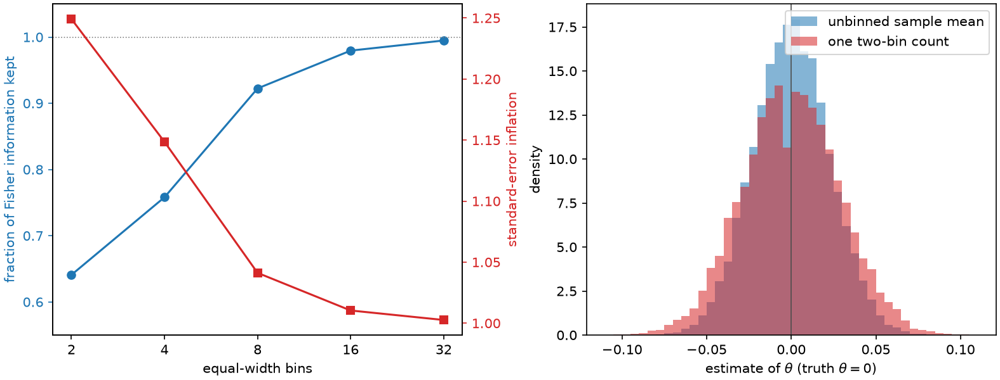

# 1. Why bin at all

A great many measurement pipelines end the same way. Millions of events arrive, each one
a rich object — a waveform, a track, a cell, a spectrum — and the analysis that finally
estimates a physical or biological parameter looks at a handful of integers. How many
events fell in this category, and how many in that one. Everything else has been thrown
away.

There are good reasons for this. Counts survive being written down, shipped across a
network, and read again in five years. A likelihood built on Poisson counts is small
enough to fit, profile, and combine with other experiments. Systematic uncertainties are
far easier to propagate through a dozen bins than through a continuous density estimate.
A human being can look at a table of a dozen numbers and notice that something is wrong.
Categories are also sometimes forced on you: a sensor network transmits a few bits per
node, a triage rule must output a decision, a public dataset is released only in
aggregated form.

So the question is not whether to bin. It is *how*, and what exactly the choice costs.
This book is about answering that question quantitatively, for a specific and well-posed
notion of cost: the Fisher information a parameter estimate can still draw from the
surviving labels.

## The currency

Fix a parametric model \(P_\theta\) for one event and a reference parameter value
\(\theta_0\) — your current best guess, the Standard Model point, the null value, the
previous fit. The *score* of an event is the gradient of its log likelihood at that
point,

$$s(x) = \nabla_\theta \log p(x \mid \theta)\big|_{\theta_0},$$

and the Fisher information of one unbinned event is \(I_{\text{full}} =
\mathbb{E}\big[s(X)s(X)^\top\big]\). Under the usual regularity conditions the inverse
of \(N I_{\text{full}}\) is the asymptotic covariance floor of any unbiased estimator
built from \(N\) events. Information is therefore not a metaphor here: it is the
exchange rate between what you keep and how precisely you can eventually measure
\(\theta\).

Now replace each event by a hard label \(Z = q(x) \in \{1,\dots,K\}\). The labeled data
is a multinomial count vector, and it has its own Fisher information \(I_q \preceq
I_{\text{full}}\). The whole subject is the gap between the two, and the design freedom
you have in choosing \(q\) to make that gap small. [Chapter
5](ch05-information-after-binning.md) derives \(I_q\) exactly; for now it is enough to
know that ScoreQuant reports the *retained fraction*

$$\text{retention} = \big(\det(I_{\text{full}}^{-1} I_q)\big)^{1/\operatorname{rank}},$$

which is one when the labels lose nothing and zero when they lose everything, the
determinant being taken over the numerically informative subspace whose dimension is
that rank. For a single parameter it is simply \(I_q / I_{\text{full}}\).

## The cost, measured

Take the simplest possible model: \(X \sim \mathcal{N}(\theta, 1)\) with reference point
\(\theta_0 = 0\). Then \(\log p = -\tfrac12 (x-\theta)^2 + \text{const}\) and the score
is \(s(x) = x - \theta_0 = x\), so score space *is* observation space, and the score law
is a standard normal. This model will follow us through the next two chapters, because
everything about it can be computed by hand.

```python
import numpy as np

import scorequant as sq

rng = np.random.default_rng(0)
# X ~ N(theta, 1) at theta0 = 0, so the score is s(x) = x.
scores = rng.normal(size=(20_000, 1))

unbinned = float(sq.fisher_information(scores)[0, 0])
# Unit weights, one unit of information per event.
assert abs(unbinned / scores.shape[0] - 1.0) < 0.05
```

Now bin those scores on a uniform grid — the histogram anybody would draw first — and
ask how much information each grid keeps.

```python
def equal_width_labels(values, n_bins, span=4.0):
    """Label a scalar coordinate with equal-width cells and open ends."""
    edges = np.linspace(-span, span, n_bins + 1)[1:-1]
    return np.digitize(values, edges)


table = {}
for n_bins in (2, 4, 8, 16, 32):
    labels = equal_width_labels(scores[:, 0], n_bins)
    report = sq.information_report(scores, labels, n_bins=n_bins)
    table[n_bins] = float(report.geometric_mean_retention)

assert table[2] < table[4] < table[8] < table[16] < table[32]
assert table[32] > 0.99
assert abs(table[2] - 0.641) < 0.01
print({k: round(v, 4) for k, v in table.items()})
```

Two equal-width bins keep 64% of the information. Eight keep 92%, thirty-two keep 99.5%.
Refinement never hurts — that is a theorem, and Chapter 5 proves it — but the returns
diminish fast, and the interesting region is the coarse end, where a handful of bins
must do the work of a continuum.

A retention number becomes concrete once you translate it into a standard error. Because
the asymptotic variance scales as \(1/(N I)\), losing a fraction \(r\) of the
information inflates every standard error by \(1/\sqrt{r}\). Two bins therefore cost you
a 25% wider confidence interval — the same as throwing away a third of your events. Here
is that statement checked directly, with no Fisher algebra at all: fit \(\theta\) from
the full sample, then from the single number "how many events were positive".

```python
import math

n_events, n_replicates = 400, 20_000
draws = rng.normal(size=(n_replicates, n_events))

full_estimate = draws.mean(axis=1)
fraction = (draws > 0.0).mean(axis=1)
# For a two-cell rule split at zero the count is Binomial(n, Phi(theta)),
# so the maximum-likelihood estimate inverts the normal distribution function.
grid = np.linspace(-6.0, 6.0, 20_001)
cdf = 0.5 * (1.0 + np.vectorize(math.erf)(grid / math.sqrt(2.0)))
binned_estimate = np.interp(fraction, cdf, grid)

variance_ratio = binned_estimate.var() / full_estimate.var()
assert abs(variance_ratio - math.pi / 2) < 0.1
print(round(variance_ratio, 4), round(math.pi / 2, 4))
```

The variance inflates by a factor very close to \(\pi/2 = 1.5708\), which is exactly the
reciprocal of the retention \(2/\pi\) that [Chapter 2](ch02-one-dimension.md) derives
with a pencil. The information bookkeeping and the Monte-Carlo experiment are two views
of one fact.



*Left: the fraction of Fisher information that equal-width bins keep from a Gaussian
location sample, with the standard-error inflation \(1/\sqrt{\text{retention}}\) it
implies. Right: the sampling distribution of \(\theta\) estimated from 2000 raw values
against the same \(\theta\) estimated from a single two-bin count. The wider red
distribution is what "we lost 36% of the information" looks like.*

## Estimating is not detecting

It matters that the objective above is *estimation*. A large body of practice chooses
bins to maximize the expected significance of a discovery, or the power of a test
against a specific alternative. That is a different optimization with a different
answer: a detection objective happily concentrates all its resolution near the decision
boundary and is indifferent to regions that constrain a nuisance parameter, whereas an
estimation objective must protect every direction of the parameter space it claims to
measure. Both are legitimate; they are simply not the same problem, and a binning that
is excellent for one can be mediocre for the other. [Chapter
14](ch14-choosing-a-method.md) places the two side by side. Everything between here and
there is about estimation, and the matrix \(I_q\) is the only scoreboard.

It also matters that the objective is *local*. The score is evaluated at one reference
point \(\theta_0\), so what we optimize is local information at that point. This is the
same locality that underlies optimal experimental design and inference-aware machine
learning: [de Castro and Dorigo (2019)](../bibliography.md#decastro2019) train a neural
summary directly against a differentiable approximation of the uncertainty of a binned
likelihood, and the score-based summaries of simulation-based inference are local by
construction. A rule optimized at \(\theta_0\) is not automatically good far away from
it, and Chapter 14 returns to what that means in practice.

## Four traditions, one intersection

The question "which few labels preserve the most information?" has been asked
independently in at least four literatures, and it is worth knowing all four, because
almost every ingredient this book uses was invented in one of them.

**Optimal experimental design** is where "maximize the determinant of an information
matrix" became a standard objective at all. [Kiefer and Wolfowitz
(1960)](../bibliography.md#kiefer1960) proved the equivalence of D-optimal and G-optimal
design, which turns a log-determinant objective into a local sensitivity condition and
explains why the inverse information matrix \(I^{-1}\) keeps appearing as the natural
metric. The optimization variable in that literature is a design measure rather than a
hard partition, but the criteria, the vocabulary, and the convex-analytic machinery all
come from there.

**Quantization for estimation** asks how to spend a finite number of bits while losing
as little parameter information as possible. [Venkitasubramaniam, Tong and Swami
(2006)](../bibliography.md#venkitasubramaniam2006) posed exactly this problem for
distributed estimation and introduced *score-function quantizers* as the optimal or
benchmark structure — direct prior art for the idea at the center of this book. The
broader theory of quantization, its distortion measures and its high-resolution
asymptotics, is surveyed by [Gray and Neuhoff (1998)](../bibliography.md#gray1998);
[Chapter 3](ch03-exact-1d.md) shows that in one dimension the information problem and
the classical distortion problem are literally the same optimization.

**Determinant clustering and vector quantization** supply the algorithms: centroids,
Voronoi cells, local relocation moves, and determinant criteria on partitions that go
back to the 1960s. **Inference-aware categorization**, mostly developed in particle
physics, supplies the modern practice of optimizing summaries for the downstream
statistical objective rather than for a proxy loss. The [related-work
page](../related-work.md) maps all four in detail and states plainly which results are
already known; this book credits them chapter by chapter as they become relevant.

What is *not* inherited from any of them is the exact finite-sample structure of the
full-matrix log-determinant criterion on a hard partition of multivariate score space.
That is the narrow layer Chapters 8 to 10 develop, and it is stated there as narrowly as
it deserves.

## The plan

The path from here is deliberately gradual. Chapter 2 works the one-dimensional Gaussian
by hand and derives the \(2/\pi\) that appeared above. Chapter 3 shows that
one-dimensional binning is a solved problem: an exact dynamic program returns the global
optimum, no seeds and no restarts. [Chapter 4](ch04-scores-and-doors.md) explains what a
score is, why score space is the right place to work, and the three practical routes to
getting one.

From Chapter 5 onward the score is a vector, the criterion is a matrix, and the
comfortable one-dimensional certainties disappear one by one — which is where the
subject becomes interesting.
