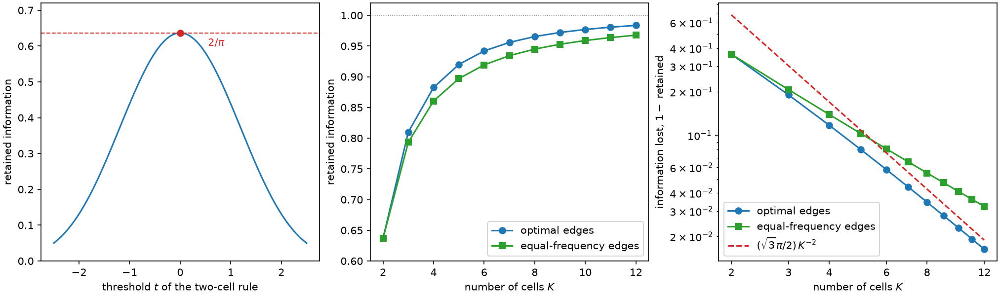

# 2. One dimension by hand

Before any of this becomes a matrix problem, it is worth solving the smallest
interesting case completely, with a pencil. One parameter, one score coordinate, two
cells. The answer is a number you can remember — \(2/\pi\) — and the way it is derived
contains, in miniature, every structural idea the rest of the book generalizes.

The problem is also old. [Cox (1957)](../bibliography.md#cox1957) asked exactly this
question under the name "grouping": if a normal sample must be reported as counts in
\(K\) groups, where should the group boundaries go so that as little information about
the mean as possible is lost? Six years earlier [Ogawa
(1951)](../bibliography.md#ogawa1951) had studied the asymptotic version, choosing
spacings of order statistics to maximize retained Fisher information. What follows is
their problem, in the language this book will use for the multivariate case.

## The model

Let \(X \sim \mathcal{N}(\theta, 1)\) and take the reference point \(\theta_0 = 0\).
Then

$$\log p(x\mid\theta) = -\tfrac12 (x-\theta)^2 + \text{const}, \qquad
s(x) = \partial_\theta \log p(x\mid\theta)\big|_{0} = x .$$

The score map is the identity, so the score law is the standard normal \(P_S =
\mathcal{N}(0,1)\) and the unbinned information is \(I_{\text{full}} = \mathbb{E}[S^2] =
1\). Every retention number below is therefore just \(I_q\) itself.

Two facts do all the work. First, the information carried by a hard label is the
variance of the conditional score mean,

$$I_q = \sum_{b=1}^{K} W_b\,\mu_b^2, \qquad
W_b = \Pr\big(q(S)=b\big), \quad \mu_b = \mathbb{E}\big[S \mid q(S)=b\big].$$

[Chapter 5](ch05-information-after-binning.md) derives this in full generality; the
intuition is that a count in cell \(b\) tells you only that \(S\) landed there, so the
derivative of its log probability with respect to \(\theta\) is the average score of the
events inside. Second, conditioning splits the second moment,

$$I_{\text{full}} = I_q + \mathbb{E}\big[\operatorname{Var}(S \mid q(S))\big],$$

with no centering anywhere: both sides are uncentered second moments. In one dimension
this identity has a striking consequence. Since \(I_{\text{full}}\) does not depend on
the rule, **maximizing the retained information is exactly minimizing the mean squared
within-cell error** — the classical objective of scalar quantizer design. [Chapter
3](ch03-exact-1d.md) cashes that equivalence in. It is special to one dimension: once
the criterion is \(\log\det I_q\) on a matrix, no such reduction survives.

## Two cells

Consider the threshold rule \(q_t(s) = \mathbf{1}\{s > t\}\). Because
\(\frac{d}{ds}\big[-\varphi(s)\big] = s\,\varphi(s)\), the cell moments are available in
closed form:

$$W_+ = 1-\Phi(t), \quad m_+ = \int_t^{\infty}\! s\,\varphi(s)\,ds = \varphi(t),
\qquad W_- = \Phi(t), \quad m_- = -\varphi(t),$$

and therefore, using \(I_q = \sum_b m_b^2 / W_b\),

$$I_q(t) \;=\; \frac{\varphi(t)^2}{1-\Phi(t)} + \frac{\varphi(t)^2}{\Phi(t)}
\;=\; \frac{\varphi(t)^2}{\Phi(t)\big(1-\Phi(t)\big)} .$$

Where does the optimum sit? The first-order condition for an interior boundary is that
neither neighboring cell is more attractive than the other — in one dimension, that the
boundary lies at the midpoint of the two conditional means, \(t =
\tfrac12(\mu_-+\mu_+)\). By symmetry of the standard normal \(\mu_- = -\mu_+\), so
\(t=0\) satisfies it. The standard normal density is log-concave, which is the classical
condition under which this stationary rule is unique, so the symmetric split is the
optimum and not merely a critical point. Differentiating directly gives the same
picture,

$$\frac{d}{dt}\log I_q(t) \;=\; -2t \;+\; \frac{\varphi(t)\big(2\Phi(t)-1\big)}{\Phi(t)\big(1-\Phi(t)\big)},$$

which vanishes at \(t=0\) and is negative for every \(t>0\).

Now evaluate. At \(t=0\) the two cells have equal probability \(W_\pm = 1/2\), and the
conditional mean of the positive half is the mean of a half-normal:

$$\mu_+ = \mathbb{E}[S \mid S>0] = \int_0^\infty s\cdot 2\varphi(s)\,ds = 2\varphi(0)
= \sqrt{\tfrac{2}{\pi}} \approx 0.7979 .$$

Hence

$$\boxed{\;I_q = \tfrac12\mu_+^2 + \tfrac12\mu_-^2 = \mu_+^2 = \big(\mathbb{E}|S|\big)^2 = \frac{2}{\pi} \approx 0.6366\;}$$

A single yes/no answer about a Gaussian observation preserves \(2/\pi\) of its Fisher
information — and the mnemonic is that the retained information is the *square of the
mean absolute deviation*. The complementary loss is \(1 - 2/\pi \approx 0.3634\), and
standard errors inflate by \(\sqrt{\pi/2} \approx 1.2533\), which is the number [Chapter
1](ch01-why-bin.md) measured by brute force.

Two properties of this answer are worth pausing on. It does not depend on \(\theta_0\)
or on the variance: rescaling the score rescales \(I_q\) and \(I_{\text{full}}\)
together. And it depends on the sign of \(s\) only, never on the magnitude — which is
precisely why one bit is so expensive.

## Checking the algebra

The closed form first, at machine precision, and then the same statement through the
library on a sample.

```python
import math

import numpy as np

import scorequant as sq


def normal_pdf(x):
    """Standard normal density."""
    return np.exp(-0.5 * np.asarray(x, dtype=float) ** 2) / math.sqrt(2.0 * math.pi)


def normal_cdf(x):
    """Standard normal distribution function."""
    return 0.5 * (1.0 + np.vectorize(math.erf)(np.asarray(x, dtype=float) / math.sqrt(2.0)))


def two_cell_information(t):
    """Information kept by the rule that reports whether the score exceeds t."""
    return normal_pdf(t) ** 2 / (normal_cdf(t) * (1.0 - normal_cdf(t)))


assert abs(float(two_cell_information(0.0)) - 2.0 / math.pi) < 1e-12

sweep = np.linspace(-2.5, 2.5, 5_001)
values = two_cell_information(sweep)
assert abs(sweep[int(np.argmax(values))]) < 1e-9
assert values.max() <= 2.0 / math.pi + 1e-12
```

The sweep confirms that the symmetric split is the maximum and that nothing beats
\(2/\pi\). Now the empirical side: draw a sample, split it at zero, and ask the library
what the labels retained.

```python
rng = np.random.default_rng(0)
scores = rng.normal(size=(20_000, 1))

hand_labels = (scores[:, 0] > 0.0).astype(int)
report = sq.information_report(scores, hand_labels, n_bins=2)
retention = float(report.geometric_mean_retention)

assert abs(retention - 2.0 / math.pi) < 0.02
print(round(retention, 4), round(2.0 / math.pi, 4))
```

The reported number is the retained fraction defined in Chapter 1; with a single score
coordinate it is exactly \(I_q/I_{\text{full}}\), and it lands on \(2/\pi\) up to
sampling noise.

## The population optimum is not the sample optimum

The threshold \(t=0\) is optimal for the *law*. It is not, in general, optimal for a
particular finite sample drawn from that law — the empirical cell means are not exactly
\(\pm\sqrt{2/\pi}\), so the empirical midpoint is not exactly zero. ScoreQuant can be
asked directly whether any single event would rather be in the other cell.

```python
sample = rng.normal(size=(4_000, 1))
split_at_zero = (sample[:, 0] > 0.0).astype(int)

stability = sq.exchange_stability_report(sample, split_at_zero, criterion=sq.DOptimality())
assert stability.best_gain < 1e-3

exact = sq.fit_quantizer(
    sq.ScoreSample(sample),
    n_bins=2,
    criterion=sq.DOptimality(),
    config=sq.ScalarDPConfig(),
)
labels = np.asarray(exact.labels)
lower = sample[labels == labels[np.argmin(sample[:, 0])], 0].max()
upper = sample[labels != labels[np.argmin(sample[:, 0])], 0].min()
sample_boundary = 0.5 * (lower + upper)

hand_on_sample = sq.information_report(sample, split_at_zero, n_bins=2)
assert abs(sample_boundary) < 0.1
assert exact.train_report.geometric_mean_retention >= hand_on_sample.geometric_mean_retention
print(round(stability.best_gain, 8), round(float(sample_boundary), 4))
```

The best available single-event relocation is worth a few millionths of a nat, and the
exactly optimal sample boundary sits within a hundredth of the origin. The distinction
is negligible here and it will not always be. [Chapter 6](ch06-two-tasks.md) gives it a
name and [Chapter 8](ch08-d-optimality.md) shows that for the determinant criterion the
two problems are joined by a theorem rather than by an approximation.

## More than two cells

The midpoint condition generalizes immediately. With cells
\((-\infty,t_1],\,(t_1,t_2],\dots,(t_{K-1},\infty)\), a stationary rule satisfies

$$t_b = \tfrac12\big(\mu_b + \mu_{b+1}\big), \qquad
\mu_b = \frac{\varphi(t_{b-1})-\varphi(t_b)}{\Phi(t_b)-\Phi(t_{b-1})},$$

with the conventions \(t_0 = -\infty\), \(t_K = +\infty\). Iterating the two lines to a
fixed point is a handful of numpy, and it converges from the equal-frequency starting
point.

```python
def equal_frequency_thresholds(n_bins):
    """Cut points that give every cell the same probability."""
    grid = np.linspace(-8.0, 8.0, 200_001)
    return np.interp(np.arange(1, n_bins) / n_bins, normal_cdf(grid), grid)


def retained_information(thresholds):
    """Information kept by an interval rule with the given interior cut points."""
    edges = np.concatenate(([-np.inf], np.asarray(thresholds, dtype=float), [np.inf]))
    cell_weights = normal_cdf(edges[1:]) - normal_cdf(edges[:-1])
    cell_moments = normal_pdf(edges[:-1]) - normal_pdf(edges[1:])
    return float(np.sum(cell_moments**2 / cell_weights))


def optimal_thresholds(n_bins, iterations=2_000):
    """Iterate the midpoint condition from equal-frequency cut points."""
    thresholds = equal_frequency_thresholds(n_bins)
    for _ in range(iterations):
        edges = np.concatenate(([-np.inf], thresholds, [np.inf]))
        cell_weights = normal_cdf(edges[1:]) - normal_cdf(edges[:-1])
        cell_means = (normal_pdf(edges[:-1]) - normal_pdf(edges[1:])) / cell_weights
        thresholds = 0.5 * (cell_means[:-1] + cell_means[1:])
    return thresholds


best = {k: retained_information(optimal_thresholds(k)) for k in range(2, 9)}
equal = {k: retained_information(equal_frequency_thresholds(k)) for k in range(2, 9)}

assert abs(best[2] - 2.0 / math.pi) < 1e-10
assert abs(best[2] - equal[2]) < 1e-9  # the median is the optimal two-cell split
assert all(best[k] >= equal[k] - 1e-12 for k in best)
assert all(best[k] < best[k + 1] for k in range(2, 8))
for k in best:
    print(k, round(best[k], 6), round(equal[k], 6))
```

| cells \(K\) | optimal edges | equal-frequency edges |
| --- | --- | --- |
| 2 | 0.636620 | 0.636620 |
| 3 | 0.809826 | 0.793229 |
| 4 | 0.882518 | 0.860559 |
| 5 | 0.920059 | 0.896955 |
| 6 | 0.942022 | 0.919361 |
| 7 | 0.956000 | 0.934368 |
| 8 | 0.965452 | 0.945034 |

The first column is the classical grouping efficiency of a normal location parameter.
Three cells already recover 81%, eight recover 96.5%. The second column is what you get
from the reflex of putting an equal number of events in every bin: never better, and by
\(K=8\) it is throwing away about two extra percentage points of information — roughly
the equivalent of discarding one event in fifty.

The reason is visible in the optimal cut points. For eight cells they are \(0,
\pm0.5005, \pm1.0500, \pm1.7479\), while equal frequency puts them at \(0, \pm0.3186,
\pm0.6745, \pm1.1503\). The information-optimal rule pushes its boundaries
*outward*, spending resolution on the tails. That is not a quirk: the quantity being
resolved is the score, and in the tails the score is large, so a misplaced boundary
there costs far more than a misplaced boundary in the crowded center. Equal frequency
optimizes occupancy; nobody asked for occupancy.



*Left: information kept by a two-cell rule as a function of its threshold, peaking at
\(2/\pi\) for the symmetric split. Middle: retained information against the number of
cells, for optimal and for equal-frequency edges. Right: the same loss on logarithmic
axes, against the high-resolution reference \((\sqrt3\pi/2)K^{-2}\).*

## How fast does the loss vanish?

The right-hand panel answers the natural follow-up. Because in one dimension retained
information is one minus the mean squared quantization error of the score, the classical
high-resolution theory applies verbatim: for a smooth density the optimal \(K\)-cell
loss behaves like \(\tfrac{1}{12}\big(\int f^{1/3}\big)^3 K^{-2}\) in units of
\(\mathbb{E}[S^2]\), which is one here, so for the standard normal the reference curve
is \((\sqrt3\pi/2)\,K^{-2} \approx 2.72\,K^{-2}\). The approach is slow
because Gaussian tails are long, but the exponent is already clear by \(K=12\).

Two practical consequences follow. Doubling the number of cells quarters the remaining
loss, so the marginal value of a bin falls off a cliff — most of what there is to gain
is gained by \(K\approx 6\). And the loss is a property of the score law: a heavy-tailed
or multimodal score is far more expensive to quantize than a Gaussian one, which is
exactly the situation Chapter 3 examines.

## What generalizes and what does not

Three ideas from this chapter survive into the rest of the book. The information of a
label is the variance of the conditional score mean. A stationary rule assigns each
event to the *nearest* cell representative. And the boundaries follow the score, not the
event count.

One idea does not survive. Here the criterion was a scalar, so "maximize retained
information" and "minimize within-cell scatter" were the same instruction, and the
optimum could be found by iterating a midpoint rule. With two or more parameters the
criterion becomes a function of a matrix, the notion of "nearest" acquires a metric that
depends on the current partition, and iterating the analogous rule can make the
objective *worse*. That story starts in Chapter 5. First, though, Chapter 3 finishes the
one-dimensional case properly: not a fixed point that might be local, but the exact
global optimum.
