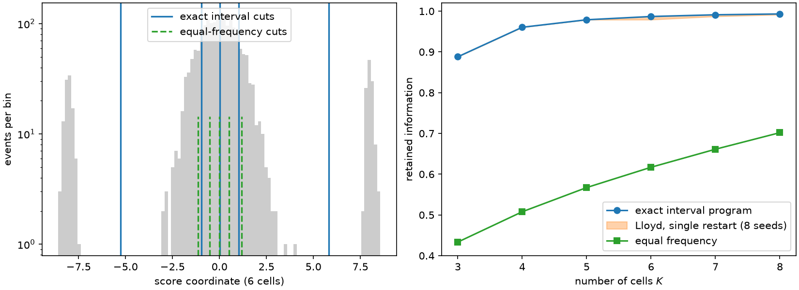

# 3. Exact 1D binning by dynamic programming

[Chapter 2](ch02-one-dimension.md) found the best two-cell rule for a Gaussian by
symmetry, and the best \(K\)-cell rule by iterating a midpoint condition to a fixed
point. That is a satisfying answer for a well-behaved law and a dangerous one in
general: a fixed point of a local condition is a *local* optimum, and nothing in the
iteration knows how far it is from the best rule available.

For a single score coordinate, that uncertainty is unnecessary. The one-dimensional
problem is exactly solvable — not approximately, not with restarts and a seed, but
provably and in closed algorithmic form. This chapter shows why, how the library does
it, and what the exact answer buys you on a score law that defeats every reflex.

## Optimal one-dimensional cells are intervals

Recall from Chapter 2 the conditioning identity \(I_{\text{full}} = I_q +
\mathbb{E}[\operatorname{Var}(S\mid q(S))]\). When the score law has a single
informative direction, \(I_q\) is a scalar, \(I_{\text{full}}\) does not depend on the
rule, and every criterion this book uses — the log determinant, the normalized trace,
anything increasing in \(I_q\) — is maximized by exactly the same partition: the one
minimizing the weighted within-cell squared error

$$\mathcal{E}(q) \;=\; \sum_{b=1}^{K} \sum_{i:\,q(s_i)=b} w_i\,(s_i - \mu_b)^2,
\qquad \mu_b = \frac{\sum_{i:\,q(s_i)=b} w_i s_i}{\sum_{i:\,q(s_i)=b} w_i}.$$

That is the classical scalar quantizer design problem — the one Lloyd solved by
iteration in a 1957 Bell Labs memorandum, published as [Lloyd
(1982)](../bibliography.md#lloyd1982), and [Max (1960)](../bibliography.md#max1960)
tabulated for the Gaussian; [Gray and Neuhoff (1998)](../bibliography.md#gray1998)
survey the field it grew into. The information problem and the distortion problem
coincide here, which is why fifty years of quantization theory transfers to score
binning without modification.

**Proposition (interval structure).** *An optimal \(K\)-cell rule for a scalar score
assigns an interval of the sorted values to each cell.*

*Reason.* Suppose two cells \(a\ne b\) interleave: there are values \(s_i < s_j < s_k\)
with \(i,k\) in \(a\) and \(j\) in \(b\). The cost \(\mathcal{E}\) is a sum of
within-cell squared deviations, and moving a point to the cell whose mean is closer
never increases it. Since \(s_j\) lies between two members of \(a\), repeatedly moving
the offending point to the nearer of \(\mu_a,\mu_b\) and updating means strictly
decreases \(\mathcal{E}\) until no interleaving remains; a strict decrease is impossible
at an optimum, so an optimum has no interleaving. ∎

This collapses the search space from something like \(K^N\) labelings to a choice of
\(K-1\) split positions among the \(N-1\) gaps between sorted values.

## The dynamic program

Sort the distinct score atoms and let \(c(i,j)\) be the weighted within-segment squared
error of the atoms \(i,\dots,j-1\). Prefix sums of \(w\), \(w s\), and \(w s^2\) make
every \(c(i,j)\) a constant-time expression, since

$$c(i,j) \;=\; \sum_{r=i}^{j-1} w_r s_r^2 \;-\;
\frac{\big(\sum_{r=i}^{j-1} w_r s_r\big)^2}{\sum_{r=i}^{j-1} w_r}.$$

Then the value function \(D_k(j)\) — the least cost of covering the first \(j\) atoms
with \(k\) segments — obeys

$$D_k(j) \;=\; \min_{k-1 \le i < j}\ \Big[\,D_{k-1}(i) + c(i,j)\,\Big],
\qquad D_0(0)=0,$$

and \(D_K(N)\) is the global optimum. Back-pointers recover the splits. The cost is
\(O(K N^2)\) time in the number of *distinct* atoms and \(O(K N)\) memory, with no
randomness anywhere: ties are resolved by the smallest split index, so two runs on the
same table give the same labels.

In ScoreQuant this solver is `ScalarDPConfig`, and it pairs with `DOptimality` inside
`fit_quantizer`. Three details are part of its contract. It requires the *effective*
score space — after numerically singular directions are projected out — to have rank
one, and it refuses a higher rank by name rather than silently projecting. Whitening
that single direction is a strictly positive rescaling, so it never moves the optimal
boundaries; it only fixes the units of the reported objective, which the trace labels
`"whitened_sse"` because it is a minimized within-cell error rather than a maximized log
determinant. And `max_rows` caps the number of distinct atoms, because the exact
recursion really is quadratic and an exact solver should decline an instance it cannot
finish rather than quietly degrade.

## A score law that punishes reflexes

Gaussian scores are forgiving. Here is one that is not: a bulk of ordinary events around
zero, plus two small groups — 5% each — sitting far out at \(s \approx \pm 8\). Score
laws like this are common wherever a rare, highly discriminating configuration exists: a
clean tag, a saturated channel, an unambiguous marker.

```python
import numpy as np

import scorequant as sq

rng = np.random.default_rng(3)
uniform = rng.random(2_000)
values = np.where(
    uniform < 0.05,
    rng.normal(-8.0, 0.2, 2_000),
    np.where(uniform < 0.10, rng.normal(8.0, 0.2, 2_000), rng.normal(0.0, 1.0, 2_000)),
)
scores = values[:, None]


def retention(labels, n_bins):
    """Retained fraction of the unbinned information under one labeling."""
    report = sq.information_report(scores, np.asarray(labels), n_bins=n_bins)
    return float(report.geometric_mean_retention)


exact = sq.fit_quantizer(
    sq.ScoreSample(scores),
    n_bins=6,
    criterion=sq.DOptimality(),
    config=sq.ScalarDPConfig(),
)
exact_retention = retention(exact.labels, 6)
assert exact.trace.objective_label == "whitened_sse"
assert abs(exact_retention - 0.9869) < 0.01
```

Now the two reflexes. Equal frequency puts 1/6 of the events in each cell. A single
Lloyd restart iterates the midpoint condition from one \(k\)-means++ seeding.

```python
cuts = np.quantile(values, np.arange(1, 6) / 6)
equal_frequency = retention(np.digitize(values, cuts), 6)

restarts = [
    retention(
        sq.fit_quantizer(
            sq.ScoreSample(scores),
            n_bins=6,
            criterion=sq.NormalizedTrace(),
            config=sq.KMeansConfig(seed=seed, solver_restarts=1),
        ).labels,
        6,
    )
    for seed in range(8)
]

assert equal_frequency < 0.65
assert min(restarts) < exact_retention - 0.005
assert max(restarts) <= exact_retention + 1e-6
print(round(exact_retention, 6), round(equal_frequency, 6), round(min(restarts), 6))
```

Equal frequency keeps 62% of the information. The exact program keeps 98.7%. The gap is
not subtle, and it has a simple cause: equal frequency budgets cells by *how many*
events are in a region, and 90% of the events are in the uninformative bulk. It spends
all five of its boundaries there and lumps each satellite in with the bulk's tail,
destroying the very contrast that made those events valuable.

Lloyd does far better — it optimizes the right objective, after all — but it is a local
method. Across eight single restarts the worst run lands at 0.9791 against the exact
0.9869, and nothing in the output would have told you which run you got. With enough
restarts the gap usually closes; "usually" is precisely what the dynamic program
removes.



*Left: the score law on a logarithmic count axis, with the six-cell exact interval cuts
(solid) and the equal-frequency cuts (dashed, drawn shorter to stay visible). Two of the
exact cuts isolate the satellite groups; equal frequency spends every boundary inside
the bulk. Right: retained information against the cell budget for the exact program, the
spread of eight single-restart Lloyd runs, and equal frequency.*

## Interval structure, verified

The proposition above is worth checking rather than believing, and it is a one-line
check: sort the score values and confirm that the labels never revisit a cell.

```python
order = np.argsort(values, kind="stable")
ordered_labels = np.asarray(exact.labels)[order]
changes = np.flatnonzero(ordered_labels[1:] != ordered_labels[:-1])

assert changes.size == 5  # exactly K - 1 crossings for K = 6 interval cells
assert len(set(ordered_labels.tolist())) == 6
```

Five crossings for six cells means every cell is a contiguous run, which is what an
interval rule looks like on sorted data.

## The solver declines what it cannot certify

`ScalarDPConfig` exists to return a *global* optimum. On a score space with two
informative directions there is no interval structure to exploit, and the honest
response is refusal rather than a projection nobody asked for.

```python
two_dimensional = sq.ScoreSample(rng.normal(size=(60, 2)))
try:
    sq.fit_quantizer(
        two_dimensional,
        n_bins=3,
        criterion=sq.DOptimality(),
        config=sq.ScalarDPConfig(),
    )
    raise AssertionError("a rank-two score space must be rejected")
except ValueError as error:
    assert "rank of one" in str(error)
```

The same exact recursion reappears later in a role that is not obviously
one-dimensional. [Chapter 10](ch10-profiled-ds.md) shows that when there is a single
parameter of interest among nuisance parameters, the *efficient score* is scalar, and
quantizing it optimally gives a certified ceiling on what any rule of the full
multivariate score space can achieve. The certificate is this dynamic program, run on a
projection.

## The other end: many cells

The dynamic program answers the small-\(K\) question exactly. The complementary regime —
\(K\) large, cells narrow — is answered asymptotically. [Farias and Brossier
(2013)](../bibliography.md#farias2013) develop precisely this theory for
Fisher-information-optimal scalar quantization in parameter estimation, deriving the
asymptotic information loss, the optimal density of interval boundaries, and adaptive
schemes that place them without knowing the law in advance.

The reduction at the top of this chapter says what that theory looks like in score
coordinates. Since the information lost is exactly the mean squared quantization error
of the score, high-resolution companding applies directly: the optimal density of cell
boundaries is proportional to \(f_S^{1/3}\), the density of the score law raised to the
one-third power, and the residual loss decays as

$$1 - \text{retention} \;\approx\; \frac{1}{12\,\mathbb{E}[S^2]}\Big(\int f_S^{1/3}\Big)^{3} K^{-2},$$

the constant that Chapter 2 plotted as \((\sqrt3\pi/2)K^{-2}\) for the standard normal.
The one-third power is why the optimal rule pushes boundaries into the tails: it
flattens the density far less than proportional allocation would, so regions with few
events but large scores still receive resolution.

## What one dimension was hiding

It is worth being explicit about how much of this chapter is a one-dimensional luxury.

*The criterion collapsed.* Log determinant, trace, and every other increasing function
of \(I_q\) selected the same partition, so there was only ever one problem. With two or
more parameters the criteria genuinely disagree, and Chapters 7 and 8 show they select
different partitions of the same data.

*The geometry collapsed.* Optimal cells were intervals, described by \(K-1\) numbers.
In \(d\) dimensions a stationary rule is a Voronoi diagram in a partition-dependent
metric — still convex, still polyhedral, but with no ordering to run a dynamic program
along.

*The reduction to squared error collapsed.* \(I_{\text{full}} = I_q + \text{scatter}\)
remains true as a matrix identity, but \(\log\det I_q\) is not \(\text{const} -
\text{scatter}\); it couples all directions through the inverse of the matrix currently
retained. That coupling is what makes the multivariate problem interesting, and it is
where [Chapter 5](ch05-information-after-binning.md) begins.

What survives is the habit: state the objective, find the structure the objective
imposes on optimal rules, and exploit that structure rather than guessing. [Chapter
8](ch08-d-optimality.md) does the same thing for the determinant criterion, and finds a
different structure — weaker than interval order, but strong enough to make a finite
solver exact in its own sense.
