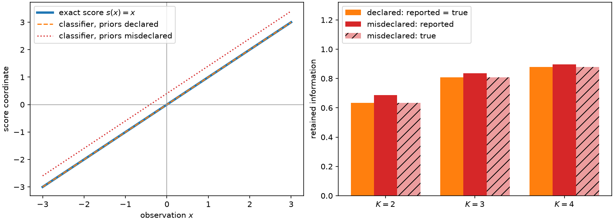

# 4. Scores, score laws, and the three doors

The first three chapters treated the score as if it were simply the data. For the
Gaussian location model that was literally true — \(s(x)=x\) — which is why the
arithmetic stayed transparent. This chapter pays that debt. What is a score, why is it
the right thing to bin, and where does one actually come from when the model is not a
textbook Gaussian?

## What the score is

Fix a model \(p(x\mid\theta)\) and a reference point \(\theta_0\). Expanding the log
likelihood of one event around that point,

$$\log p(x\mid\theta) \;=\; \log p(x\mid\theta_0) \;+\; s(x)^\top(\theta-\theta_0)
\;+\; O\big(\|\theta-\theta_0\|^2\big), \qquad
s(x) = \nabla_\theta \log p(x\mid\theta)\big|_{\theta_0},$$

so the score is the event's *local opinion about \(\theta\)*: a vector in parameter
space whose direction says which parameter combinations the event favors and whose
length says how strongly. Two events with the same score are locally indistinguishable
as evidence, however different they look in the detector. Summing the outer products
over the reference measure gives the Fisher information \(I_{\text{full}} =
\mathbb{E}\big[s(X)s(X)^\top\big]\).

The score has units, an origin, and an orientation, all of which are statistical rather
than conventional. Replacing \(s\) by \(As\) with \(A\) invertible is a
reparameterization of \(\theta\), and criteria such as the log determinant are designed
to be invariant under it. Replacing \(s\) by \(s - c\) is **not** a reparameterization:
it is a different statistical problem. For a normalized probability model the score
happens to have mean zero, so shifting looks harmless; for a Poisson intensity model
\(\lambda(x;\theta)\) the event score \(s_\alpha(x) =
\partial_{\theta_\alpha}\log\lambda\) has a nonzero mean under the intensity measure,
and subtracting it deletes the total-rate direction — a real parameter, silently
discarded. This is why nothing in ScoreQuant ever centers a score table, and why the
origin of score space is protected throughout the book.

## The score law is the whole input

Let \(q:\mathbb{R}^d\to\{1,\dots,K\}\) be a hard rule on score space, so that the
observation-space compressor is \(Q(x) = q(s(x))\). Every quantity the criteria of this
book depend on is a cell probability or a cell score moment,

$$W_b = \Pr\big(q(S)=b\big), \qquad m_b = \mathbb{E}\big[S\,\mathbf{1}\{q(S)=b\}\big],$$

and both are integrals of functions of \(S\) alone. They therefore depend on the
observation model only through the *push-forward score law*

$$P_S \;=\; s_{\#}P_{\theta_0},$$

the distribution of \(S\) when \(X\sim P_{\theta_0}\). Two entirely different
experiments with the same score law pose the same binning problem and have the same
optimal rules. This is a genuine simplification: it removes the observation space,
whatever its dimension and structure, from every algorithm in this book.

It is also not a new observation. Quantizing the score to preserve Fisher information
was posed directly for distributed estimation by [Venkitasubramaniam, Tong and Swami
(2006)](../bibliography.md#venkitasubramaniam2006). [Barnes, Han and Özgür
(2018)](../bibliography.md#barnes2018) characterized the Fisher information of a
quantized observation geometrically through conditional score means — the identity
[Chapter 5](ch05-information-after-binning.md) uses throughout — and solved the one-bit
Gaussian location problem exactly, recovering the half-space rule of [Chapter
2](ch02-one-dimension.md). [Dülek (2023)](../bibliography.md#dulek2023) proved for
exponential families that an optimal \(K\)-level quantizer can be taken to depend only
on the sufficient statistic and that the trace-optimal partition is convex-polytopal, so
polyhedral quantizer geometry is established prior art rather than a contribution. The
detection-side analogue is older still: [Tsitsiklis
(1993)](../bibliography.md#tsitsiklis1993) established the corresponding sufficiency of
likelihood-ratio space for quantizer design in hypothesis testing. What this book adds
begins in [Chapter 8](ch08-d-optimality.md) and concerns the exact finite structure of
the full-matrix determinant criterion, not the choice of score space.

## Two contracts, not one

A score law is *a map plus a measure*. Knowing \(s(x)\) for every \(x\) tells you where
each event lands in score space; it says nothing about how many events land where. So
ScoreQuant separates the two:

| Contract | Supplies | Examples |
| --- | --- | --- |
| **Source** | the reference measure — which events exist, with what weight | `ScoreSample`, `ObservationSample`, `IntegrationSource` |
| **Score provider** | the observation-to-score map | `ScoreFunction`, `LinearComponentScore`, `DensityRatioScore`, `CentralLogRatioScore` |

The pairing is validated rather than guessed. A `ScoreSample` is already in score space,
so it *rejects* a provider; an `ObservationSample` or `IntegrationSource` is in
observation space, so it *requires* one. A score callback offered on its own is refused,
because automatic differentiation and trained classifiers supply the map and never the
measure.

There is a matching split on the output side, which [Chapter 6](ch06-two-tasks.md)
develops in full: `optimize_partition` labels one fixed table and returns no predictor,
while `fit_quantizer` learns a reusable rule whose only prediction method is
`predict_scores`. Converting observations to scores stays a line you wrote, visible in
your own code.

## Door 1: the scores already exist

The simplest case. Somebody — you, a colleague, a simulator's weight-derivative output —
has already produced a score column.

```python
import math

import numpy as np

import scorequant as sq

rng = np.random.default_rng(4)
observations = rng.normal(size=(4_000, 1))  # X ~ N(theta, 1) at theta0 = 0
precomputed = np.asarray(observations)  # so the score is s(x) = x

door1 = sq.ScoreSample(
    precomputed,
    provenance=sq.ScoreProvenance(kind="exact", reference_point=(0.0,)),
)
quantizer = sq.fit_quantizer(
    door1, n_bins=4, criterion=sq.DOptimality(), config=sq.ScalarDPConfig()
)
partition = sq.optimize_partition(precomputed, n_bins=4, config=sq.DExchangeConfig(seed=4))

assert quantizer.information_kind == "exact_fisher"
assert hasattr(quantizer, "predict_scores")
assert not hasattr(partition, "predict_scores")
```

`ScoreProvenance` is how you declare where the numbers came from. Only `"exact"` and
`"autodiff"` let a result describe its matrices as Fisher information; everything else
reports `"supplied_score_surrogate"`, for reasons the last section of this chapter makes
concrete.

## Door 2: a model you can differentiate

When an analytic likelihood or intensity is available, the score is a function you can
write down or differentiate automatically. `ScoreFunction` wraps any callable `[N, D] ->
[N, P]`, and `LinearComponentScore` evaluates a linear component model, for which
\(\lambda(x;\theta)=\sum_\alpha \theta_\alpha\phi_\alpha(x)\) gives \(s_\alpha =
\phi_\alpha/\lambda\) directly.

```python
exact_score = sq.ScoreFunction(
    lambda X: np.asarray(X),
    provenance=sq.ScoreProvenance(kind="exact", reference_point=(0.0,)),
)
door2 = sq.fit_quantizer(
    sq.ObservationSample(observations),
    provider=exact_score,
    n_bins=4,
    criterion=sq.DOptimality(),
    config=sq.ScalarDPConfig(),
)

# Same events, same map, therefore the same score law and the same answer.
assert np.array_equal(np.asarray(door2.labels), np.asarray(quantizer.labels))
```

A sample is not the only way to carry a measure. For a bounded low-dimensional model the
reference measure can be supplied *deterministically*, as an explicit density on a box
evaluated at Gauss-Legendre nodes. There is no sampling noise in the result at all.

```python
population = sq.IntegrationSource(
    [[-8.0, 8.0]],
    density=lambda X: np.exp(-0.5 * np.asarray(X)[:, 0] ** 2) / math.sqrt(2.0 * math.pi),
    quadrature=sq.GaussLegendreConfig(order=200),
)
door2_population = sq.fit_quantizer(
    population,
    provider=exact_score,
    n_bins=4,
    criterion=sq.DOptimality(),
    config=sq.ScalarDPConfig(),
)

# Chapter 2 computed the four-cell population optimum in closed form.
assert abs(float(door2_population.train_report.geometric_mean_retention) - 0.882518) < 0.02
```

Bounds alone never imply a uniform measure — the density is mandatory — and the node
count is `order ** D`, so this door closes quickly above a few dimensions. Beyond that,
use a sample.

## Door 3: estimated density ratios

Often there is no evaluable likelihood at all: the model is a simulator, the detector
response is learned, the background is data. The score can still be estimated. Generate
samples at \(\theta_0-\delta_j e_j\) and \(\theta_0+\delta_j e_j\) and train a
calibrated binary classifier \(D_j\) to tell them apart. With equal training priors the
Bayes-optimal logit is the log likelihood ratio — the observation that [Cranmer, Pavez
and Louppe (2015)](../bibliography.md#cranmer2015) turned into a practical method — so

$$\operatorname{logit} D_j(x) = \log\frac{p(x\mid\theta_0+\delta_j e_j)}{p(x\mid\theta_0-\delta_j e_j)},
\qquad
\hat s_j(x) = \frac{1}{2\delta_j}\operatorname{logit} D_j(x)$$

is a central finite-difference estimate of the \(j\)-th score coordinate, with
deterministic bias \(O(\delta_j^2)\). Using the local score as the learned summary of a
simulator is the SALLY/SALLINO construction of [Brehmer, Louppe, Pavez and Cranmer
(2020)](../bibliography.md#brehmer2020). If the priors of the two training samples are
unequal, their log-odds must be subtracted from the logit before dividing.

ScoreQuant begins at the trained model. Training, cross-fitting and calibration stay in
your application; the library takes a ready probability callback and applies the pure
prior-corrected transform.

```python
delta = 0.5


def calibrated(X):
    """Bayes-optimal minus/plus probabilities for N(-delta, 1) against N(+delta, 1)."""
    plus = 1.0 / (1.0 + np.exp(-2.0 * delta * np.asarray(X)[:, 0]))
    return np.stack([1.0 - plus, plus], axis=1)


door3 = sq.CentralLogRatioScore(calibrated, [delta], [0.5, 0.5])
recovered = np.asarray(door3.score(observations))[:, 0]

assert np.max(np.abs(recovered - observations[:, 0])) < 1e-5
assert door3.provenance.kind == "estimated_ratio"
```

Here the classifier is the exact Bayes rule and the Gaussian location model is
exponential in \(x\), so the finite-difference construction recovers \(s(x)=x\) to the
working precision of the arithmetic, for any \(\delta\). Running that check against your
own callback, on a model where you know the answer, is the cheapest calibration
diagnostic there is.

For a finite mixture whose parameters are the component fractions the ratio is the
representation itself. A calibrated multiclass classifier estimates posteriors
\(\eta_\alpha(x)\propto \pi_\alpha \phi_\alpha(x)\); dividing by the known training
priors (`ratios_from_posteriors`) recovers the component density ratios, and
`mixture_scores_from_ratios` applies the simplex-constrained algebra that turns them into
scores — `DensityRatioScore.from_classifier` packages the chain as a provider. The same
provider accepts a ratio callback from any other backend: an analytic formula, a direct
density-ratio estimator, a calibrated neural likelihood-ratio model. The [three-doors
guide](../three-doors.md) works through the constructions with the exact shape and
normalization requirements.

## Estimated scores are not Fisher information

Door 3 buys reach at a price, and the price deserves to be stated bluntly. The
between-cell algebra is exact for whatever vectors you supply. If those vectors are
\(\hat s \ne s\), the matrix a report contains is
\(\operatorname{Var}\big(\mathbb{E}[\hat s\mid q(\hat s)]\big)\) — a surrogate — while
the information the labels actually retain about \(\theta\) is
\(\operatorname{Var}\big(\mathbb{E}[s\mid q(\hat s)]\big)\). The two coincide only when
the estimated score is the true one.

The gap is not academic. Suppose the two training samples behind the classifier were
imbalanced, 40/60 rather than 50/50, and that imbalance was never declared. The
transform then subtracts the wrong log-odds and returns \(\hat s(x) = x + c\) with \(c =
\log(1.5)/(2\delta)\). Watch what that does to the two numbers.

```python
def imbalanced(X):
    """The same classifier, trained with 40/60 priors that were never declared."""
    odds = np.exp(2.0 * delta * np.asarray(X)[:, 0]) * (0.6 / 0.4)
    plus = odds / (1.0 + odds)
    return np.stack([1.0 - plus, plus], axis=1)


misdeclared = sq.CentralLogRatioScore(imbalanced, [delta], [0.5, 0.5])
offset = np.asarray(misdeclared.score(observations))[:, 0] - observations[:, 0]
assert abs(float(offset.mean()) - math.log(1.5) / (2 * delta)) < 1e-5

biased = sq.fit_quantizer(
    sq.ScoreSample(np.asarray(misdeclared.score(observations))),
    n_bins=2,
    criterion=sq.DOptimality(),
    config=sq.ScalarDPConfig(),
)
reported = float(biased.train_report.geometric_mean_retention)
true = float(sq.information_report(observations, biased.labels, n_bins=2).geometric_mean_retention)

assert reported > true + 0.03  # the surrogate number is inflated
assert abs(true - 2.0 / math.pi) < 0.02  # the information actually kept is unchanged
assert biased.information_kind == "supplied_score_surrogate"
print(round(reported, 5), round(true, 5))
```

The misdeclared classifier reports 0.687 where the honest answer is 0.635. It looks
*better* than the correctly declared one, and it is not. The mechanism is worth
following. Retention is the ratio \(I_q/I_{\text{full}}\), and both matrices are built
from the vectors you supplied. Shifting the score to \(S+c\) leaves the within-cell
scatter untouched, because variance is shift-invariant, but it raises the reference from
\(\mathbb{E}[S^2]\) to \(\mathbb{E}[S^2]+c^2\). The reported number is therefore
\(1 - \text{scatter}/(1+c^2)\) in place of \(1-\text{scatter}\), and it drifts towards
one as the offset grows — a score estimator can be made to look arbitrarily good simply
by being arbitrarily wrong about the origin. In one dimension the offset does not even
change the labels, because the D-optimal scalar partition minimizes within-cell scatter,
so the *true* retention is exactly the \(2/\pi\) of Chapter 2. In more than one dimension
there is no such reprieve: the log determinant is not shift-invariant and a misdeclared
offset moves the partition itself.



*Left: the exact score map against two classifier-derived ones. The correctly declared
classifier lies exactly on top of the exact score; the misdeclared one is offset by
\(\log(1.5)/(2\delta)\). Right: for two, three and four cells, the retention a correctly
declared classifier reports (which is also the truth) against the inflated number the
misdeclared one reports and the information it actually retains.*

This is why `ScoreProvenance` is not decoration. A classifier-derived provider always
records `kind="estimated_ratio"`, `information_kind` reads `"supplied_score_surrogate"`,
and no combination of arguments will make the library call an estimated quantity Fisher
information. To measure what the labels truly retain, do what the snippet above does:
label with the estimated score, then evaluate an exact score under those labels.
[Chapter 13](ch13-estimated-scores.md) takes the estimated-ratio path seriously — how
estimator quality maps to retention, what calibration diagnostics are worth running,
and which parts of the question are genuinely open.

## Choosing a door

Use Door 1 when the scores exist and you trust them; declare their provenance honestly.
Use Door 2 whenever the model is differentiable, and prefer the integration source over
a sample whenever the model is bounded and low-dimensional, since it removes Monte-Carlo
noise from the answer entirely. Use Door 3 when there is no other way in — and then
treat every number the library reports as conditional on the score estimate, because it
is.

**Runnable examples:** [door1-score-events](../examples/door1-score-events.md),
[door2-mixture-densities](../examples/door2-mixture-densities.md), and
[door3-classifier](../examples/door3-classifier.md) walk each door end to end.

All three doors open onto the same room: a weighted table of score vectors. From here on
the table is all that matters. Chapter 5 works out exactly how much information survives
when that table is compressed into \(K\) labels.
