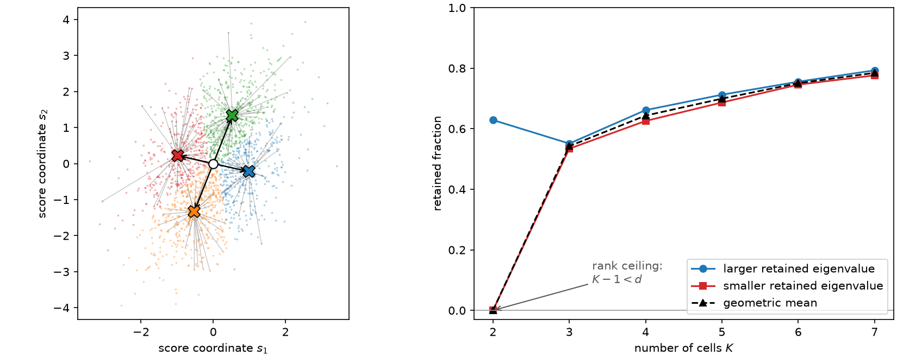

# 5. Information after hard labels

From here the score is a vector. [Chapter 4](ch04-scores-and-doors.md) closed with a
weighted table of score rows, whatever door produced it, and the promise that the table
is all that matters. This chapter cashes that promise: given the table and a rule that
sorts its rows into \(K\) cells, exactly how much Fisher information do the resulting
counts carry?

The answer is one formula. It is short enough to memorize, it is exact rather than
asymptotic, and every criterion, algorithm, theorem, and diagnostic in the rest of the
book is built on top of it. It is worth deriving carefully once.

## The label has a likelihood of its own

Fix a hard rule \(q\) on score space and let \(Z=q(S)\) be the label of one event. The
label is an ordinary random variable with an ordinary parametric law: it takes value
\(b\) with probability

$$W_b(\theta) \;=\; \Pr\nolimits_\theta\big(q(s(X))=b\big)
\;=\; \int \mathbf{1}\{q(s(x))=b\}\,p(x\mid\theta)\,dx .$$

So the labeled experiment is a categorical model with \(K\) cells and the same parameter
\(\theta\) as the original one. Its Fisher information is whatever the ordinary
definition says it is; there is nothing to invent.

Differentiate the cell probability at the reference point, moving the derivative inside
the integral (the rule does not depend on \(\theta\), so the indicator is a constant):

$$\nabla_\theta W_b(\theta)\big|_{\theta_0}
\;=\; \int \mathbf{1}\{q(s(x))=b\}\,\nabla_\theta p(x\mid\theta_0)\,dx
\;=\; \int \mathbf{1}\{q(s(x))=b\}\,s(x)\,p(x\mid\theta_0)\,dx
\;=\; m_b ,$$

where the last equality names the *cell score moment*
\(m_b=\mathbb{E}\big[S\,\mathbf{1}\{q(S)=b\}\big]\). Dividing by the cell probability
gives the score of the discrete observation:

$$\nabla_\theta \log W_b\big|_{\theta_0} \;=\; \frac{m_b}{W_b}
\;=\; \mathbb{E}\big[S \mid Z=b\big] \;=\; \mu_b .$$

**The conditional-score-mean identity.** *The score of a hard label is the average score
of the events that produce it.*

$$\boxed{\;\nabla_\theta \log \Pr(Z=b)\big|_{\theta_0} \;=\; \mathbb{E}[S\mid Z=b]\;}$$

This is the tool the rest of the book leans on, so it is worth saying in words. Observing
"the event landed in cell \(b\)" is evidence about \(\theta\) of exactly the strength that
the *typical* member of cell \(b\) carries. Within-cell differences of opinion are
averaged away and cannot be recovered. The identity is the geometric characterization of
quantized Fisher information given by [Barnes, Han and Özgür
(2018)](../bibliography.md#barnes2018), which the same authors then turned into
information lower bounds for estimation under communication constraints [(Barnes, Han and
Özgür, 2020)](../bibliography.md#barnes2020).

Summing the outer products of the label score over the label's own law gives the
information the counts retain:

$$\boxed{\;I_q \;=\; \sum_{b=1}^{K} W_b\,\mu_b\mu_b^\top
\;=\; \sum_{b=1}^{K} \frac{m_b m_b^\top}{W_b}
\;=\; \mathbb{E}\Big[\mathbb{E}[S\mid Z]\,\mathbb{E}[S\mid Z]^\top\Big].\;}$$

Three readings of the same object, each useful. The first says \(I_q\) is a weighted
scatter of the \(K\) cell means about the score-space origin. The second says the whole
problem depends on the rule through \(2K\) numbers only: \(K\) cell weights and \(K\)
cell moment vectors. The third says information survives binning exactly to the extent
that the cell means *differ from the origin* — which, when the score has mean zero as it
does for a normalized model, is the same as the variance of the conditional mean. The
third form is written uncentered anyway, because for an unnormalized intensity model the
score's mean is not zero and subtracting it would delete the total-rate direction, as
[Chapter 4](ch04-scores-and-doors.md) showed.

The middle reading is the practical one. A rule with a million cells and a rule with four
cells are compared through objects of the same size, and everything a criterion can see
is the finite table \(\{(W_b, m_b)\}\). That is why the algorithms of Chapters 7 to 9 can
be exact.

## Checking the identity, not assuming it

For \(X\sim\mathcal N(\theta, I_2)\) at \(\theta_0=0\) the score is \(s(x)=x\), so score
space is observation space and cell probabilities can be re-evaluated at a nearby
\(\theta\) by tilting the same sample. Differencing \(\log W_b\) numerically must
reproduce the conditional score mean.

```python
import numpy as np

import scorequant as sq

rng = np.random.default_rng(15)
scores = rng.normal(size=(2_000, 2))  # X ~ N(theta, I) at theta0 = 0, so s(x) = x

partition = sq.optimize_partition(scores, n_bins=4, config=sq.DExchangeConfig(seed=0))
labels = np.asarray(partition.labels)
cell_weights = np.asarray(partition.cell_weights)
cell_means = np.asarray(partition.cell_score_means)


def log_cell_probability(theta, cell):
    """Log probability of one cell at theta, by exponential tilting of the sample."""
    tilt = np.exp(scores @ theta - 0.5 * theta @ theta)
    return np.log(np.mean(tilt * (labels == cell)))


delta = 0.02
for cell in range(4):
    gradient = []
    for coordinate in range(2):
        step = np.zeros(2)
        step[coordinate] = delta
        forward = log_cell_probability(step, cell)
        backward = log_cell_probability(-step, cell)
        gradient.append((forward - backward) / (2.0 * delta))
    assert np.max(np.abs(np.asarray(gradient) - cell_means[cell])) < 1e-3
```

The label's score really is the average score of its members, to the \(O(\delta^2)\)
accuracy of a central difference. Now the matrix built from those means, against the
library's own binned information:

```python
by_hand = np.einsum("b,bp,bq->pq", cell_weights, cell_means, cell_means)
from_library = np.asarray(sq.binned_fisher_information(scores, labels, n_bins=4))

assert np.allclose(by_hand, from_library, rtol=0, atol=1e-9)
assert np.allclose(np.asarray(partition.information_partitioned), by_hand, rtol=0, atol=1e-9)
```

## What the labels lose

Conditioning splits the second moment of the score, one term for each of the two things a
label does and does not tell you:

$$I_{\text{full}} \;=\; \mathbb{E}\big[SS^\top\big]
\;=\; \mathbb{E}\Big[\mathbb{E}\big[SS^\top \mid Z\big]\Big]
\;=\; \underbrace{\sum_b W_b\,\mu_b\mu_b^\top}_{I_q}
\;+\; \underbrace{\mathbb{E}\big[\operatorname{Cov}(S\mid Z)\big]}_{\text{within-cell scatter}} .$$

Both terms are positive semidefinite, so \(I_q \preceq I_{\text{full}}\) always: hard
labels can never manufacture information. The gap is the *within-cell scatter*, and it is
the object every algorithm in this book is trying to make small.

Two conventions in that line are deliberate and both matter. The inner covariance is
taken about the cell mean \(\mu_b\), because that is what the conditional expectation
gives. The outer sum is *not* centered at all: \(I_{\text{full}}\) and \(I_q\) are
uncentered second moments about the score-space origin. The origin of score space is
where "this event says nothing about \(\theta\)" lives, and it is a statement about the
model, not a convention. Subtracting a global mean from a score table would change the
problem — [Chapter 4](ch04-scores-and-doors.md) shows exactly how much — so ScoreQuant
never does it, and neither does any formula in this book.

```python
full = np.asarray(sq.fisher_information(scores))
scatter = sum(
    (scores[labels == cell] - cell_means[cell]).T @ (scores[labels == cell] - cell_means[cell])
    for cell in range(4)
)

assert np.max(np.abs(full - from_library - scatter)) < 1e-8
```

## Refining a partition can never hurt

Split one cell in two. The pooled cell contributed \(m m^\top / W\) with \(m=m_1+m_2\)
and \(W=W_1+W_2\); the two children contribute \(m_1m_1^\top/W_1 + m_2m_2^\top/W_2\).
The matrix fractional map \((m,W)\mapsto mm^\top/W\) is jointly convex, and applying that
convexity with weights \(W_1/W\) and \(W_2/W\) gives

$$\frac{(m_1+m_2)(m_1+m_2)^\top}{W_1+W_2}
\;\preceq\; \frac{m_1m_1^\top}{W_1} + \frac{m_2m_2^\top}{W_2} ,$$

with equality exactly when \(\mu_1=\mu_2\). Every other cell is untouched, so a
refinement raises \(I_q\) in the Loewner order — the split gains nothing only when the
two halves were saying the same thing anyway.

```python
coarse_partition = sq.optimize_partition(scores, n_bins=3, config=sq.DExchangeConfig(seed=0))
coarse = np.asarray(coarse_partition.labels)
finer = coarse.copy()
finer[(coarse == 0) & (scores[:, 1] > 0.0)] = 3  # split cell 0 along the second coordinate

gain = np.asarray(sq.binned_fisher_information(scores, finer, n_bins=4)) - np.asarray(
    sq.binned_fisher_information(scores, coarse, n_bins=4)
)
assert np.min(np.linalg.eigvalsh(gain)) > -1e-9  # positive semidefinite up to rounding
```

This is the matrix version of the "refinement never hurts" fact [Chapter
1](ch01-why-bin.md) observed on a histogram. It is also the engine behind the global
certificates of [Chapter 8](ch08-d-optimality.md): treating every unassigned row as its
own singleton cell produces a matrix that dominates every way of finishing the
assignment, which is exactly what a branch-and-bound bound needs.

## Rank: why \(K\) must exceed the number of parameters

For a normalized probability model the score has mean zero, so the cell moments sum to
zero:

$$\sum_{b=1}^{K} m_b \;=\; \mathbb{E}[S] \;=\; 0 .$$

The \(K\) vectors \(m_1,\dots,m_K\) therefore span at most \(K-1\) dimensions, and since
\(I_q\) is built from them,

$$\operatorname{rank} I_q \;\le\; \min(d,\;K-1) .$$

A criterion that needs a nonsingular \(I_q\) — the log determinant of [Chapter
8](ch08-d-optimality.md), above all — therefore needs at least \(d+1\) cells for \(d\)
parameters. Two cells cannot measure two parameters, no matter where the boundary goes.
Here is that wall, on a score table whose mean vanishes exactly by construction:

```python
half = rng.integers(-9, 10, size=(600, 2)).astype(float)
symmetric = np.concatenate([half, -half], axis=0)  # E[S] = 0 holds exactly, in binary too
assert np.array_equal(symmetric.sum(axis=0), np.zeros(2))

two_cells = (symmetric[:, 0] > 0.0).astype(int)
two_cell_report = sq.information_report(symmetric, two_cells, n_bins=2)
assert two_cell_report.geometric_mean_retention == 0.0  # one direction is exactly dead
assert float(np.max(np.asarray(two_cell_report.retained_eigenvalues))) > 0.7  # the other is not

three_cells = sq.optimize_partition(symmetric, n_bins=3, config=sq.DExchangeConfig(seed=0))
four_cells = sq.optimize_partition(symmetric, n_bins=4, config=sq.DExchangeConfig(seed=0))
assert abs(float(three_cells.train_report.geometric_mean_retention) - 0.6006) < 0.01
assert abs(float(four_cells.train_report.geometric_mean_retention) - 0.7507) < 0.01
```

The collapse is structural, not numerical fragility to be tuned away: with two cells the
two moment vectors are \(m\) and \(-m\), so \(I_q\) is exactly rank one and one whole
direction of parameter space is invisible however the boundary is drawn. A third cell
fixes it — recovering 60% of a two-parameter Fisher matrix from three counts, and 75%
from four.

The D solver states the requirement rather than discovering it at run time. Asking for
fewer cells than there are informative directions is refused by name:

```python
three_parameters = rng.normal(size=(400, 3))
try:
    sq.optimize_partition(three_parameters, n_bins=2, config=sq.DExchangeConfig(seed=0))
    raise AssertionError("two cells cannot support three parameters")
except ValueError as error:
    assert "at least as many bins as informative directions" in str(error)
```

## Reading the report

`information_report` assembles everything above for one labeling.

```python
report = sq.information_report(scores, labels, n_bins=4)

assert report.effective_rank == 2
assert abs(float(report.geometric_mean_retention) - 0.6442) < 0.01
assert float(report.psd_residual_min_eigenvalue) > 0.0  # I_full - I_q is positive definite
assert np.array_equal(np.asarray(report.bin_counts), np.bincount(labels, minlength=4))
print(report)
```

The two retention numbers deserve to be told apart, because they are two different
opinions about the same matrix. Both are computed after mapping into the informative
subspace of \(I_{\text{full}}\) and whitening it, so the object being summarized is

$$R \;=\; I_{\text{full}}^{-1/2}\,I_q\,I_{\text{full}}^{-1/2} ,$$

whose eigenvalues lie in \([0,1]\) and are `retained_eigenvalues`. Then
`arithmetic_mean_retention` is their *mean* and `geometric_mean_retention` is their
*geometric* mean \(\exp(\tfrac1r\log\det R)\). The arithmetic mean is forgiving: a rule
that keeps one direction perfectly and loses another entirely still scores \(1/2\). The
geometric mean is not: it scores zero. Since a standard error is only as good as the
worst-measured direction of the parameter you claim to measure, the geometric mean is the
number this book quotes, and `logdet_retention` is its logarithm. [Chapter
7](ch07-trace-kmeans.md) shows that the arithmetic mean is not merely a softer report but
a genuinely different design criterion with a different optimum.



*Left: a two-parameter score sample with four optimized cells. Information is the weighted
scatter of the four cell means (crosses) about the score-space origin (circle); the grey
segments are the within-cell residuals that the labels destroy. Right: the two retained
eigenvalues and their geometric mean against the cell budget. Two cells leave one
direction at exactly zero — the rank bound — and refinement lifts both.*

## The informative subspace, and why singular directions are projected out

Not every direction of a declared parameter space is measurable. A parameter can be
exactly redundant (two components of a template that are proportional), or measurable
only through a combination (a total rate and a fraction that enter the intensity the same
way), or informative in principle but not in the reference sample. The Fisher matrix
\(I_{\text{full}}\) then has an eigenvalue at or near zero, and \(I_{\text{full}}^{-1/2}\)
does not exist.

ScoreQuant handles this by eigendecomposing \(I_{\text{full}}\) once, keeping the
directions whose eigenvalue exceeds `rank_rtol` times the largest, and working in that
subspace. Every result carries the resulting `transform`, so you can see what was kept:

```python
redundant = np.concatenate([scores, scores[:, :1] * 2.0 - scores[:, 1:2] * 3.0], axis=1)
padded = sq.optimize_partition(redundant, n_bins=4, config=sq.DExchangeConfig(seed=0))

assert padded.transform.input_dim == 3
assert padded.transform.rank == 2
assert padded.transform.dropped_directions == 1
assert np.array_equal(np.asarray(padded.labels), labels)  # the third column changed nothing
assert abs(
    float(padded.train_report.geometric_mean_retention)
    - float(partition.train_report.geometric_mean_retention)
) < 1e-9
```

The third column was an exact linear combination of the first two. Projecting it out
recovers the two-column answer exactly, labels included.

The alternative — adding \(\varepsilon I\) to \(I_{\text{full}}\) so that the inverse
exists — is never used here, and the reason is not taste. A ridge invents information in
a direction where the data has none. Retention is a ratio, and inflating its denominator
by a fictitious \(\varepsilon\) makes every rule look better in a direction no rule can
possibly measure; worse, the log determinant of a ridged matrix rewards a partition for
spreading its cell means along the invented direction. Projection reports "this problem
has rank two" and answers the rank-two question exactly. A ridge reports a rank-three
number that is not about your experiment.

The threshold is a numerical decision and is exposed as one. `rank_rtol` defaults to
\(10^{-10}\) in double precision and \(10^{-5}\) in single, and the absolute cut actually
applied is `transform.threshold`. When a direction sits near that cut, the honest move is
to look at `transform.eigenvalues` and decide whether the parameterization is really
identified, not to nudge the tolerance until the answer changes.

## What this buys

Everything from here is a choice of what to do with \(I_q\). A hard rule is a way of
placing \(K\) cell means; the criterion is a scalar summary of the matrix they generate;
the solver searches over rules. [Chapter 6](ch06-two-tasks.md) settles a question that has
to come first — whether you are labeling a table or building a rule, which are not the
same task — and then Chapters 7 and 8 take the two summaries that matter, the trace and
the log determinant, and show that they behave completely differently.
