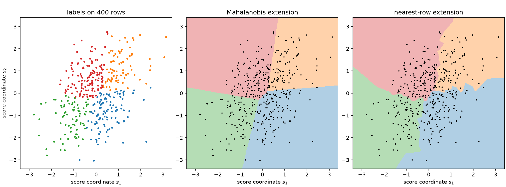

# 6. Two tasks and three optimization levels

Suppose you have run everything in [Chapter 5](ch05-information-after-binning.md) on a
score table and you are holding a good set of labels. Tomorrow a new event arrives. Which
cell does it belong to?

That question sounds like bookkeeping and is not. Nothing in a list of labels answers it.
Labels are attached to the rows you had; a new score vector is not one of those rows, and
the labeling is silent about it. If you want an answer you must supply extra
structure — a rule — and there are infinitely many rules consistent with the labels you
already hold.

This chapter is about taking that seriously. It separates two tasks that are often merged,
explains why ScoreQuant gives them different entry points and different result types, and
sets up the one place where a theorem lets you cross from the first to the second.

## Labels do not determine a rule

**Underdetermination.** *Let \(s_1,\dots,s_N\) be distinct score vectors with labels
\(z_1,\dots,z_N\) in \(\{1,\dots,K\}\), and let \(K\ge2\). Then there are infinitely many
maps \(q:\mathbb{R}^d\to\{1,\dots,K\}\) with \(q(s_i)=z_i\) for every \(i\).*

The proof is one line: pick any point \(s^\star\) outside the sample and any label for it,
and extend arbitrarily elsewhere. There is nothing subtle here, and that is exactly the
point — the gap between a labeling and a rule is not a technicality that a good algorithm
closes on its own. It has to be closed by a decision, and the decision should be visible.

The figure below makes the size of the gap concrete. Two extensions of the *same* optimal
labeling of the same 400 rows: one assigns a new score to the nearest cell mean in the
metric the criterion produced, the other assigns it the label of its nearest training row.
Both reproduce every training label exactly, and they disagree about one fresh event in
twenty-two — a disagreement rate no amount of looking at the labels could have revealed,
because the labels are identical.



*Left: 400 score rows with the optimal four-cell labeling. Middle: the canonical
Mahalanobis extension of that labeling, shaded over the whole plane — polyhedral cells,
because the rule compares quadratic forms that share a metric. Right: the
nearest-training-row extension of the very same labeling. Both are exact on the training
rows: every point in the left panel keeps its colour. They differ on 4.7% of the plotted
region and label 4.5% of fresh draws from the same law differently.*

## Three levels, not one problem

It helps to name the three questions that the same cell-moment algebra can answer. They
are genuinely different optimizations and can have different optima.

**A. Population quantizer design.** Choose any measurable \(q:\mathbb{R}^d\to\{1,\dots,K\}\)
to maximize \(F(I_q)\) under the score law \(P_S\) itself. This is the clean variational
problem, the one whose stationarity conditions produce the geometry of Chapters 8 and 9.
It presumes you can evaluate cell moments under the law, which in ScoreQuant means an
`IntegrationSource`: an explicit density on a box, integrated at quadrature nodes, with no
sampling noise anywhere.

**B. Empirical inductive fitting.** Choose parameters \(\eta\) of an explicit rule family
\(q_\eta\) — centers, a metric, affine discriminants — to maximize \(F(I_{P_n}(q_\eta))\)
on a finite weighted sample. The output is a *function*, so it can be applied to new
events and evaluated on a held-out sample. This is ordinary statistical estimation, and
the usual questions about generalization apply.

**C. Finite assignment.** Choose arbitrary labels \(z_1,\dots,z_N\) for one fixed weighted
table. The search space is all \(K^N\) labelings before cell relabeling, and it is not
restricted to any geometric family. The result is transductive: it is a fact about that
table and says nothing about a new score.

Level C is not a degenerate version of level B. When the dataset is final — an offline
histogram, a published categorization of a fixed corpus, a frozen analysis sample — the
combinatorial optimum on those rows *is* the object you want, and restricting to a
geometric family can only lose. Conversely, when the rule will be applied to events that
do not exist yet, level C answers the wrong question no matter how well it answers it.

## Two entry points, deliberately

ScoreQuant refuses to blur the two, so the split is visible in the type system.

| | `optimize_partition` | `fit_quantizer` |
| --- | --- | --- |
| Level | C — finite assignment | B (or A, with an integration source) |
| Input | a raw score table with weights | a `Source`, plus a `ScoreProvider` when the source is in observation space |
| Search space | all labelings | an explicit rule family |
| Result | `PartitionResult` | `QuantizerResult` |
| Prediction | none | `predict_scores` |

```python
import numpy as np

import scorequant as sq

rng = np.random.default_rng(6)
scores = rng.normal(size=(1_200, 2)) @ np.array([[1.0, 0.4], [0.0, 1.1]])

partition = sq.optimize_partition(scores, n_bins=4, config=sq.DExchangeConfig(seed=0))
quantizer = sq.fit_quantizer(
    sq.ScoreSample(scores), n_bins=4, criterion=sq.NormalizedTrace(), config=sq.KMeansConfig(seed=0)
)

assert not hasattr(partition, "predict_scores")
assert hasattr(quantizer, "predict_scores")
assert quantizer.predict_scores(rng.normal(size=(5, 2))).shape == (5,)
```

`PartitionResult` has no prediction method, and the omission is a design statement rather
than a gap waiting to be filled. Its labels came from a search over labelings; there is no
rule to hand you, and inventing one silently would be exactly the underdetermination
above, decided on your behalf and undocumented.

`QuantizerResult` does predict, and its only prediction method takes *scores*. There is no
`predict(x)`. Converting an observation into a score is the step where provenance,
calibration and finite-difference bias live — [Chapter
4](ch04-scores-and-doors.md) spends a chapter on it and [Chapter
13](ch13-estimated-scores.md) another — so it stays a line you wrote:

<!-- snippet: skip -->
```python
labels = quantizer.predict_scores(my_score_provider.score(new_observations))
```

The source side of the contract is validated in the same spirit. A `ScoreSample` is
already in score space, so it rejects a provider; an `ObservationSample` or an
`IntegrationSource` is not, so it requires one. A score callback offered alone is refused,
because a map is not a measure — automatic differentiation and trained classifiers supply
\(s(\cdot)\) and never \(P_{\theta_0}\).

## The bridge, and why it is only one bridge

For one criterion the gap closes by theorem rather than by convention. When a D-optimal
finite partition is *exchange-stable* — no single row would rather be in another cell —
and its information matrix is nonsingular, the partition is provably identical to the
nearest-cell rule in its own metric \(I_q^{-1}\). The labels then determine a rule, and
that rule reproduces them exactly.

```python
assert partition.exchange_stable is True

compiled = partition.compile_quantizer()
assert np.array_equal(np.asarray(compiled.predict_scores(scores)), np.asarray(partition.labels))
assert compiled.source_kind == "compiled_partition"
assert compiled.metric is not None  # the Mahalanobis metric the theorem supplies
```

`compile_quantizer` verifies label reproduction rather than assuming it, and refuses on a
partition that is not exchange-stable. [Chapter 8](ch08-d-optimality.md) proves the
theorem, states its hypotheses precisely, and shows what the refusal protects you from.

The bridge is criterion-specific, and it is worth being blunt about how narrow it is. It
exists for the log determinant and nothing else in this book. A profiled-\(D_s\) partition
has an analogous population geometry but no exact finite implication — [Chapter
10](ch10-profiled-ds.md) exhibits a global optimum that violates its own geometric rule —
so it refuses to compile:

```python
profiled = sq.optimize_partition(
    scores,
    n_bins=4,
    criterion=sq.ProfiledDOptimality((0,)),
    config=sq.DExchangeConfig(seed=0),
)
try:
    profiled.compile_quantizer()
    raise AssertionError("a profiled partition has no canonical rule")
except ValueError as error:
    assert "no canonical inductive compilation" in str(error)
```

## Three optimization levels of a rule

Once you are on the inductive side, there is a second three-way choice: what exactly is
being varied.

**Free labels.** No geometry at all; the variables are the labels themselves. This is
level C, and it is the exchange engine of [Chapter 8](ch08-d-optimality.md).

**Centers and a metric.** The rule is \(q(s)=\arg\min_b (s-\mu_b)^\top G (s-\mu_b)\) and
the variables are the \(K\) centers together with a shared matrix \(G\). This is the
family that the population first-order condition singles out, it is polyhedral (every cell
is an intersection of half-spaces), and it is what `KMeansConfig` fits with \(G=I\) after
whitening and what a compiled D partition carries with \(G=I_q^{-1}\).

**Soft parameters.** The rule is relaxed into responsibilities
\(r_b(s;\eta,\tau)=\operatorname{softmax}_b\big((a_b^\top s + c_b)/\tau\big)\), the cell
moments become weighted sums with those responsibilities, and the objective becomes
differentiable in \(\eta\). This is `SoftVoronoiConfig`, and [Chapter
12](ch12-soft-rules.md) develops it.

The middle and the last are not two implementations of one idea. On a finite sample the
*hard* objective \(F(I_{P_n}(q_\eta))\) is piecewise constant in \(\eta\): move a
boundary a little and, until some training score crosses it, every label and every cell
moment is unchanged. Its gradient is zero almost everywhere and undefined on the crossing
surfaces, so "gradient descent on the hard empirical objective" is not an algorithm. The
soft relaxation is what makes a gradient exist, and it optimizes a genuinely different —
and, as Chapter 12 explains, genuinely meaningful — objective. That is why a soft fit is
always judged after hardening, and why the library reports the `hardening_gap` between the
two.

## Criterion and solver are a closed set

Not every criterion works with every solver, and rather than accept a pairing and quietly
do something else, ScoreQuant enumerates the combinations it implements and rejects the
rest before any optimization starts.

| Configuration | `optimize_partition` | `fit_quantizer` |
| --- | --- | --- |
| `DExchangeConfig` | `DOptimality`, `ProfiledDOptimality` | `DOptimality` |
| `MahalanobisLloydConfig` | `DOptimality`, `ProfiledDOptimality` | `DOptimality` |
| `KMeansConfig` | — | `NormalizedTrace` |
| `SoftVoronoiConfig` | — | `DOptimality`, `ProfiledDOptimality` |
| `ScalarDPConfig` | — | `DOptimality` |

```python
for config, criterion, task in (
    (sq.DExchangeConfig(), sq.NormalizedTrace(), "partition"),
    (sq.KMeansConfig(), sq.DOptimality(), "quantizer"),
    (sq.DExchangeConfig(), sq.ProfiledDOptimality((0,)), "quantizer"),
):
    try:
        if task == "partition":
            sq.optimize_partition(scores, n_bins=4, criterion=criterion, config=config)
        else:
            sq.fit_quantizer(sq.ScoreSample(scores), n_bins=4, criterion=criterion, config=config)
        raise AssertionError("an unimplemented pairing must be refused")
    except ValueError as error:
        assert "implements only" in str(error)
```

The dashes in the table are not omissions either. `KMeansConfig` will never appear in
`optimize_partition`, because a fixed-metric Lloyd solver is a rule fitter by
construction; asking it for a free labeling is a category error, and the library answers
with a `TypeError` naming the configurations that task actually takes.

Two of the criterion names are inherited rather than invented. *D-optimality*,
*\(D_s\)-optimality* and *E-optimality* are the classical criteria of optimal experimental
design — the determinant, the profiled determinant, and the smallest eigenvalue of an
information matrix — catalogued with their equivalence theory by [Pukelsheim
(2006)](../bibliography.md#pukelsheim2006). What is different here is the feasible set: in
design theory the variable is a probability measure over experimental conditions, which
makes the problem convex, whereas here it is a hard partition of score space, which does
not.

## Validation is a report, never a lever

`fit_quantizer` accepts a second source. It is used for exactly one thing: evaluating the
fitted rule and reporting what it retained.

```python
holdout = np.random.default_rng(600).normal(size=(600, 2)) @ np.array([[1.0, 0.4], [0.0, 1.1]])
validated = sq.fit_quantizer(
    sq.ScoreSample(scores),
    validation=sq.ScoreSample(holdout),
    n_bins=4,
    criterion=sq.NormalizedTrace(),
    config=sq.KMeansConfig(seed=0, n_init=4),
)

plain = sq.fit_quantizer(
    sq.ScoreSample(scores),
    n_bins=4,
    criterion=sq.NormalizedTrace(),
    config=sq.KMeansConfig(seed=0, n_init=4),
)

# The validation sample changed the reports and nothing else.
assert np.array_equal(np.asarray(validated.centers), np.asarray(plain.centers))
assert np.array_equal(np.asarray(validated.labels), np.asarray(plain.labels))
assert validated.validation_report is not None and plain.validation_report is None
print(
    round(float(validated.train_report.geometric_mean_retention), 5),
    round(float(validated.validation_report.geometric_mean_retention), 5),
)
```

The held-out sample never enters a gradient, a stopping rule, or a choice among restarts.
The moment it does, it stops measuring generalization and starts being fitted, and the
number it reports stops meaning what its name says. Keeping that boundary is cheap, and it
is the difference between a diagnostic and a decoration.

## Where this leaves us

The choice of task comes first, before any criterion or solver. Is the dataset final, or
will the rule meet new events? That answers whether you want `optimize_partition` or
`fit_quantizer`, and it determines which of the guarantees in the next three chapters are
available to you.

With the task fixed, the remaining question is what scalar summary of \(I_q\) to maximize.
[Chapter 7](ch07-trace-kmeans.md) takes the easy one — the trace — and finds that it
reduces to a fifty-year-old algorithm. [Chapter 8](ch08-d-optimality.md) takes the
determinant and finds something new.
