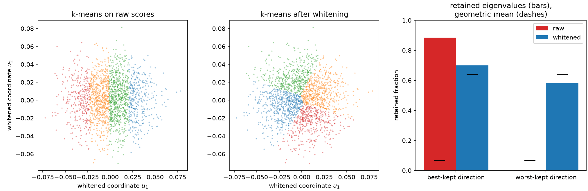

# 7. The trace criterion and whitened k-means

[Chapter 5](ch05-information-after-binning.md) left a matrix on the table, and
[Chapter 6](ch06-two-tasks.md) settled which task you are doing. What remains is to turn
\(I_q\) into a single number to maximize. The cheapest summary is the trace: add up the
diagonal and be done.

That choice turns out to have a famous consequence. Once the score coordinates are put in
statistically meaningful units, maximizing the retained trace is *exactly* weighted
k-means — same objective, same optimum, same algorithm. This chapter derives that
equivalence, uses it, and then shows the two places where it stops being enough: when the
units are wrong, and when the trace is the wrong summary in the first place.

## The trace of the loss identity

There is no new theorem here. Take the identity from Chapter 5,

$$I_{\text{full}} - I_q \;=\; \mathbb{E}\big[\operatorname{Cov}(S\mid Z)\big],$$

and apply the trace, which is linear and turns a covariance into a sum of squares:

$$\operatorname{tr}\big(I_{\text{full}} - I_q\big)
\;=\; \sum_{b=1}^{K}\ \int_{q(s)=b} \|s-\mu_b\|^2 \,d\nu(s)
\;=\; \sum_{b=1}^{K} \sum_{i:\,q(s_i)=b} w_i\,\|s_i-\mu_b\|^2 .$$

The left-hand side is what a hard rule costs in retained trace; the right-hand side is the
weighted within-cell sum of squared distances — the k-means distortion. Since
\(\operatorname{tr} I_{\text{full}}\) does not depend on the rule, the two optimizations
are the same optimization.

**Corollary (trace equals k-means).** *Maximizing \(\operatorname{tr} I_q\) over hard rules
is minimizing weighted k-means distortion over the same rules, in the same coordinates.*

It is worth being precise about what this is and is not. It is a two-line consequence of
the conditional-score-mean identity, and it belongs to the literature rather than to this
book. Determinant- and trace-based criteria on partitions of a scatter matrix go back to
[Friedman and Rubin (1967)](../bibliography.md#friedman1967), [Scott and Symons
(1971)](../bibliography.md#scott1971) and [Marriott
(1971)](../bibliography.md#marriott1971); the Fisher-information version of the trace
geometry is developed by [Barnes, Han and Özgür (2018)](../bibliography.md#barnes2018);
and for exponential families [Dülek (2023)](../bibliography.md#dulek2023) proved that a
trace-optimal quantizer can be taken to depend only on the sufficient statistic and has
convex-polytopal cells. What the identity gives *us* is a licence to reuse fifty years of
vector quantization for free, and a clear statement of when that licence expires — which
is the subject of the last two sections and of [Chapter 8](ch08-d-optimality.md).

## Which Euclidean distance?

The corollary above has an unstated dependency: *in the same coordinates*. Distortion is a
sum of squared distances, and a squared distance in score space is a sum of terms with
different units — the score of a rate parameter and the score of a shape parameter are not
measured in the same thing. Adding them is like adding a length to a temperature. The
answer you get depends on which units you happened to write the parameters in, and any
criterion with that property is not measuring a statistical fact.

The fix is the one every part of this book uses. Project onto the informative subspace and
whiten by \(I_{\text{full}}^{-1/2}\):

$$u \;=\; I_{\text{full}}^{-1/2}\,s ,\qquad
\operatorname{tr}\big(I_{\text{full}}^{-1/2} I_q I_{\text{full}}^{-1/2}\big)
\;=\; r\cdot(\text{arithmetic mean retention}) .$$

In whitened coordinates the unbinned information is the identity, so the criterion becomes
the fraction of a unit budget retained in each direction, and every direction is worth the
same. That is the `NormalizedTrace` criterion, and by the corollary its solver is weighted
Lloyd iteration in whitened coordinates: `KMeansConfig`.

**Proposition (normalized-trace equivalence).** *In whitened coordinates, minimizing
weighted within-cell squared error is exactly maximizing
\(\operatorname{tr}(I_{\text{full}}^{-1/2} I_q I_{\text{full}}^{-1/2})\), and the
resulting labels are unchanged under any invertible linear reparameterization of
\(\theta\).*

The second half follows because whitening two reparameterized score tables produces the
same coordinates up to an orthogonal transform, and Euclidean distance does not notice an
orthogonal transform.

## The baseline that fails: k-means on raw scores

The most common thing to do with a score table is to run k-means on it directly. When the
score coordinates happen to be comparably informative, that is fine, and [Chapter
14](ch14-choosing-a-method.md) says so. When they are not, it fails in a specific and
instructive way.

Here is a two-parameter problem in which one parameter's score is numerically large and
the other's is numerically small — a rate measured in events and a fraction measured in
units of one, say, or simply two parameters someone wrote in different units. Setting
`whiten=False` gives exactly the raw baseline: the projection onto the informative
subspace is then an orthogonal change of basis, which leaves every Euclidean distance
alone, so the cells are the ones plain k-means on the score columns would produce.

```python
import numpy as np

import scorequant as sq

rng = np.random.default_rng(7)
base = rng.normal(size=(2_000, 2))
scores = np.stack([40.0 * base[:, 0], 0.05 * base[:, 1]], axis=1)


def four_cell_fit(table, whiten):
    """Fit four whitened or raw-coordinate k-means cells to one score table."""
    return sq.fit_quantizer(
        sq.ScoreSample(table),
        n_bins=4,
        criterion=sq.NormalizedTrace(),
        config=sq.KMeansConfig(seed=0, n_init=4, whiten=whiten),
    )


raw = four_cell_fit(scores, whiten=False)
whitened = four_cell_fit(scores, whiten=True)

assert abs(float(raw.train_report.geometric_mean_retention) - 0.0648) < 0.01
assert abs(float(whitened.train_report.geometric_mean_retention) - 0.6377) < 0.01
print(
    np.round(np.asarray(raw.train_report.retained_eigenvalues), 5),
    np.round(np.asarray(whitened.train_report.retained_eigenvalues), 5),
)
```

Raw-coordinate k-means keeps 88% of one direction and 0.5% of the other. Its geometric
mean retention is 6.5%; the whitened fit reaches 63.8%. The mechanism is not subtle: the
distortion \(\sum w_i\|s_i-\mu_b\|^2\) is dominated by whichever coordinate has the larger
numerical spread, so all four cells are spent resolving the first parameter and the second
is never split at all. The rule is excellent at the thing nobody asked it to optimize.

Note that the *arithmetic* mean retention of the raw fit is 44%, which does not look like a
disaster. That is the arithmetic mean doing what [Chapter
5](ch05-information-after-binning.md) warned it does: averaging a direction that was kept
with a direction that was destroyed. The standard error on the second parameter is inflated
by \(1/\sqrt{0.0048} \approx 14\).

The clean way to see that the raw baseline is measuring an accident is to reparameterize.
Replacing \(\theta\) by \(B\theta\) replaces the score table by \(sA^\top\) with
\(A=B^{-\top}\); nothing statistical has happened. The whitened rule does not notice; the
raw rule returns different cells.

```python
reparameterization = np.array([[0.5, 300.0], [-2.0, 1.0]])  # invertible: det = 600.5
rotated = scores @ reparameterization.T

assert np.array_equal(
    np.asarray(four_cell_fit(rotated, whiten=True).labels), np.asarray(whitened.labels)
)
assert not np.array_equal(
    np.asarray(four_cell_fit(rotated, whiten=False).labels), np.asarray(raw.labels)
)
```



*Left and middle: the same score sample drawn in whitened coordinates, coloured by
raw-coordinate k-means cells and by whitened k-means cells. The raw fit stacks all four
cells along the numerically larger direction and never splits the other. Right: the two
retained eigenvalues of each fit, with the geometric mean marked. Averaging the raw fit's
two directions hides a direction that was lost entirely.*

## Lloyd iteration, and why it is monotone here

The solver behind `NormalizedTrace` is the classical alternation, run on the whitened
table:

1. assign every positive-weight row to its nearest center;
2. replace each center by the weighted mean of the rows assigned to it.

**Theorem (fixed-metric monotonicity).** *With the metric held fixed, each step weakly
decreases the weighted distortion. With deterministic tie handling and finitely many
labelings, the label sequence therefore reaches a fixed labeling in finitely many
iterations.*

*Proof.* With centers fixed, nearest-center assignment minimizes every row's term
independently, so step one cannot increase the total. With labels fixed, the weighted mean
is the unique minimizer of \(\sum_i w_i\|s_i-c\|^2\) within a nonempty cell, so step two
cannot increase it either. A strictly decreasing sequence cannot revisit a labeling, and
there are finitely many. ∎

That proof uses the fixed metric twice, and the emphasis is not decorative. The
determinant criterion of the next chapter induces a metric \(I_q^{-1}\) that *depends on
the current partition*, and the corresponding batch iteration recomputes it after every
sweep. Neither line of the proof survives that change, and [Chapter
9](ch09-mahalanobis-lloyd.md) exhibits an eight-row configuration where one such step
lowers the objective by 0.137 nat.

What monotonicity does not give you is a global optimum: k-means is nonconvex, and Lloyd
finds a local one. The library defaults to eight deterministic weighted k-means++
restarts, and the result records which objective it reports:

```python
assert whitened.trace.objective_label == "whitened_sse"
assert whitened.n_bins == 4
assert whitened.rank == 2

single = four_cell_fit(scores, whiten=True)
assert np.array_equal(np.asarray(single.labels), np.asarray(whitened.labels))  # deterministic
```

`objective_label` is worth respecting. A `KMeansConfig` trace is a *minimized* within-cell
squared error, while a D trace is a *maximized* log determinant. Both are floats and they
are not comparable; the label exists so that a plotted history is never read in the wrong
convention.

Two classical results frame what the k-means inheritance is worth. [Pollard
(1981)](../bibliography.md#pollard1981) proved strong consistency of k-means: empirical
minimizers converge almost surely to population minimizers under mild conditions. That is
the canonical empirical-to-population template, and it is the right comparator for a
learned score-space rule, though its objective is additive squared distortion rather than a
matrix criterion — a gap [Chapter 12](ch12-soft-rules.md) returns to. [Inaba, Katoh and
Imai (1994)](../bibliography.md#inaba1994) showed that because optimal k-means cells are
Voronoi-realizable, enumerating candidate Voronoi diagrams gives exact algorithms for
fixed dimension and cell count. That idea reappears, with a determinant-specific twist, in
the certificates of [Chapter 8](ch08-d-optimality.md). [Telgarsky and Vattani
(2010)](../bibliography.md#telgarsky2010) analyzed single-point relocation — Hartigan's
method — against Lloyd's, and showed that the two have different fixed points, with
Hartigan's the strictly stronger condition. That distinction, transplanted to the
determinant criterion, is the whole of Chapters 8 and 9.

## Trace and determinant are different criteria

The last thing to establish is that this chapter has not solved the problem. Trace and
determinant are two summaries of the same matrix, they agree in one dimension — [Chapter
3](ch03-exact-1d.md) showed every increasing function of a scalar \(I_q\) picks the same
partition — and in more than one dimension they do not.

With ten rows and three cells the question can be settled by looking at every partition
there is. There are \(S(10,3)=9330\) of them, which is nothing.

```python
def restricted_growth(n_rows, n_bins):
    """Enumerate every partition of n_rows items into exactly n_bins nonempty cells."""
    labels = np.zeros(n_rows, dtype=np.int64)
    found = []

    def extend(position, used):
        if position == n_rows:
            if used == n_bins:
                found.append(labels.copy())
            return
        if n_bins - used > n_rows - position:
            return
        for cell in range(min(used + 1, n_bins)):
            labels[position] = cell
            extend(position + 1, used + (1 if cell == used else 0))

    extend(0, 0)
    return np.asarray(found)


small = np.random.default_rng(5).normal(size=(10, 2))
labelings = restricted_growth(10, 3)
assert labelings.shape == (9_330, 10)

# Whitened retained information of every labeling at once.
membership = (labelings[:, :, None] == np.arange(3)[None, None, :]).astype(float)
mass = membership.sum(axis=1)
moments = np.einsum("jib,ip->jbp", membership, small)
information = np.einsum("jb,jbp,jbq->jpq", 1.0 / mass, moments, moments)
eigenvalues, basis = np.linalg.eigh(np.asarray(sq.fisher_information(small)))
whitener = basis / np.sqrt(eigenvalues)
retained = np.einsum("pr,jpq,qs->jrs", whitener, information, whitener)

log_determinant = np.linalg.slogdet(retained)[1]
normalized_trace = np.trace(retained, axis1=1, axis2=2)

best_determinant = int(np.argmax(log_determinant))
best_trace = int(np.argmax(normalized_trace))
assert best_determinant != best_trace
```

The two optima are different partitions, and each is strictly better on its own scoreboard
and strictly worse on the other:

```python
for name, index in (("determinant", best_determinant), ("trace", best_trace)):
    report = sq.information_report(small, labelings[index], n_bins=3)
    print(
        name,
        round(float(report.geometric_mean_retention), 6),
        round(float(report.arithmetic_mean_retention), 6),
    )

d_report = sq.information_report(small, labelings[best_determinant], n_bins=3)
t_report = sq.information_report(small, labelings[best_trace], n_bins=3)
assert d_report.geometric_mean_retention > t_report.geometric_mean_retention
assert t_report.arithmetic_mean_retention > d_report.arithmetic_mean_retention
assert abs(float(d_report.geometric_mean_retention) - 0.688157) < 1e-4
assert abs(float(t_report.arithmetic_mean_retention) - 0.715759) < 1e-4
```

The determinant optimum retains a geometric mean of 0.688 against the trace optimum's
0.685; the trace optimum retains an arithmetic mean of 0.716 against the determinant
optimum's 0.703. These are not local optima or seeds — this is every partition of the
table, so the disagreement is a property of the criteria.

The gap is small here and it need not be. The trace is a sum, so it will happily trade a
direction away if another direction pays more; the determinant is a product, so it cannot,
and it goes to \(-\infty\) if any direction is lost. Which one you want follows from what
the labels are for. If the deliverable is a confidence region for several parameters
jointly, its volume is governed by \(\det I^{-1}\) and the determinant is the criterion
that matches. If one parameter genuinely matters more and you can say so, the honest move
is to declare it — [Chapter 10](ch10-profiled-ds.md) shows how — rather than to let a
trace decide by accident of units.

The determinant costs something for this. It couples every direction through
\(I_q^{-1}\), so there is no reduction to an additive per-row distortion, no fixed metric,
and no Lloyd monotonicity theorem to inherit. The next chapter shows what replaces them.
