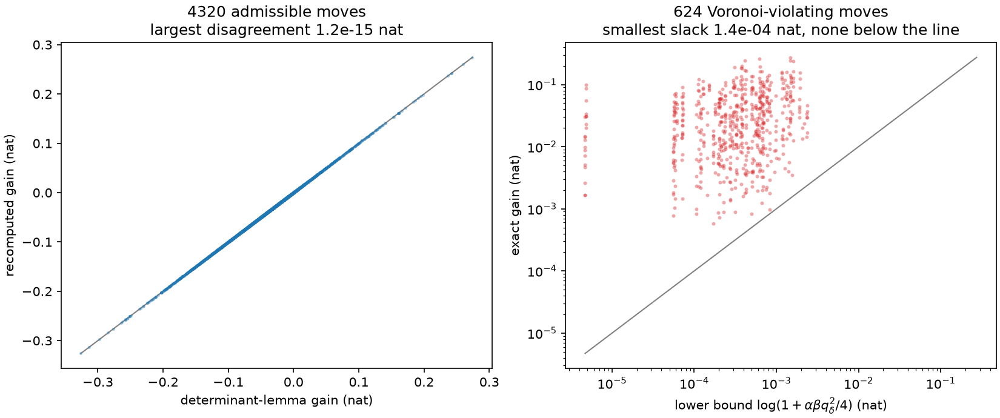
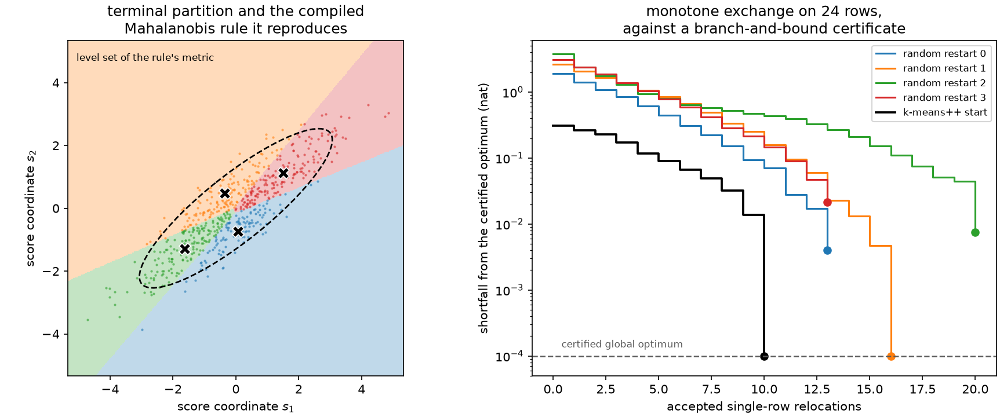

# 8. D-optimality and exact exchange

[Chapter 7](ch07-trace-kmeans.md) ended by showing that the trace and the determinant of
\(I_q\) pick different partitions. This chapter takes the determinant seriously.

$$F_D(I_q) \;=\; \log\det I_q .$$

The reason to want it is geometric. The asymptotic confidence region for \(\theta\) built
from \(N\) labeled events is an ellipsoid whose volume is proportional to
\(\det(N I_q)^{-1/2}\), so maximizing \(\log\det I_q\) is minimizing the volume of the
region you will actually publish. It is also the only criterion in this book that is
invariant under reparameterization for free: replacing \(\theta\) by \(B\theta\) replaces
\(I_q\) by \(B^{-\top}I_qB^{-1}\) and changes the objective by \(-2\log|\det B|\), the
same constant for every rule, so the ranking of rules is untouched.

That criterion is inherited. "Maximize the determinant of an information matrix" is
D-optimality in the design of experiments, where [Kiefer and Wolfowitz
(1960)](../bibliography.md#kiefer1960) proved its equivalence to G-optimality, and where
the convex-analytic theory of such criteria is catalogued by [Pukelsheim
(2006)](../bibliography.md#pukelsheim2006). Determinant criteria on *partitions* are also
old, going back to [Friedman and Rubin (1967)](../bibliography.md#friedman1967) and
[Scott and Symons (1971)](../bibliography.md#scott1971) — though that literature mostly
minimizes the determinant of a *within*-cluster scatter matrix, which above one dimension
is not the same problem as maximizing the determinant of the between-cell matrix even when
their sum is fixed.

What is not inherited, and what this chapter is about, is the exact finite structure: a
closed relocation identity, a closed determinant gain, a monotone finite algorithm, and a
theorem that turns a terminal labeling into a rule.

## Why the determinant is harder than the trace

Start with the first variation, which is where the geometry comes from. Move an
infinitesimal amount \(d\varepsilon\) of probability mass sitting at score \(s\) from cell
\(a\) to cell \(b\). Differentiating the cell-moment expression for \(I_q\) gives

$$dI_q \;=\; \Big[(s-\mu_a)(s-\mu_a)^\top - (s-\mu_b)(s-\mu_b)^\top\Big]\,d\varepsilon ,$$

so for any differentiable criterion \(F\) with symmetric gradient
\(G=\nabla_I F(I_q)\),

$$\frac{dF}{d\varepsilon}
\;=\; (s-\mu_a)^\top G\,(s-\mu_a) \;-\; (s-\mu_b)^\top G\,(s-\mu_b) .$$

A stationary population rule can therefore have no score sitting in a cell it is farther
from, in the metric \(G\): almost every \(s\) must satisfy \(q(s)\in\arg\min_b
(s-\mu_b)^\top G(s-\mu_b)\). Because all cells share one \(G\), the comparison between two
cells cancels the common \(s^\top Gs\) and leaves an affine inequality, so every cell is
an intersection of half-spaces: a Mahalanobis Voronoi diagram.

For \(F_D=\log\det\) the gradient is \(G_D=I_q^{-1}\), and here is where the determinant
parts company with the trace. The metric is the inverse of the very matrix the partition
produces. Change the partition and you change the ruler you were measuring it with.
There is no fixed metric, no additive per-row distortion to minimize, and therefore no
Lloyd monotonicity theorem to inherit from [Chapter 7](ch07-trace-kmeans.md).

Worse, the display above is an *infinitesimal* statement about a *population*. A real
relocation moves one whole row: it shifts two centroids by a finite amount and changes
\(I_q\), hence \(G\), by a finite amount. Treating the population first-order rule as if
it governed finite moves is a category error, and [Chapter
9](ch09-mahalanobis-lloyd.md) exhibits what it costs. The way out is not to approximate
the finite move — it is to compute it exactly.

## The exact relocation identity

Move one row \((s,w)\) from a cell \(a\) that keeps positive weight into a cell \(b\).
Write

$$u_a=s-\mu_a,\qquad u_b=s-\mu_b,\qquad
\alpha=\frac{wW_a}{W_a-w},\qquad \beta=\frac{wW_b}{W_b+w} .$$

**Theorem (exact rank-two relocation).** *The change in retained information is*

$$\boxed{\;\Delta I \;=\; \alpha\,u_au_a^\top \;-\; \beta\,u_bu_b^\top .\;}$$

*Proof.* Take the source cell first. Its moment becomes \(m_a'=m_a-ws\) and its weight
\(W_a'=W_a-w\). Writing \(m_a=W_a\mu_a\) and \(s=\mu_a+u_a\) gives
\(m_a'=W_a'\mu_a-wu_a\), so

$$\frac{m_a'm_a'^\top}{W_a'}
= W_a'\mu_a\mu_a^\top - w\big(\mu_au_a^\top+u_a\mu_a^\top\big) + \frac{w^2}{W_a'}u_au_a^\top .$$

Subtracting the old contribution \(W_a\mu_a\mu_a^\top\) and using
\(\alpha-\tfrac{w^2}{W_a'} = \tfrac{w(W_a-w)}{W_a'} = w\) collects the remainder into a
perfect square:

$$\Delta_a \;=\; \alpha\,u_au_a^\top
\;-\; w\big(\mu_a\mu_a^\top+\mu_au_a^\top+u_a\mu_a^\top+u_au_a^\top\big)
\;=\; \alpha\,u_au_a^\top - w\,ss^\top .$$

The destination is the mirror image. With \(m_b'=W_b'\mu_b+wu_b\), \(W_b'=W_b+w\), and
\(w-\beta=\tfrac{w^2}{W_b'}\),

$$\Delta_b \;=\; w\,ss^\top - \beta\,u_bu_b^\top .$$

Every other cell is untouched, and the event's own outer product \(w\,ss^\top\) — the
information it would carry as a singleton — appears once with each sign and cancels. ∎

The cancellation is the whole content: an operation that touches two cells, two weights
and two means collapses to one positive and one negative rank-one update, with no
cross-term and nothing left over. The \(\pm w\,ss^\top\) that cancels is also the reason
the identity requires the source cell to keep positive weight; emptying a cell is not a
relocation, it is a change of \(K\).

```python
import numpy as np

import scorequant as sq

rng = np.random.default_rng(8)
scores = rng.normal(size=(240, 2)) @ np.array([[1.0, 0.45], [0.0, 1.25]])
labels = np.asarray(
    sq.optimize_partition(scores, n_bins=4, config=sq.DExchangeConfig(seed=0)).labels
)


def cell_moments(table, assignment, n_bins=4):
    """Return cell masses, cell means, and the binned information of a labeling."""
    mass = np.bincount(assignment, minlength=n_bins).astype(float)
    sums = np.zeros((n_bins, table.shape[1]))
    np.add.at(sums, assignment, table)
    means = sums / mass[:, None]
    return mass, means, np.einsum("b,bp,bq->pq", mass, means, means)


mass, means, information = cell_moments(scores, labels)
row, weight = 7, 1.0
source, destination = int(labels[row]), (int(labels[row]) + 2) % 4
u_source = scores[row] - means[source]
u_destination = scores[row] - means[destination]
alpha = weight * mass[source] / (mass[source] - weight)
beta = weight * mass[destination] / (mass[destination] + weight)

moved = labels.copy()
moved[row] = destination
_, _, after = cell_moments(scores, moved)

predicted = information + alpha * np.outer(u_source, u_source)
predicted -= beta * np.outer(u_destination, u_destination)
assert np.max(np.abs(predicted - after)) < 1e-10
```

The two halves of the proof are just as checkable as the whole, and worth checking,
because the cancellation is the surprising part:

```python
own = weight * np.outer(scores[row], scores[row])
source_sum = np.sum(scores[moved == source], axis=0)
source_after = np.outer(source_sum, source_sum) / np.sum(moved == source)
source_before = mass[source] * np.outer(means[source], means[source])
source_half = alpha * np.outer(u_source, u_source) - own

assert np.max(np.abs((source_after - source_before) - source_half)) < 1e-10
```

## The determinant gain in closed form

Write the update as a rank-two correction, \(\Delta I = UCU^\top\) with
\(U=[\,u_a\ \ u_b\,]\) and \(C=\operatorname{diag}(\alpha,-\beta)\). The matrix determinant
lemma turns the \(d\times d\) determinant into a \(2\times2\) one:

$$\frac{\det(I+UCU^\top)}{\det I} \;=\; \det\!\big(\mathbb{1}_2 + C\,U^\top I^{-1} U\big) .$$

With \(H=I^{-1}\) and the three inner products
\(q_{aa}=u_a^\top Hu_a\), \(q_{bb}=u_b^\top Hu_b\), \(q_{ab}=u_a^\top Hu_b\), the inner
matrix is \(\begin{pmatrix}\alpha q_{aa} & \alpha q_{ab}\\ -\beta q_{ab} & -\beta
q_{bb}\end{pmatrix}\) and its shifted determinant is immediate:

$$\boxed{\;\Delta F_D \;=\; \log\Big[(1+\alpha q_{aa})(1-\beta q_{bb}) + \alpha\beta\,q_{ab}^2\Big].\;}$$

Three scalars per candidate move, once \(H\) is available. Nothing is inverted, nothing is
refactorized, and nothing is approximated — this is the exact change in the objective, not
a first-order proxy for it.

```python
inverse = np.linalg.inv(information)
q_source = u_source @ inverse @ u_source
q_destination = u_destination @ inverse @ u_destination
q_cross = u_source @ inverse @ u_destination

lemma = np.log((1.0 + alpha * q_source) * (1.0 - beta * q_destination) + alpha * beta * q_cross**2)
recomputed = np.linalg.slogdet(after)[1] - np.linalg.slogdet(information)[1]
assert abs(lemma - recomputed) < 1e-10
```



*Left: the determinant-lemma gain against a full rebuild of \(\log\det I_q\), over 4320
admissible relocations of twelve random configurations. The largest disagreement is
\(1.2\times10^{-15}\) nat — floating-point noise, not approximation. Right: for the 624 of
those moves that violate the current Mahalanobis-Voronoi rule, the exact gain against the
Theorem-3 lower bound. Every point lies above the identity line, and every point is
positive.*

## Monotone exchange

The algorithm follows. A *scan* evaluates the closed gain of every admissible relocation;
if the best gain is positive, take it — or, under `batch_moves`, take many of the best at
once and verify the batch against an exactly rebuilt objective. Repeat until no positive
gain remains.

**Theorem (finite monotonicity).** *Accepting only strictly positive exact gains makes
\(\log\det I_q\) strictly increase at every accepted step. A strictly increasing sequence
cannot revisit a labeling, and there are finitely many labelings, so the procedure
terminates.*

That is the whole argument, and it is worth appreciating how little it assumes: no
convexity, no fixed metric, no step size, no schedule. The price is that the guarantee is
about *termination at a locally unimprovable state*, not about global optimality — the
last section of this chapter is about buying the difference.

Single-row relocation as a clustering move is Hartigan's method, from [Hartigan
(1975)](../bibliography.md#hartigan1975), and the relationship between its fixed points
and Lloyd's was analyzed for k-means by [Telgarsky and Vattani
(2010)](../bibliography.md#telgarsky2010), who showed Hartigan's condition is strictly
stronger. That distinction is about to become the central fact of this chapter.

```python
partition = sq.optimize_partition(
    scores, n_bins=4, config=sq.DExchangeConfig(seed=0, batch_moves=False)
)
history = np.asarray(partition.objective_history)

assert np.all(np.diff(history) > 0)  # strictly monotone, by construction
assert partition.objective == float(history[-1])
assert partition.exchange_stable is True
assert partition.best_remaining_gain <= partition.config.gain_tolerance
print(partition.accepted_moves, partition.scans, round(partition.objective, 6))
```

Two implementation facts are worth knowing because they show up in the reports.
`DExchangeConfig` maintains \(I_q\) and \(I_q^{-1}\) incrementally through the rank-two
update — two chained Sherman-Morrison steps — and refreshes the inverse exactly whenever
the accumulated residual of \(I\,I^{-1}-\mathbb{1}\) drifts past a dtype-dependent
tolerance, so a long run cannot quietly accumulate error into the gains it is ranking.
And identical score rows are merged into one weighted atom before the search, because the
theorem below needs distinct atoms and because it makes the scan cheaper.

## Exchange stability

A labeling is **exchange-stable** when no admissible single-row relocation has positive
exact gain. That is a property of a labeling, not of an algorithm, so it can be checked on
labels of any origin: a run that stopped early, a hand edit, an external tool's output.

```python
perturbed = labels.copy()
perturbed[:20] = (perturbed[:20] + 1) % 4

unstable = sq.exchange_stability_report(scores, perturbed)
assert unstable.stable is False
assert unstable.best_gain > 0.0
assert unstable.best_move is not None  # (row, destination) in original row indexing

settled = sq.exchange_stability_report(scores, np.asarray(partition.labels))
assert settled.stable is True
print(round(unstable.best_gain, 6), unstable.best_move)
```

One scan, no optimization, no repair. The report names the improving move when one exists,
which is what makes it usable as a check rather than an oracle.

## The leverage lemma

Before the main theorem, one inequality that costs three lines and does all the work.

**Lemma (leverage bound).** *For a nonsingular partition and any two cells,*

$$(\mu_a-\mu_b)^\top I_q^{-1}(\mu_a-\mu_b) \;\le\; \frac{1}{W_a}+\frac{1}{W_b} .$$

*Proof.* Put \(v_b=\sqrt{W_b}\,\mu_b\) and \(M=[v_1,\dots,v_K]\), so that
\(I_q=MM^\top\). Then \(P=M^\top(MM^\top)^{-1}M\) is an orthogonal projection on
\(\mathbb{R}^K\), with entries \(P_{ab}=\sqrt{W_aW_b}\,\mu_a^\top I_q^{-1}\mu_b\). Taking
\(e = W_a^{-1/2}e_a - W_b^{-1/2}e_b\) gives
\((\mu_a-\mu_b)^\top I_q^{-1}(\mu_a-\mu_b) = e^\top Pe \le e^\top e = 1/W_a+1/W_b\),
because a projection has operator norm at most one. ∎

The bound says cells cannot be arbitrarily far apart in the metric they themselves
generate, and that light cells are allowed to be farther apart than heavy ones. It is a
constraint every labeling satisfies, so a violation is a numerical warning rather than a
better partition, and the geometry report measures it:

```python
geometry = partition.geometry
assert geometry.maximum_separation_residual <= 0.0  # the lemma, measured
assert geometry.separation_certified is True
```

## Theorem 3: stability forces geometry

Here is the result that makes the determinant criterion structurally different from every
other criterion in this book.

**Theorem 3 (finite D exchange stability forces self-consistent Voronoi geometry).**
*Assume positive weights, merged duplicate score atoms, distinct nonempty centroids, and a
positive-definite \(I\). For an admissible move \(a\to b\), if the point is no closer to
its own centroid than to \(b\) in the current D metric,*

$$q_{aa}\;\ge\;q_{bb},$$

*then*

$$\Delta F_D \;\ge\; \log\!\left(1+\frac{\alpha\beta}{4}\,q_\delta^2\right)\;>\;0,
\qquad q_\delta=(\mu_a-\mu_b)^\top I^{-1}(\mu_a-\mu_b) .$$

*Hence every one-point-exchange-stable finite D partition is a strict self-consistent
\(I^{-1}\)-Mahalanobis Voronoi partition on the observed rows.*

Read the contrapositive, because that is how it is used. If a row is sitting in a cell it
is not closest to — in the metric its own partition generates — then relocating it is
*guaranteed* to raise the objective by a definite, computable amount. So a partition from
which no relocation helps cannot contain such a row. Stability, a purely combinatorial
property, forces geometry.

The proof is short enough to give, and the point of giving it is that one line in it is a
coincidence that no other criterion in this book enjoys.

*Proof.* Write \(x=q_{aa}\), \(y=q_{bb}\), \(z=q_{ab}\) and \(D=q_\delta\). Since
\(u_a-u_b=\mu_b-\mu_a\), the separation is \(D=x+y-2z\), so \(z=\tfrac12(x+y-D)\), and
\(D\ge0\) because \(I^{-1}\succ0\). The determinant lemma gives

$$\frac{\det I'}{\det I}-1 \;=\; \alpha x-\beta y-\alpha\beta\,(xy-z^2) .$$

Bound the subtracted term with \(xy\le\tfrac14(x+y)^2\):

$$xy-z^2 \;\le\; \frac{(x+y)^2-(x+y-D)^2}{4}
\;=\; \frac{2(x+y)D-D^2}{4},$$

so that

$$\frac{\det I'}{\det I}-1-\frac{\alpha\beta}{4}D^2
\;\ge\; \alpha x-\beta y-\frac{\alpha\beta}{2}(x+y)\,D .$$

Now the two ingredients meet. Because \(\alpha>w>\beta>0\), the leverage lemma reads
\(D\le \tfrac1{W_a}+\tfrac1{W_b} = \tfrac{\alpha-\beta}{\alpha\beta}\), and substituting it
leaves

$$\alpha x-\beta y-\frac{(x+y)(\alpha-\beta)}{2}
\;=\; \frac{(\alpha+\beta)(x-y)}{2} \;\ge\; 0$$

by the premise \(x\ge y\). Hence \(\det I'/\det I \ge 1+\tfrac{\alpha\beta}{4}D^2\), and
taking logarithms gives the claim; it is strict because the centroids are distinct, so
\(D>0\). ∎

The line that matters is

$$\frac{\alpha-\beta}{\alpha\beta} \;=\; \frac{1}{W_a}+\frac{1}{W_b} ,$$

where the left side comes from the determinant lemma's coefficients and the right side is
the leverage bound. They are the same number. Nothing forced that, and change the
criterion and it is gone: subtract a nuisance determinant and the two sides no longer meet
([Chapter 10](ch10-profiled-ds.md)); replace \(\log\det\) by \(\lambda_{\min}\) and there
is not even a unique \(G\) in which to write the premise ([Chapter
11](ch11-e-optimality.md)).

The bound is exact mathematics, so the useful thing to do numerically is to hunt for a
violation. Over sixty small random configurations there are several hundred moves
satisfying the premise, and none of them comes close to breaking it:

```python
checked, worst_slack = 0, np.inf
for seed in range(60):
    generator = np.random.default_rng(seed)
    table = generator.normal(size=(12, 2))
    assignment = np.array([index % 3 for index in range(12)])
    generator.shuffle(assignment)
    mass, means, information = cell_moments(table, assignment, n_bins=3)
    sign, base = np.linalg.slogdet(information)
    if sign <= 0 or mass.min() < 2:
        continue
    inverse = np.linalg.inv(information)
    for row in range(12):
        source = int(assignment[row])
        u_source = table[row] - means[source]
        q_source = u_source @ inverse @ u_source
        for destination in range(3):
            if destination == source:
                continue
            u_destination = table[row] - means[destination]
            if q_source < u_destination @ inverse @ u_destination:
                continue  # not a Voronoi violation, so the theorem says nothing
            alpha = mass[source] / (mass[source] - 1.0)
            beta = mass[destination] / (mass[destination] + 1.0)
            separation = means[source] - means[destination]
            bound = np.log1p(alpha * beta * (separation @ inverse @ separation) ** 2 / 4.0)
            trial = assignment.copy()
            trial[row] = destination
            gain = np.linalg.slogdet(cell_moments(table, trial, n_bins=3)[2])[1] - base
            worst_slack = min(worst_slack, float(gain - bound))
            checked += 1

assert checked > 400
assert worst_slack > 0.0
print(checked, round(worst_slack, 6))
```

## The compile bridge

Theorem 3 says a terminal labeling *is* the training realization of a rule, so handing
that rule back is bookkeeping rather than invention:

$$\widehat q_D(s) \;=\; \arg\min_b\,(s-\mu_b)^\top \widehat I^{-1}(s-\mu_b) .$$

```python
compiled = partition.compile_quantizer()
assert np.array_equal(np.asarray(compiled.predict_scores(scores)), np.asarray(partition.labels))
assert partition.geometry.voronoi_consistent is True
assert partition.geometry.violating_moves == 0
assert partition.geometry.guaranteed_violation_gain == 0.0
```

`compile_quantizer` refuses on a partition that is not exchange-stable, and — having
compiled — it checks that every training label is actually reproduced rather than trusting
the theorem to cover a degenerate case the hypotheses exclude. The `geometry` report is the
theorem's two sides measured on the terminal state: `voronoi_consistent` says no row is
misplaced, and `guaranteed_violation_gain` is the largest Theorem-3 bound over
Voronoi-violating moves, exactly zero when there are none.

One line of fine print separates the theorem from the software. The theorem is exact and
holds at exchange stability; a solver stops at `gain_tolerance`, so what it delivers is
stability *at* \(\tau\), and the checks above are made at \(\tau\) rather than at zero.
The two coincide until the guaranteed gain gets small, and it does get small: it is
\(\log(1+\alpha\beta q_\delta^2/4)\), and cell centroids crowd together as the sample
grows, so the guarantee falls like \(1/N^2\). Past roughly a million rows it slips under the
default \(10^{-10}\), and a handful of rows may then sit a hair past a boundary without any
relocation being worth taking. `geometry.gain_tolerance` records which tolerance was bought
and `geometry.maximum_violation_gain` what was actually left on the table, so the compiled
rule's claim is exact about its own precision: self-consistent at \(\tau\), agreeing with
the training labels everywhere except on rows worth less than \(\tau\) to move. The
mathematics of Theorem 3 is untouched by this; only the arithmetic has a floor.



*Left: an exchange-stable four-cell partition drawn in raw score coordinates, shaded by the
Mahalanobis rule it compiles into. Cell boundaries are straight because all cells share one
metric, whose shape is the dashed level set. Right: five exchange runs on a twenty-four-row
table, plotted as shortfall from the branch-and-bound global optimum. Every run is
monotone; two reach the optimum and three stop, exchange-stable, above it.*

## The converse is false, twice

Theorem 3 is an implication, and it is worth being explicit that neither converse holds.

**Self-consistent does not imply exchange-stable.** A partition can satisfy the
nearest-centroid rule in its own metric and still admit an improving relocation. That is
not a paradox: the Voronoi condition is what the *infinitesimal* first-order argument
sees, while a relocation is finite and moves the centroids and the metric as well.
Transplanted from k-means, this is exactly the Lloyd-versus-Hartigan gap of [Telgarsky and
Vattani (2010)](../bibliography.md#telgarsky2010). It is easy to exhibit: run the batch
Mahalanobis iteration of [Chapter 9](ch09-mahalanobis-lloyd.md) to its own fixed point,
tell it not to hand off to the exchange, and then ask.

```python
generator = np.random.default_rng(31)
blobs = np.concatenate(
    [
        generator.normal(loc=centre, scale=0.5, size=(200, 2))
        for centre in ((-3.0, 0.0), (3.0, 0.0), (0.0, 4.0), (0.0, -4.0))
    ]
)
start = np.random.default_rng(2).integers(0, 4, size=blobs.shape[0])

fixed_point = sq.optimize_partition(
    blobs,
    n_bins=4,
    config=sq.MahalanobisLloydConfig(seed=2, guard="reject"),
    initial_labels=start,
)
assert fixed_point.geometry.voronoi_consistent is True  # every row is in its nearest cell
assert fixed_point.exchange_stable is False  # and yet a relocation still pays
assert fixed_point.best_remaining_gain > 0.0

try:
    fixed_point.compile_quantizer()
    raise AssertionError("an unstable partition has no theorem behind it")
except ValueError as error:
    assert "only an exchange-stable D partition can be compiled" in str(error)
```

**Exchange-stable does not imply globally optimal.** The same configuration makes that
point loudly. The self-consistent fixed point above sits far below what the criterion can
actually reach:

```python
best = sq.optimize_partition(blobs, n_bins=4, config=sq.DExchangeConfig(seed=0))
assert best.exchange_stable is True
assert best.objective > fixed_point.objective + 0.6
print(round(fixed_point.objective, 6), round(best.objective, 6))
```

Both labelings are geometrically self-consistent; one is worth 0.66 nat more than the
other. Local optimality of any kind is a statement about a neighborhood, and the
neighborhood of single-row relocations is small.

## Certificates

So: when *is* a partition globally optimal? For small tables the question can be settled
rather than estimated. `certify_partition` runs a depth-first branch and bound over
labelings with an upper bound that comes straight from the refinement monotonicity of
[Chapter 5](ch05-information-after-binning.md): after assigning the first \(t\) rows, any
completion is a coarsening of the current partial cells together with one singleton cell
per remaining row, so

$$\log\det\Big(I_{\text{partial}} + \sum_{u\ge t} w_u\,y_uy_u^\top\Big)$$

is a valid ceiling for the whole subtree, and it tightens with depth. The search starts
from an incumbent, so supplying an exchange result answers the practical question
directly.

```python
table = np.random.default_rng(8).normal(size=(24, 2))
exchanged = sq.optimize_partition(table, n_bins=4, config=sq.DExchangeConfig(seed=0))
certificate = sq.certify_partition(table, n_bins=4, incumbent=exchanged.labels)

assert certificate.status == "optimal"  # the tree was exhausted
assert certificate.gap == 0.0
assert certificate.incumbent_was_optimal is False  # the exchange had stopped short
assert certificate.objective > exchanged.objective
print(
    round(exchanged.objective, 6),
    round(certificate.objective, 6),
    certificate.nodes_explored,
)
```

The exchange reached \(-0.5728\); the true optimum of that table is \(-0.5687\), found
after 25093 nodes. The gap is 0.004 nat, which is not much — and that is the point of
measuring it rather than assuming either way.

Two properties of the certificate are deliberate. It always reports which of two things
happened: `status="optimal"` means the tree was exhausted and nothing beats the reported
objective by more than the gain tolerance, while `status="budget_exhausted"` means the
node budget ran out and returns a genuine outstanding `upper_bound` and `gap` instead of a
claim. And it refuses instances larger than its declared capacity by name rather than
appearing to hang: global certification is exponential, and `CertificationConfig.max_rows`
defaults to 64 distinct score atoms.

How often does a plain fit find the global optimum? On small tables, often enough to be
tempting and not often enough to be trusted:

```python
optimal = 0
for seed in range(10):
    instance = np.random.default_rng(100 + seed).normal(size=(12, 2))
    fitted = sq.fit_quantizer(
        sq.ScoreSample(instance),
        n_bins=3,
        criterion=sq.NormalizedTrace(),
        config=sq.KMeansConfig(seed=0, n_init=1),
    )
    proved = sq.certify_partition(instance, n_bins=3, incumbent=fitted.labels)
    optimal += proved.incumbent_was_optimal

assert optimal == 4
print(optimal, "of 10 single-restart k-means fits were already globally D-optimal")
```

Four of ten. A single k-means restart is a reasonable initializer and a poor answer, which
is why the exchange exists, and why `certify_partition` exists for the cases where
"reasonable" is not enough.

For fixed \(d\) and \(K\) there is a better-than-brute-force route in principle. Theorem 3
restricts global optima to affine-max labelings, so enumerating the arrangement of
candidate boundary hyperplanes gives an \(N^{O(Kd)}\) exact algorithm — the
determinant analogue of the Voronoi-realizability argument [Inaba, Katoh and Imai
(1994)](../bibliography.md#inaba1994) used for variance-based clustering. That is
polynomial for fixed parameters and useless in practice for anything but small \(d\) and
\(K\); the branch and bound with a Loewner-monotone bound is what the library implements.

**Runnable example:** [global-certification](../examples/global-certification.md) runs the
branch-and-bound certificate and a multi-restart hit-rate study.

## What has and has not been shown

Exact algebra, a monotone finite algorithm, a theorem that turns terminal labels into a
deployable rule, and an explicit way to ask about global optimality. That is a complete
finite story for one criterion, and it is worth stating exactly what it does not include.

Theorem 3 is a statement about the observed rows. It says finite D optimization does not
destroy the natural score-space geometry, so a terminal labeling has a canonical
extension. It does not say that the extension is optimal for the population law, nor that
it converges to a population optimum as the sample grows. Those are separate questions,
and [Chapter 12](ch12-soft-rules.md) says what is and is not known about them.

The next chapter takes the metric that Theorem 3 produces and asks the obvious follow-up:
if the terminal partition is a Mahalanobis Voronoi diagram, why not just iterate the
Mahalanobis Voronoi assignment directly? The answer is instructive, and it is not yes.
