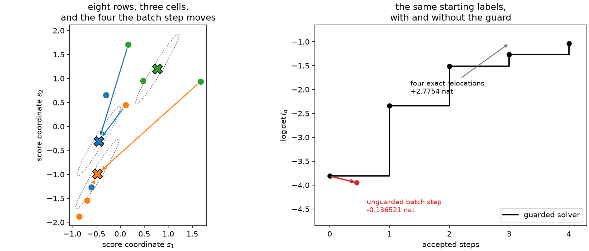

# 9. Mahalanobis geometry and guarded Lloyd

[Chapter 8](ch08-d-optimality.md) ended with a theorem that practically begs to be turned
into an algorithm. A terminal D partition *is* a Mahalanobis Voronoi diagram in the metric
\(I_q^{-1}\). So: compute the metric, assign every row to its nearest cell mean in that
metric, recompute the means and the metric, repeat. One full-data pass per iteration, no
per-row scan, and a fixed point that satisfies the geometry the theorem describes.

This is the obvious algorithm, it is what [Chapter 7](ch07-trace-kmeans.md)'s Lloyd
iteration looks like when the metric is the one the criterion supplies, and it does not
work. Not in the sense of being slow or fragile: one step of it can make \(\log\det I_q\)
smaller. This chapter shows exactly how, explains why the usual proof fails, and describes
the guard that makes the idea usable anyway.

## The metric the criterion supplies

Before breaking it, it is worth understanding what \(I_q^{-1}\) is doing as a ruler.

The D metric weights each direction by the *reciprocal* of the information the current
partition has already retained there. A direction that the cells are measuring well has a
large eigenvalue in \(I_q\), hence a small one in \(I_q^{-1}\), so distances along it count
for little; a direction the cells are measuring badly counts for a lot. Deciding which
cell a row belongs to therefore emphasizes the parameter combinations the partition is
currently worst at. That is the determinant criterion's whole personality in one sentence:
it refuses to let any direction be neglected, because the product of the eigenvalues
collapses if one of them does.

It also explains why the metric cannot be frozen honestly. Reassigning rows changes what
is retained in each direction, which changes the ruler, which changes what "nearest"
means. Chapter 7's Lloyd proof used a fixed metric in both of its two steps; here there is
no fixed metric to use.

## One batch step, downhill

Take the smallest configuration that shows it: eight rows, two parameters, three cells,
equal weights. These numbers are a committed fixture rather than a lucky draw, and the
whole demonstration is arithmetic.

```python
import numpy as np

import scorequant as sq

scores = np.array(
    [
        [0.1116, 0.4427],
        [-0.2932, 0.6537],
        [-0.5995, -1.2685],
        [-0.6848, -1.5456],
        [0.4810, 0.9521],
        [1.6707, 0.9370],
        [0.1689, 1.7090],
        [-0.8548, -1.8805],
    ]
)
labels = np.array([1, 0, 0, 1, 2, 2, 2, 1])
weights = np.full(scores.shape[0], 1.0 / scores.shape[0])

information = np.asarray(sq.binned_fisher_information(scores, labels, weights, n_bins=3))
means = np.stack([scores[labels == cell].mean(axis=0) for cell in range(3)])
metric = np.linalg.inv(information)
```

Now do exactly what the theorem's geometry suggests: freeze that metric and send every row
to its nearest cell mean in it.

```python
residuals = scores[:, None, :] - means[None, :, :]
distances = np.einsum("nkp,pq,nkq->nk", residuals, metric, residuals)
batch = np.argmin(distances, axis=1)

before = float(np.linalg.slogdet(information)[1])
after = float(
    np.linalg.slogdet(np.asarray(sq.binned_fisher_information(scores, batch, weights, n_bins=3)))[1]
)

assert not np.array_equal(batch, labels)  # four rows change cell
assert abs(before - (-3.810643)) < 1e-6
assert abs(after - (-3.947164)) < 1e-6
assert after < before
print(round(before, 6), round(after, 6), round(after - before, 6))
```

The objective falls from \(-3.810643\) to \(-3.947164\): a loss of **0.136521 nat**. The
step did everything it was asked to do — each row really is now in its nearest cell under
the metric it was given — and the criterion got worse.

What makes this more than a curiosity is that the step *did* improve the quantity it was
actually optimizing. The frozen-metric distortion, the thing a nearest-centroid assignment
minimizes, went down:

```python
def frozen_distortion(assignment):
    """Weighted Mahalanobis within-cell distortion in the frozen metric."""
    offsets = scores - means[assignment]
    return float(np.einsum("np,pq,nq->", offsets, metric, offsets) / scores.shape[0])


assert frozen_distortion(batch) < frozen_distortion(labels)
print(round(frozen_distortion(labels), 4), round(frozen_distortion(batch), 4))
```

Distortion 13.55 before, 9.75 after — a 28% improvement in the surrogate, paid for with
0.14 nat of the objective. The surrogate and the objective are simply not the same
function, and nothing forces them to move together.

## Why the usual proof fails

The reason is one line of convexity, and it is worth writing out because it explains why no
amount of care in implementing the batch step would fix it.

\(\log\det\) is concave on positive-definite matrices, so its first-order Taylor expansion
is an *upper* bound:

$$\log\det I' \;\le\; \log\det I + \operatorname{tr}\!\big(I^{-1}(I'-I)\big)
\qquad\text{for all } I' \succ 0 .$$

The nearest-centroid batch step is a step on that right-hand side. Improving an upper
bound on a function tells you nothing whatsoever about the function: the bound can rise
while the objective falls, and on this fixture it does exactly that.

```python
batched = np.asarray(sq.binned_fisher_information(scores, batch, weights, n_bins=3))
tangent_change = float(np.trace(metric @ batched)) - scores.shape[1]

assert tangent_change > 0.0  # the surrogate went up
assert after - before < 0.0  # the objective went down
assert after - before <= tangent_change  # concavity, holding as it must
print(round(tangent_change, 4), round(after - before, 6))
```

The surrogate rose by 8.23 while the objective fell by 0.14, and the concavity inequality
is satisfied throughout — nothing is broken, the bound is simply pointing the wrong way. A
minorize-maximize argument needs the opposite: a *lower* bound that touches the objective
at the current point, so that raising the bound must raise the objective. Concavity gives
a majorizer, not a minorizer, and the direction of the inequality is not negotiable.

Contrast this with [Chapter 7](ch07-trace-kmeans.md), where the metric was fixed and both
Lloyd steps decreased the *same* function that the algorithm was minimizing. There was no
surrogate, so there was nothing to diverge.

## The guard

The repair is blunt and complete: never accept a batch proposal on the strength of the
surrogate. Build the proposal, rebuild the exact criterion state from the proposed labels,
and adopt it only if the exact objective strictly improved. That is `MahalanobisLloydConfig`,
and the guard is part of the solver's contract rather than a safety option.

```python
guarded = sq.optimize_partition(
    scores,
    weights=weights,
    n_bins=3,
    config=sq.MahalanobisLloydConfig(seed=0, guard="reject"),
    initial_labels=labels,
)

assert guarded.lloyd_iterations == 1  # the proposal was built
assert guarded.accepted_lloyd_steps == 0  # and rejected
assert np.array_equal(np.asarray(guarded.labels), labels)  # so nothing moved
assert guarded.exchange_stable is False
```

Started from the very labels that produce the counterexample, the guarded solver builds
the same losing proposal, measures it exactly, and refuses it. The objective it reports is
the one it started with — and honestly reports that the labels are not exchange-stable,
which is why `guard="reject"` also refuses to compile them into a rule.

The default is `guard="exchange"`, which hands the labels to the exact positive-gain
engine of [Chapter 8](ch08-d-optimality.md) once the batch stops improving. On this
fixture the batch never improves at all, so the exchange does all the work — and there is
plenty of it to do:

```python
rescued = sq.optimize_partition(
    scores,
    weights=weights,
    n_bins=3,
    config=sq.MahalanobisLloydConfig(seed=0, guard="exchange"),
    initial_labels=labels,
)
history = np.asarray(rescued.objective_history)

assert rescued.accepted_lloyd_steps == 0
assert rescued.accepted_moves == 4
assert np.all(np.diff(history) > 0)
assert rescued.exchange_stable is True
assert rescued.objective > float(history[0]) + 2.7
print(round(float(history[0]), 6), round(rescued.objective, 6))
```

Four single-row relocations gain 2.78 nat, where the batch step would have lost 0.14. The
starting configuration was simply a long way from stable, and single-row exchange found
that out by evaluating exact gains instead of trusting a geometry that only holds *at* a
terminal state.

One convention to keep straight when comparing these numbers with the ones above. The
library optimizes in Fisher-whitened coordinates, so `objective` is
\(\log\det\big(I_{\text{full}}^{-1/2} I_q I_{\text{full}}^{-1/2}\big)\), which differs from
the raw \(\log\det I_q\) by the rule-independent constant \(\log\det I_{\text{full}} =
-0.783062\) on this table. Differences — the \(-0.136521\) and the \(+2.78\) — are the same
in either convention, which is why they are the numbers worth quoting.

```python
full = np.asarray(sq.fisher_information(scores, weights))
offset = float(np.linalg.slogdet(full)[1])

assert abs(float(history[0]) + offset - before) < 1e-6
print(round(offset, 6))
```



*Left: the eight-row fixture with its three cells, their means (crosses), and one level set
of the \(I_q^{-1}\) metric drawn at each mean — the same shape everywhere, because all cells
share one metric. Arrows mark the four rows that a frozen-metric batch step relocates,
coloured by destination; every one of them really is moving into a nearer cell. Right: the
objective. The
unguarded batch step loses 0.136521 nat in one move; the guarded solver rejects it and
climbs 2.78 nat in four exact single-row relocations instead.*

## Empty cells, and what a guard has to catch

A frozen-metric proposal can also vacate a cell entirely, which the exact criterion state
cannot represent at all — \(K\) cells with one of them empty is a \(K-1\)-cell partition
with a singular \(I_q\) if \(K-1 < d+1\). The solver repairs such a proposal by keeping,
for each emptied cell, the row it currently holds that is closest to its own centroid, so
the recovered cell is the one the criterion currently supports best. A repair that empties
some other cell as collateral is then rejected by the same guard as any other infeasible
proposal.

This is worth naming because it is a second way the batch step can be wrong that has
nothing to do with concavity, and both are caught by the same rule: propose freely, verify
exactly, accept only improvements.

## When to use which solver

With the guard in place both solvers are monotone and both terminate exchange-stable under
the default `guard="exchange"`, so the choice is about work per unit of progress rather
than about correctness. They do different amounts of different things.

```python
big = np.random.default_rng(41).normal(size=(20_000, 4))

lloyd = sq.optimize_partition(big, n_bins=6, config=sq.MahalanobisLloydConfig(seed=1))
exchange = sq.optimize_partition(big, n_bins=6, config=sq.DExchangeConfig(seed=1))

assert lloyd.exchange_stable and exchange.exchange_stable
assert abs(lloyd.objective - exchange.objective) < 0.01
print(
    lloyd.lloyd_iterations,
    lloyd.accepted_lloyd_steps,
    lloyd.scans,
    lloyd.accepted_moves,
    "|",
    exchange.scans,
    exchange.accepted_moves,
)
```

On this problem the guarded batch takes 51 full-data iterations, accepts almost all of
them, and then needs only a handful of exchange scans to settle; the plain exchange takes
57 scans but relocates several thousand rows in the process, since its own batching moves
many gain-ranked rows per scan. Both land on the same objective to within \(10^{-2}\).

The useful way to think about the difference:

- **Guarded Mahalanobis-Lloyd** makes large, coarse moves. Every iteration reconsiders
  every row at once, so it crosses a bad initialization quickly. It is the better choice
  when the starting labels are far from any sensible geometry, and when \(K\) is large
  enough that a per-row scan over all destinations is expensive.
- **Exact exchange** makes small, certified moves. Every accepted step is an exact
  improvement with a closed-form gain, so it does not need a rebuild to know whether a move
  helps, and it settles the boundary rows that a batch step keeps overshooting.

Neither escapes the basic limitation. Both are local, both depend on the seeding, and
[Chapter 8](ch08-d-optimality.md)'s certificates are the only thing in the library that
answers the global question. Running both and keeping the better exact objective is
cheap and is what the diagnostics workflow of [Chapter
14](ch14-choosing-a-method.md) recommends.

## The population picture, and what is missing from it

The batch iteration does have a clean theory — for a different objective. For squared-error
quantization of a continuous law, the fixed points of Lloyd's algorithm are *centroidal
Voronoi tessellations*: partitions in which each generator is the centroid of its own cell.
[Du, Faber and Gunzburger (1999)](../bibliography.md#du1999) survey their structure and
algorithms, and [Du, Emelianenko and Ju (2006)](../bibliography.md#du2006) prove
convergence of the Lloyd iteration under explicit assumptions, continuing the line that
starts with [Lloyd (1982)](../bibliography.md#lloyd1982). That theory is what makes
Chapter 7's fixed-metric iteration respectable.

None of it transfers here without work, and it is more honest to say so than to gesture at
it. Those results are about an additive squared distortion with a fixed metric; the D
objective is a nonlinear function of a matrix, with a metric that is a functional of the
partition. For an absolutely continuous score law, moving a cell boundary does move
positive probability mass, so shape derivatives can exist and the population first-order
condition of Chapter 8 is meaningful — but a complete theorem giving differentiability
with respect to moving generators, and convergence of a generator-space iteration to a
local optimum, has not been established for the information criteria of this book. On a
*finite* sample the situation is worse still, and for a reason that has nothing to do with
concavity: the hard objective is piecewise constant in the generators, so it has no useful
gradient anywhere. That is the observation [Chapter 6](ch06-two-tasks.md) made when
listing the three optimization levels, and it is what [Chapter
12](ch12-soft-rules.md) does something about.

What survives from this chapter is a rule of practice with a proof behind it. Geometry
that holds at an optimum is not a licence to iterate that geometry, because the metric
moves with the partition. Propose with the geometry, verify with the criterion, accept only
what improves. That discipline costs one exact rebuild per proposal and buys a monotone
algorithm; the alternative costs 0.136521 nat on an eight-row table, and there is no
reason to think it is bounded on a larger one.

The next chapter changes the criterion rather than the solver. When only some of the
parameters are of interest, profiling the rest away gives an objective that keeps the
population geometry of Chapter 8 and loses its finite theorem — a different kind of gap,
with a different repair.
