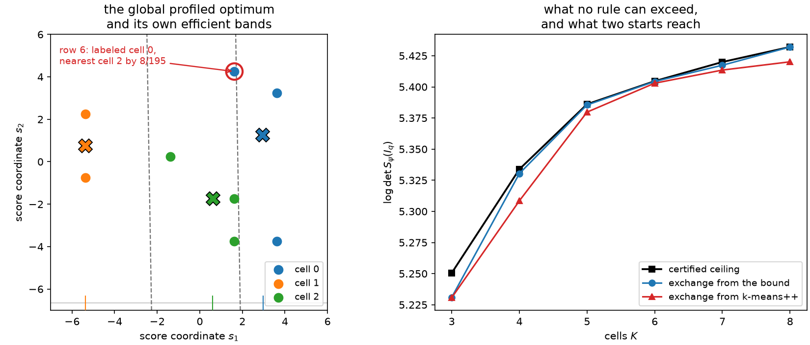

# 10. Nuisance parameters and profiled \(D_s\)

Almost no real measurement is about every parameter in its own model. A cross-section is
measured together with a luminosity and a dozen calibration constants; a rate is measured
together with a background normalization and a shape systematic. The parameters you
report and the parameters you must estimate are different sets, and only the first set
appears in the paper.

[Chapter 8](ch08-d-optimality.md)'s criterion does not know that. Maximizing
\(\log\det I_q\) buys precision in every direction of parameter space at the same price,
including directions you will marginalize away and never quote. If four cells are all you
can afford, spending one of them resolving a nuisance shape is a bad trade — unless that
nuisance is correlated with what you care about, in which case it may be the best trade
available. Sorting out which is which is what this chapter is about.

The answer is a classical criterion, \(D_s\)-optimality, with a population geometry that
looks reassuringly like Chapter 8's. And then the finite theory diverges: there is an
eight-row score table whose *globally optimal* profiled labeling sits, provably and in
exact rational arithmetic, in the wrong cell of the geometry it generates. That is why
this chapter has no compile bridge, and why the library refuses to invent one.

## Profiling, in one Schur complement

Split the parameter as \(\theta=(\psi,\lambda)\) with \(\psi\in\mathbb{R}^{d_\psi}\) of
interest and \(\lambda\) nuisance, and split the retained information to match:

$$I_q=\begin{pmatrix}A&B\\B^\top&C\end{pmatrix},
\qquad
S_\psi(I_q) \;=\; A - BC^{-1}B^\top .$$

The Schur complement \(S_\psi\) is the right object for a mundane reason: it is the
inverse of the \(\psi\) block of \(I_q^{-1}\). Since \(I_q^{-1}\) is the asymptotic
covariance of the joint estimator, \((I_q^{-1})_{\psi\psi}=S_\psi(I_q)^{-1}\) is the
covariance of \(\hat\psi\) *after* \(\lambda\) has been estimated from the same labels and
profiled out. So

$$F_s(I_q) \;=\; \log\det S_\psi(I_q) \;=\; \log\det I_q - \log\det C$$

is exactly the log inverse volume of the confidence region you will publish, and the
second form — a determinant minus its nuisance block's determinant — is what makes it
computable. Both terms are ordinary log determinants of matrices the cell moments already
supply.

The subtraction is the whole story of this chapter. \(A\) alone would be the information
about \(\psi\) if \(\lambda\) were known; \(BC^{-1}B^\top\) is what you give back for
having to estimate \(\lambda\) too. A rule that separates \(\psi\) beautifully but confuses
it with a nuisance direction is penalized precisely by the amount of that confusion.

This criterion is not an invention. \(D_s\)-optimality is the classical
subset-determinant criterion of optimal experimental design, catalogued with the rest of
the \(\Phi_p\) family by [Pukelsheim (2006)](../bibliography.md#pukelsheim2006), and its
equivalence theory descends from [Whittle (1973)](../bibliography.md#whittle1973)'s
general equivalence theorem, specialized to the subset case by [Näther and Reinsch
(1981)](../bibliography.md#nather1981). What is different here, as in Chapter 8, is the
feasible set: design theory varies a measure over experimental conditions and gets a
convex problem, while here the variable is a hard partition and the problem is not convex
at all.

```python
import numpy as np

import scorequant as sq

rng = np.random.default_rng(13)
mixing = np.array([[1.0, 0.6, -0.3], [0.0, 1.1, 0.4], [0.0, 0.0, 0.9]])
scores = rng.normal(size=(400, 3)) @ mixing  # column 0 is of interest, 1 and 2 nuisance

profiled = sq.optimize_partition(
    scores,
    n_bins=4,
    criterion=sq.ProfiledDOptimality((0,)),
    config=sq.DExchangeConfig(seed=0, n_init=8),
)
report = profiled.profiled_report

full = np.asarray(profiled.information_partitioned)
schur = full[0, 0] - full[0, 1:] @ np.linalg.solve(full[1:, 1:], full[1:, 0])
assert abs(float(np.asarray(report.schur_binned)[0, 0]) - schur) < 1e-9
assert abs(profiled.objective - float(np.log(schur))) < 1e-9

# The Schur complement is the inverse of the interest block of the inverse.
assert abs(1.0 / np.linalg.inv(full)[0, 0] - schur) < 1e-9
assert report.interest == (0,) and report.nuisance == (1, 2)
```

`ProfiledDOptimality` names the interest columns and the library derives the nuisance
block from what is left; at least one nuisance column must remain, or the criterion is
just `DOptimality` with extra steps and is refused as such. The objective is reported as
the raw \(\log\det S_\psi\) on the supplied score columns, not in whitened coordinates,
because the interest/nuisance split is a statement about *those* columns in *that* order.

## The efficient score, and the geometry it induces

Chapter 8's population geometry came from a matrix gradient. Do the same here. The
gradient of \(F_s\) at \(I\) is

$$G_s \;=\; I^{-1} - E_\lambda C^{-1}E_\lambda^\top \;=\; L^\top S_\psi(I)^{-1} L,
\qquad L=\begin{bmatrix}\mathbb{1}_{d_\psi} & -BC^{-1}\end{bmatrix},$$

where \(E_\lambda\) embeds the nuisance block. Two things are visible in the factored
form. \(G_s\) is positive *semi*definite with rank exactly \(d_\psi\), and it acts on a
score only through the linear combination

$$e(s) \;=\; L\,s \;=\; s_\psi - BC^{-1}s_\lambda ,$$

the **efficient score**: the part of the interest score that is left after regressing away
the nuisance score. Feeding \(G_s\) into the first-variation rule of Chapter 8 gives the
population stationarity condition

$$q(s) \;=\; \arg\min_b\; \big(e(s)-e(\mu_b)\big)^\top S_\psi(I_q)^{-1}\big(e(s)-e(\mu_b)\big) ,$$

a nearest-cell rule in a \(d_\psi\)-dimensional projection. Its cells are cylinders: they
are Voronoi regions in the efficient coordinates and completely indifferent to the
\(d-d_\psi\) directions that \(L\) annihilates. That is exactly right as a statement about
an ideal optimum. Nuisance directions matter only through the regression coefficient
\(BC^{-1}\) inside \(e\), never through where a point sits along them.

The library exposes this semimetric on any profiled result, because it is the thing the
next section is going to violate.

```python
geometry = profiled.profiled_geometry
metric = np.asarray(geometry.metric)

eigenvalues = np.linalg.eigvalsh(metric)
assert float(eigenvalues[0]) > -1e-12  # positive semidefinite
assert int(np.sum(eigenvalues > 1e-9 * eigenvalues[-1])) == 1  # rank equals dim(psi)

# and it is exactly L^T S^-1 L
regression = np.linalg.solve(full[1:, 1:], full[1:, 0])
projector = np.concatenate([[1.0], -regression])
assert np.max(np.abs(metric - np.outer(projector, projector) / schur)) < 1e-9
```

## The exchange is still exact

Everything algebraic in Chapter 8 survives the change of criterion, because the rank-two
relocation identity \(\Delta I=\alpha u_au_a^\top-\beta u_bu_b^\top\) is a statement about
\(I_q\) and says nothing about what you do with it. The profiled objective is a difference
of two log determinants, so its exact gain is a difference of two determinant-lemma gains:
one for the full matrix in the metric \(I_q^{-1}\), one for the nuisance block in the
metric \(C^{-1}\), each computed from three inner products.

$$\Delta F_s \;=\; \Delta F_D\big(I_q\big) \;-\; \Delta F_D\big(C\big) .$$

Accepting only strictly positive exact gains is therefore monotone and finite for the same
one-line reason as before, and the solver reports the same counters.

```python
history = np.asarray(profiled.objective_history)

assert np.all(np.diff(history) > 0)
assert profiled.exchange_stable is True
assert profiled.objective == float(history[-1])
assert profiled.geometry is None  # the D geometry report is not offered here
print(profiled.scans, profiled.accepted_moves, round(profiled.objective, 6))
```

Note which report is missing. A `ProfiledDOptimality` result carries
`profiled_geometry` and no `geometry`, because the two measure different objects and one
of them comes with a theorem the other does not have. Naming both `geometry` would claim
an implication that is about to fail.

## An optimum that violates its own geometry

Here is the counterexample, and it is worth stating precisely what it rules out. Chapter
8's Theorem 3 says that for the log determinant, exchange stability *forces* the
Mahalanobis-Voronoi rule: a stable labeling cannot contain a misplaced row. The natural
conjecture is that the same holds for \(F_s\) with \(G_s\) in place of \(I_q^{-1}\). It
does not — and not merely for a locally stable labeling but for the *global* optimum of a
tiny table.

Take eight integer score vectors, shifted once by their exact mean so that the table sums
to zero the way a score sample from a normalized model does, and give every row equal
weight. All eight coordinates are then rationals with denominator 8, so every quantity
below is an exact rational and no floating-point search is involved in establishing any
sign.

```python
from fractions import Fraction
from itertools import product

raw = [(4, -4), (-5, 2), (-1, 0), (-5, -1), (2, -2), (4, 3), (2, 4), (2, -4)]
weight = Fraction(1, 8)
centre = [Fraction(sum(row[axis] for row in raw), 8) for axis in range(2)]
table = [[Fraction(row[axis]) - centre[axis] for axis in range(2)] for row in raw]


def cell_moments(labels):
    """Exact rational masses and score moments of one three-cell labeling."""
    mass = [Fraction(0)] * 3
    moment = [[Fraction(0), Fraction(0)] for _ in range(3)]
    for row, cell in enumerate(labels):
        mass[cell] += weight
        for axis in range(2):
            moment[cell][axis] += weight * table[row][axis]
    return mass, moment


def information(labels):
    """Exact rational binned information of one labeling."""
    mass, moment = cell_moments(labels)
    return [
        [sum(moment[cell][i] * moment[cell][j] / mass[cell] for cell in range(3)) for j in range(2)]
        for i in range(2)
    ]


def profiled_value(labels):
    """Exact scalar Schur complement with column 0 of interest."""
    matrix = information(labels)
    return matrix[0][0] - matrix[0][1] * matrix[1][0] / matrix[1][1]


labelings = [
    labels
    for labels in product(range(3), repeat=8)
    if labels[0] == 0
    and set(labels) == {0, 1, 2}
    and all(labels[i] <= max(labels[:i]) + 1 for i in range(1, 8))
]
assert len(labelings) == 966  # every three-cell partition of eight rows, once each

ranked = sorted(((profiled_value(labels), labels) for labels in labelings), reverse=True)
best, optimum = ranked[0]

assert optimum == (0, 1, 2, 1, 2, 0, 0, 2)
assert best == Fraction(20449, 1920)
assert best - ranked[1][0] == Fraction(2929, 21120)  # a clear, exact winner
```

The enumeration is complete: 966 labelings is every way of splitting eight rows into three
nonempty cells up to relabeling, so `optimum` is *the* global maximizer, by a margin of
\(2929/21120\approx 0.139\) over the runner-up. Now build the semimetric that this
optimum itself induces and ask where each row belongs under it.

```python
matrix = information(optimum)
determinant = matrix[0][0] * matrix[1][1] - matrix[0][1] * matrix[1][0]
inverse = [
    [matrix[1][1] / determinant, -matrix[0][1] / determinant],
    [-matrix[1][0] / determinant, matrix[0][0] / determinant],
]
semimetric = [
    [inverse[0][0], inverse[0][1]],
    [inverse[1][0], inverse[1][1] - 1 / matrix[1][1]],
]

assert semimetric[0][0] == Fraction(1920, 20449)
assert semimetric[1][1] == Fraction(8, 306735)

mass, moment = cell_moments(optimum)
means = [[moment[cell][axis] / mass[cell] for axis in range(2)] for cell in range(3)]


def semidistance(row, cell):
    """Squared efficient-semimetric distance from one row to one cell mean."""
    offset = [table[row][axis] - means[cell][axis] for axis in range(2)]
    return sum(offset[i] * semimetric[i][j] * offset[j] for i in range(2) for j in range(2))


margins = []
for row in range(8):
    distances = [semidistance(row, cell) for cell in range(3)]
    margins.append(distances[optimum[row]] - min(distances))

assert margins[6] == Fraction(8, 195)  # row 6 is strictly not in its nearest cell
assert sum(margin > 0 for margin in margins) == 1
print([str(margin) for margin in margins])
```

Row 6 sits in cell 0, and in the semimetric that cell 0 helped create, it is strictly
closer to cell 2 — by \(8/195\), an exact positive rational. Moving it there would satisfy
the geometry and would *lower* the objective, because the global optimum is where it is.
There is no numerical tolerance to blame and no local-search artifact to appeal to: an
exhaustive rational enumeration found the best labeling, and the best labeling is not
geometric.

The subtraction is where Chapter 8's proof dies. That proof turned on the coincidence

$$\frac{\alpha-\beta}{\alpha\beta} \;=\; \frac{1}{W_a}+\frac{1}{W_b} ,$$

the determinant lemma's coefficients meeting the leverage bound exactly. Subtracting
\(\log\det C\) subtracts a *second* determinant-lemma gain with its own \(\alpha,\beta\)
computed in the nuisance block, and the two sides no longer meet. Concretely: a relocation
can hurt the full determinant a little and help the nuisance determinant more, and the
efficient semimetric — which only sees the difference through \(G_s\) — cannot see that
happening.

The library reproduces the optimum from a cold start and reports the violation as a
measured quantity rather than a promise.

```python
scores_8 = np.asarray(raw, dtype=float) - np.asarray(raw, dtype=float).mean(axis=0)
weights_8 = np.full(8, 0.125)

counterexample = sq.optimize_partition(
    scores_8,
    weights=weights_8,
    n_bins=3,
    criterion=sq.ProfiledDOptimality((0,)),
    config=sq.DExchangeConfig(seed=1, n_init=32, max_scans=200),
)

assert counterexample.exchange_stable is True
assert abs(float(np.exp(counterexample.objective)) - 20449 / 1920) < 1e-10
assert np.array_equal(np.asarray(counterexample.labels), np.asarray(optimum))

violated = counterexample.profiled_geometry
assert violated.violating_moves == 1
assert abs(violated.maximum_positive_violation - 8 / 195) < 1e-12
```

And it refuses to compile, in the one place where refusing matters.

```python
try:
    counterexample.compile_quantizer()
    raise AssertionError("a profiled partition has no canonical rule")
except ValueError as error:
    assert "no canonical inductive compilation" in str(error)
```

Compare that with Chapter 8, where `compile_quantizer` succeeds precisely because Theorem
3 guarantees the labels *are* the training realization of the nearest-cell rule. Here they
are not, so handing back a nearest-cell rule would return a quantizer that disagrees with
the labels it came from. The refusal is not caution; it is the absence of a theorem.

If you need a reusable profiled rule, fit one explicitly — `SoftVoronoiConfig` accepts
`ProfiledDOptimality` and returns a `QuantizerResult` with `predict_scores`, which is
[Chapter 12](ch12-soft-rules.md)'s subject. That object is an honest inductive fit with a
validation report, not a finite labeling wearing a rule's clothes.



*Left: the eight-row table with its globally optimal three-cell labeling. The semimetric
\(G_s\) has rank one, so its Voronoi cells are the bands between the dashed lines of
constant efficient score \(e(s)=s_1+s_2/60\); the cell means project to the ticks on the
axis below. Every row lies in the band of its own cell except row 6, which is labeled 0
while sitting in cell 2's band — an exact \(8/195\) violation at the global optimum.
Right: for the 400-row three-parameter example, the certified efficient-score ceiling
against the profiled objective reached from generic seeding and from the bound's own
labels, over cell budgets three to eight.*

## How far off can a stable partition be?

The counterexample kills the exact implication; it does not say the geometry is useless.
There is a quantitative bound, and it says the violation is small when individual
observations are light.

**Proposition (approximate finite efficient-Voronoi geometry).** *At a one-point
exchange-stable \(D_s\) partition, write \(s_{aa}=u_a^\top G_su_a\),
\(s_{bb}=u_b^\top G_su_b\) and \(q_{aa}=u_a^\top I_q^{-1}u_a\). For every admissible move,*

$$\big[s_{aa}-s_{bb}\big]_+ \;\le\; w_i\,q_{aa}\left(\frac{1}{W_a}+\frac{1}{W_b}\right).$$

Read the right-hand side as a budget. The violation of the efficient geometry, *relative*
to the row's own distance in the full D metric, is at most \(w_i(1/W_a+1/W_b)\). Under
uniform weights with cell masses of order \(1/K\), that is \(O(K/N)\): the geometry becomes
exact in the limit where no single observation can move a centroid. On the eight-row
fixture each row carries an eighth of the total mass, which is why a violation of that size
is possible there at all.

`ProfiledGeometryReport` measures both sides. `maximum_bound_residual` is the largest
violation minus its own bound over admissible moves, and the proposition makes it
nonpositive at a stable state — so a positive value is a numerical warning, not a
discovery.

```python
assert violated.maximum_bound_residual <= 0.0
assert violated.bound_certified is True  # the scan ended exchange-stable
print(round(violated.maximum_positive_violation, 6), round(violated.maximum_theoretical_bound, 6))
```

The budget shrinks with sample size, and so does the violation. Growing the same
three-parameter law with balanced weights and a fixed cell budget:

```python
ladder = []
for n_rows in (100, 200, 400, 800):
    sample = np.random.default_rng(1000).normal(size=(n_rows, 3)) @ mixing
    balanced = np.full(n_rows, 1.0 / n_rows)
    stable = sq.optimize_partition(
        sample,
        weights=balanced,
        n_bins=4,
        criterion=sq.ProfiledDOptimality((0,)),
        config=sq.DExchangeConfig(seed=0, n_init=4),
    )
    cells = np.asarray(stable.cell_score_means)
    labels = np.asarray(stable.labels)
    efficient_metric = np.asarray(stable.profiled_geometry.metric)
    inverse_information = np.linalg.inv(np.asarray(stable.information_partitioned))

    offsets = sample[:, None, :] - cells[None, :, :]
    efficient = np.einsum("nbp,pq,nbq->nb", offsets, efficient_metric, offsets)
    own_offsets = sample - cells[labels]
    q_own = np.einsum("np,pq,nq->n", own_offsets, inverse_information, own_offsets)
    own_efficient = efficient[np.arange(n_rows), labels]

    elsewhere = np.arange(4)[None, :] != labels[:, None]
    violation = np.maximum(own_efficient[:, None] - efficient, 0.0)
    relative = np.max(np.where(elsewhere, violation / q_own[:, None], 0.0))
    masses = np.asarray(stable.cell_weights)
    budget = balanced[:, None] * (1.0 / masses[labels][:, None] + 1.0 / masses[None, :])
    budget = np.max(np.where(elsewhere, budget, 0.0))

    assert relative <= budget  # the proposition, measured
    ladder.append((float(relative), float(budget)))

assert ladder[0][0] > 4 * ladder[-1][0]  # the violation shrinks with the sample
assert ladder[0][1] > 8 * ladder[-1][1]  # and so does the budget that bounds it
print([(round(violation, 5), round(budget, 5)) for violation, budget in ladder])
```

The largest relative violation falls from 0.0060 at a hundred rows to 0.0012 at eight
hundred, and the budget bounding it falls from 0.145 to 0.014. This is why population
efficient-Voronoi geometry is a good working picture for a large sample and a bad
*theorem* for a small one — and it is not, by itself, a consistency result. Whether global
finite \(D_s\) optima approach population efficient-Voronoi solutions as \(N\) grows is
open.

## A certified ceiling, from a smaller problem

The profiled criterion also admits something Chapter 8's certificates cannot give at
realistic sample sizes: a cheap upper bound that is genuinely certified rather than
estimated.

Build the efficient score from the **unbinned** information — the reference measure, not
any partition:

$$\widehat s \;=\; s_\psi - B^\ast s_\lambda ,
\qquad B^\ast = I^{\text{full}}_{\psi\lambda}\big(I^{\text{full}}_{\lambda\lambda}\big)^{-1} .$$

**Theorem (efficient-score domination).** *For every hard rule \(q\) on score space,*

$$S_\psi\big(I_q\big) \;\preceq\; \operatorname{Var}\!\big(\mathbb{E}[\widehat s\mid q(S)]\big) .$$

The right-hand side is the ordinary between-cell information of the *scalar* (when
\(d_\psi=1\)) efficient score under the same labels. So maximizing the right-hand side
over all \(K\)-cell rules of \(\widehat s\) upper-bounds the profiled objective of every
\(K\)-cell rule of the whole \(d\)-dimensional score space. The maximization is a problem
we have already solved exactly: for a scalar coordinate the D-optimal partition has ordered
interval cells, and [Chapter 3](ch03-exact-1d.md)'s weighted interval dynamic program
attains the global optimum. The ceiling is therefore both exact and cheap.

```python
bound = sq.efficient_score_bound(scores, interest=(0,), n_bins=4)

efficient_scores = np.asarray(bound.efficient_scores)
assert efficient_scores.shape == (400, 1)
assert np.max(np.abs(efficient_scores.T @ scores[:, 1:])) < 1e-9  # orthogonal to nuisance

achieved = profiled  # the generically seeded fit from the top of the chapter
assert bound.gap_to(achieved) >= 0.0
print(round(bound.upper_bound, 6), round(achieved.objective, 6), round(bound.gap_to(achieved), 6))
```

The efficient score is the residual of the interest column after regressing out the
nuisance columns under the reference measure, which is what the orthogonality check
verifies. Two properties of the bound are worth knowing. It is stated in the same
uncentered convention as `PartitionResult.objective` under `ProfiledDOptimality`, which is
what makes `gap_to` meaningful rather than a comparison of two conventions. And by
refinement monotonicity a ceiling certified for \(K\) cells also bounds any coarser rule,
so it does not have to be recomputed for every budget you try.

The bound refuses multivariate interest by name. A two-dimensional efficient score would
need a genuine multivariate D solver, whose output is a local optimum — and a ceiling built
on a local optimum is not a ceiling.

```python
try:
    sq.efficient_score_bound(scores, interest=(0, 1), n_bins=4)
    raise AssertionError("a heuristic ceiling is not a certificate")
except NotImplementedError as error:
    assert "one interest column" in str(error)
```

## The ceiling as an initializer

The labels attaining the bound are not only a certificate. They already solve the relaxed
problem, so they start profiled exchange inside the efficient-score geometry instead of at
generic k-means seeding — and on this example that is worth both objective and work.

```python
warm = sq.optimize_partition(
    scores,
    n_bins=4,
    criterion=sq.ProfiledDOptimality((0,)),
    config=sq.DExchangeConfig(seed=0, n_init=8),
    initial_labels=bound.labels,
)

assert warm.objective > achieved.objective
assert warm.scans < achieved.scans // 10
assert bound.gap_to(warm) < bound.gap_to(achieved) / 5
print(
    round(bound.gap_to(achieved), 6),
    round(bound.gap_to(warm), 6),
    achieved.scans,
    warm.scans,
    achieved.accepted_moves,
    warm.accepted_moves,
)
```

Generic seeding takes 52 scans and 251 accepted relocations to stop 0.0254 nat below the
ceiling. Starting from the bound's own labels takes 3 scans and 3 relocations to stop
0.0035 nat below it — a factor of seven closer, for a seventeenth of the scans. In ratio
terms the exchange result is within 0.35% of a quantity that no four-cell rule of this
score table can exceed, which is a far more useful statement than "the solver converged".

Supplied labels replace the seeding of the *first* restart only, so `n_restarts` still
explores; the initializer is a head start, not a cage.

## Where this leaves the profiled criterion

Three things hold and one does not, and it is worth keeping them apart.

The **population** geometry holds: a regular stationary population rule is a Voronoi
partition of the efficient score, with cylindrical cells along the nuisance directions.
The **finite algebra** holds: the exchange gain is exact, the algorithm is monotone, and it
terminates. The **bound** holds: efficient-score domination certifies a ceiling, and for a
scalar interest that ceiling is attained by an exact dynamic program. What does not hold is
the bridge between the first two — exchange stability, and even global optimality, does
not force the finite labeling into the geometry it induces.

So a profiled partition is a fact about the rows you have, and a profiled quantizer is a
different object that must be fitted as one. Chapter 8's criterion is the exception in this
book, not the rule, and the next chapter shows a criterion where even the population
geometry stops being well defined.
