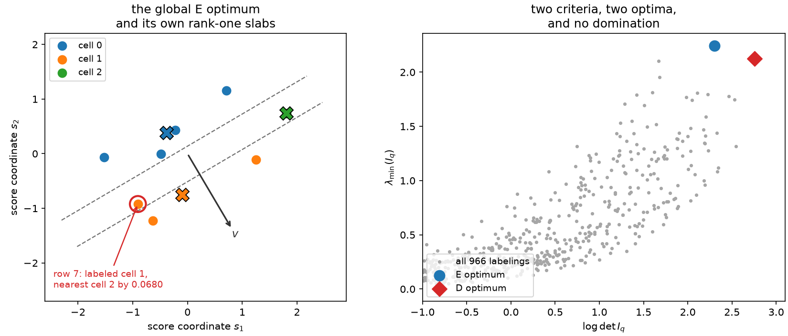

# 11. E-optimality: why not

There is one more classical criterion worth naming, and this chapter is about why the
library does not implement it.

The log determinant of [Chapter 8](ch08-d-optimality.md) controls the *volume* of the
confidence region. Volume is a product, so it can be respectable while one axis is
enormous: a rule that measures three parameter combinations beautifully and a fourth
barely can still post a decent determinant. If what you need is a guarantee for *every*
linear combination of \(\theta\) — the worst standard error rather than the average one —
the right criterion is the smallest eigenvalue,

$$F_E(I_q) \;=\; \lambda_{\min}(I_q),$$

the E-optimality of experimental design, catalogued alongside D and \(D_s\) by
[Pukelsheim (2006)](../bibliography.md#pukelsheim2006). It is concave and monotone in the
Loewner order, exactly like \(\log\det\), so as a population design criterion it is
respectable and well studied.

Every finite tool in this book breaks on it, and the ways it breaks are instructive
enough to be worth a chapter even though the conclusion is negative.

## The metric stops being unique

Chapter 8's geometry came from one line: for a criterion with symmetric matrix gradient
\(G=\nabla_I F\), the first variation of moving mass at \(s\) from cell \(a\) to cell \(b\)
is \((s-\mu_a)^\top G(s-\mu_a)-(s-\mu_b)^\top G(s-\mu_b)\), so a stationary population
rule assigns every score to its nearest cell in \(G\).

When the smallest eigenvalue of \(I_q\) is *simple*, with unit eigenvector \(v\), that
still works. A gradient is \(G_E=vv^\top\), and the rule becomes

$$q(s) \;=\; \arg\min_b\,\big(v^\top(s-\mu_b)\big)^2 ,$$

a rank-one rule: cells are slabs perpendicular to \(v\), and nothing but the current
least-informed projection matters. That is a coherent picture and a strange one — the
criterion looks at exactly one direction at a time, and which direction that is changes as
soon as the partition does.

When the smallest eigenvalue is *repeated*, the picture dissolves. \(\lambda_{\min}\) is
not differentiable there. If the minimum eigenspace has orthonormal basis
\(V\in\mathbb{R}^{d\times r}\), the superdifferential of the concave function is

$$\partial^{+}\lambda_{\min}(I) \;=\; \big\{\,VHV^\top \;:\; H\succeq0,\ \operatorname{tr}H=1\,\big\},$$

a whole set of matrices, not a point. There is no "the" metric to write the nearest-cell
rule in, and different valid supergradients give different rules. Chapter 8's argument
does not become harder here; its first line stops parsing.

## First-order stability becomes automatic

The multiplicity problem is worse than nonuniqueness, and this is the part that rules out
the exchange strategy specifically.

A single-point transfer changes the information matrix by
\(\Delta I=\alpha u_au_a^\top-\beta u_bu_b^\top\): one positive and one negative rank-one
term, by the exact relocation identity of Chapter 8. The directional derivative of
\(\lambda_{\min}\) along that direction is \(\lambda_{\min}(V^\top\Delta I\,V)\), and the
projected update is again a difference of two rank-one matrices. In any subspace of
dimension \(r\ge2\), such a matrix has a nonpositive smallest eigenvalue — it is singular
or indefinite, never positive definite, because two rank-one terms cannot fill \(r\ge2\)
dimensions with positive curvature.

In two dimensions the fact is an identity rather than an argument:

$$\det\big(aa^\top-bb^\top\big) \;=\; -\big(a_1b_2-a_2b_1\big)^2 \;\le\; 0 ,$$

so the two eigenvalues have opposite signs unless \(a\) and \(b\) are parallel, in which
case one of them is zero.

```python
import numpy as np

rng = np.random.default_rng(11)
worst_determinant, worst_eigenvalue = -np.inf, -np.inf
for _ in range(4_000):
    a, b = rng.normal(size=2), rng.normal(size=2)
    difference = np.outer(a, a) - np.outer(b, b)
    identity = -((a[0] * b[1] - a[1] * b[0]) ** 2)
    assert abs(float(np.linalg.det(difference)) - identity) < 1e-12
    worst_determinant = max(worst_determinant, float(np.linalg.det(difference)))
    worst_eigenvalue = max(worst_eigenvalue, float(np.linalg.eigvalsh(difference)[0]))

assert worst_determinant <= 1e-12
assert worst_eigenvalue <= 1e-7  # a difference of two rank-one terms is never definite
print(round(worst_determinant, 12), round(worst_eigenvalue, 9))
```

So at a partition whose weakest directions have been equalized — which is precisely what
E-optimality is trying to achieve — *every* single-point transfer has a nonpositive
first-order effect. First-order stability is not evidence of anything; it is automatic. A
criterion whose stationarity condition is satisfied by construction at its own targets
cannot be used to rank moves, and an exchange method that trusted it would stop
immediately and everywhere.

## And the simple case fails too

One might hope that away from multiplicity the rank-one rule of the first section would at
least hold at a finite optimum, the way Chapter 8's Theorem 3 holds for the determinant. It
does not, and a committed eight-row fixture settles it by exhaustive enumeration.

The table below holds eight two-parameter score rows, shifted once so that they sum to zero
the way a score sample from a normalized model does. Enumerating all 966 three-cell
labelings gives the global E optimum outright.

```python
from itertools import product

table = np.array(
    [
        [-0.226534, 0.428773],
        [-0.629944, -1.223406],
        [1.253439, -0.109445],
        [1.807897, 0.734952],
        [-1.520937, -0.061786],
        [-0.488606, -0.002247],
        [0.710355, 1.154412],
        [-0.905669, -0.921253],
    ]
)
table = table - table.mean(axis=0)


def binned_information(labels):
    """Between-cell information of one labeling of the fixture."""
    assignment = np.asarray(labels)
    mass = np.bincount(assignment, minlength=3).astype(float)
    sums = np.zeros((3, 2))
    np.add.at(sums, assignment, table)
    means = sums / mass[:, None]
    return np.einsum("b,bp,bq->pq", mass, means, means)


labelings = [
    labels
    for labels in product(range(3), repeat=8)
    if labels[0] == 0
    and set(labels) == {0, 1, 2}
    and all(labels[i] <= max(labels[:i]) + 1 for i in range(1, 8))
]
assert len(labelings) == 966

matrices = {labels: binned_information(labels) for labels in labelings}
optimum = max(labelings, key=lambda labels: float(np.linalg.eigvalsh(matrices[labels])[0]))
eigenvalues, eigenvectors = np.linalg.eigh(matrices[optimum])

assert optimum == (0, 1, 1, 2, 0, 0, 0, 1)
assert eigenvalues[1] - eigenvalues[0] > 2.1  # the minimum eigenvalue is simple by a mile
```

The minimum eigenvalue is simple with a gap of 2.198, so the rank-one rule of the first
section is unambiguous here. Ask where it puts each row.

```python
direction = eigenvectors[:, 0]
assignment = np.asarray(optimum)
means = np.stack([table[assignment == cell].mean(axis=0) for cell in range(3)])
distances = np.square((table[:, None, :] - means[None, :, :]) @ direction)
margins = distances[np.arange(8), assignment] - distances.min(axis=1)

assert int(np.argmin(distances[7])) == 2  # row 7 is nearest to cell 2
assert assignment[7] == 1  # and the global optimum puts it in cell 1
assert abs(float(margins[7]) - 0.067959) < 1e-6
assert int(np.count_nonzero(margins > 1e-9)) == 1
print(round(float(margins[7]), 6))
```

Row 7 is misplaced by 0.0680 in its own rank-one metric, at the *global* optimum of an
exhaustively searched instance. The same failure Chapter 10 exhibited for profiled
\(D_s\), on a criterion with no nuisance block to blame it on.

There is a second, quieter observation in the same fixture: the E optimum is not the D
optimum, and the D optimum is the E runner-up.

```python
d_optimum = max(labelings, key=lambda labels: float(np.linalg.slogdet(matrices[labels])[1]))

assert d_optimum == (0, 1, 2, 2, 0, 0, 0, 1)
assert d_optimum != optimum
assert float(np.linalg.eigvalsh(matrices[d_optimum])[0]) < float(eigenvalues[0])
assert float(np.linalg.slogdet(matrices[optimum])[1]) < float(
    np.linalg.slogdet(matrices[d_optimum])[1]
)
```

The determinant-optimal labeling gives up 5.4% of the weakest direction to buy 0.454 nat
of volume. Neither answer is wrong; they answer different questions, which is the whole
reason more than one criterion exists.



*Left: the eight-row fixture with its globally E-optimal three-cell labeling. The rank-one
rule \(q(s)=\arg\min_b(v^\top(s-\mu_b))^2\) makes slabs perpendicular to the minimum
eigenvector \(v\); row 7 is labeled cell 1 while lying in cell 2's slab. Right: all 966
labelings plotted as \((\log\det I_q,\lambda_{\min}(I_q))\). The two criteria pick
different points of the upper-right frontier, and neither dominates.*

## What does survive

One thing does, and it is worth stating because it is the honest residue of the section
above. Concavity gives a *safe screen*. For any supergradient \(G\) of \(\lambda_{\min}\)
at \(I\),

$$F_E(I+\Delta I) - F_E(I) \;\le\; \operatorname{tr}\big(G\,\Delta I\big),$$

so a candidate move whose weighted tangent gain is nonpositive *cannot* improve the exact
E objective. The implication runs one way only — a positive tangent says nothing — but it
is enough to discard candidates cheaply before paying for an eigenvalue recomputation.
That is screening, not geometry, and it is a very different thing from the exact closed
gain that makes Chapter 8's exchange work.

## Why the library stops here

ScoreQuant implements three criteria — `DOptimality`, `ProfiledDOptimality` and
`NormalizedTrace` — and E-optimality is not among them.

```python
import scorequant as sq

for name in ("DOptimality", "ProfiledDOptimality", "NormalizedTrace"):
    assert hasattr(sq, name)
assert not hasattr(sq, "EOptimality")
```

The omission is a conclusion rather than an oversight. Adding the criterion would mean
shipping a solver with no exact move gain (the smallest eigenvalue has no rank-two
shortcut, so every candidate costs a decomposition), no compile bridge, no certified
geometry report, no branch-and-bound bound, and — at the eigenvalue multiplicities the
criterion actively creates — no well-defined inductive rule family to fit instead. Every
guarantee this book offers for the determinant is absent, and several of them are absent
for proven reasons rather than for want of work.

If the worst measured direction is what you actually care about, there are two honest
routes today. Report it: `InformationReport.retained_eigenvalues` gives the whole spectrum
of \(I_{\text{full}}^{-1/2}I_qI_{\text{full}}^{-1/2}\), so the smallest entry is the
E-efficiency of any rule you fit, whatever criterion produced it. And optimize the
determinant, which — unlike the trace of [Chapter 7](ch07-trace-kmeans.md) — has no
finite value at all when a direction is lost, and therefore refuses the failure mode that
motivates E-optimality in the first place.

```python
sample = np.random.default_rng(11).normal(size=(1_200, 2)) @ np.array([[1.0, 0.4], [0.0, 1.1]])
fitted = sq.optimize_partition(sample, n_bins=4, config=sq.DExchangeConfig(seed=0))
spectrum = np.asarray(fitted.train_report.retained_eigenvalues)

assert float(np.min(spectrum)) > 0.4  # the E-efficiency of a D-optimal rule, measured
print(np.round(spectrum, 4), round(float(np.min(spectrum)), 4))
```

Whether a population equivalence theorem in the spirit of the design-theory results could
pin down a *single* minimum-eigenspace supergradient supporting all cell inequalities at an
E-optimum is an open question, and it is the one that would have to be settled before any
of the machinery in this book could be pointed at \(\lambda_{\min}\).

The next chapter returns to solvable ground: relaxing the hard rule into a randomized one,
which is where a gradient exists at all.
