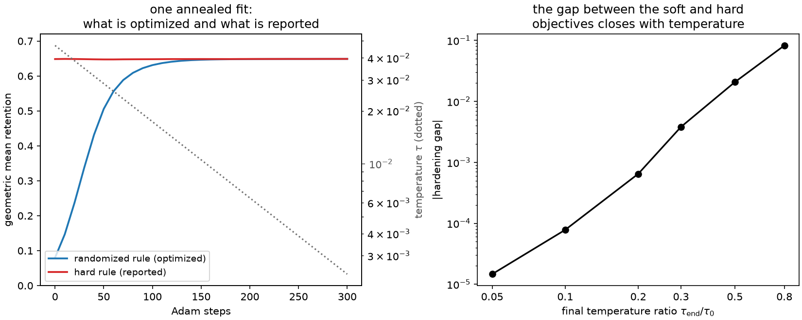

# 12. Soft rules, purification, and consistency

[Chapter 6](ch06-two-tasks.md) named a problem and postponed it. On a finite sample the
hard objective \(F(I_{P_n}(q_\eta))\) is *piecewise constant* in the rule's parameters:
nudge a boundary and, until some training score crosses it, every label and every cell
moment is exactly what it was. The gradient is zero almost everywhere and undefined on the
crossing surfaces, so "gradient descent on the hard empirical objective" is not an
algorithm — it is a description of a procedure that never moves.

The way out is not a smoothing trick. It is to change the rule.

## A randomized quantizer is a quantizer

Replace the hard assignment by a *probability* of assignment. A randomized quantizer gives
each score a distribution over cells, \(r_b(s)\ge0\) with \(\sum_b r_b(s)=1\), and the
label is drawn from it. That is a legitimate decision rule — you flip a coin and report a
cell — and it has an ordinary label law:

$$W_b \;=\; \mathbb{E}\big[r_b(S)\big],
\qquad
m_b \;=\; \mathbb{E}\big[r_b(S)\,S\big],
\qquad
I_{\text{soft}} \;=\; \sum_b \frac{m_bm_b^\top}{W_b} .$$

Nothing here is an approximation. \(\Pr(Z=b)=\mathbb{E}[r_b(S)]\) exactly, and the
conditional-score-mean identity of [Chapter 5](ch05-information-after-binning.md) applies
verbatim, because it only ever needed the label's own likelihood. So \(I_{\text{soft}}\) is
the Fisher information of the randomized rule at \(\theta_0\), on the same footing as
\(I_q\) for a hard one — not a surrogate for it.

`fractional_fisher_information` computes it, and validates that the rows really are
probability vectors, because a matrix of arbitrary nonnegative weights would not be a
quantizer at all.

```python
import numpy as np

import scorequant as sq

rng = np.random.default_rng(12)
scores = rng.normal(size=(2_000, 2)) @ np.array([[1.0, 0.5], [0.0, 1.2]])
centers = np.array([[2.0, 0.5], [-1.5, 1.5], [-0.5, -2.0], [1.0, -0.5]])
temperature = 0.8

logits = -np.sum((scores[:, None, :] - centers[None, :, :]) ** 2, axis=2) / (2 * temperature**2)
responsibilities = np.exp(logits - logits.max(axis=1, keepdims=True))
responsibilities /= responsibilities.sum(axis=1, keepdims=True)

soft = np.asarray(sq.fractional_fisher_information(scores, responsibilities))
cell_weights = responsibilities.sum(axis=0)
cell_moments = responsibilities.T @ scores
cell_means = cell_moments / cell_weights[:, None]

assert np.max(np.abs(soft - np.einsum("b,bp,bq->pq", cell_weights, cell_means, cell_means))) < 1e-9
```

The coin flip is not a metaphor either. Draw one label per row from its own responsibility
row and the realized cell weights and moments are unbiased estimates of the soft ones:

```python
coin = np.random.default_rng(5)
drawn = np.array([coin.choice(4, p=row) for row in responsibilities])
drawn_weights = np.bincount(drawn, minlength=4).astype(float)

assert np.max(np.abs(drawn_weights - cell_weights) / cell_weights) < 0.05
realized = np.asarray(sq.binned_fisher_information(scores, drawn, n_bins=4))
assert abs(float(np.linalg.slogdet(realized)[1]) - float(np.linalg.slogdet(soft)[1])) < 0.1
```

## The gradient, and the geometry hiding in it

Now the objective is differentiable in the responsibilities. For a differentiable criterion
\(F\) with gradient \(G=\nabla_IF(I_{\text{soft}})\), differentiating the cell-moment
expression gives

$$\boxed{\;\frac{\partial F}{\partial r_{ib}} \;=\; w_i\Big(2\,s_i^\top G\,\mu_b - \mu_b^\top G\,\mu_b\Big).\;}$$

That expression is the same Mahalanobis geometry the hard criteria produce, wearing a
different hat. Completing the square,

$$2\,s^\top G\mu_b - \mu_b^\top G\mu_b \;=\; s^\top Gs \;-\; (s-\mu_b)^\top G\,(s-\mu_b),$$

and the first term does not depend on \(b\). So *increasing the responsibility of the
nearest cell in \(G\) is the direction of steepest ascent*, cell for cell — the population
first-order rule of Chapter 8 reappears as a gradient rather than as a stationarity
condition.

```python
metric = np.linalg.inv(soft)
analytic = (
    2.0 * scores @ metric @ cell_means.T
    - np.einsum("bp,pq,bq->b", cell_means, metric, cell_means)[None, :]
)


def objective(table):
    """Log determinant of the soft information of unnormalized responsibilities."""
    occupancy = table.sum(axis=0)
    means = (table.T @ scores) / occupancy[:, None]
    return float(np.linalg.slogdet(np.einsum("b,bp,bq->pq", occupancy, means, means))[1])


base, step = objective(responsibilities), 1e-6
for row, cell in ((3, 2), (17, 0), (250, 3)):
    bumped = responsibilities.copy()
    bumped[row, cell] += step
    assert abs((objective(bumped) - base) / step - analytic[row, cell]) < 1e-5

offsets = scores[:, None, :] - cell_means[None, :, :]
mahalanobis = np.einsum("nbp,pq,nbq->nb", offsets, metric, offsets)
common = np.einsum("np,pq,nq->n", scores, metric, scores)

assert np.max(np.abs(analytic - (common[:, None] - mahalanobis))) < 1e-9
```

## The family the library fits

A gradient in responsibility space is not yet a rule. To get one you parameterize the
responsibilities. The general choice is an affine-max relaxation,
\(r_b(s;\eta,\tau)=\operatorname{softmax}_b\big((a_b^\top s+c_b)/\tau\big)\), which
approaches a hard affine-max partition as \(\tau\to0\) whenever ties have zero mass.
`SoftVoronoiConfig` fits the common-metric specialization of it: in Fisher-whitened
coordinates,

$$r_b(s;c,\tau) \;=\; \operatorname{softmax}_b\!\left(-\frac{\|s-c_b\|^2}{2\tau^2}\right),$$

whose free parameters are the \(K\) centers alone. Dropping the shared \(\|s\|^2\) makes the
logits affine in \(s\), so the \(\tau\to0\) limit is exactly the Voronoi rule those centers
define — the same family a compiled D partition lands in, fitted rather than compiled.

The schedule matters as much as the family. The library initializes the centers with
weighted k-means, sets the starting temperature to the median nearest-center separation
(so the initial responsibilities are genuinely soft in the units of the problem), and
anneals geometrically to `temperature_end_ratio` times that over `max_steps` Adam updates,
with global-norm gradient clipping and a learning rate scaled by the starting temperature
so the whole fit is invariant to the scale of the information.

```python
train = np.random.default_rng(120).normal(size=(1_200, 2)) @ np.array([[1.0, 0.5], [0.0, 1.2]])

fitted = sq.fit_quantizer(
    sq.ScoreSample(train),
    n_bins=4,
    criterion=sq.DOptimality(),
    config=sq.SoftVoronoiConfig(seed=0, initializer_restarts=4, max_steps=300, record_every=25),
)
trace = fitted.trace

assert hasattr(fitted, "predict_scores")  # this one really is a rule
assert trace.objective_label == "logdet_retained"
assert float(np.asarray(trace.temperatures)[0]) > float(np.asarray(trace.temperatures)[-1])
assert (
    abs(float(np.asarray(trace.temperatures)[-1] / np.asarray(trace.temperatures)[0]) - 0.05) < 1e-6
)
print(round(float(np.asarray(trace.soft_retention)[-1]), 6), fitted.n_bins)
```

Four histories come back from a soft fit and they measure different things:
`trace.objective` is the soft criterion value being maximized, `trace.soft_retention` is
that value normalized into a retention, `trace.temperatures` is the schedule, and
`trace.gradient_norms` is the norm of the center gradient at each recorded step. A
gradient-norm history that never settles means the schedule outran the optimizer, not that
the answer is bad — but it does mean the reported centers are wherever the last step left
them.

## The hardening gap

A soft fit is never the deliverable. The deployed rule is hard: `predict_scores` assigns
each score to its nearest center, which is the \(\tau\to0\) limit. So the number that
matters is the retention of *that* rule, and the library reports the difference:

$$\text{hardening gap} \;=\; (\text{soft retention at the last step}) \;-\;
(\text{hard retention of the same centers}).$$

```python
gaps = []
for ratio in (0.5, 0.2, 0.05, 0.01):
    annealed = sq.fit_quantizer(
        sq.ScoreSample(train),
        n_bins=4,
        criterion=sq.DOptimality(),
        config=sq.SoftVoronoiConfig(
            seed=0,
            initializer_restarts=4,
            max_steps=300,
            record_every=25,
            temperature_end_ratio=ratio,
        ),
    )
    gaps.append(float(annealed.hardening_gap))

assert abs(gaps[0] + 0.020665) < 1e-5
assert all(abs(later) < abs(earlier) for earlier, later in zip(gaps, gaps[1:]))
assert abs(gaps[-1]) < 1e-8  # the two objectives have met
print([round(gap, 8) for gap in gaps])
```

On this table the gap runs \(-0.0207,\,-0.00065,\,-0.0000147,\,\approx0\) as the final
temperature falls by a factor of fifty. Two things are worth reading off. The gap closes,
which is what a temperature schedule is for. And it is *negative*: at a high final
temperature the hard rule retains more than the soft rule that produced it, because
diffuse responsibilities pull every cell mean toward the global mean and hardening
sharpens them again. Neither sign is guaranteed in general, which is exactly why the
number is reported rather than assumed.



*Left: a four-cell soft fit on 1200 rows. The blue curve is the retention of the randomized
rule the optimizer is actually maximizing; it starts near 0.08 because the initial
responsibilities are deliberately diffuse. The red curve is the retention of the hard rule
those same centers imply, which barely moves. The dotted line is the temperature schedule
on a logarithmic right-hand axis. Right: the absolute hardening gap against the final
temperature ratio, over six annealing schedules — almost four decades of closure for a
factor of sixteen in temperature.*

That flat red curve is the second lesson of the panel. `trace.train_hard_retention` records
the hard retention of the recorded center snapshots, and comparing its first entry with its
last says whether the soft optimization improved the thing you will actually deploy:

```python
history = np.asarray(trace.train_hard_retention)

assert abs(float(history[0]) - 0.648460) < 1e-5  # the k-means initialization
assert abs(float(history[-1]) - 0.648885) < 1e-5  # after 300 annealed Adam steps
print(round(float(history[-1]) - float(history[0]), 6))
```

Four hundred parts per million, for three hundred gradient steps. The default
`diagnostics="endpoints"` scores exactly these two snapshots, precisely because that
comparison is worth its two full-dataset passes and a per-snapshot history usually is not.

For contrast, the exact exchange of [Chapter 8](ch08-d-optimality.md) on the same table:

```python
exchange = sq.optimize_partition(train, n_bins=4, config=sq.DExchangeConfig(seed=0))
kmeans = sq.fit_quantizer(
    sq.ScoreSample(train),
    n_bins=4,
    criterion=sq.NormalizedTrace(),
    config=sq.KMeansConfig(seed=0, solver_restarts=4),
)

assert exchange.train_report.geometric_mean_retention > fitted.train_report.geometric_mean_retention
assert fitted.train_report.geometric_mean_retention > kmeans.train_report.geometric_mean_retention
print(
    round(float(kmeans.train_report.geometric_mean_retention), 6),
    round(float(fitted.train_report.geometric_mean_retention), 6),
    round(float(exchange.train_report.geometric_mean_retention), 6),
)
```

0.648460, 0.648885, 0.649148. The soft fit improves on its k-means initialization and the
free-label exchange beats both — on a smooth two-parameter law where there is very little
to win. Where the soft path earns its keep is not raw objective on an easy problem; it is
the two things the exchange cannot do, namely produce a rule for future events under a
criterion that has no compile bridge, and fit families that are not nearest-centroid at
all.

The profiled criterion of [Chapter 10](ch10-profiled-ds.md) is the case in point. Finite
profiled exchange has no canonical extension, but a soft profiled *fit* is an ordinary
estimator with an ordinary validation report:

```python
mixing = np.array([[1.0, 0.6, -0.3], [0.0, 1.1, 0.4], [0.0, 0.0, 0.9]])
three = np.random.default_rng(121).normal(size=(900, 3)) @ mixing
holdout = np.random.default_rng(122).normal(size=(600, 3)) @ mixing

profiled = sq.fit_quantizer(
    sq.ScoreSample(three),
    validation=sq.ScoreSample(holdout),
    n_bins=4,
    criterion=sq.ProfiledDOptimality((0,)),
    config=sq.SoftVoronoiConfig(seed=0, initializer_restarts=2, max_steps=120, record_every=30),
)

assert profiled.trace.objective_label == "profiled_logdet"
assert profiled.train_profiled_report is not None
assert profiled.validation_profiled_report is not None
assert profiled.predict_scores(holdout).shape == (600,)
print(
    round(float(profiled.train_profiled_report.geometric_mean_retention), 5),
    round(float(profiled.validation_profiled_report.geometric_mean_retention), 5),
)
```

## Purification: randomization buys nothing, in the population

A natural worry at this point: by allowing randomized rules, have we enlarged the problem?
Could the best randomized quantizer beat every hard one, making the soft relaxation not a
computational device but a genuinely better class of answers?

For a population law with no atoms, no.

**Theorem (purification; classical).** *If the score law \(P_S\) is atomless, every
randomized \(K\)-action quantizer can be replaced by a deterministic quantizer of score
space that reproduces all \((W_b,m_b)\) exactly.*

This is the Dvoretzky–Wald–Wolfowitz elimination-of-randomization theorem, proved for
statistical decision procedures and zero-sum games by [Dvoretzky, Wald and Wolfowitz
(1951)](../bibliography.md#dvoretzky1951); the modern measure-theoretic statement for
atomless finite-action problems is due to [Khan, Rath and Sun
(2006)](../bibliography.md#khan2006). It is quoted here as established mathematics, not as
a contribution. Since every criterion in this book depends on a rule only through the
finite collection \(\{(W_b,m_b)\}\), matching those moments exactly means matching the
objective exactly, so

$$\sup_{\text{randomized}} F \;=\; \sup_{\text{deterministic}} F$$

for D, \(D_s\), the trace and \(\lambda_{\min}\) alike.

Three qualifications, all of which matter in practice.

It is an **existence** statement. It says a purifying partition exists; it does not say
gradient ascent finds it, and it certainly does not say that hardening one particular
soft parameterization produces it. The hardening gap above is an empirical measurement
precisely because the theorem does not cover the operation the library performs.

The atomlessness is a condition on the **score law**, not on the observation law. A
dimension-reducing projection of an atomless law can perfectly well have atoms — this is
the same caution [Chapter 10](ch10-profiled-ds.md) needs when the efficient-score bound
appeals to purification for the relaxed upper problem.

And a **finite empirical** score law is atomic by construction: it is a sum of point
masses. The theorem simply does not apply to a fixed table, which is why the finite
assignment problem of Chapter 8 is a combinatorial optimization over labelings and not a
relaxation of anything.

For one important special case the finite answer is still clean, and it is worth
recording because it is provable rather than observed. With a *scalar* score, the objective
is \(\sum_b m_b^2/W_b\), and the map \((m,W)\mapsto m^2/W\) is jointly convex while
\((m_b,W_b)\) are linear in the responsibilities. So the finite soft objective is a convex
function of the responsibility matrix, and a convex function on a product of simplices
attains its maximum at a vertex — that is, at a hard labeling.

```python
column = np.random.default_rng(31).normal(size=(40, 1))

worst = np.inf
for trial in range(200):
    generator = np.random.default_rng(trial)
    left = generator.dirichlet(np.ones(3), size=40)
    right = generator.dirichlet(np.ones(3), size=40)
    values = [
        float(np.asarray(sq.fractional_fisher_information(column, table))[0, 0])
        for table in (left, 0.5 * (left + right), right)
    ]
    worst = min(worst, values[0] + values[2] - 2.0 * values[1])

assert worst > 0.0  # convex along every chord, so no interior point is a maximum
print(round(worst, 8))
```

Above one dimension the criterion is a log determinant of a convex matrix function, which is
neither convex nor concave in the responsibilities, and whether randomization can strictly
help on an *atomic* score law is open.

## Consistency: from a sample to the population

The last question a fitted rule owes an answer to is whether it means anything beyond the
rows it was fitted on. For a restricted family it does, by an argument that is standard
rather than special.

**Proposition (restricted-class empirical consistency).** *Let \(\mathcal{Q}\) be a compact
parameterized class of \(K\)-cell affine-max quantizers. Assume the scores are bounded (or
suitably uniformly integrable), that the relevant cell masses are bounded below uniformly
over \(\mathcal{Q}\), and restrict to a region where the criterion's information matrices
stay uniformly nonsingular. Then the empirical cell probabilities and score first moments
converge uniformly over \(\mathcal{Q}\) to their population values, so D, \(D_s\) and
\(\lambda_{\min}\) converge uniformly there. Any sequence of approximate empirical
maximizers is value-consistent for the best member of \(\mathcal{Q}\); with an isolated
population maximizer, the argmax theorem gives decision consistency up to relabeling.*

The proof is empirical-process routine: affine multiclass decision regions have finite
capacity, so their indicators satisfy a uniform law of large numbers; bounded score
coordinates extend it to \(s_j\mathbf{1}\{q(s)=b\}\); and the matrix criteria are
continuous away from singular boundaries. It plays the same role here that [Pollard
(1981)](../bibliography.md#pollard1981)'s strong consistency theorem plays for k-means,
though the objective is a matrix functional rather than an additive distortion, so it is an
analogue and not a corollary.

The visible consequence is that the train/validation difference of a fitted rule shrinks:

```python
population = np.random.default_rng(999).normal(size=(20_000, 2)) @ np.array(
    [[1.0, 0.5], [0.0, 1.2]]
)

differences = []
for n_rows in (100, 400, 1600, 6400):
    sample = np.random.default_rng(4).normal(size=(n_rows, 2)) @ np.array([[1.0, 0.5], [0.0, 1.2]])
    checked = sq.fit_quantizer(
        sq.ScoreSample(sample),
        validation=sq.ScoreSample(population),
        n_bins=4,
        criterion=sq.NormalizedTrace(),
        config=sq.KMeansConfig(seed=0, solver_restarts=4),
    )
    differences.append(
        float(checked.train_report.geometric_mean_retention)
        - float(checked.validation_report.geometric_mean_retention)
    )

assert differences[0] > 0.03  # a hundred rows overstates its own performance
assert abs(differences[-1]) < 0.002  # sixty-four hundred does not
print([round(difference, 5) for difference in differences])
```

A hundred rows report 0.0338 more retention than the same rule delivers on twenty thousand
fresh ones; sixty-four hundred rows are within four parts in ten thousand. That is the
optimism of a fitted objective, measured — and the reason the validation source is a report
and never a lever, since the moment it selects a checkpoint it stops estimating this
quantity and starts being fitted like everything else.

What is *not* covered by the proposition is the unrestricted problem. Whether the global
finite optima of Chapter 8's free-label search converge to population optima as \(N\) grows
is open for all three criteria, and Chapter 10's counterexample shows that for profiled
\(D_s\) the finite and geometric problems do not even coincide at fixed \(N\). For D,
Theorem 3 makes the relationship unusually favorable — every global finite optimum is
already a self-consistent geometric rule — but favorable is not the same as proved.

**Runnable example:** [soft-purification](../examples/soft-purification.md) runs the
responsibility-space relaxation through a temperature schedule and measures the
hardening gap directly.

The next chapter goes back upstream, to the place where the score vectors themselves came
from, and asks what happens when they are estimated rather than known.
