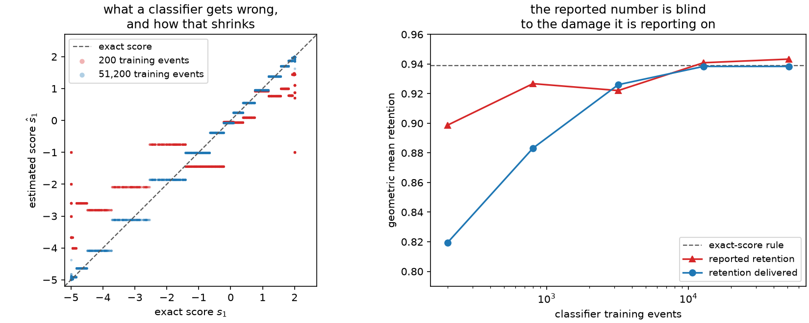

# 13. Estimated scores: classifiers and calibration

Every guarantee in Chapters 5 to 12 is a guarantee about the score vectors you hand the
optimizer. The exact relocation identity, Theorem 3, the certificates, the efficient-score
bound — all of them are exact statements about a weighted table of numbers, and all of them
are silent about where those numbers came from.

That silence is the point of [Chapter 4](ch04-scores-and-doors.md)'s third door. When the
likelihood cannot be evaluated — the model is a simulator, the detector response is
learned, the background is data — the score can still be *estimated* by training a
classifier. The framework then works exactly as before, on \(\hat s\) instead of \(s\).
What changes is what the resulting numbers mean.

This chapter takes that seriously: where estimated scores come from, which parts of the
estimation error actually cost you information (fewer than you would guess), which cost you
nothing at all, how retention degrades as the classifier gets worse, and what is honestly
still unknown.

## Two transforms, one contract

ScoreQuant begins at a *trained* model. Training, splitting, cross-fitting and calibration
belong to your application; the library takes a probability callback and applies a pure,
declared transform to its output. Two transforms cover the standard constructions.

The **central log-ratio transform** is for the general case. Generate samples at
\(\theta_0\pm\delta_je_j\), train a calibrated binary classifier \(D_j\) to tell them apart,
and use the fact that with equal training priors the Bayes-optimal logit is the log
likelihood ratio:

$$\hat s_j(x) \;=\; \frac{1}{2\delta_j}\Big(\operatorname{logit}D_j(x)
- \log\tfrac{\pi_j^+}{\pi_j^-}\Big) .$$

The prior log-odds subtraction is not optional; [Chapter
4](ch04-scores-and-doors.md) shows what an undeclared 40/60 split does to the reported
number. The estimator is a central finite difference, so it carries a deterministic
\(O(\delta_j^2)\) bias on top of whatever the classifier's own error is, and \(\delta_j\)
trades that bias against the variance of separating two samples that are close together.

The **mixture posterior transform** is for the case that motivated the library. For a
component or template model \(\lambda(x;\theta)=\sum_\alpha\theta_\alpha\phi_\alpha(x)\),
the score is \(s_\alpha=\phi_\alpha/\lambda\), which is a ratio of component densities — and
a calibrated multiclass classifier that names which component an event came from estimates
\(\eta_\alpha(x)\propto\pi_\alpha\phi_\alpha(x)\). Dividing by the known training priors
recovers the ratios \(r_\alpha=\eta_\alpha/\pi_\alpha\), and
`mixture_scores_from_posteriors` applies the simplex-constrained algebra that turns them
into scores of the mixture fractions.

Both are exactly the constructions of [Cranmer, Pavez and Louppe
(2015)](../bibliography.md#cranmer2015) and the local-score summaries of [Brehmer, Louppe,
Pavez and Cranmer (2020)](../bibliography.md#brehmer2020), used as prior art rather than
re-derived. The same instinct — differentiate through an inference objective rather than
around it — drives the inference-aware summary learning of [de Castro and Dorigo
(2019)](../bibliography.md#decastro2019); the difference is that here the learned object is
upstream of the binning, and the binning has its own exact theory once it arrives.

This chapter's running model is a three-component mixture whose exact posteriors are
computable, so the truth is available to compare against. That is a luxury of a
demonstration, and using it is the whole method of this chapter.

```python
import numpy as np

import scorequant as sq

FRACTIONS = np.array([0.5, 0.3, 0.2])
MEANS = np.array([-1.6, 0.0, 1.9])
SIGMAS = np.array([0.8, 0.6, 0.9])


def component_densities(values):
    """Component densities of the three-Gaussian mixture, shape [N, 3]."""
    exponent = -0.5 * ((values[:, None] - MEANS) / SIGMAS) ** 2
    return np.exp(exponent) / (SIGMAS * np.sqrt(2.0 * np.pi))


def draw(n_rows, seed):
    """Draw observations together with the component that generated them."""
    generator = np.random.default_rng(seed)
    component = generator.choice(3, size=n_rows, p=FRACTIONS)
    return generator.normal(MEANS[component], SIGMAS[component]), component


def exact_posteriors(values):
    """Exact component posteriors under the reference fractions."""
    joint = FRACTIONS * component_densities(values)
    return joint / joint.sum(axis=1, keepdims=True)


observations, _ = draw(4_000, 0)
exact = np.asarray(
    sq.mixture_scores_from_posteriors(exact_posteriors(observations), FRACTIONS, FRACTIONS)
)

assert exact.shape == (4_000, 2)  # three fractions, two free after the simplex constraint
truth = sq.optimize_partition(
    exact,
    n_bins=4,
    config=sq.DExchangeConfig(seed=0),
    provenance=sq.ScoreProvenance(kind="exact", description="analytic mixture score"),
)
assert truth.information_kind == "exact_fisher"
assert abs(float(truth.train_report.geometric_mean_retention) - 0.938921) < 1e-5
```

An exact posterior wrapped in `ClassifierScore` still reports estimated provenance, because
the provider describes *how* the numbers were produced, not how good they happen to be:

```python
oracle = sq.ClassifierScore(
    lambda values: exact_posteriors(np.asarray(values)[:, 0]),
    sq.MixturePosteriorTransform(FRACTIONS, FRACTIONS),
)

assert np.max(np.abs(np.asarray(oracle.score(observations[:, None])) - exact)) < 1e-12
assert oracle.provenance.kind == "estimated_classifier"
assert oracle.provenance.exact_fisher is False
```

That is deliberate. `ScoreProvenance.exact_fisher` is derived from `kind` rather than
accepted as a flag, so no combination of arguments makes the library describe a
classifier-derived matrix as Fisher information. It is also, in this one artificial case,
too conservative — which is exactly the price of a rule that cannot be talked out of.

## Which errors cost you, and which do not

Not all score-estimation error is equal, and the difference is large enough to change what
you should worry about.

**An invertible linear distortion costs nothing.** If \(\hat s = As\) with \(A\)
invertible, then \(\hat s\) is the exact score of a *reparameterized* model, and both
`DOptimality` and `NormalizedTrace` are invariant under reparameterization by
construction. The labels are identical, so the information actually retained is identical.

```python
mapping = np.array([[0.4, 3.0], [-1.5, 0.9]])  # invertible: det = 4.86
distorted = sq.optimize_partition(exact @ mapping.T, n_bins=4, config=sq.DExchangeConfig(seed=0))

assert np.array_equal(np.asarray(distorted.labels), np.asarray(truth.labels))
assert abs(
    float(sq.information_report(exact, distorted.labels, n_bins=4).geometric_mean_retention)
    - float(truth.train_report.geometric_mean_retention)
) < 1e-9
```

A classifier that gets the relative scale of two score coordinates wrong, or mixes them,
therefore costs you nothing at all as long as it does so *linearly and invertibly*. Note the
qualification for the profiled criterion of [Chapter 10](ch10-profiled-ds.md): there the
invariance holds only for maps that respect the interest/nuisance block structure, because
the criterion refers to those blocks by name.

**An error in the origin costs you twice.** The score-space origin is where "this event
says nothing about \(\theta\)" lives, and it is not a convention. Shift \(\hat s = s + c\)
and two things happen at once: the reported retention rises, because \(I_{\text{full}}\)
gains \(c\,c^\top\) in its denominator while the within-cell scatter is shift-invariant; and
the partition itself moves, because \(\log\det\) is not shift-invariant above one dimension.

```python
inflated, delivered = [], []
for offset in (0.0, 1.0, 2.0, 4.0, 8.0):
    shifted = sq.optimize_partition(
        exact + np.array([offset, 0.0]), n_bins=4, config=sq.DExchangeConfig(seed=0)
    )
    inflated.append(float(shifted.train_report.geometric_mean_retention))
    delivered.append(
        float(sq.information_report(exact, shifted.labels, n_bins=4).geometric_mean_retention)
    )

assert inflated[0] == delivered[0]  # no offset, nothing to hide
assert abs(inflated[-1] - 0.97903) < 1e-4  # what an eight-unit offset reports
assert abs(delivered[-1] - 0.84338) < 1e-4  # what it actually keeps
assert all(later > earlier for earlier, later in zip(inflated, inflated[1:]))
print([round(value, 5) for value in inflated], [round(value, 5) for value in delivered])
```

The reported number climbs monotonically towards one while the information the labels
retain falls by ten points. A score estimator can be made to look arbitrarily good by being
arbitrarily wrong about the origin, which is why nothing in this book ever centers a score
table and why the reported retention of an estimated score is not, on its own, evidence of
anything.

**A misdeclared prior is the realistic version of both.** For the mixture transform the
class priors under which the classifier was trained are an input, and getting them wrong
rescales the density ratios non-linearly. The damage is real and the reported number does
not show it — but a cheap diagnostic does.

```python
misdeclared = np.asarray(
    sq.mixture_scores_from_posteriors(exact_posteriors(observations), [0.2, 0.3, 0.5], FRACTIONS)
)
biased = sq.optimize_partition(misdeclared, n_bins=4, config=sq.DExchangeConfig(seed=0))

reported = float(biased.train_report.geometric_mean_retention)
actual = float(sq.information_report(exact, biased.labels, n_bins=4).geometric_mean_retention)

assert reported > actual + 0.03
assert abs(reported - 0.94010) < 1e-4 and abs(actual - 0.90795) < 1e-4
assert float(np.abs(exact.mean(axis=0)).max()) < 0.01  # the exact score closes on zero
assert float(np.abs(misdeclared.mean(axis=0)).max()) > 0.3  # the misdeclared one does not
print(round(reported, 5), round(actual, 5))
```

The last two assertions are the **mean-score closure** check, and it is the cheapest
calibration diagnostic available. For a normalized probability model the score has mean zero
under the reference measure, so \(\overline{\hat s}\) should be zero up to Monte-Carlo
error. Here the exact score closes to 0.004 and the misdeclared one sits at 0.30 — a factor
of eighty, visible without knowing the truth. Two caveats keep it honest: the check needs
the reference sample to be drawn from \(P_{\theta_0}\) (or correctly weighted to it), and it
does not apply to an unnormalized intensity model, whose score legitimately has a nonzero
mean along the total-rate direction.

## Retention against classifier quality

Now the study the chapter exists for. Replace the exact posteriors with a genuinely
estimated classifier and vary how much data it was trained on.

The estimator is a smoothed histogram of class frequencies: deterministic, dependency-free,
and nonparametric, so its error shrinks with training size without ever being exactly right.
Nested training samples keep the ladder monotone in expectation rather than in luck.

```python
EDGES = np.linspace(-5.0, 5.0, 41)

training, components = draw(51_200, 77)
training_index = np.clip(np.digitize(training, EDGES) - 1, 0, len(EDGES) - 2)
observation_index = np.clip(np.digitize(observations, EDGES) - 1, 0, len(EDGES) - 2)

errors, reported_ladder, delivered_ladder = [], [], []
for n_train in (200, 800, 3_200, 12_800, 51_200):
    counts = np.ones((len(EDGES) - 1, 3))  # one pseudo-count per class
    np.add.at(counts, (training_index[:n_train], components[:n_train]), 1.0)
    table = counts / counts.sum(axis=1, keepdims=True)

    estimated = np.asarray(
        sq.mixture_scores_from_posteriors(table[observation_index], FRACTIONS, FRACTIONS)
    )
    fitted = sq.optimize_partition(estimated, n_bins=4, config=sq.DExchangeConfig(seed=0))

    errors.append(float(np.sqrt(np.mean((estimated - exact) ** 2))))
    reported_ladder.append(float(fitted.train_report.geometric_mean_retention))
    delivered_ladder.append(
        float(sq.information_report(exact, fitted.labels, n_bins=4).geometric_mean_retention)
    )

assert errors[0] > 6.0 * errors[-1]  # the score estimate really does improve
assert abs(delivered_ladder[0] - 0.81950) < 1e-4
assert abs(delivered_ladder[-1] - 0.93839) < 1e-4
assert delivered_ladder[-1] < float(truth.train_report.geometric_mean_retention)
print([round(value, 5) for value in reported_ladder])
print([round(value, 5) for value in delivered_ladder])
```

Read the two ladders side by side.

| training events | rms score error | reported retention | retention delivered |
| --- | --- | --- | --- |
| 200 | 1.082 | 0.8988 | 0.8195 |
| 800 | 0.598 | 0.9267 | 0.8832 |
| 3 200 | 0.295 | 0.9221 | 0.9260 |
| 12 800 | 0.175 | 0.9409 | 0.9384 |
| 51 200 | 0.155 | 0.9433 | 0.9384 |
| exact score | 0 | 0.9389 | 0.9389 |

The delivered column does what it should: it climbs from 0.820 to 0.938 and converges to the
exact-score value of 0.9389 from below. The reported column does not. It starts at 0.899 —
four points below the exact-score benchmark when the labels are really twelve points below
it — wanders non-monotonically, and finishes *above* that benchmark, because by then the
residual estimation noise is inflating \(I_{\text{full}}\) faster than it is degrading the
labels.

At two hundred training events the honest summary of this pipeline is "the labels retain
82% of the Fisher information", and the number the library prints is 90%. Neither is a bug.
The library computed exactly what it was asked to compute — the between-cell scatter of the
vectors you supplied — and those vectors were wrong.



*Left: the first estimated score coordinate against the exact one, for the worst and the
best classifier in the ladder. The staircase is the histogram estimator's own resolution;
the spread around the diagonal is what shrinks with training data. Right: reported and
delivered retention against training size, with the exact-score rule as a dashed reference.
The two curves converge from opposite sides and cross near thirteen thousand events.*

## Reading the reports honestly

The mechanism behind that gap is worth stating once, plainly. The between-cell algebra is
exact for whatever vectors it is given. Supply \(\hat s\ne s\) and the matrix in the report
is

$$\operatorname{Var}\big(\mathbb{E}[\hat s\mid q(\hat s)]\big),$$

a **surrogate**, while the information the labels genuinely retain about \(\theta\) is

$$\operatorname{Var}\big(\mathbb{E}[s\mid q(\hat s)]\big).$$

The two coincide only when the estimated score is the true one. Every result object says
which of the two it is holding:

```python
assert biased.information_kind == "supplied_score_surrogate"
assert truth.information_kind == "exact_fisher"
```

Three practices follow, and they are cheap.

**Label with the estimate, evaluate with whatever truth you have.** Every "delivered"
number in this chapter is `sq.information_report(exact, fitted.labels, ...)` — the labels
came from \(\hat s\), the evaluation used \(s\). Even a partial truth helps: an analytic
score for a subset of parameters, a high-statistics reference sample, or a second
independent estimator all give something to evaluate against.

**Validate the estimator on a model where you know the answer** before pointing it at one
where you do not. The oracle check above — feed the transform an exactly known posterior and
confirm it reproduces the analytic score to working precision — costs one line and catches
sign errors, prior misdeclarations and shape mismatches in the transform itself.

**Hold out or cross-fit the score estimator, not just the quantizer.** A classifier trained
on the same events it later scores will produce scores that are optimistically separated on
exactly those events, and the quantizer will happily fit that separation. The validation
source of [Chapter 6](ch06-two-tasks.md) checks the *rule*; it does not check the score
estimator, because both its columns came from the same estimator.

## What is genuinely open

Everything above is diagnosis. There is no theory here, and it would be dishonest to imply
otherwise.

The exact statements of this book concern the score vectors supplied to the optimizer.
Interpreting the resulting matrix as Fisher information for the original model additionally
requires that those vectors equal — or consistently estimate — the true local score. What is
*not* available is a quantitative bridge between the two: given a score estimator with a
stated uniform or mean-square error, there is no result in this book, or that we know of,
that bounds the resulting error in the cell moments, in the optimized criterion value, in
the position of the decision boundaries, or in the Fisher information the chosen labels
truly retain.

The ladder above is a measurement of one such propagation on one model, and its shape is
suggestive — delivered retention converging from below, reported retention crossing from
above — but a measurement on one model is not a rate and not a bound. The open problem is
concrete: quantify how score-estimator error propagates through cell moments to the
retained information, with conditions under which the induced partition is stable and the
reported surrogate is a conservative rather than an optimistic estimate of the truth.

Until that exists, the honest protocol is the one this chapter demonstrates. Declare the
provenance, check the closure, validate the transform against a known case, evaluate the
labels against the best truth available, and treat every reported number as conditional on
the score estimate — because it is.

[Chapter 14](ch14-choosing-a-method.md) puts this alongside every other choice the library
asks you to make, and says which of them are decided by the problem rather than by taste.
