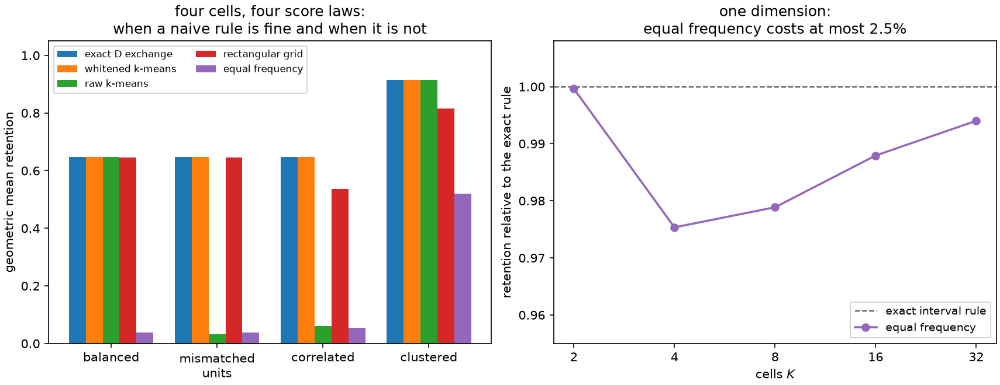

# 14. Diagnostics and choosing a method

Thirteen chapters have produced a lot of machinery, and the natural last question is which
part of it to use. That question is less open than it looks. Most of the choices this
library asks you to make are already made by your problem — whether the dataset is final,
whether you can evaluate the likelihood, whether some parameters are nuisance — and only
after those are settled does anything resembling taste enter.

This chapter is the map: the decision table, the three naive rules that are often good
enough and the cases where they are not, the diagnostics that tell you whether a fit is
worth trusting, and an honest list of what remains unsolved.

## The decision table

Five columns, and they resolve in order. Task first, because it determines the entry
point. Then the door, because it determines what you can supply. Then the criterion,
because it is a statistical statement about what you are measuring. The solver and the
available certificate follow from those three rather than being chosen freely.

| Task | Entry point | Door | Criterion | Solver | Certificate available |
| --- | --- | --- | --- | --- | --- |
| Label a fixed table | `optimize_partition` | raw score table | `DOptimality` | `DExchangeConfig` | stability, geometry, branch-and-bound, compile |
| Label a fixed table | `optimize_partition` | raw score table | `DOptimality` | `MahalanobisLloydConfig` | stability, geometry, branch-and-bound, compile |
| Label a fixed table | `optimize_partition` | raw score table | `ProfiledDOptimality` | `DExchangeConfig` | stability, efficient-score bound |
| Label a fixed table | `optimize_partition` | raw score table | `ProfiledDOptimality` | `MahalanobisLloydConfig` | stability, efficient-score bound |
| Fit a reusable rule | `fit_quantizer` | any source | `NormalizedTrace` | `KMeansConfig` | validation report |
| Fit a reusable rule | `fit_quantizer` | any source | `DOptimality` | `DExchangeConfig` | compile, geometry, validation report |
| Fit a reusable rule | `fit_quantizer` | any source | `DOptimality` | `MahalanobisLloydConfig` | compile, geometry, validation report |
| Fit a reusable rule | `fit_quantizer` | any source | `DOptimality` | `SoftVoronoiConfig` | hardening gap, validation report |
| Fit a reusable rule | `fit_quantizer` | any source | `ProfiledDOptimality` | `SoftVoronoiConfig` | hardening gap, profiled validation report |
| Fit a reusable rule | `fit_quantizer` | any source, rank one | `DOptimality` | `ScalarDPConfig` | exact global optimum, validation report |

Ten rows out of thirty possible (config, criterion, task) combinations. The other twenty
are not silently reinterpreted — they are refused before any optimization begins, with a
`ValueError` when both halves are individually valid and a `TypeError` when the
configuration is not one the task's signature accepts at all. That distinction is the
difference between "this pairing is not implemented" and "this is the wrong kind of
object".

```python
import numpy as np

import scorequant as sq

rng = np.random.default_rng(140)
table = rng.normal(size=(160, 3)) @ np.array([[1.0, 0.5, -0.2], [0.0, 1.1, 0.3], [0.0, 0.0, 0.9]])
scalar = rng.normal(size=(160, 1))

configs = {
    "DExchangeConfig": sq.DExchangeConfig(seed=0, n_init=2),
    "MahalanobisLloydConfig": sq.MahalanobisLloydConfig(seed=0, n_init=2),
    "KMeansConfig": sq.KMeansConfig(seed=0, n_init=2),
    "SoftVoronoiConfig": sq.SoftVoronoiConfig(seed=0, n_init=2, max_steps=20, record_every=20),
    "ScalarDPConfig": sq.ScalarDPConfig(),
}
criteria = {
    "DOptimality": sq.DOptimality(),
    "ProfiledDOptimality": sq.ProfiledDOptimality((0,)),
    "NormalizedTrace": sq.NormalizedTrace(),
}
supported = {
    ("optimize_partition", "DExchangeConfig"): {"DOptimality", "ProfiledDOptimality"},
    ("optimize_partition", "MahalanobisLloydConfig"): {"DOptimality", "ProfiledDOptimality"},
    ("fit_quantizer", "DExchangeConfig"): {"DOptimality"},
    ("fit_quantizer", "MahalanobisLloydConfig"): {"DOptimality"},
    ("fit_quantizer", "KMeansConfig"): {"NormalizedTrace"},
    ("fit_quantizer", "SoftVoronoiConfig"): {"DOptimality", "ProfiledDOptimality"},
    ("fit_quantizer", "ScalarDPConfig"): {"DOptimality"},
}

accepted, refused = 0, 0
for task in ("optimize_partition", "fit_quantizer"):
    for config_name, config in configs.items():
        for criterion_name, criterion in criteria.items():
            data = scalar if config_name == "ScalarDPConfig" else table
            expected = criterion_name in supported.get((task, config_name), set())
            try:
                if task == "optimize_partition":
                    sq.optimize_partition(data, n_bins=4, criterion=criterion, config=config)
                else:
                    sq.fit_quantizer(
                        sq.ScoreSample(data), n_bins=4, criterion=criterion, config=config
                    )
                assert expected, f"{task}/{config_name}/{criterion_name} should have been refused"
                accepted += 1
            except (TypeError, ValueError) as error:
                assert not expected, f"{task}/{config_name}/{criterion_name}: {error}"
                assert "implements only" in str(error) or "requires" in str(error)
                refused += 1

assert (accepted, refused) == (10, 20)
print(accepted, "supported pairings,", refused, "refused before any optimization")
```

Where two solvers share a row — `DExchangeConfig` and `MahalanobisLloydConfig` — the choice
is about work rather than correctness, since both terminate exchange-stable under the
default guard and [Chapter 9](ch09-mahalanobis-lloyd.md) says which crosses a bad
initialization faster. Two other entries deserve a sentence each, because they are the only
ones whose placement is not obvious.

`ScalarDPConfig` is the only solver in the library that returns a **global** optimum rather
than a locally unimprovable one, and it earns that by only accepting a rank-one score law:
on one coordinate the optimal partition has ordered interval cells and weighted interval
dynamic programming finds the best set of cut points exactly. If your problem is genuinely
one-dimensional, use it and stop worrying about restarts.

`SoftVoronoiConfig` is the only route to a reusable **profiled** rule. Finite profiled
exchange has no canonical extension — [Chapter 10](ch10-profiled-ds.md) exhibits a global
optimum that violates its own geometry — so `fit_quantizer` refuses
`ProfiledDOptimality` with the exchange solvers and offers an explicitly fitted rule
instead.

E-optimality has no row, for the reasons [Chapter 11](ch11-e-optimality.md) gives.

## Three naive baselines, and when they are fine

Before reaching for any of this, it is worth knowing what the obvious alternatives cost.
Here are three, scored on four two-parameter score laws with a budget of four cells.

```python
def retention(scores, labels, n_bins):
    """Geometric mean retention of one labeling."""
    return float(sq.information_report(scores, labels, n_bins=n_bins).geometric_mean_retention)


def rectangular_labels(scores, n_side):
    """Label rows by a quantile grid on the raw score coordinates."""
    quantiles = np.linspace(0.0, 1.0, n_side + 1)[1:-1]
    index = [
        np.digitize(scores[:, axis], np.quantile(scores[:, axis], quantiles)) for axis in (0, 1)
    ]
    return index[0] * n_side + index[1]


def equal_frequency_labels(column, n_bins):
    """Label rows by equal-frequency cuts on one coordinate."""
    quantiles = np.linspace(0.0, 1.0, n_bins + 1)[1:-1]
    return np.digitize(column, np.quantile(column, quantiles))


def compare(scores):
    """Score five four-cell rules on one score law."""
    exchange = sq.optimize_partition(scores, n_bins=4, config=sq.DExchangeConfig(seed=0))
    raw = sq.fit_quantizer(
        sq.ScoreSample(scores),
        n_bins=4,
        criterion=sq.NormalizedTrace(),
        config=sq.KMeansConfig(seed=0, n_init=8, whiten=False),
    )
    return (
        float(exchange.train_report.geometric_mean_retention),
        retention(scores, np.asarray(raw.labels), 4),
        retention(scores, rectangular_labels(scores, 2), 4),
        retention(scores, equal_frequency_labels(scores[:, 0], 4), 4),
    )


generator = np.random.default_rng(14)
base = generator.normal(size=(3_000, 2))
centres = np.array([[3.0, 0.2], [-1.0, 2.6], [-2.0, -2.4], [0.5, -0.4]])
pick = generator.integers(0, 4, size=3_000)
clustered = centres[pick] + generator.normal(scale=0.55, size=(3_000, 2))

laws = {
    "balanced": base,
    "mismatched units": np.stack([40.0 * base[:, 0], 0.05 * base[:, 1]], axis=1),
    "correlated": base @ np.array([[1.0, 0.0], [0.95, 0.31]]),
    "clustered": clustered - clustered.mean(axis=0),
}
results = {name: compare(scores) for name, scores in laws.items()}

for name, (best, raw, grid, frequency) in results.items():
    print(f"{name:17s} exchange={best:.5f} raw={raw:.5f} grid={grid:.5f} 1d={frequency:.5f}")

assert results["balanced"][2] > 0.99 * results["balanced"][0]  # a grid is fine here
assert results["correlated"][2] < 0.85 * results["correlated"][0]  # and not here
assert results["mismatched units"][1] < 0.06 * results["mismatched units"][0]
assert max(row[3] for row in results.values()) < 0.6  # one coordinate never suffices
```

**Rectangular bins on the observation (or score) coordinates.** On the balanced law a
two-by-two quantile grid reaches 0.64535 against the exact optimum's 0.64746 — 99.7% of it,
for a rule you can describe in a caption. Rectangular bins are genuinely fine when the
informative directions are close to the coordinate axes and comparably informative, and
they have two virtues nothing here can match: everyone understands them, and they are
stable under small changes in the sample. On the correlated law the same grid drops to
0.536, because the informative direction is diagonal and an axis-aligned cut cannot follow
it. If physical locality or rectangular interpretability is the actual requirement — a
detector region, a published table someone must reproduce — use a grid and quote what it
costs.

**Euclidean k-means on the raw score columns.** Fine when the score coordinates are already
comparably scaled, which is a fact about the units someone chose and not about the
statistics. On the balanced and clustered laws it is within \(10^{-4}\) of the whitened fit;
on the mismatched-units law it retains 3.2% where the whitened fit retains 64.7%.
[Chapter 7](ch07-trace-kmeans.md) analyzes the failure; the practical point is that the
check is one keyword. Fit with `whiten=True` and `whiten=False` and compare — if they
agree, the raw baseline was fine all along, and if they do not, you have just measured how
much the coordinate scaling was costing you.

**Equal-frequency cuts on one coordinate.** In one dimension this is a genuinely good rule.
Against the exact interval program of [Chapter 3](ch03-exact-1d.md) on a standard normal
score, equal frequency costs at most 2.5% of retention, and less as the budget grows:

```python
column = np.random.default_rng(2).normal(size=(4_000, 1))

ratios = []
for n_bins in (2, 4, 8, 16, 32):
    exact = sq.fit_quantizer(
        sq.ScoreSample(column),
        n_bins=n_bins,
        criterion=sq.DOptimality(),
        config=sq.ScalarDPConfig(),
    )
    frequency = retention(column, equal_frequency_labels(column[:, 0], n_bins), n_bins)
    ratios.append(frequency / float(exact.train_report.geometric_mean_retention))

assert min(ratios) > 0.975
assert ratios[-1] > 0.99
print([round(ratio, 5) for ratio in ratios])
```

It also guarantees something the optimal rule does not: every cell holds the same number of
events, so no downstream statistic is computed from a nearly empty bin. When occupancy is a
hard requirement, spending 2% of the information to buy it is usually the right trade.

Above one dimension it is a different story, and the reason is structural rather than a
matter of degree. Cutting on one coordinate makes every cell mean vary along that
coordinate alone, so \(I_q\) is rank one whatever \(K\) is, and the geometric mean retention
collapses — 0.038 on the balanced law, where four well-placed cells reach 0.647. This is
the rank bound of [Chapter 5](ch05-information-after-binning.md) in its most avoidable
form: a one-dimensional rule cannot serve a two-parameter measurement, however finely it
cuts.



*Left: geometric mean retention of five four-cell rules on four two-parameter score laws.
The exact exchange and the whitened k-means fit are indistinguishable on all four; the raw
k-means fit collapses when the coordinates are scaled differently; the rectangular grid is
excellent until the informative direction goes diagonal; equal-frequency cuts on one
coordinate are never adequate for two parameters. Right: in one dimension, equal-frequency
cuts against the exact interval program, over five cell budgets.*

And one baseline that is not in the figure because it wins whenever it is available: **do
not bin at all**. If the unbinned likelihood can be evaluated and afforded, and it has been
validated, use it. Everything in this book is about the case where a small hard interface is
a requirement — a published histogram, a bandwidth budget, a categorical decision — not an
analysis choice.

## The diagnostics workflow

A single objective value validates nothing. Four error sources stack up between a model and
a set of labels, and they need separate checks: **score error** (\(\hat s\) is not \(s\)),
**measure error** (the source approximates the wrong or an under-resolved reference
measure), **optimization error** (the solver missed a better rule inside its own family and
task), and **quantization error** (even the best rule of that size loses information).

Run them in that order. Here is the whole workflow on one problem.

```python
mixing = np.array([[1.0, 0.45], [0.0, 1.2]])
scores = np.random.default_rng(141).normal(size=(3_000, 2)) @ mixing
holdout = np.random.default_rng(142).normal(size=(3_000, 2)) @ mixing

partition = sq.optimize_partition(scores, n_bins=4, config=sq.DExchangeConfig(seed=0))
report = partition.train_report

# 1. Is the problem well posed at all? Rank, occupancy, and the PSD residual.
assert partition.rank == 2
assert float(np.min(np.asarray(report.bin_weights))) > 400  # no nearly empty cell
assert float(report.psd_residual_min_eigenvalue) > 0.0  # I_full - I_q is positive definite

# 2. Did the optimizer finish? Stability is a property of the labels, not of the run.
stability = sq.exchange_stability_report(scores, partition.labels)
assert stability.stable is True and stability.best_move is None
assert partition.best_remaining_gain <= partition.config.gain_tolerance

# 3. Do the labels have the geometry the theorem promises?
assert partition.geometry.voronoi_consistent is True
assert partition.geometry.violating_moves == 0
assert partition.geometry.separation_certified is True

# 4. Does the rule generalize? Compile it and evaluate on events it has never seen.
compiled = partition.compile_quantizer()
validation = compiled.evaluate_scores(holdout)
assert abs(float(report.geometric_mean_retention) - 0.63777) < 1e-4
assert abs(float(validation.geometric_mean_retention) - 0.63315) < 1e-4
print(
    round(float(report.geometric_mean_retention), 5),
    round(float(validation.geometric_mean_retention), 5),
)
```

Retention 0.6378 on the training rows and 0.6331 on three thousand fresh ones — a
five-per-thousand optimism, which is about what a four-cell rule fitted on three thousand
rows should look like.

Two more checks apply when the problem is small enough or the criterion is profiled.

```python
# 5a. On a small table, ask the global question outright.
small = np.random.default_rng(143).normal(size=(20, 2))
incumbent = sq.optimize_partition(small, n_bins=4, config=sq.DExchangeConfig(seed=0))
certificate = sq.certify_partition(small, n_bins=4, incumbent=incumbent.labels)

assert certificate.status == "optimal"
assert certificate.gap == 0.0
assert certificate.incumbent_was_optimal is False  # the exchange stopped 0.0016 nat short
print(certificate.nodes_explored, round(certificate.objective - incumbent.objective, 6))

# 5b. Under the profiled criterion, ask what no rule of that size could exceed.
three = np.random.default_rng(144).normal(size=(300, 3))
bound = sq.efficient_score_bound(three, interest=(0,), n_bins=4)
profiled = sq.optimize_partition(
    three,
    n_bins=4,
    criterion=sq.ProfiledDOptimality((0,)),
    config=sq.DExchangeConfig(seed=0, n_init=4),
    initial_labels=bound.labels,
)
assert bound.gap_to(profiled) >= 0.0
print(round(bound.gap_to(profiled), 6))
```

The certificate is the strongest statement in the library and the most limited: exponential
in the number of distinct score atoms, capped by `CertificationConfig.max_rows` at 64 by
default, and available for `DOptimality` only. Everything else is a local guarantee.

```python
try:
    sq.certify_partition(small, n_bins=4, criterion=sq.ProfiledDOptimality((0,)))
    raise AssertionError("the singleton bound is a D-specific argument")
except ValueError as error:
    assert "supports DOptimality only" in str(error)
```

And when the scores were estimated, none of the above measures what you actually want.
[Chapter 13](ch13-estimated-scores.md)'s protocol goes on top: declare provenance, check
mean-score closure, validate the transform on a case where the answer is known, and
evaluate the labels against the best available truth. `information_kind` says which of the
two objects a report is holding, and no argument changes it.

## Contrast: binning for discovery

One boundary is worth drawing, because a neighbouring literature solves a similar-looking
problem with a different objective. In collider physics, event categorization is often
optimized for **discovery significance** or for expected exclusion limits rather than for
Fisher information: [Matchev and Shyamsundar
(2021)](../bibliography.md#matchev2021) derive optimal event selection and categorization
for signal discovery, and [Erdmann, Kasaraguppe and Mausolf
(2026)](../bibliography.md#erdmann2026) optimize multi-dimensional binnings directly by
differentiable and Bayesian search against a downstream figure of merit.

Those are different problems, not competing solutions to this one. A discovery figure of
merit is a global statement about two hypotheses; the criteria in this book are local
statements about estimating a parameter near \(\theta_0\). They coincide only in special
cases, and where they differ, the right question is which one your analysis actually
reports. What this book adds is not a better objective but exact finite structure for one
family of objectives: a closed relocation gain, a theorem turning terminal labels into a
deployable rule, and certificates that say what was proved rather than what was reached.

## Limitations and open problems

An honest closing list. None of these is a defect in the implementation; they are the edges
of what is known.

**Global optimality at scale.** Branch and bound settles tables of a few dozen distinct
score atoms and nothing larger. The complexity of the general problem — for variable \(K\)
and \(d\) — is not settled, and the fixed-parameter arrangement argument that Theorem 3
enables is polynomial only for small \(d\) and \(K\). Whether stronger neighbourhoods
(two-point exchanges, merge/split moves, hybrid global search) substantially close the gap
to the optimum in practice is an open and very testable question.

**Population consistency of unrestricted optimization.** For a fixed geometric family, the
usual empirical-process argument of [Chapter 12](ch12-soft-rules.md) gives value and
decision consistency. For the unrestricted finite assignment problem — the exchange
engine's actual search space — whether global sample optima converge to population optima
as \(N\) grows is unproved for all three criteria. For the determinant the situation is
unusually favourable, since every global finite optimum is already a self-consistent
geometric rule, but favourable is not proved.

**Nuisance parameters need their own theory.** The population efficient-score geometry of
[Chapter 10](ch10-profiled-ds.md) is clear, the finite exchange is exact, and the
counterexample shows the two do not meet. Whether the \(O(K/N)\) stability bound is enough,
under regularity conditions, to force global finite profiled optima toward population
efficient-Voronoi solutions is open, and it is the missing piece that would give the
profiled criterion a compile bridge.

**Spectral criteria.** For \(\lambda_{\min}\), even the population first-order geometry is
not unique at eigenvalue multiplicity, and whether a single minimum-eigenspace
supergradient can be made to support all cell inequalities at an optimum is unresolved.
More broadly: which concave matrix criteria besides the full log determinant admit a finite
exchange-stability-implies-geometry theorem at all? The determinant's proof turns on a
coincidence between two inequalities, and nobody knows how special that coincidence is.

**Atomic score laws.** Purification removes the need for randomization when the score law
has no atoms. A finite empirical law is nothing but atoms, and the gap between the best
randomized and the best deterministic rule on such a law is uncharacterized above one
dimension.

**Estimated scores.** How uniform or mean-square error in a learned score oracle propagates
into the cell moments, the optimized criterion, the position of the boundaries, and the
Fisher information the labels truly retain — none of that is quantified. It is the largest
practical gap in the framework, and [Chapter 13](ch13-estimated-scores.md) states it
plainly rather than papering over it.

**Reference-point dependence.** The score is a local object at \(\theta_0\). A rule
optimized there is not optimal elsewhere, and how far it can be transported — across
reference parameters, across covariate shift, across a change in the model itself — has no
theory here. In practice this is the assumption most likely to be violated quietly.

**Differentiable against combinatorial.** [Chapter 12](ch12-soft-rules.md) reported one
comparison on one easy problem, where the exact exchange won narrowly. When smooth
relaxation beats discrete exchange, and by how much, on genuinely hard multimodal score
laws is an empirical question that deserves a proper benchmark rather than an anecdote.

## Where to start

If you have read this far and want one paragraph: decide whether the dataset is final. If
it is, call `optimize_partition` with `DOptimality` and the default exchange, check
`exchange_stable`, and certify if the table is small. If it is not, call `fit_quantizer`
with a validation source, use `NormalizedTrace` when the parameters are interchangeable in
importance and `DOptimality` when they are not, and compile the exchange result when you
want the rule the theorem supplies rather than one you chose. Either way, before you
believe any number, check the rank, check the occupancy, check the train/validation
difference, and check where the scores came from.

The rest of this book is why those are the right things to check.
