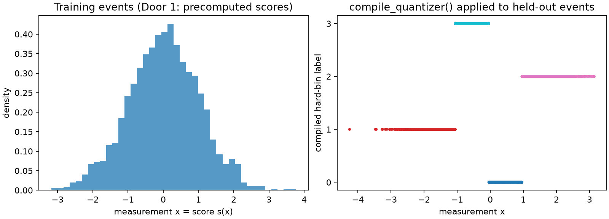

# Door 1: precomputed score events

This page walks both public tasks — **sample partitioning** (`optimize_partition`) and
**space quantization** (`fit_quantizer`) — through [Door 1](../three-doors.md): you already
have `(event, score)` rows and their weights, so no provider is needed. It replaces the old
"first analytic partition" tutorial and answers a question that comes up immediately: once
you have a stable partition of your sample, when do you compile it into a rule, and when do
you just fit a rule directly?

## Problem

Each event is one measurement \(x\sim\mathcal N(\mu,1)\), and the downstream task is to
estimate the unknown location \(\mu\). At the reference point \(\mu_0=0\), the score is
\(s(x)=x\), so the observation and its score coincide — a useful analytic check, since
grouping nearby score values should preserve information about \(\mu\) and the amount lost
can be measured exactly.

## Data

`examples.synthetic_problems.gaussian_location` returns deterministic train/validation/test
splits of this model. The scores are declared `exact` at the reference point, so
`information_kind` is later allowed to read `"exact_fisher"`.

```python
import numpy as np

import scorequant as sq
from examples.synthetic_problems import gaussian_location

problem = gaussian_location()
train, test = problem.train, problem.test

provenance = sq.ScoreProvenance(kind="exact", reference_point=(0.0,))
sample = sq.ScoreSample(train.scores, train.weights, provenance=provenance)
assert sample.scores.shape == (2000, 1)
```



## API walkthrough

### `optimize_partition`, with a stability report

`optimize_partition` assigns labels to exactly the 2000 rows supplied. `exchange_stable` and
`best_remaining_gain` are that assignment's own certificate: they report whether any single
admissible relocation could still improve the exact objective.

```python
partition = sq.optimize_partition(
    sample.scores,
    weights=sample.weights,
    n_bins=4,
    criterion=sq.DOptimality(),
    config=sq.DExchangeConfig(seed=12),
    provenance=sample.provenance,
)
assert partition.exchange_stable is True
assert partition.best_remaining_gain < 0.0  # no move would raise the objective
train_efficiency = float(partition.train_report.geometric_mean_retention)
assert 0.85 < train_efficiency < 0.92
```

The same certificate is checkable independently of how the labels were produced, through
`exchange_stability_report`:

```python
stability = sq.exchange_stability_report(
    partition.training_scores, partition.labels, weights=sample.weights
)
assert stability.stable == partition.exchange_stable
```

`partition.labels` belongs to these 2000 rows and nothing else — `PartitionResult` has no
`predict_scores`.

### The compile bridge

Because the partition is exchange-stable and the criterion is `DOptimality`, it is already a
strict self-consistent Voronoi partition in the retained Mahalanobis metric ([Chapter
6](../book/ch06-two-tasks.md) proves why). `compile_quantizer()` turns that fact into a
`QuantizerResult` and verifies it reproduces every training label before returning:

```python
compiled = partition.compile_quantizer()
compiled_test = compiled.evaluate_scores(test.scores, test.weights)
compiled_retention = float(compiled_test.geometric_mean_retention)
assert 0.85 < compiled_retention < 0.92
future_bins = compiled.predict_scores(np.array([[0.4], [-1.2]]))
```

### `fit_quantizer` directly, as the alternative

If a reusable rule is the goal from the start, fit one directly instead of routing through a
partition. This also opens criteria and solvers `compile_quantizer` cannot reach — here,
normalized-trace k-means instead of D-optimal exchange:

```python
direct = sq.fit_quantizer(
    sample,
    n_bins=4,
    criterion=sq.NormalizedTrace(),
    config=sq.KMeansConfig(seed=12, n_init=4),
)
direct_retention = float(direct.evaluate_scores(test.scores, test.weights).geometric_mean_retention)
assert 0.85 < direct_retention < 0.92
assert round(compiled_retention, 6) == round(direct_retention, 6)
```

On this one-dimensional problem the two routes land on the same test-set D-efficiency to six
decimal places — both are approximating the same optimal interval partition. That agreement
is a property of this simple problem, not a guarantee; a later solver-shootout page compares
every solver against every baseline on a harder, two-parameter problem where they separate.

## Analysis

| Route | Criterion / solver | Certificate | Reusable? |
| --- | --- | --- | --- |
| `optimize_partition` alone | any | `exchange_stable`, `best_remaining_gain` | no — `PartitionResult` has no predict method |
| `optimize_partition` → `compile_quantizer()` | `DOptimality` only, exchange-stable, nonsingular | Theorem-backed Mahalanobis rule | yes |
| `fit_quantizer` directly | `DOptimality`, `ProfiledDOptimality`, or `NormalizedTrace`, any solver | the fit's own diagnostics | yes |

## Discussion

**Task:** both — sample partitioning first, then either the compile bridge or a direct fit
into space quantization. **Door:** 1, precomputed `(event, score)` rows via `ScoreSample`.
**Criterion / solver:** `DOptimality` with exact exchange for the partition and its compiled
rule; `NormalizedTrace` with k-means for the direct alternative.

Use `optimize_partition` → `compile_quantizer()` when you specifically want the D-optimal
exchange result and its exchange-stability certificate, and only need a reusable rule as a
by-product of a result you were already computing. Use `fit_quantizer` directly when you know
from the start you want a rule, or when you want a criterion or solver the compile bridge
does not reach — `NormalizedTrace`, `ProfiledDOptimality`, or the soft-Voronoi and scalar
dynamic-programming solvers all skip the partition step entirely. See [Chapter
4](../book/ch04-scores-and-doors.md) for where scores and doors come from, and [Chapter
6](../book/ch06-two-tasks.md) for the theorem behind the compile bridge.

The matching notebook,
[`door1_score_events.ipynb`](https://github.com/VitalyVorobyev/scorequant/blob/main/examples/notebooks/door1_score_events.ipynb),
runs the fuller study with more restarts and a closer look at where the two routes would
disagree on a harder problem.
