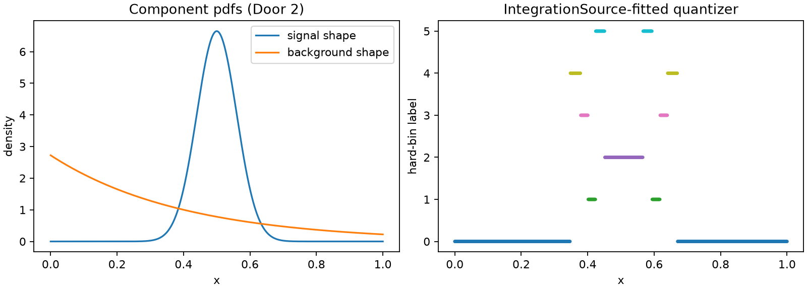

# Door 2: mixture densities to a binned fraction measurement

This page solves **space quantization** (`fit_quantizer`) through [Door 2](../three-doors.md):
a linear-component model built from exact component pdfs. It absorbs the old "linear
components" tutorial, and goes one step further: it fits from a bounded `IntegrationSource`
end to end with two score columns, then measures what binning actually cost the downstream
mixture-fraction estimate — not just the overall D-efficiency, but the retained Fisher
information about the fraction specifically.

## Problem

A one-dimensional spectrum is a mixture of a narrow signal peak and a broader
truncated-exponential background, \(\lambda(x;c)=c_{\text{sig}}\phi_{\text{sig}}(x) +
c_{\text{bkg}}\phi_{\text{bkg}}(x)\), with both \(\phi\) exact, normalized densities on
\([0,1]\) and \(c_{\text{sig}}+c_{\text{bkg}}=1\). The event score at the reference
coefficients is \(s_k(x)=\phi_k(x)/\lambda(x;c_0)\) — `scores_from_components`'s exact
identity. `c_sig` is the parameter of interest (the mixture fraction); `c_bkg` is a nuisance
shape parameter here treated jointly, so every fit below is plain `DOptimality` on both
columns together.

## Data

`examples.synthetic_problems.signal_background_shape` returns the exact densities and
precomputed Monte Carlo splits. One background shape keeps this a clean two-parameter
problem — exactly the case an `IntegrationSource` must handle correctly.

```python
import numpy as np

import scorequant as sq
from examples.synthetic_problems import signal_background_shape

problem = signal_background_shape(background_rates=(2.5,), n_bins=6)
problem.component_names, problem.interest, problem.nuisance, problem.coefficients
```

The component pdfs are exact callables; wrapping them as `LinearComponents` makes the
"component pdfs → score" step an explicit API call rather than something the generator did
silently.

```python
def signal_component(x):
    return problem.signal_density(np.asarray(x)[:, 0])


def background_component(x):
    return problem.background_densities[0](np.asarray(x)[:, 0])


model = sq.LinearComponents(
    components={"signal": signal_component, "background": background_component},
    coefficients={
        "signal": float(problem.coefficients[0]),
        "background": float(problem.coefficients[1]),
    },
    variables=["x"],
)
provider = sq.LinearComponentScore(model)

reproduced = np.asarray(provider.score(problem.train.observations))
assert np.allclose(reproduced, problem.train.scores)
```



## API walkthrough

### Fit from a Monte Carlo observation sample

The generator's Monte Carlo splits pair physical observations with the reference intensity as
their weight, so `ObservationSample` plus `provider` reaches `fit_quantizer` directly.

```python
train, test = problem.train, problem.test

quantizer_mc = sq.fit_quantizer(
    sq.ObservationSample(train.observations, train.weights),
    score=provider,
    n_bins=problem.n_bins,
    criterion=sq.DOptimality(),
    config=sq.DExchangeConfig(seed=50),
)
mc_retention = float(
    quantizer_mc.evaluate_scores(test.scores, test.weights).geometric_mean_retention
)
assert 0.99 < mc_retention <= 1.0
```

### Fit from a bounded `IntegrationSource`, end to end

The density is bounded on `[0, 1]` and exact, so no Monte Carlo sample is needed at all: a
deterministic Gauss-Legendre grid over `problem.bounds`, weighted by the mixture density, is
the whole reference measure. This is the required two-parameter `IntegrationSource` path —
`provider` returns one score column per component, so this run carries two.

```python
source = sq.IntegrationSource(
    problem.bounds, density=problem.intensity, quadrature=sq.GaussLegendreConfig(order=64)
)
quantizer_int = sq.fit_quantizer(
    source,
    score=provider,
    n_bins=problem.n_bins,
    criterion=sq.DOptimality(),
    config=sq.DExchangeConfig(seed=50),
)
assert quantizer_int.source_kind == "integration_source"
assert quantizer_int.transform.rank == 2
int_retention = float(
    quantizer_int.evaluate_scores(test.scores, test.weights).geometric_mean_retention
)
assert 0.99 < int_retention <= 1.0
```

The two fits — one from a 4000-event Monte Carlo sample, one from a 64-point deterministic
quadrature grid — land on the same held-out D-efficiency to four decimal places. For a
low-dimensional bounded model, `IntegrationSource` gets the exact reference measure without
paying for a Monte Carlo sample at all.

## Analysis: the downstream payoff

The overall D-efficiency above compresses both coefficients jointly. The question that
actually matters for a mixture-fraction measurement is narrower: how much information about
`c_sig` specifically survived the six bins? `profiled_information_report` answers this for any
labels, independent of what criterion produced them, by Schur-completing the nuisance block
out of both the unbinned and the binned Fisher matrix.

```python
labels = np.asarray(quantizer_int.predict_scores(test.scores))
profiled = sq.profiled_information_report(
    test.scores, labels, interest=problem.interest, weights=test.weights, n_bins=problem.n_bins
)
fraction_retention = float(profiled.geometric_mean_retention)
assert 0.99 < fraction_retention <= 1.0
schur_ratio = float(profiled.schur_binned[0, 0] / profiled.schur_unbinned[0, 0])
assert 0.99 < schur_ratio <= 1.0
```

Six bins retain about 99.6% of the Fisher information specifically about the signal fraction
— close to, but strictly less than, the unbinned ceiling. That gap is exactly what a binned
mixture-fraction fit pays for compression; `profiled.schur_unbinned` and `profiled.schur_binned`
are the two \(1\times1\) matrices a downstream likelihood's asymptotic variance would use.

## Discussion

**Task:** space quantization (`fit_quantizer`). **Door:** 2, an analytic component model —
both an `ObservationSample` Monte Carlo route and the required `IntegrationSource` route with
two score columns. **Criterion / solver:** `DOptimality` with exact exchange throughout;
`profiled_information_report` is applied afterward as a diagnostic and does not need to be the
fitting criterion.

This page treats `c_sig` and `c_bkg` jointly rather than fitting with `ProfiledDOptimality`.
When the background shape is a genuine nuisance you want optimized *around* rather than just
reported on, that is a different, deliberate choice of criterion — see
[Chapter 10](../book/ch10-profiled-ds.md) and a later profiled-\(D_s\) page for the deeper
D-versus-profiled-D comparison this same generator was built for.

The matching notebook,
[`door2_mixture_densities.ipynb`](https://github.com/VitalyVorobyev/scorequant/blob/main/examples/notebooks/door2_mixture_densities.ipynb),
runs both fits at full sample size and inspects the retained Fisher matrix directly.
