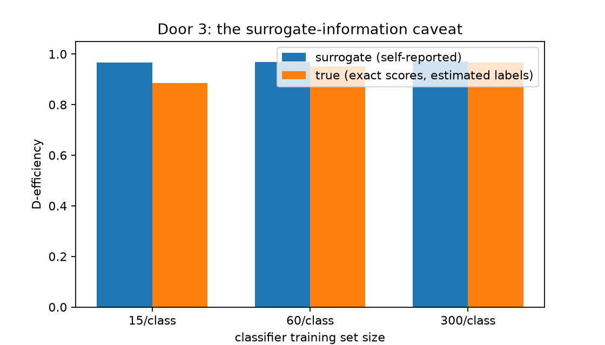

# Door 3: classifier-estimated density ratios, and what they honestly buy you

This page solves **space quantization** (`fit_quantizer`) through [Door 3](../book/ch04-scores-and-doors.md):
density ratios estimated by a trained scikit-learn classifier, standing in for a likelihood
ScoreQuant cannot evaluate. The classifier is one ratio backend among several — its calibrated
posteriors over the training priors *are* the component density ratios, up to a factor that
cancels. The page adds an actual retention-versus-classifier-quality ladder and an honest
demonstration of the surrogate-information caveat from [Chapter
13](../book/ch13-estimated-scores.md).

## Problem

Events come from a two-component mixture, \(\lambda(x;\theta)=\theta_{\text{sig}}\phi_{\text{sig}}(x)
+\theta_{\text{bkg}}\phi_{\text{bkg}}(x)\), with \(\phi_{\text{sig}}=\mathcal N(1.0, 0.5^2)\),
\(\phi_{\text{bkg}}=\mathcal N(0.0, 1.5^2)\), and reference fractions \(\theta_0=(0.3,0.7)\).
Unlike Door 2, the pdfs are treated as unavailable: only a classifier trained to separate
labeled signal and background events stands in for them.

## Data

Labeled training events are drawn per component to train the classifier; a separate,
unlabeled sample is drawn from the reference mixture itself to fit and evaluate the quantizer.
The classifier uses a quadratic feature \([x, x^2]\) so it can in principle reach the exact
Bayes boundary between two different-variance Gaussians — the only thing the ladder below
varies is how much labeled data it gets. A third sample, drawn from the *balanced* 0.5/0.5
mixture rather than the 0.3/0.7 reference fractions, is dedicated to the ratio-closure check
below: `DensityRatioScore.from_classifier` declares `class_priors = [0.5, 0.5]` as the ratio
denominator's measure, so that check must be evaluated on a sample from that measure, not from
`train_observations`.

```python
import numpy as np
from sklearn.linear_model import LogisticRegression

import scorequant as sq

signal_mu, signal_sigma = 1.0, 0.5
background_mu, background_sigma = 0.0, 1.5
reference_fractions = (0.3, 0.7)


def make_features(x):
    return np.column_stack([x, x**2])


def draw_reference_mixture(seed, n):
    rng = np.random.default_rng(seed)
    is_signal = rng.random(n) < reference_fractions[0]
    x = np.where(
        is_signal,
        rng.normal(signal_mu, signal_sigma, n),
        rng.normal(background_mu, background_sigma, n),
    )
    return x[:, None]


def draw_training_mixture(seed, n):
    rng = np.random.default_rng(seed)
    is_signal = rng.random(n) < 0.5
    x = np.where(
        is_signal,
        rng.normal(signal_mu, signal_sigma, n),
        rng.normal(background_mu, background_sigma, n),
    )
    return x[:, None]


train_observations = draw_reference_mixture(2026, 400)
test_observations = draw_reference_mixture(999, 600)
# Large and dedicated: this sample never enters a fit, and the closure check
# needs a tight noise floor to tell estimator bias apart from sampling noise.
closure_observations = draw_training_mixture(4242, 50_000)
train_observations.shape, test_observations.shape, closure_observations.shape
```



## API walkthrough

### Train, wrap, and fit

Training and calibration stay application code; ScoreQuant starts at `predict_proba`, the
declared training priors, and a declared parameterization.
`DensityRatioScore.from_classifier` converts calibrated posteriors into density ratios and
then into the mixture-fraction score.

```python
def train_classifier(seed, n_per_class):
    rng = np.random.default_rng(seed)
    x_signal = rng.normal(signal_mu, signal_sigma, n_per_class)
    x_background = rng.normal(background_mu, background_sigma, n_per_class)
    x = np.concatenate([x_signal, x_background])
    y = np.concatenate([np.zeros(n_per_class), np.ones(n_per_class)])
    return LogisticRegression(max_iter=1000).fit(make_features(x), y)


def classifier_provider(model, description):
    def predict(x):
        return model.predict_proba(make_features(np.asarray(x)[:, 0]))

    return sq.DensityRatioScore.from_classifier(
        predict,
        [0.5, 0.5],
        sq.MixtureParameterization(list(reference_fractions)),
        description=description,
    )


small_model = train_classifier(101, n_per_class=15)
small_provider = classifier_provider(small_model, "logistic regression, 15 events per class")
small_result = sq.fit_quantizer(
    sq.ObservationSample(train_observations),
    provider=small_provider,
    n_bins=4,
    criterion=sq.DOptimality(),
    config=sq.DExchangeConfig(seed=7),
)
assert small_result.information_kind == "supplied_score_surrogate"
assert small_provider.provenance.kind == "estimated_ratio"
assert small_provider.provenance.exact_fisher is False

closure = sq.ratio_closure_report(
    small_provider.ratio(closure_observations), np.ones(closure_observations.shape[0])
)
assert round(closure.max_residual, 3) == 0.042  # visible estimator bias, before any fitting
```

`information_kind` is `"supplied_score_surrogate"` for every classifier-derived result, no
matter how good the classifier is — `kind="estimated_ratio"` is recorded unconditionally, so
`ScoreProvenance.exact_fisher` (derived from `kind`, never an independent flag) is `False`
and the library never lets an estimate be reported as exact Fisher information. The
`ratio_closure_report` line is a ratio-level diagnostic: exact ratios integrate to one under
the measure they were built against — here the balanced 0.5/0.5 training prior, which is
exactly why the check runs on `closure_observations` rather than on `train_observations`
(drawn from the 0.3/0.7 reference mixture instead). Get that substitution backwards and the
check silently answers a different question; the Analysis section below measures what that
looks like, on purpose, as a labelled contrast.

### The retention ladder

Refitting at three labeled training-set sizes shows the *self-reported* retention barely
moving, while an independent check tells a different story.

```python
def exact_posteriors(x):
    values = np.asarray(x)[:, 0]
    signal = np.exp(-0.5 * ((values - signal_mu) / signal_sigma) ** 2) / signal_sigma
    background = (
        np.exp(-0.5 * ((values - background_mu) / background_sigma) ** 2) / background_sigma
    )
    joint = np.stack([signal, background], axis=1)
    return joint / joint.sum(axis=1, keepdims=True)


exact_provider = sq.ScoreFunction(
    lambda x: sq.mixture_scores_from_ratios(
        sq.ratios_from_posteriors(exact_posteriors(x), [0.5, 0.5]), list(reference_fractions)
    ),
    provenance=sq.ScoreProvenance(kind="exact"),
)
oracle_test_scores = np.asarray(exact_provider.score(test_observations))

ladder = []
for n_per_class, seed in ((15, 101), (60, 102), (300, 103)):
    model = train_classifier(seed, n_per_class)
    provider = classifier_provider(model, f"logistic regression, {n_per_class} events per class")
    result = sq.fit_quantizer(
        sq.ObservationSample(train_observations),
        provider=provider,
        n_bins=4,
        criterion=sq.DOptimality(),
        config=sq.DExchangeConfig(seed=7),
    )
    surrogate = float(
        result.evaluate_scores(provider.score(test_observations)).geometric_mean_retention
    )
    labels = np.asarray(result.predict_scores(provider.score(test_observations)))
    true_retention = float(
        sq.information_report(
            oracle_test_scores, labels, n_bins=result.n_bins
        ).geometric_mean_retention
    )
    closure = sq.ratio_closure_report(
        provider.ratio(closure_observations), np.ones(closure_observations.shape[0])
    )
    ladder.append((n_per_class, surrogate, true_retention, closure.max_residual))

small, medium, large = ladder
assert small[1] > 0.95 and small[2] < 0.90  # surrogate looks fine; the truth is not
assert large[2] > medium[2] > small[2]  # true retention rises with classifier quality
assert abs(large[1] - large[2]) < 0.01  # a good classifier's surrogate is finally trustworthy

# The table below rounds each ladder entry to three decimals.
assert [round(small[1], 3), round(small[2], 3)] == [0.966, 0.885]
assert [round(medium[1], 3), round(medium[2], 3)] == [0.969, 0.952]
assert [round(large[1], 3), round(large[2], 3)] == [0.970, 0.966]

# The closure residual, evaluated on the correct measure, is a genuine
# estimator-bias signal: it falls monotonically with classifier quality.
# (Tolerance rather than `round(..., 3) ==`: this quantity sits close
# enough to a rounding boundary that float32-versus-float64 execution
# tips it either side of the third decimal.)
assert small[3] > medium[3] > large[3]
assert abs(small[3] - 0.042) < 2e-3
assert abs(medium[3] - 0.0185) < 2e-3
assert abs(large[3] - 0.0032) < 2e-3

# The surrogate gap: what the self-reported number hides. It shrinks
# monotonically, and is largest at the smallest training size.
gaps = [surrogate - true for _, surrogate, true, _closure in ladder]
assert gaps[0] > gaps[1] > gaps[2]
assert round(gaps[0], 3) == 0.081
assert round(gaps[1], 3) == 0.017
assert round(gaps[2], 3) == 0.003

# The ceiling a quantizer fit directly from the exact score reaches on this sample.
assert exact_provider.provenance.kind == "exact"
assert exact_provider.provenance.exact_fisher is True

direct = sq.fit_quantizer(
    sq.ObservationSample(train_observations),
    provider=exact_provider,
    n_bins=4,
    criterion=sq.DOptimality(),
    config=sq.DExchangeConfig(seed=7),
)
assert direct.information_kind == "exact_fisher"
direct_retention = float(
    direct.evaluate_scores(exact_provider.score(test_observations)).geometric_mean_retention
)
assert round(direct_retention, 3) == 0.972

# The exact provider's own closure residual, on the correct measure: sampling
# noise on an unbiased estimator, sitting below every classifier rung's.
exact_closure = sq.ratio_closure_report(
    sq.ratios_from_posteriors(exact_posteriors(closure_observations), [0.5, 0.5]),
    np.ones(closure_observations.shape[0]),
)
assert abs(exact_closure.max_residual - 0.0017) < 1e-3
assert exact_closure.max_residual < large[3] < medium[3] < small[3]

# For contrast: the same exact ratios, evaluated on the *wrong* measure
# (`train_observations`, the reference mixture, instead of
# `closure_observations`) -- what this check reports on a perfect estimator
# when handed the wrong sample. Not a smaller bias: a different question.
wrong_measure_closure = sq.ratio_closure_report(
    sq.ratios_from_posteriors(exact_posteriors(train_observations), [0.5, 0.5]),
    np.ones(train_observations.shape[0]),
)
assert abs(wrong_measure_closure.max_residual - 0.180) < 5e-3
assert wrong_measure_closure.max_residual > 50 * exact_closure.max_residual


def equal_frequency_labels(score, n_bins):
    values = np.asarray(score).reshape(-1)
    edges = np.quantile(values, np.linspace(0.0, 1.0, n_bins + 1)[1:-1])
    return np.digitize(values, edges)


def equal_width_labels(score, n_bins):
    values = np.asarray(score).reshape(-1)
    lo, hi = float(values.min()), float(values.max())
    edges = np.linspace(lo, hi, n_bins + 1)[1:-1]
    return np.digitize(values, edges)


# What a reader's default one-dimensional binning of the same estimated
# score would have retained -- no Fisher information involved at all.
naive = []
for n_per_class, seed in ((15, 101), (60, 102), (300, 103)):
    model = train_classifier(seed, n_per_class)
    provider = classifier_provider(model, f"logistic regression, {n_per_class} events per class")
    scores = np.asarray(provider.score(test_observations))
    eq_freq = float(
        sq.information_report(
            oracle_test_scores, equal_frequency_labels(scores, 4), n_bins=4
        ).geometric_mean_retention
    )
    eq_width = float(
        sq.information_report(
            oracle_test_scores, equal_width_labels(scores, 4), n_bins=4
        ).geometric_mean_retention
    )
    naive.append((n_per_class, eq_freq, eq_width))

naive_small, naive_medium, naive_large = naive
# At 15/class the quantile rule and the fitted D-optimal partition are
# within half a point of each other -- not the dramatic gap the other doors
# show, because the score here is one-dimensional.
assert abs(small[2] - naive_small[1]) < 0.001
# At 300/class the naive equal-width rule actually beats the fit.
assert naive_large[2] > large[2]

# The same two naive rules, applied to the exact score itself.
direct_scores = np.asarray(exact_provider.score(test_observations))
direct_eq_freq = float(
    sq.information_report(
        oracle_test_scores, equal_frequency_labels(direct_scores, 4), n_bins=4
    ).geometric_mean_retention
)
direct_eq_width = float(
    sq.information_report(
        oracle_test_scores, equal_width_labels(direct_scores, 4), n_bins=4
    ).geometric_mean_retention
)
assert direct_retention - direct_eq_width < 0.01  # a small gap even with no classifier at all

# The single quoted figure: the largest gap the fit opens over the better
# naive rule, at any rung.
naive_gaps = [
    true - max(eq_freq, eq_width)
    for (_, _surrogate, true, _closure), (_, eq_freq, eq_width) in zip(ladder, naive, strict=True)
]
assert abs(max(naive_gaps) - 0.0155) < 2e-3
```

## Analysis

| Training size | Surrogate retention | True retention (exact scores, estimated labels) | Surrogate gap | Closure residual |
| --- | --- | --- | --- | --- |
| 15 / class | ~0.966 | ~0.885 | 0.081 | 0.042 |
| 60 / class | ~0.969 | ~0.952 | 0.017 | 0.019 |
| 300 / class | ~0.970 | ~0.966 | 0.003 | 0.003 |
| exact provider (ceiling) | ~0.972 | ~0.972 | — | 0.0017 |

The surrogate number — what `evaluate_scores` reports on the classifier's own estimated
scores — stays close to 0.97 throughout, because it measures
\(\operatorname{Var}(E[\hat s\mid q(\hat s)])\): how well the *bins* preserve the *estimated*
score, which the D-optimal solver is genuinely good at regardless of how good the estimate is.
The true number relabels the same held-out events with the classifier-based bins, then scores
the *exact* mixture-fraction score under those labels — \(\operatorname{Var}(E[s\mid
q(\hat s)])\) — and it is what a real downstream fit's information actually depends on. The
**surrogate gap** — surrogate minus true retention — is 8 points of D-efficiency at 15 labeled
events per class, the largest of the ladder; by 300 it has closed to under one point,
converging on the same ceiling a quantizer fit directly from the exact score reaches (~0.972
on this sample, with a matching surrogate and true retention because there is no estimate to
be wrong about).

**The closure column, evaluated correctly, is a genuine bias signal.** Once
`ratio_closure_report` runs on `closure_observations` — a dedicated sample from the balanced
0.5/0.5 mixture the ratios are actually defined against, never `train_observations` — the
residual falls monotonically with classifier quality (0.042, then 0.019, then 0.003) and the
exact provider's own residual (0.0017, pure sampling noise on 50,000 events) sits below every
rung, though only by a modest margin against the best-trained one: at 300 labeled events per
class the classifier has essentially converged, so its residual bias is already close to this
sample's noise floor. That ordering is the check working as designed, and it is what would
catch a regression back to the mistake below.

**The mistake it is easy to make, kept as a deliberate contrast.** Evaluating the *same* exact
ratios on `train_observations` instead — the 0.3/0.7 reference mixture, not the 0.5/0.5
training measure the ratios are declared against — gives 0.180, over a hundred times the
correct-measure residual, for a *perfect* estimator. That is not a smaller bias signal; it is
`ratio_closure_report` correctly answering a different, unintended question, because its
`weights` argument was handed the wrong measure. The check is not unreliable — feeding it the
wrong sample is a specific, easy-to-make mistake, and this page keeps both numbers side by
side so a reader can recognise it rather than mistake a working diagnostic for a broken one.

**What a reader's default one-dimensional binning would have retained.** The comparison every
other door page makes, run here too:

| Training size | Equal-frequency (quantile) | Equal-width | Fitted (true retention) |
| --- | --- | --- | --- |
| 15 / class | 0.884 | 0.865 | ~0.885 |
| 60 / class | 0.930 | 0.937 | ~0.952 |
| 300 / class | 0.938 | 0.968 | ~0.966 |
| exact provider (ceiling) | 0.938 | 0.968 | ~0.972 |

Measured, not assumed, and much less dramatic than the multi-dimensional doors: at 15/class the
quantile rule (0.884) is within half a point of the fitted D-optimal partition (0.885) — the
classifier is bad enough here that neither rule is doing much better than the other. At
300/class, naive equal-width cells (0.968) actually *beat* the fitted partition (0.966), and
the same is true against the exact-score ceiling (0.968 versus 0.972, still a gap of well under
a point). The largest gap the fit opens over the better of the two naive rules, at any rung, is
0.016 D-efficiency points, at 60/class — nothing close to the roughly 20-point classifier-
binning spread `docs/usecases/hep/index.md` measures on its multi-dimensional score. The
reason is dimensionality, not this problem being easy: the score here is one number, and in one
dimension an information-ordered rule and a well-chosen quantile rule are close by
construction — sorting one axis into equal-mass or equal-width pieces is nearly what a
D-optimal exchange would do anyway. The gap ScoreQuant opens up elsewhere is a genuinely
multi-dimensional phenomenon this page's own one-dimensional score is too simple to show.

## Discussion

**Task:** space quantization (`fit_quantizer`). **Door:** 3, classifier-derived density
ratios via `DensityRatioScore.from_classifier` with a `MixtureParameterization`.
**Criterion / solver:** `DOptimality` with exact exchange, held fixed across the ladder so
only classifier quality varies.

The caveat is not a defect to work around; it is what `information_kind ==
"supplied_score_surrogate"` is warning about on every classifier-backed result, and
`ScoreProvenance.exact_fisher` — derived from `kind`, never accepted as an independent flag —
is `False` for that result no matter how good the classifier is, while the exact provider's is
unconditionally `True`. Trust the self-reported retention only as far as you trust the
classifier — and when you can, check it the way this page does: relabel a held-out sample with
the fitted rule, then evaluate an exact or better-estimated score under those labels. See
[Chapter 13](../book/ch13-estimated-scores.md) for which parts of classifier error cost
information and which do not.

The second caveat is about the diagnostic meant to catch this without a held-out oracle.
`ratio_closure_report` works — evaluated on the measure its ratios are actually defined
against, its residual is a genuine, monotone estimator-bias signal (see Analysis) — but that
measure is not automatically the sample a study already has lying around. `train_observations`
comes from the reference mixture the physics problem cares about; the ratio's declared
denominator is the balanced training prior the classifier and the exact provider alike were
built against. Handing the check the former when it expects the latter is a specific, easy
mistake with a specific symptom (a large, classifier-quality-independent residual, ~0.18
here), not a sign the diagnostic itself is unreliable. Running the exact provider through both
versions of the check — and keeping the wrong-measure number as a labelled contrast rather
than deleting it — is what makes that distinction visible instead of just asserted.

The matching notebook,
[`door3_classifier.ipynb`](https://github.com/VitalyVorobyev/scorequant/blob/main/examples/notebooks/door3_classifier.ipynb),
runs a longer ladder at full sample size and plots the convergence directly.
