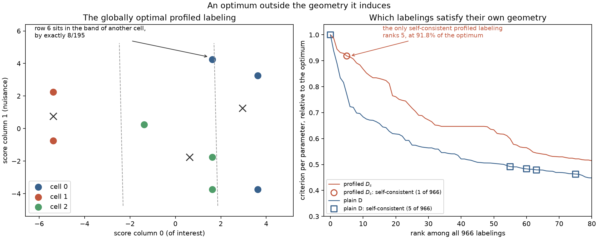

# A profiled optimum outside its own geometry

This page is about **sample partitioning** only (`optimize_partition`), and it enters
through [Door 1](../three-doors.md): a score table, eight rows of it, written down rather
than sampled. It exists to make one exact result runnable, and the result is the reason the
library has no compile bridge for the profiled criterion. The theory is
[Chapter 10](../book/ch10-profiled-ds.md).

For the plain determinant, [Chapter 8](../book/ch08-d-optimality.md)'s Theorem 3 says that
exchange stability *forces* geometry: a stable labeling cannot contain a misplaced row, so
its labels are the training realization of a Mahalanobis nearest-cell rule and
`compile_quantizer` can hand that rule back. The natural conjecture is that the same holds
for profiled \(D_s\) with its efficient semimetric in place of the Mahalanobis one.

It does not. On the eight rows below, the labeling that maximizes the profiled objective
over **all 966** three-cell labelings puts one row strictly in another cell's region of the
geometry that this very labeling induces, by an exact rational \(8/195\). Every quantity on
this page is computed with `fractions.Fraction`, so no sign depends on a tolerance.



## Problem

The parameter of interest is score column 0; column 1 is a nuisance to be estimated from the
same labels and profiled away. The criterion is the scalar Schur complement

$$S(I_q)\;=\;(I_q)_{00}-\frac{(I_q)_{01}(I_q)_{10}}{(I_q)_{11}},$$

whose logarithm is what `ProfiledDOptimality((0,))` maximizes. The question is whether the
best labeling of a finite table has to satisfy the nearest-cell rule in the semimetric it
generates. The way to settle that on eight rows is to enumerate every labeling.

## Data and preprocessing

There is none, and there is nothing to normalize. The fixture is *constructed*: eight
integer vectors, shifted once by their own exact mean so that the table sums to zero the way
a score sample from a normalized model does under its own reference measure. That shift is
part of the construction of a plausible score table, not preprocessing applied to data —
scores are never centered by this library, because the score-space origin means "this event
says nothing about these parameters".

Working in integers keeps every derived quantity a rational with a small denominator, which
is what makes the whole demonstration exact.

```python
from fractions import Fraction

from examples.ds_geometry_counterexample import (
    RAW_TABLE,
    canonical_labelings,
    exact_table,
    profiled_value,
)

table = exact_table()
labelings = canonical_labelings()

assert len(RAW_TABLE) == 8
assert all(len(row) == 2 for row in table)
assert [sum(row[column] for row in table) for column in (0, 1)] == [Fraction(0), Fraction(0)]
assert len(labelings) == 966
```

Bin names carry no meaning, so labelings are enumerated in restricted-growth form: row 0 is
in cell 0, and a new cell may only be opened by the smallest unused index. That visits every
three-cell partition of eight rows exactly once instead of once per relabeling, which is why
966 is the count of *partitions* rather than of label vectors.

## API walkthrough

### The exact global optimum

Rank all 966 by the exact profiled value. The winner is clear-cut: it beats the runner-up by
\(2929/21120\), which is about 0.139 in absolute terms and leaves no room for a numerical
accident.

```python
ranked = sorted(((profiled_value(labels, table), labels) for labels in labelings), reverse=True)
best, optimum = ranked[0]

assert optimum == (0, 1, 2, 1, 2, 0, 0, 2)
assert best == Fraction(20449, 1920)
assert best - ranked[1][0] == Fraction(2929, 21120)
```

### The geometry that optimum induces

The gradient of the profiled objective at a labeling is the inverse binned information minus
the embedded inverse of its nuisance block. Here it has rank one, so its level sets are
parallel bands of constant *efficient score* — the interest column with the nuisance column
regressed out. Ask where each row belongs under the bands that the optimum itself generates.

```python
from examples.ds_geometry_counterexample import efficient_semimetric, violation_margins

semimetric = efficient_semimetric(optimum, table)
margins = violation_margins(optimum, table, semimetric)

assert semimetric is not None
assert margins[6] == Fraction(8, 195)
assert sum(margin > 0 for margin in margins) == 1
assert all(margin == 0 for margin in margins[:6] + margins[7:])
```

Row 6 is labeled 0, and in the semimetric that cell 0 helped create it is strictly closer to
cell 2 — by an exact positive rational. Moving it there would satisfy the geometry and would
*lower* the objective, because the labeling it is leaving is the global optimum. There is no
tolerance to blame and no local-search artifact to appeal to.

### The library reproduces it, and measures the violation

The same eight rows in floating point, solved from a cold start, land on the same partition
and report the violation as a measured quantity rather than a promise.

```python
import numpy as np

import scorequant as sq
from examples.ds_geometry_counterexample import float_table

scores, weights = float_table()
profiled = sq.optimize_partition(
    scores,
    weights=weights,
    n_bins=3,
    criterion=sq.ProfiledDOptimality((0,)),
    config=sq.DExchangeConfig(seed=1, n_init=32, max_scans=200),
)
geometry = profiled.profiled_geometry

assert np.array_equal(np.asarray(profiled.labels), np.asarray(optimum))
assert abs(float(np.exp(profiled.objective)) - float(best)) < 1e-10
assert geometry.violating_moves == 1
assert abs(geometry.maximum_positive_violation - float(Fraction(8, 195))) < 1e-12
```

The same report carries the quantitative side of the story. Chapter 10's proposition bounds
the violation at a stable labeling by the row's own leverage, roughly the number of cells
divided by the number of rows; `maximum_bound_residual` is the largest violation minus its
own bound, and the proposition makes it nonpositive.

```python
assert geometry.maximum_bound_residual <= 0.0
assert geometry.bound_certified is True
```

With an eighth of the total mass on every row, the bound here is loose enough to permit a
violation of this size. That is exactly why the counterexample lives on eight rows.

### The refusal

`compile_quantizer` exists because Theorem 3 makes it bookkeeping. Without a theorem there is
nothing to compile, and the library says so instead of returning a nearest-cell rule that
would disagree with the labels it came from.

```python
try:
    profiled.compile_quantizer()
    raise AssertionError("a profiled partition has no canonical rule")
except ValueError as error:
    assert str(error) == (
        "finite profiled-D labels have no canonical inductive compilation; "
        "fit an explicit quantizer instead"
    )
```

### The same eight rows under plain D

Change one argument and the missing implication comes back. The determinant partition of the
same table is self-consistent, compiles, and — this being an eight-row problem — can be
proved globally optimal outright.

```python
plain = sq.optimize_partition(
    scores,
    weights=weights,
    n_bins=3,
    config=sq.DExchangeConfig(seed=1, n_init=32, max_scans=200),
)
certificate = sq.certify_partition(scores, weights=weights, n_bins=3, incumbent=plain.labels)
compiled = plain.compile_quantizer()

assert plain.geometry.voronoi_consistent is True
assert plain.geometry.violating_moves == 0
assert np.array_equal(np.asarray(compiled.predict_scores(scores)), np.asarray(plain.labels))
assert certificate.status == "optimal"
assert certificate.incumbent_was_optimal is True
```

The exact enumeration agrees, and says the same thing without any solver in the way.

```python
from examples.ds_geometry_counterexample import determinant_value, mahalanobis_metric

d_ranked = sorted(
    ((determinant_value(labels, table), labels) for labels in labelings), reverse=True
)
d_best, d_optimum = d_ranked[0]
d_margins = violation_margins(d_optimum, table, mahalanobis_metric(d_optimum, table))

assert d_best == Fraction(71289, 1024)
assert all(margin == 0 for margin in d_margins)
```

## Analysis

### How rare is a self-consistent labeling?

The enumeration answers a sharper question than "does the optimum violate its geometry". It
can ask how many of the 966 labelings satisfy their own, under each criterion. Two of the
966 have a singular binned information and induce no geometry at all; of the remaining 964:

```python
from examples.ds_geometry_counterexample import rank_labelings

profiled_survey = rank_labelings("profiled", table)
determinant_survey = rank_labelings("determinant", table)

assert profiled_survey.singular_labelings == 2
assert profiled_survey.consistent_ranks == [5]
assert determinant_survey.consistent_ranks == [0, 55, 60, 63, 75]
assert determinant_survey.optimum_is_consistent is True
assert profiled_survey.optimum_is_consistent is False
```

| Criterion | Self-consistent labelings | Rank of the best one | Its value, relative to the optimum |
| --- | --- | --- | --- |
| Plain D | 5 of 966 | 0 | 1.000000 |
| Profiled \(D_s\) | 1 of 966 | 5 | 0.918327 |

Read the profiled row carefully, because it is stronger than the headline. On this table the
efficient-Voronoi geometry does not merely fail to contain the optimum: exactly one labeling
of 966 satisfies it, and that labeling is fifth-best, retaining 91.83% of the profiled
information the optimum retains. In log terms it is 0.0852 nat short. A solver constrained
to produce geometrically self-consistent profiled labelings would, on this table, have
exactly one choice, and it would be the wrong one.

```python
import math

assert abs(profiled_survey.best_consistent_ratio - 0.918327) < 1e-6
assert abs(-math.log(profiled_survey.best_consistent_ratio) - 0.085201) < 1e-6
```

The plain-D row is Theorem 3 in the form the theorem actually takes. Self-consistency is
necessary at an optimum but not sufficient: five labelings satisfy the Mahalanobis rule, four
of which are merely locally reasonable and rank 55th or worse. The theorem says the optimum
is among them, and it is — at rank 0.

### Where Chapter 8's proof dies

The D proof turns on a coincidence between the determinant lemma's coefficients and the
leverage bound. Subtracting the nuisance block's log determinant subtracts a *second*
determinant-lemma gain, computed with its own coefficients in the nuisance block, and the two
sides no longer meet. Concretely, a relocation can hurt the full determinant a little and help
the nuisance determinant more; the efficient semimetric, which sees only the difference
through the gradient, cannot see that happening.

Nothing else breaks. The exchange gain for \(D_s\) is still exact and still closed-form, the
solver is still monotone, and it still terminates — those are statements about the algebra of
a rank-two update, and they do not depend on any geometry. What is missing is only the bridge
from a stable labeling to a rule.

## Discussion

**Task:** sample partitioning, and nothing else. That is the point rather than a limitation:
a profiled partition is a fact about the rows you have, and this page is about why it cannot
quietly become more than that.

**Door:** 1. The table is a bare score matrix, constructed rather than generated.

**Criterion and solver:** `ProfiledDOptimality((0,))` with `DExchangeConfig`, plus
`DOptimality` and `certify_partition` for the contrast. Everything else is exact rational
arithmetic that no solver touches.

**What the baselines did.** They are not run. The reference point here is not a naive binning
but an exhaustive enumeration, which is stronger than any baseline: it is the whole feasible
set.

**What to do instead.** A reusable profiled rule has to be *fitted* as one, which
`SoftVoronoiConfig` does — an honest inductive fit with a validation report rather than a
finite labeling wearing a rule's clothes. That path is
[Chapter 12](../book/ch12-soft-rules.md)'s subject and is measured on a real measurement
problem in [nuisance-profiled-ds](nuisance-profiled-ds.md), where the fitted rule's shortfall
against the free-label partition is exactly the price of insisting on a rule.

The matching notebook,
[`ds_geometry_counterexample.ipynb`](https://github.com/VitalyVorobyev/scorequant/blob/main/examples/notebooks/ds_geometry_counterexample.ipynb),
runs both enumerations, prints the tables above, and re-renders the figure.
