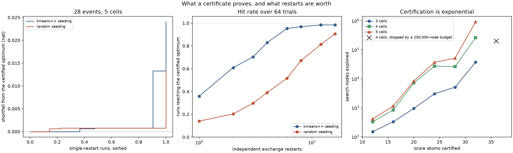

# Certificates, and what restarts are worth

This page is about **sample partitioning** (`optimize_partition`) and the one question a
partition cannot answer about itself: is this the best labeling of these rows, or only a
labeling no single relocation improves? It enters through
[Door 2](door2-mixture-densities.md) — exact component densities converted to scores — and
its subject is `certify_partition`, the bounded branch-and-bound search of
[Chapter 8](../book/ch08-d-optimality.md).

Exchange stability is a statement about a neighborhood, and the neighborhood of single-row
relocations is small. On a twenty-eight-event problem below, a single exchange restart lands
on the certified global optimum **36% of the time**. Six restarts get that to 95%, and cost
a hundredth of what proving the optimum costs. Certification is exponential and always says
so; restarts are cheap and never prove anything. The useful workflow uses both, and this
page measures the exchange rate between them.



## Problem

Two spectral templates overlap on a wavelength axis. Each event's exact score is the linear
component score, and each event carries the reference intensity as its weight — the same
Door 2 construction the [mixture-densities example](door2-mixture-densities.md) uses at full
size. Here the sample is deliberately tiny: twenty-eight events, because global
certification is exponential in the number of distinct score atoms and refuses larger
instances by name rather than appearing to hang.

Twenty-eight events is not a strange thing to have. It is a pilot run, a calibration
subsample, or one bin of a larger analysis — and it is exactly the regime where "the solver
converged" is least convincing.

```python
import numpy as np

import scorequant as sq
from examples.global_certification import certification_table

split = certification_table(28)

assert split.scores.shape == (28, 2)
assert float(split.weights.min()) > 0.0
```

## Data and preprocessing

None. The scores are the exact component scores and the weights are the reference intensity,
both consumed unchanged. Scores are not centered, here or anywhere: the origin of score space
is where an event says nothing about the parameters.

One detail matters for certification specifically. The search works on distinct
positive-weight score *atoms*, pooling identical rows into one weighted atom exactly as
`optimize_partition` does. `CertificationConfig.max_rows` counts atoms, not rows, and
defaults to 64.

## API walkthrough

### Confirming an incumbent

The search starts from an incumbent so that pruning is effective from the first node.
Supplying the labels of an exchange result therefore answers the practical question directly.
On eight rows the answer is yes, after eight nodes.

```python
from examples.global_certification import incumbent_cases

cases = {case.key: case for case in incumbent_cases()}
confirmed = cases["confirmed"]

assert confirmed.n_rows == 8
assert confirmed.status == "optimal"
assert confirmed.incumbent_was_optimal is True
assert abs(confirmed.gap) < 1e-9
assert abs(confirmed.gain) < 1e-9
assert confirmed.nodes_explored <= 16
```

### Improving an incumbent

On a ten-row weighted table the answer is no. The incumbent is exchange-stable — no single
relocation improves it — and the search finds a labeling worth **0.046845 nat** more, in 67
nodes.

```python
improved = cases["improved"]

assert improved.n_rows == 10
assert improved.status == "optimal"
assert improved.incumbent_was_optimal is False
assert abs(improved.gain - 0.046845) < 1e-6
assert improved.certified_objective > improved.incumbent_objective
assert 10 <= improved.nodes_explored <= 200
```

Both outcomes come back through the same three fields, and they are worth reading carefully.
`status` says whether the tree was exhausted. `incumbent_was_optimal` says whether the thing
you handed in survived. `gap` is `upper_bound` minus `objective`, exactly zero for a proved
optimum.

### When the budget runs out

The third possibility is that the search does not finish. It is never disguised: the status
downgrades and the certificate returns a genuine outstanding ceiling instead of a claim.

```python
capped = sq.certify_partition(
    split.scores,
    weights=split.weights,
    n_bins=5,
    config=sq.CertificationConfig(max_nodes=400),
)

assert capped.status == "budget_exhausted"
assert capped.incumbent_was_optimal is False
assert capped.gap > 0.0
assert capped.upper_bound > capped.objective
assert capped.nodes_explored <= 401
```

A `budget_exhausted` certificate is still useful. Its `upper_bound` is a real ceiling on
every labeling of the table, so `gap` bounds how much the search could still have been
leaving behind.

### What certification refuses

Two refusals are by design. The bound is Loewner monotonicity of the log determinant under
refinement, which the profiled Schur objective does not inherit, so profiled certification
is refused rather than approximated. And an oversized instance is refused by name.

```python
try:
    sq.certify_partition(
        split.scores, weights=split.weights, n_bins=5, criterion=sq.ProfiledDOptimality((0,))
    )
    raise AssertionError("the singleton-completion bound is a determinant bound")
except ValueError as error:
    assert "DOptimality only" in str(error)

try:
    sq.certify_partition(
        split.scores, weights=split.weights, n_bins=5, config=sq.CertificationConfig(max_rows=10)
    )
    raise AssertionError("global certification is exponential and says so")
except ValueError as error:
    assert "exceeding max_rows=10" in str(error)
```

### Restarts, measured against the certificate

With the optimum in hand, "did the fit find it" becomes a measurable event rather than a
hope. `DExchangeConfig` exposes both knobs that matter: `n_restarts` runs independent
exchanges and keeps the best exact objective, and `init` chooses how each restart is seeded.

```python
certificate = sq.certify_partition(split.scores, weights=split.weights, n_bins=5)


def hits(n_restarts: int, init: str, trials: int = 16) -> int:
    """Count trials whose terminal objective matches the certified optimum."""
    found = 0
    for trial in range(trials):
        run = sq.optimize_partition(
            split.scores,
            weights=split.weights,
            n_bins=5,
            config=sq.DExchangeConfig(seed=trial * 16, n_init=1, n_restarts=n_restarts, init=init),
        )
        found += run.objective > certificate.objective - 1e-9
    return found


seeded_once, seeded_eight = hits(1, "kmeans++"), hits(8, "kmeans++")
random_once = hits(1, "random")

assert certificate.status == "optimal"
assert seeded_eight >= seeded_once
assert seeded_eight >= 12
assert random_once <= seeded_eight
```

Every trial is a real fit with `n_restarts` set, not a maximum reconstructed afterwards, and
trial \(t\) uses base seed \(16t\) so that different trials never share a restart seed.

## Analysis

Full-study numbers over 64 trials per cell, regenerated by
`examples/global_certification.py` into
[`assets/global-certification.json`](assets/global-certification.json). The problem is the
one above: 28 events, 5 cells, proved optimal in 51292 nodes and 3.4 seconds.

### How the hit rate grows

| Restarts | k-means++ seeding | Random seeding | Seconds per fit, k-means++ |
| --- | --- | --- | --- |
| 1 | 0.359 | 0.141 | 0.014 |
| 2 | 0.609 | 0.203 | 0.014 |
| 3 | 0.703 | 0.297 | 0.019 |
| 4 | 0.828 | 0.391 | 0.024 |
| 6 | 0.953 | 0.516 | 0.035 |
| 8 | 0.969 | 0.672 | 0.044 |
| 12 | 0.984 | 0.812 | 0.065 |
| 16 | 0.984 | 0.906 | 0.083 |

Three things fall out, and they are different claims.

**One restart is not an answer.** A single k-means++-seeded exchange reaches the global
optimum in about a third of trials on this problem. Nothing about the run announces which
third it is in: every one of those fits is exchange-stable, monotone, and terminated
cleanly.

**Restarts buy most of the gap, cheaply.** Six restarts reach 95%, at 0.035 seconds per fit
against 3.4 seconds to prove the optimum — about a hundredfold. Past six the curve flattens:
twelve and sixteen restarts both sit at 0.984, because the remaining trials are ones where
the basin of the optimum is genuinely hard to seed into.

**Seeding is not a detail.** Random initialization reaches the optimum in 14% of
single-restart trials, and needs sixteen restarts to reach what k-means++ reaches with four.
It is also *slower* per restart — 0.55 seconds for sixteen random restarts against 0.083 for
sixteen seeded ones — because a random labeling starts far from any sensible geometry and the
exchange has to relocate its way out. A cheaper-looking initialization that costs more and
finds less is a bad trade twice over.

The misses are not catastrophic, and the certificate is what allows saying so. The
single-restart shortfalls take only four distinct values, one per local optimum reached: two
within 0.0008 nat of the optimum, one at 0.013, and one at 0.024. The worst of them costs 2.4%
of the retained information and the most common miss costs 0.08%.

### What certification costs

| Score atoms | 3 cells | 4 cells | 5 cells |
| --- | --- | --- | --- |
| 12 | 151 | 332 | 414 |
| 16 | 330 | 847 | 1152 |
| 20 | 948 | 7204 | 8361 |
| 24 | 3051 | 27129 | 36813 |
| 28 | 5117 | 26281 | 51292 |
| 32 | 37471 | 263634 | 925202 |

Nodes explored, every row proved optimal. Read the columns down: over twenty additional
atoms the tree grows by a factor of 250 at three cells, 790 at four, and 2200 at five —
roughly 1.3 to 1.5 times per event, compounding. That is what "exponential" means in
practice, and it is why the capacity guard exists rather than a progress bar.

The counts are not monotone in the number of atoms — 26281 nodes at 28 atoms and four cells
against 27129 at 24 — because a stronger incumbent prunes more of the tree. The trend is what
matters; individual instances vary.

Past the envelope the search stops honestly. At 36 atoms and four cells, with a 200000-node
budget, it returns `status="budget_exhausted"` with **0.030 nat** still outstanding.

```python
from examples.global_certification import budget_overrun

overrun = budget_overrun(max_nodes=20_000)

assert overrun.status == "budget_exhausted"
assert overrun.gap > 0.0
```

(The snippet uses a smaller budget so the page runs quickly; the committed study uses
200000 nodes and reports the 0.030 nat above.)

The practical envelope on this hardware is therefore something like: **tens of atoms and a
handful of cells** certify in seconds; the low tens of seconds buy a few more atoms; beyond
roughly 32 to 36 atoms at four or more cells, a certificate becomes a bounded search whose
answer is a ceiling rather than a proof. `CertificationConfig.max_rows` defaults to 64 and
may not exceed 512, which is a statement about the recursion depth rather than a promise that
512 is reachable.

```python
assert sq.CertificationConfig().max_rows == 64
try:
    sq.CertificationConfig(max_rows=513)
    raise AssertionError("512 is the stated ceiling")
except ValueError as error:
    assert "max_rows must be at most 512" in str(error)
```

### The workflow this suggests

Certification does not scale to a real sample and was never meant to. What it does is
calibrate the thing that does scale. Certify a small instance of the problem you care about,
measure how many restarts it takes to reach the certified optimum, and use that number on the
full sample — where the same measurement is impossible and the same optimizer is running.

```python
best_of_six = sq.optimize_partition(
    split.scores,
    weights=split.weights,
    n_bins=5,
    config=sq.DExchangeConfig(seed=0, n_init=1, n_restarts=6),
)

assert best_of_six.exchange_stable is True
assert best_of_six.objective <= certificate.objective + 1e-9
```

The inequality in that last line is the only direction that is guaranteed. A certificate is
a ceiling; a fit is a floor; the workflow is about making the distance between them small
enough to stop caring, and knowing when it is.

## Discussion

**Task:** sample partitioning throughout. `certify_partition` returns a `PartitionCertificate`
with labels and no predictor, for the same reason `PartitionResult` has none: a certificate is
a statement about the rows that were certified.

**Door:** 2. The scores come from exact component densities; nothing about certification
depends on that, and a Door 1 table of the same size would behave identically.

**Criterion and solver:** `DOptimality` only. Certification is D-only by construction, and
refuses `ProfiledDOptimality` by name — the singleton-completion bound needs Loewner
monotonicity of the log determinant under refinement, which the profiled Schur objective does
not inherit. That refusal has the same root as the missing compile bridge on the
[profiled counterexample page](ds-geometry-counterexample.md).

**What the baselines did.** No baseline appears here, and none would help. The reference is
not a naive binning but the exact optimum of the criterion itself, which is the strongest
reference available and the reason this page exists.

**The honest caveat.** Everything above is one problem family at one small size, on one
machine. The hit rates are properties of this table, not constants: a smoother problem needs
fewer restarts and a more clustered one needs more. What generalizes is the method — certify
small, measure the restart budget, spend it on the large sample — and the shape of the cost
curve, which is exponential in every direction.

The matching notebook,
[`global_certification.ipynb`](https://github.com/VitalyVorobyev/scorequant/blob/main/examples/notebooks/global_certification.ipynb),
runs the whole study, prints every table above, and re-renders the figure.
