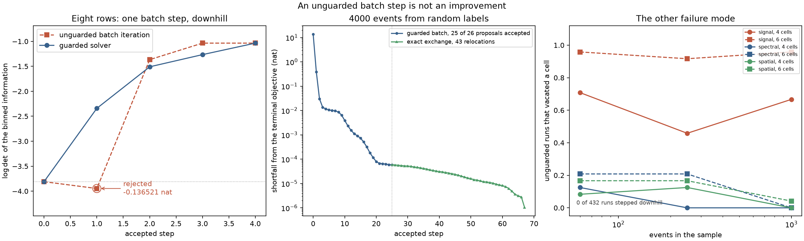

# A batch step that loses information

This page is entirely about **sample partitioning** (`optimize_partition`): no rule is
fitted and nothing is predicted. It enters through [Door 1](../three-doors.md) — a
precomputed score table, eight rows of it — and it exists to make one theoretical result
runnable. The theory is [Chapter 9](../book/ch09-mahalanobis-lloyd.md); this page is the
demonstration.

The result is a negative one. [Chapter 8](../book/ch08-d-optimality.md)'s Theorem 3 says a
terminal D partition *is* a Mahalanobis Voronoi diagram in the metric that its own retained
information induces. The obvious algorithm follows: compute the metric, send every row to
its nearest cell mean in it, recompute, repeat. One full-data pass per iteration and a
fixed point that satisfies the geometry.

It is not monotone. One such step, on a committed eight-row fixture, lowers the criterion
by **0.136521 nat** while improving the distortion it actually minimizes. Everything below
is arithmetic on those eight rows, plus a measurement of how often the same iteration fails
in the other way it can.



## Problem

Eight score rows, two parameters, three cells, equal weights. The rows and the starting
labels are a committed fixture rather than a lucky draw, so the whole demonstration is
reproducible arithmetic rather than a search.

```python
import numpy as np

import scorequant as sq
from examples.lloyd_nonmonotone import (
    COUNTEREXAMPLE_BINS,
    COUNTEREXAMPLE_LABELS,
    COUNTEREXAMPLE_SCORES,
    frozen_metric_distortion,
    frozen_metric_proposal,
    raw_log_determinant,
    unguarded_trajectory,
)

scores = COUNTEREXAMPLE_SCORES
labels = COUNTEREXAMPLE_LABELS
n_bins = COUNTEREXAMPLE_BINS
weights = np.full(scores.shape[0], 1.0 / scores.shape[0])

assert scores.shape == (8, 2)
assert sorted(set(labels.tolist())) == [0, 1, 2]
```

## Data and preprocessing

There is none. The scores are used exactly as written, and in particular they are not
centered: the origin of score space is the point at which an event says nothing about the
parameters, which is a fact about the model rather than an offset to be removed.

Two quantities are needed before anything moves. The criterion value is the log determinant
of the binned information. The metric the criterion supplies is the inverse of that same
matrix, which weights each direction by the reciprocal of the information already retained
there — so a direction the cells are measuring badly counts for a lot when deciding where a
row belongs.

```python
information = np.asarray(sq.binned_fisher_information(scores, labels, weights, n_bins=n_bins))
before = raw_log_determinant(scores, weights, labels, n_bins=n_bins)

assert abs(before - (-3.810643)) < 1e-6
assert np.allclose(information, information.T)
assert float(np.linalg.eigvalsh(information)[0]) > 0.0
```

## API walkthrough

### One batch step, downhill

Freeze that metric and send every row to its nearest cell mean in it. Four rows change
cell, and every one of them really is moving into a nearer cell — the assignment does
exactly what it was asked to do.

```python
proposal, means, metric = frozen_metric_proposal(scores, weights, labels, n_bins=n_bins)
after = raw_log_determinant(scores, weights, proposal, n_bins=n_bins)

assert int(np.sum(proposal != labels)) == 4
assert abs(after - (-3.947164)) < 1e-6
assert abs((after - before) - (-0.136521)) < 1e-6
```

The criterion got worse by 0.136521 nat. What makes this more than a curiosity is that the
step *improved* the quantity a nearest-centroid assignment is actually minimizing: the
within-cell distortion in the frozen metric.

```python
distortion_before = frozen_metric_distortion(scores, weights, labels, means, metric)
distortion_after = frozen_metric_distortion(scores, weights, proposal, means, metric)

assert distortion_after < distortion_before
assert abs(distortion_before - 13.5450) < 1e-3
assert abs(distortion_after - 9.7464) < 1e-3
assert round((distortion_before - distortion_after) / distortion_before, 2) == 0.28
```

Distortion falls 28%; the objective falls 0.14 nat. The surrogate and the criterion are not
the same function and nothing forces them to move together. The reason is one line of
convexity: the log determinant is *concave*, so its first-order expansion is an upper
bound, and improving an upper bound says nothing about the function underneath it.

```python
proposed = np.asarray(sq.binned_fisher_information(scores, proposal, weights, n_bins=n_bins))
tangent_change = float(np.trace(np.linalg.inv(information) @ proposed)) - scores.shape[1]

assert tangent_change > 0.0  # the surrogate went up
assert after - before < 0.0  # the criterion went down
assert after - before <= tangent_change  # concavity, holding as it must
assert abs(tangent_change - 8.2274) < 1e-3
```

### The guard refuses the step

`MahalanobisLloydConfig` never accepts a proposal on the strength of the surrogate. It
builds the proposal, rebuilds the exact criterion state from the proposed labels, and
adopts it only if the exact objective strictly improved. Started from the very labels that
produce the counterexample, `guard="reject"` builds the same losing proposal, measures it,
and refuses.

```python
rejected = sq.optimize_partition(
    scores,
    weights=weights,
    n_bins=n_bins,
    config=sq.MahalanobisLloydConfig(seed=0, guard="reject"),
    initial_labels=labels,
)

assert rejected.lloyd_iterations == 1  # the proposal was built
assert rejected.accepted_lloyd_steps == 0  # and rejected
assert np.array_equal(np.asarray(rejected.labels), labels)
assert rejected.exchange_stable is False
```

It also says, without being asked, that the labels it is reporting are not exchange-stable
— and refuses to compile them into a rule for exactly that reason.

```python
try:
    rejected.compile_quantizer()
    raise AssertionError("an unstable partition has no theorem behind it")
except ValueError as error:
    assert "only an exchange-stable D partition can be compiled" in str(error)
```

### The guard recovers, and climbs

The default is `guard="exchange"`, which hands the labels to the exact positive-gain
exchange engine once the batch stops improving. On this fixture the batch never improves at
all, so the exchange does all of the work — and there is plenty of it to do.

```python
rescued = sq.optimize_partition(
    scores,
    weights=weights,
    n_bins=n_bins,
    config=sq.MahalanobisLloydConfig(seed=0, guard="exchange"),
    initial_labels=labels,
)
history = np.asarray(rescued.objective_history)

assert rescued.accepted_lloyd_steps == 0
assert rescued.accepted_moves == 4
assert len(history) == 5
assert np.all(np.diff(history) > 0)
assert rescued.exchange_stable is True
assert abs((rescued.objective - float(history[0])) - 2.775392) < 1e-5
```

That is the acceptance trace: five recorded states, four accepted single-row relocations,
strictly increasing throughout. Where the batch step would have lost 0.14 nat, four exact
relocations gain **2.775392**.

One convention has to be kept straight when comparing these numbers. The solver optimizes
in Fisher-whitened coordinates, so `objective` differs from the raw log determinant by the
rule-independent constant below. Differences are the same in either convention, which is
why the differences are the numbers worth quoting.

```python
offset = float(np.linalg.slogdet(np.asarray(sq.fisher_information(scores, weights)))[1])

assert abs(offset - (-0.783062)) < 1e-6
assert abs(float(history[0]) + offset - before) < 1e-6
assert abs(rescued.objective + offset - (-1.035251)) < 1e-6
```

## Analysis

### Where the unguarded iteration goes next

The library stops after one rejected proposal, so it is worth asking what the unguarded
iteration would have done if it had been allowed to continue. `unguarded_trajectory` runs
the batch step with no guard at all, purely so that the page can measure what the guard is
protecting against.

```python
run = unguarded_trajectory(scores, weights, labels, n_bins=n_bins)

assert run.outcome == "fixed"
assert run.went_downhill is True
assert abs(run.worst_step - (-0.136521)) < 1e-6
assert abs(run.objectives[-1] - (-1.035251)) < 1e-6

# The trajectory table's "Change" column.
changes = np.diff(np.asarray(run.objectives))
assert abs(changes[0] - (-0.136521)) < 1e-6
assert abs(changes[1] - 2.580919) < 1e-6
assert abs(changes[2] - 0.330994) < 1e-6
assert abs(changes[3] - 0.0) < 1e-9
```

| Step | Raw log determinant | Change |
| --- | --- | --- |
| start | -3.810643 | — |
| 1 | -3.947164 | **-0.136521** |
| 2 | -1.366245 | +2.580919 |
| 3 | -1.035251 | +0.330994 |
| 4 | -1.035251 | fixed point |

On this fixture the unguarded iteration recovers: it dips, climbs, and lands on exactly the
labeling the guarded solver reaches. That is worth stating plainly because it is the weaker
of the two things one might hope for. Nothing made it recover, the dip is real and exactly
measured, and there is no bound on the dip's size on a larger table. The guarded path never
goes down in the first place, which is a property rather than an outcome.

### The other way the same step fails

Concavity is not the only thing that can go wrong. A frozen-metric proposal can vacate a
cell entirely, and the exact criterion state cannot represent that at all: with one of
\(K\) cells empty the binned information is that of a \(K-1\)-cell partition, singular as
soon as \(K-1\) is smaller than the score dimension plus one. The same guard catches it,
because the same rule applies — propose freely, verify exactly, accept only improvements.

This failure mode is not rare. Running the unguarded iteration from random starting labels
across three synthetic problems, three sample sizes, and two bin budgets — 432 runs
regenerated by `examples/lloyd_nonmonotone.py` into
[`assets/lloyd-nonmonotone.json`](assets/lloyd-nonmonotone.json):

| Problem | 60 events | 250 events | 1000 events |
| --- | --- | --- | --- |
| Signal plus backgrounds, 4 cells | 17 of 24 | 11 of 24 | 16 of 24 |
| Signal plus backgrounds, 6 cells | 23 of 24 | 22 of 24 | 23 of 24 |
| Spectral templates, 4 cells | 3 of 24 | 0 of 24 | 0 of 24 |
| Spectral templates, 6 cells | 5 of 24 | 5 of 24 | 0 of 24 |
| Spatial sources, 4 cells | 2 of 24 | 3 of 24 | 0 of 24 |
| Spatial sources, 6 cells | 4 of 24 | 4 of 24 | 1 of 24 |

Each entry counts the runs whose unguarded iteration vacated a cell. **139 of 432** did.
Across the same 432 runs, **not one** ever stepped downhill: the concavity failure is real
but is a small-sample, high-leverage effect, exactly as the eight-row fixture — where every
row carries an eighth of the total mass — suggests. Two different failure modes with two
different frequencies, and one rule that catches both.

A single unguarded run makes the point at page speed:

```python
from examples.lloyd_nonmonotone import ledger_split

split = ledger_split("signal_background_shape", 60)
start = np.random.default_rng(0).integers(0, 6, size=60)
vacating = unguarded_trajectory(split.scores, split.weights, start, n_bins=6)

assert vacating.outcome == "emptied"
assert vacating.went_downhill is False
```

### What the guard costs, at scale

The guard costs one exact rebuild per proposal. On 4000 events with six cells, started from
random labels so the batch phase has real work to do:

| Quantity | Guarded batch | Exact exchange |
| --- | --- | --- |
| Full-data passes | 26 batch iterations plus 44 scans | 48 scans |
| Accepted steps | 25 batch relabelings, then 43 relocations | 3781 relocations |
| Terminal objective | -0.074225 | -0.074208 |

Both are monotone and both terminate exchange-stable. The guarded batch crosses the bad
initialization in 25 full-data relabelings and then needs only single-row work to settle;
plain exchange gets there too, relocating nearly ninety times as many rows. The 26th
proposal was built, measured, and not accepted — on this problem because it was a fixed
point rather than a loss, which is the ordinary case.

## Discussion

**Task:** sample partitioning only. `PartitionResult` has no `predict_scores`, and the one
result here that *could* compile — the rescued, exchange-stable one — is left uncompiled
because the point of the page is the labeling, not a rule.

**Door:** 1 for the eight-row table, which is a bare score matrix. The larger runs draw
their scores from exact component densities, so they would equally be
[Door 2](door2-mixture-densities.md); nothing in the demonstration depends on which.

**Criterion and solvers:** `DOptimality` throughout, with `MahalanobisLloydConfig` under
both guard settings and `DExchangeConfig` for the comparison. Both pairings are ones the
dispatch table declares.

**What the baselines did.** They are not run here, and deliberately: the canonical
baselines answer "is information-aware binning worth it", which the
[solver shootout](solver-shootout.md) settles. The comparison this page needs is between
two ways of running the *same* criterion, one of which is wrong.

**What to take away.** Geometry that holds at an optimum is not a licence to iterate that
geometry, because the metric moves with the partition. The repair is not subtle and not
optional: it is one exact rebuild per proposal, and it turns a non-monotone heuristic into
a solver whose every recorded step is certified. The theory, including why a
minorize-maximize argument cannot be repaired here, is
[Chapter 9](../book/ch09-mahalanobis-lloyd.md).

The matching notebook,
[`lloyd_nonmonotone.ipynb`](https://github.com/VitalyVorobyev/scorequant/blob/main/examples/notebooks/lloyd_nonmonotone.ipynb),
runs the full ledger, prints every table above, and re-renders the figure.
