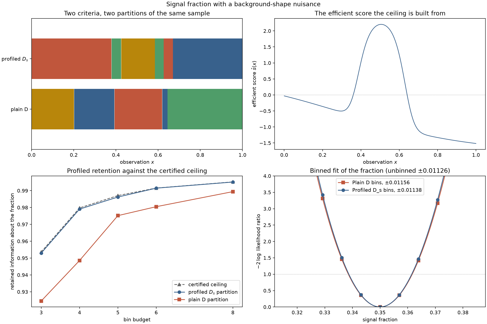

# Nuisance parameters: plain D against profiled \(D_s\)

This page is mostly about **sample partitioning** (`optimize_partition`), with **space
quantization** (`fit_quantizer`) brought in at the end to supply a held-out column. It
enters through [Door 1](../three-doors.md), a precomputed table of `(observation, score)`
events — although the scores here come from an exact component model, so
[Door 2](door2-mixture-densities.md) reaches the same table.

The measurement is a signal fraction. The obstacle is that the background shape is not
known: two background components float alongside the signal, and nobody will ever quote
them. That is the situation `ProfiledDOptimality` exists for, and this page measures what
choosing it instead of plain `DOptimality` actually buys — in retained information, in a
certified distance from the best possible answer, and in the width of the confidence
interval a binned likelihood fit finally reports.



## Problem

The reference density on \([0,1]\) is a mixture of one narrow signal peak and two
truncated-exponential backgrounds with different rates,

$$\lambda(x;c) \;=\; c_{\text{sig}}\,\phi_{\text{sig}}(x)
\;+\; c_{1}\,\phi_{1}(x) \;+\; c_{2}\,\phi_{2}(x),$$

with every \(\phi_k\) an exact normalized density and \(\sum_k c_k=1\), so
\(c_{\text{sig}}\) is literally the signal fraction. The exact score at the reference
coefficients is \(s_k(x)=\phi_k(x)/\lambda(x;c_0)\), which is what
`scores_from_components` returns. Column 0 is the interest column; columns 1 and 2 are the
nuisance columns, which is exactly the layout `ProfiledDOptimality` expects.

Two backgrounds rather than one is deliberate. With a single background the nuisance block
is one-dimensional and the profiling correction is nearly a rescaling; with two similar
exponential shapes the nuisance block is genuinely correlated with the interest direction,
and profiling has something to do.

```python
import numpy as np

import scorequant as sq
from examples.synthetic_problems import signal_background_shape

problem = signal_background_shape(
    background_rates=(1.0, 4.0), n_bins=4, sizes=(900, 300, 1500), seed=50
)
train, test = problem.train, problem.test
n_bins = problem.n_bins

assert problem.interest == (0,)
assert problem.nuisance == (1, 2)
assert train.scores.shape[1] == 3
```

## Data and preprocessing

There is no preprocessing. The generator hands over observations, exact scores, and the
reference intensity as each event's weight, and every fit below consumes those three
arrays unchanged. Scores are never centered: the origin of score space carries the
statement "this event is uninformative about this coefficient", which is a fact, not an
offset.

Both criteria are scored by the same two public functions, on whatever labels they
produce. `information_report` measures how much of the whole three-parameter Fisher matrix
survives; `profiled_information_report` Schur-completes the two background columns out and
measures how much information about the fraction survives. Neither function knows or cares
which criterion made the labels, which is what makes the comparison fair.

One number is needed before any of them: the unbinned profiled information, which is the
ceiling every retention below is measured against. It is a Schur complement of
`fisher_information` and needs no partition at all.

```python
from examples.nuisance_profiled_ds import score_labeling, unbinned_profiled_information

unbinned = unbinned_profiled_information(train.scores, train.weights, interest=problem.interest)
information = np.asarray(sq.fisher_information(train.scores, train.weights))

assert unbinned > 0.0
assert unbinned < information[0, 0]  # profiling can only remove information
```

## API walkthrough

### The same sample, two criteria

One call each. The only difference is the criterion object.

```python
config = sq.DExchangeConfig(seed=11)

plain = sq.optimize_partition(
    train.scores,
    weights=train.weights,
    n_bins=n_bins,
    criterion=sq.DOptimality(),
    config=config,
)
profiled = sq.optimize_partition(
    train.scores,
    weights=train.weights,
    n_bins=n_bins,
    criterion=sq.ProfiledDOptimality(problem.interest),
    config=config,
)

plain_score = score_labeling(
    train.scores,
    np.asarray(plain.labels),
    train.weights,
    interest=problem.interest,
    n_bins=n_bins,
)
profiled_score = score_labeling(
    train.scores,
    np.asarray(profiled.labels),
    train.weights,
    interest=problem.interest,
    n_bins=n_bins,
)

assert plain_score.full_retention > profiled_score.full_retention
assert profiled_score.profiled_retention > plain_score.profiled_retention
```

Each criterion wins on its own objective and loses on the other one. That is the whole
point, and it is worth stating in the negative: `ProfiledDOptimality` is not a better
criterion. It answers a different question, and it pays for the answer with information
about parameters you said you did not want.

The two partitions really are different objects, not two labelings of the same cells. Bin
labels carry no meaning, so the comparison has to be through which rows are placed
together, which the adjusted Rand index does.

```python
from examples.nuisance_profiled_ds import interval_runs, partition_agreement

agreement = partition_agreement(np.asarray(plain.labels), np.asarray(profiled.labels), n_bins)
assert 0.2 < agreement < 0.95
assert interval_runs(train.observations, np.asarray(profiled.labels)) >= n_bins
```

### The certified ceiling

Nothing above says how close either partition is to the best four-cell rule that exists.
`efficient_score_bound` answers that, and it answers it with a certificate rather than an
estimate. It builds the full-data efficient score \(\hat s = s_\psi - B^\ast s_\lambda\),
partitions *that* one-dimensional coordinate exactly by weighted interval dynamic
programming, and returns the resulting between-cell moment as a ceiling on the profiled
objective of **every** four-cell rule of the whole three-dimensional score space.

```python
bound = sq.efficient_score_bound(
    train.scores, interest=problem.interest, weights=train.weights, n_bins=n_bins
)
ceiling_retention = float(np.exp(bound.upper_bound - np.log(unbinned)))

assert bound.efficient_scores.shape == (train.scores.shape[0], 1)
assert bound.gap_to(profiled) >= -1e-9
assert profiled_score.profiled_retention <= ceiling_retention + 1e-9
```

The gap is reported in nats of the profiled log determinant, and `gap_to` refuses to
compare against anything but a profiled partition on the same budget, because the two
conventions would otherwise silently disagree.

### The ceiling's labels as an initializer

The labels attaining the ceiling are not only a certificate. They already solve the relaxed
upper problem, so handing them to `optimize_partition` starts profiled exchange inside the
efficient-score geometry instead of at generic k-means seeding.

```python
initialized = sq.optimize_partition(
    train.scores,
    weights=train.weights,
    n_bins=n_bins,
    criterion=sq.ProfiledDOptimality(problem.interest),
    config=config,
    initial_labels=bound.labels,
)

assert initialized.objective >= profiled.objective - 1e-12
assert bound.gap_to(initialized) <= bound.gap_to(profiled) + 1e-12
assert initialized.accepted_moves < profiled.accepted_moves
```

Supplied labels replace the seeding of the first restart only, so `n_restarts` still
explores; this is a head start, not a cage.

### A held-out column needs two different solvers

Everything so far labels one fixed sample. `PartitionResult` has no `predict_scores`, on
purpose. To say anything about events the solver never saw, you need a rule — and here the
two criteria part company for a reason that is a theorem rather than a preference.

An exchange-stable D partition compiles: [Chapter 8](../book/ch08-d-optimality.md)'s
Theorem 3 guarantees its labels *are* the training realization of a Mahalanobis
nearest-cell rule, so `compile_quantizer` hands back that rule. A profiled partition has no
such guarantee — [Chapter 10](../book/ch10-profiled-ds.md) exhibits an eight-row table
whose *globally optimal* profiled labeling puts a row in the wrong cell of the geometry it
generates — so the library refuses to invent one.

```python
try:
    initialized.compile_quantizer()
    raise AssertionError("a profiled partition has no canonical rule")
except ValueError as error:
    assert "no canonical inductive compilation" in str(error)
```

A reusable profiled rule therefore has to be *fitted* as one, which `SoftVoronoiConfig`
does; that path is [Chapter 12](../book/ch12-soft-rules.md)'s subject and the
[soft-purification](soft-purification.md) page's.

```python
source = sq.ScoreSample(train.scores, train.weights)

d_rule = sq.fit_quantizer(
    source, n_bins=n_bins, criterion=sq.DOptimality(), config=sq.DExchangeConfig(seed=11)
)
ds_rule = sq.fit_quantizer(
    source,
    n_bins=n_bins,
    criterion=sq.ProfiledDOptimality(problem.interest),
    config=sq.SoftVoronoiConfig(seed=11, n_init=4, max_steps=120, record_every=60),
)

held_out = {
    name: score_labeling(
        test.scores,
        np.asarray(rule.predict_scores(test.scores)),
        test.weights,
        interest=problem.interest,
        n_bins=n_bins,
    )
    for name, rule in (("d", d_rule), ("ds", ds_rule))
}

assert held_out["d"].full_retention > held_out["ds"].full_retention
assert held_out["ds"].profiled_retention > held_out["d"].profiled_retention
```

The crossover survives out of sample, which is the only version of it that means anything.

## Analysis

### What each criterion retains

Full-study numbers, at four bins on 4000 training and 15000 held-out events, regenerated
by `examples/nuisance_profiled_ds.py` into
[`assets/nuisance-profiled-ds.json`](assets/nuisance-profiled-ds.json).

| Labeling | Task | All three parameters | The fraction alone |
| --- | --- | --- | --- |
| Plain D | `optimize_partition` | 0.94952 | 0.94855 |
| Profiled \(D_s\), generic seeding | `optimize_partition` | 0.90115 | 0.97903 |
| Profiled \(D_s\), ceiling-initialized | `optimize_partition` | 0.90115 | 0.97903 |
| Plain D, compiled rule (held out) | `fit_quantizer` | 0.95158 | 0.95005 |
| Profiled \(D_s\), soft rule (held out) | `fit_quantizer` | 0.93238 | 0.97358 |

Read the two columns against each other. Profiling gives up **4.84 points** of overall
D-efficiency and gets **3.05 points** more information about the parameter that will be
published. Whether that is a good trade is not a mathematical question; it is a question
about what you are going to write down.

The two partitions place rows together very differently: their adjusted Rand index is
0.629, and where the plain-D partition needs five contiguous intervals of \(x\) to
describe its four cells, the profiled one needs six.

The soft profiled rule is a restricted family — nearest-center cells — so it does not reach
the free-label profiled partition's 0.97903; it reaches 0.97255 on training and 0.97358 on
the held-out split. That is the honest price of insisting on a rule.

### How close to the ceiling

The certified ceiling and the two profiled runs, over the bin budget:

| Bins | Plain D | \(D_s\), generic seeding | \(D_s\), ceiling-initialized | Certified ceiling |
| --- | --- | --- | --- | --- |
| 3 | 0.92454 | 0.95294 | 0.95294 | 0.95364 |
| 4 | 0.94855 | 0.97903 | 0.97903 | 0.97972 |
| 5 | 0.97517 | 0.98504 | 0.98620 | 0.98706 |
| 6 | 0.98047 | 0.98591 | 0.99146 | 0.99153 |
| 8 | 0.98940 | 0.99322 | 0.99509 | 0.99518 |

Every column here is information about the fraction, so the ceiling applies to all of
them. Three things fall out. Plain D never comes close: at six bins it is still below what
profiled \(D_s\) reaches with four. The ceiling is *tight enough to be useful* — the
initialized profiled partition is within 0.0007 nat of a quantity no four-cell rule can
exceed, which is 0.07% in ratio terms. And the certificate costs almost nothing: the exact
scalar dynamic program on the efficient score is a one-dimensional problem.

### What the initializer buys

| Bins | Certified gap, generic seeding | Certified gap, initialized | Relocations, generic | Relocations, initialized |
| --- | --- | --- | --- | --- |
| 3 | 0.000735 | 0.000735 | 315 | 5 |
| 4 | 0.000710 | 0.000710 | 1715 | 17 |
| 5 | 0.002041 | 0.000867 | 672 | 23 |
| 6 | 0.005682 | 0.000071 | 631 | 24 |
| 8 | 0.001971 | 0.000096 | 870 | 51 |

Two different things happen, and they are worth keeping apart. At three and four bins the
two runs converge on the same labeling, and the initializer only makes it cheaper — at four
bins, 17 accepted relocations instead of 1715, and five scans instead of 26. At five, six,
and eight bins the initializer also lands somewhere strictly better: at six bins it closes
the certified gap by a factor of **80**.

Neither effect is a guarantee, and the flat rows say so plainly. Profiled exchange is a
local search; starting it inside the geometry of the relaxed problem it is trying to beat
is a good heuristic, and the certificate is what turns "it converged" into "it is within
0.07% of unreachable".

### What the measurement actually reports

None of the above is yet a confidence interval. So bin the data and fit.

The model is the one whose Fisher information the library has been optimizing all along:
an extended Poisson likelihood over bin counts, \(\nu_b(c)=\sum_k c_k A_{bk}\), with
\(A_{bk}\) the expected yield of component \(k\) in bin \(b\). The signal fraction is
scanned; both background coefficients are profiled out at every scan point by the standard
multiplicative expectation-maximization iteration for that model. The data are the
expected counts at the reference coefficients, so this is an Asimov fit: it reports the
interval the binning implies, not the outcome of one simulated experiment.

Because the model is exactly the one behind `binned_fisher_information`, the scan is
checkable rather than merely illustrative — the half-width it finds must equal the
reciprocal square root of the binned profiled information.

```python
from examples.nuisance_profiled_ds import interval_study

study = interval_study(
    problem,
    {
        "d": ("Plain D", np.asarray(plain.labels)),
        "ds": ("Profiled D_s", np.asarray(initialized.labels)),
    },
    n_bins=n_bins,
)
rows = {row.key: row for row in study.rows}

for row in study.rows:
    assert abs(row.half_width - row.fisher_half_width) < 1e-4 * row.fisher_half_width
assert rows["ds"].half_width < rows["d"].half_width
```

At the full study size, with 4000 events in the sample:

| Binning | 68% interval half-width | Excess over the unbinned fit |
| --- | --- | --- |
| Unbinned reference | 0.011258 | — |
| Four plain-D bins | 0.011558 | 2.67% |
| Four profiled \(D_s\) bins | 0.011376 | 1.04% |

The profiled binning narrows the interval by 1.6%. Said the more informative way: binning
at all costs 2.67% of precision on the fraction under plain D and 1.04% under profiled
\(D_s\), so choosing the criterion that matches the measurement removes about **three
fifths of the price of binning** — for free, at the same four bins, by changing one
argument.

Do not inflate that. A 1.6% narrower interval is not a discovery; it is the size of effect
this trade has at four bins on this problem. At eight bins the same two profiled
retentions, 0.98940 and 0.99509, imply a narrowing of 0.29%, because by then there is very
little left to win. The reason to care is that it costs nothing, and that the certificate
tells you when there is nothing left to win.

## Discussion

**Task:** sample partitioning is the main event (`optimize_partition` under both criteria);
space quantization appears only to supply held-out numbers. **Door:** 1, precomputed score
events. **Criteria and solvers:** `DOptimality` and `ProfiledDOptimality` with the exact
positive-gain exchange, the exact scalar dynamic program inside
`efficient_score_bound`, and `SoftVoronoiConfig` for the reusable profiled rule — every
pairing one the dispatch table declares.

**What the baselines did.** The canonical baselines are not run here, and deliberately so:
the [solver shootout](solver-shootout.md) already establishes that any information-aware
binning beats a rectangular observation grid by six to thirty D-efficiency points on this
family of problems. The comparison this page needs is not naive-versus-informed but
informed-versus-informed, and the meaningful reference point is not a baseline at all — it
is the certified ceiling, which no rule of any kind can beat.

**The honest caveat.** There is no compile bridge for \(D_s\), and there will not be one.
The finite profiled optimum is not forced into the geometry it induces: an exact rational
eight-row fixture has a *globally optimal* profiled labeling that violates its own
efficient-Voronoi rule by \(8/195\). The theory is
[Chapter 10, an optimum that violates its own geometry](../book/ch10-profiled-ds.md#an-optimum-that-violates-its-own-geometry),
and that fixture gets its own page in this section, **ds-geometry-counterexample**.
Practically: a profiled partition is a fact about the rows you have, and a profiled *rule*
is a different object that must be fitted as one.

The matching notebook,
[`nuisance_profiled_ds.ipynb`](https://github.com/VitalyVorobyev/scorequant/blob/main/examples/notebooks/nuisance_profiled_ds.ipynb),
runs the full-size study, prints every table above, and re-renders the figure.
