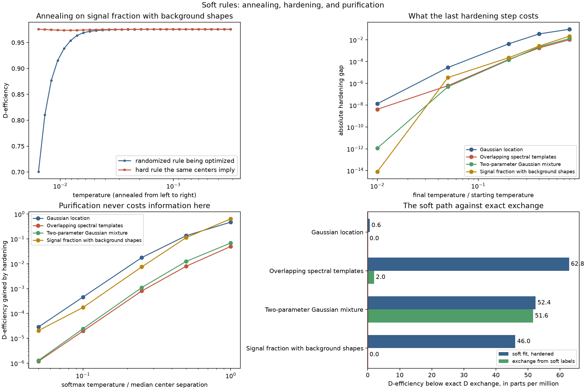

# Soft rules: annealing, the hardening gap, and purification

This page solves **space quantization** (`fit_quantizer`) through
[Door 1](../book/ch04-scores-and-doors.md), a precomputed table of `(observation, score)` events. It is
about the one solver in the library that does not optimize the hard objective at all:
`SoftVoronoiConfig`, which optimizes a *randomized* rule with gradient descent and then
hardens it.

Three questions follow from that, and this page measures all three rather than asserting
them. What does the annealing schedule actually do to the rule you deploy? What does the
final hardening step cost? And is a randomized rule ever *better* than a deterministic one
— that is, has the relaxation quietly enlarged the problem?



## Problem

On a finite sample the hard objective is piecewise constant in a rule's parameters: nudge a
cell boundary and, until some training score crosses it, every label and every cell moment
is exactly what it was. The gradient is zero almost everywhere and undefined on the
crossing surfaces, so gradient descent on the hard empirical objective is not an algorithm.

The way out is to change the rule rather than smooth the objective. A **randomized**
quantizer assigns each score a distribution over cells, \(r_b(s)\ge0\) with
\(\sum_b r_b(s)=1\); the label is drawn from it. That is a legitimate decision rule with an
ordinary label law, so it has an ordinary Fisher information,

$$W_b=\mathbb{E}\big[r_b(S)\big],\qquad
m_b=\mathbb{E}\big[r_b(S)\,S\big],\qquad
I_{\text{soft}}=\sum_b \frac{m_bm_b^\top}{W_b},$$

and `fractional_fisher_information` computes exactly that. `SoftVoronoiConfig` fits the
common-metric family \(r_b(s)=\operatorname{softmax}_b(-\lVert s-c_b\rVert^2/2\tau^2)\) in
Fisher-whitened coordinates, whose free parameters are the centers alone and whose
\(\tau\to0\) limit is the Voronoi rule those centers define. The full derivation is
[Chapter 12](../book/ch12-soft-rules.md); this page is what it looks like when measured.

## Data and preprocessing

Four problems, so that no claim below rests on one table: a one-column Gaussian location
law with a uniform reference measure, two two-column component-score laws with strongly
nonuniform weights, and the three-column signal-plus-two-backgrounds problem the
[nuisance-profiled-ds](nuisance-profiled-ds.md) page measures. No preprocessing: scores and
weights go in unchanged, and are never centered.

```python
import numpy as np

import scorequant as sq
from examples.synthetic_problems import signal_background_shape

problem = signal_background_shape(sizes=(900, 300, 1500), seed=50)
train = problem.train
n_bins = 6
source = sq.ScoreSample(train.scores, train.weights)

assert train.scores.shape[1] == 3
```

## API walkthrough

### One annealed fit, and what its trace records

The library initializes the centers with weighted k-means, sets the starting temperature to
the median nearest-center separation, and anneals geometrically to
`temperature_end_ratio` times that over `max_steps` Adam updates.

`diagnostics="full"` is the switch that makes this page possible. By default only the first
and last recorded center snapshots are re-scored with a full information report, because
each one costs an \(O(N)\) pass. Asking for every snapshot is what lets the soft objective
and the hard rule be plotted against the same schedule.

```python
rule = sq.fit_quantizer(
    source,
    n_bins=n_bins,
    criterion=sq.DOptimality(),
    config=sq.SoftVoronoiConfig(
        seed=3, initializer_restarts=4, max_steps=120, record_every=20, temperature_end_ratio=0.02
    ),
    diagnostics="full",
)
trace = rule.trace

temperatures = np.asarray(trace.temperatures)
soft = np.asarray(trace.soft_retention)
hard = np.asarray(trace.train_hard_retention)

assert trace.objective_label == "logdet_retained"
assert np.all(np.diff(temperatures) < 0)
assert soft[-1] > soft[0]
assert np.all(np.isfinite(hard))
```

Four histories come back and they measure different things. `trace.objective` is the soft
criterion value being maximized, `trace.soft_retention` is that value normalized into a
retention, `trace.temperatures` is the schedule, and `trace.gradient_norms` is the norm of
the center gradient at each recorded step. `trace.train_hard_retention` is the only one of
the five that describes the rule you will actually deploy.

That distinction is not pedantic. The soft curve climbs enormously over the schedule while
the hard curve barely moves, because at a high temperature the responsibilities are
deliberately diffuse and every cell mean is pulled toward the global mean.

```python
assert soft[0] < 0.9 < soft[-1]
assert abs(hard[-1] - hard[0]) < 0.05 * (soft[-1] - soft[0])
```

### The hardening gap

A soft fit is never the deliverable: `predict_scores` assigns each score to its nearest
center, which is the \(\tau\to0\) limit. The number that matters is the retention of *that*
rule, and `QuantizerResult.hardening_gap` reports the difference,

$$\text{hardening gap} \;=\; (\text{soft retention at the last step}) - (\text{hard
retention of the same centers}).$$

Cooling further closes it, which is what a temperature schedule is for.

```python
gaps = []
for ratio in (0.5, 0.2, 0.05):
    annealed = sq.fit_quantizer(
        source,
        n_bins=n_bins,
        criterion=sq.DOptimality(),
        config=sq.SoftVoronoiConfig(
            seed=3,
            initializer_restarts=4,
            max_steps=120,
            record_every=120,
            temperature_end_ratio=ratio,
        ),
    )
    gaps.append(float(annealed.hardening_gap))

assert all(gap < 0.0 for gap in gaps)
assert all(abs(later) < abs(earlier) for earlier, later in zip(gaps, gaps[1:]))
```

Every gap here is *negative*: the hard rule retains more than the randomized rule that
produced it. That is not a guarantee and the library does not treat it as one — it reports
the number precisely because neither sign is forced.

### Purification, measured

The negative sign above is a hint at something classical. If randomization could beat
determinism, the soft relaxation would not be a computational device but a genuinely larger
class of answers. For a population score law with no atoms it cannot: the
Dvoretzky–Wald–Wolfowitz elimination-of-randomization theorem says every randomized
\(K\)-action rule can be replaced by a deterministic one reproducing all \((W_b,m_b)\)
exactly, and every criterion in this library depends on a rule only through those moments.

That theorem is an *existence* statement about an atomless law, and a finite sample is
atomic by construction, so it does not cover the operation the library performs. What can
be done is to measure the operation. Build genuinely randomized rules at several
temperatures around the fitted centers, and compare each one against the deterministic rule
obtained by taking every row's most probable cell.

The randomized side uses `fractional_fisher_information`, which is public and validates
that the rows really are probability vectors. Turning it into the same D-efficiency number
`information_report` publishes is one line of algebra, and the way to trust that line is to
check it against a one-hot responsibility matrix, where both must agree exactly.

```python
from examples.soft_purification import (
    center_separation,
    fractional_retention,
    hard_retention,
    softmax_responsibilities,
)

labels = np.asarray(rule.predict_scores(train.scores))
one_hot = np.eye(n_bins)[labels]

assert (
    abs(
        fractional_retention(train.scores, one_hot, train.weights)
        - hard_retention(train.scores, labels, train.weights, n_bins)
    )
    < 1e-12
)
```

With the helper grounded, the probe itself is short.

```python
coordinates = np.asarray(rule.transform.apply(train.scores))
centers = np.asarray(rule.centers)
separation = center_separation(centers)

gains = []
for ratio in (1.0, 0.25):
    responsibilities = softmax_responsibilities(coordinates, centers, ratio * separation)
    randomized = fractional_retention(train.scores, responsibilities, train.weights)
    purified = hard_retention(
        train.scores, np.argmax(responsibilities, axis=1), train.weights, n_bins
    )
    gains.append(purified - randomized)

assert all(gain > 0.0 for gain in gains)
assert gains[0] > gains[1]
```

Hardening never cost information anywhere in this study, and at a temperature equal to the
median center separation it gained a great deal. Read that as evidence consistent with
purification, not as a proof of it on a finite table.

### Against exact exchange

The soft path is one of several solvers for the same criterion, so the last question is
simply whether it wins. Exact positive-gain exchange optimizes the hard objective directly;
it can also be started from the soft fit's own labels.

```python
exchange = sq.optimize_partition(
    train.scores, weights=train.weights, n_bins=n_bins, config=sq.DExchangeConfig(seed=3)
)
from_soft = sq.optimize_partition(
    train.scores,
    weights=train.weights,
    n_bins=n_bins,
    config=sq.DExchangeConfig(seed=3),
    initial_labels=labels,
)

soft_retention = float(rule.train_report.geometric_mean_retention)
assert exchange.train_report.geometric_mean_retention >= soft_retention - 1e-9
assert from_soft.train_report.geometric_mean_retention >= soft_retention - 1e-9
```

## Analysis

Full-study numbers on 4000 training events, regenerated by
`examples/soft_purification.py` into
[`assets/soft-purification.json`](assets/soft-purification.json).

### The schedule moves the soft objective, not the rule

The traced fit is the signal-plus-backgrounds problem at six cells, 300 Adam steps, cooling
to one fiftieth of the starting temperature.

| Quantity | At the first recorded step | At the last |
| --- | --- | --- |
| Randomized rule (soft retention) | 0.70076 | 0.97552 |
| Hard rule the same centers imply | 0.97557 | 0.97552 |

The soft objective climbs 27 D-efficiency points. The rule that will be deployed *falls* by
0.000046 — three hundred annealed gradient steps ended fractionally below the weighted
k-means labeling they started from. Nothing is wrong: the optimizer maximized what it was
given, which was the randomized objective at a nonzero temperature, and only in the
\(\tau\to0\) limit are the two the same function. But it is a clean demonstration of why
`train_hard_retention` exists and why watching `trace.objective` climb is not evidence of
anything you can ship.

### The hardening gap across problems and temperatures

The gap, as a function of the final temperature, on all four problems:

| \(\tau_{\text{end}}/\tau_0\) | Gaussian location | Spectral templates | Gaussian mixture | Signal + backgrounds |
| --- | --- | --- | --- | --- |
| 0.8 | -9.2e-02 | -1.0e-02 | -1.3e-02 | -2.1e-02 |
| 0.4 | -3.5e-02 | -1.8e-03 | -2.2e-03 | -2.7e-03 |
| 0.2 | -4.3e-03 | -1.6e-04 | -1.4e-04 | -2.3e-04 |
| 0.05 | -2.9e-05 | -6.2e-07 | -4.9e-07 | -3.4e-06 |
| 0.01 | -1.4e-08 | -4.2e-09 | -1.2e-12 | +8.1e-15 |

Every entry above the level of floating-point noise is negative, so on these four problems
hardening never lost information and usually gained a little. The gap closes by six or more
orders of magnitude as the final temperature falls by a factor of eighty, which is a strong
argument for the library's default `temperature_end_ratio=0.05` and against reading
anything into a fit that stopped warm. The single positive entry, \(+8\times10^{-15}\) at
the coldest schedule, is a rounding difference between two nearly identical numbers; its
sign carries no information.

```python
assert sq.SoftVoronoiConfig().temperature_end_ratio == 0.05
```

### Purification: what randomization costs

D-efficiency of a randomized rule against the deterministic rule that hardens it, at the
same centers, with the softmax temperature written as a multiple of the median
nearest-center separation:

| \(\tau\) / separation | Randomized | Purified | Gain |
| --- | --- | --- | --- |
| 1.00 | 0.33641 | 0.97552 | 0.639 |
| 0.50 | 0.86238 | 0.97552 | 0.113 |
| 0.25 | 0.96805 | 0.97552 | 0.00747 |
| 0.10 | 0.97535 | 0.97552 | 0.000174 |
| 0.05 | 0.97550 | 0.97552 | 0.0000204 |

Those are the signal-plus-backgrounds rows; the other three problems behave the same way,
with gains that are positive at every temperature and every problem, ranging from 0.64 down
to \(1.2\times10^{-6}\). At a temperature comparable to the cell spacing a randomized rule
is *catastrophically* worse — it retains a third of the information the same centers retain
when used deterministically — and the gap vanishes as the rule becomes deterministic.

This is what the classical result predicts and it is worth being precise about what has and
has not been shown. Purification says a deterministic rule matching the randomized moments
*exists* for an atomless law. The measurement above says that one specific deterministic
rule — the argmax of these particular responsibilities — is never worse here. The second
statement does not follow from the first, and on an atomic score law whether randomization
can ever strictly help is open.

### Soft against exchange

The same four problems, solved by the soft path, by exact exchange, and by exact exchange
started from the soft fit's labels:

| Problem | Cells | Soft, hardened | Exact D exchange | Exchange from soft labels |
| --- | --- | --- | --- | --- |
| Gaussian location | 4 | 0.8851049 | 0.8851055 | 0.8851055 |
| Overlapping spectral templates | 8 | 0.9968710 | 0.9969338 | 0.9969318 |
| Two-parameter Gaussian mixture | 8 | 0.9964000 | 0.9964524 | 0.9964008 |
| Signal fraction with background shapes | 6 | 0.9755215 | 0.9755675 | 0.9755675 |

Exact exchange wins on all four, by between 0.6 and 63 parts per million. Seeding exchange
with the soft labels recovers the exchange answer on two problems and lands slightly below
it on the other two, because a soft solution is a perfectly good exchange-stable point and
exchange, being a local search, stops at the first one it cannot improve.

So the soft path is not a winner on retention here, and this page will not pretend
otherwise. What it is, is the only route to two things exchange cannot do. It fits families
that are not free labelings at all, which is what makes a *rule* rather than a labeling. And
it accepts `ProfiledDOptimality`, where the exchange solver's result has no canonical
compilation — the reusable profiled rule on the
[nuisance-profiled-ds](nuisance-profiled-ds.md) page is exactly this solver, and there is no
alternative to it.

## Discussion

**Task:** space quantization (`fit_quantizer`), with `optimize_partition` appearing only as
the comparison. **Door:** 1, precomputed score events. **Criterion and solver:**
`DOptimality` with `SoftVoronoiConfig` throughout, against `DExchangeConfig` for the
comparison; `SoftVoronoiConfig` also accepts `ProfiledDOptimality`, which is where it
becomes indispensable rather than optional.

**What the baselines did.** The canonical baselines are not rerun here — the
[solver shootout](solver-shootout.md) already places soft gradient descent among the
information-aware solvers, all of which beat a rectangular observation grid by six to thirty
D-efficiency points. The comparison this page needs is internal: soft against hard, and
randomized against deterministic.

**What to take away.** Cool the schedule, and judge the fit by
`train_hard_retention` and `hardening_gap` rather than by the soft objective, which can
climb 27 points while the deployed rule goes nowhere. Expect hardening to be free or
slightly profitable, but check rather than assume — the library reports the number for that
reason. And reach for the soft path when you need a rule under a criterion that has no
compile bridge, not because it optimizes better than exact exchange, because on these
problems it does not.

The matching notebook,
[`soft_purification.ipynb`](https://github.com/VitalyVorobyev/scorequant/blob/main/examples/notebooks/soft_purification.ipynb),
runs the full-size study, prints every table above, and re-renders the figure.
