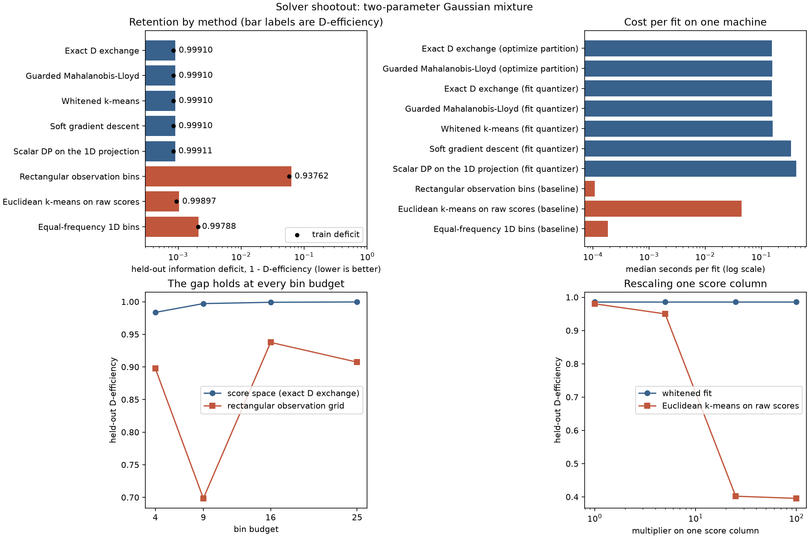

# Solver shootout: every method on one problem

This page runs **both tasks** — sample partitioning (`optimize_partition`) and space
quantization (`fit_quantizer`) — through [Door 1](../three-doors.md): a precomputed table
of `(observation, score)` events. One two-parameter problem, every solver the library
dispatches, and the three canonical baselines, scored the same way on the same held-out
split.

It answers three questions a first-time user actually has. Does binning in score space
beat binning the raw variables? Does the Fisher metric earn its keep, or would plain
k-means do? And once you are inside the information-aware family, how much does the
choice of solver matter?



## Problem

`examples.synthetic_problems.two_parameter_gaussian_mixture` places two overlapping
isotropic Gaussian bumps on a bounded square. The reference measure is uniform over the
square, each event's weight is the mixture intensity, and each event's score is the exact
linear component score \(s_k(x)=\phi_k(x)/\lambda(x;c_0)\) from `scores_from_components`.
Two components means two parameters and two score columns.

```python
import numpy as np

import scorequant as sq
from examples.baselines import (
    equal_frequency_1d,
    euclidean_kmeans_scores,
    rectangular_observation_bins,
)
from examples.synthetic_problems import separable_1d_direction, two_parameter_gaussian_mixture

problem = two_parameter_gaussian_mixture(n_bins=16, sizes=(1_200, 600, 3_000))
train, test = problem.train, problem.test
n_bins = problem.n_bins
train.observations.shape, train.scores.shape
```

One structural fact governs everything below, so it is worth checking rather than
asserting. An exact linear component score obeys \(\sum_k c_k s_k = 1\) identically: the
reference coefficients contract the score vector to one. With two components that single
identity pins the whole score cloud onto one affine line in the plane.

```python
contracted = train.scores @ np.asarray([0.5, 0.5])
assert np.allclose(contracted, 1.0)
assert np.allclose(train.scores.sum(axis=1), 2.0)
```

The Fisher information is still full rank — scores are never centered, so the origin
carries real information — but the *variation* in score space is one-dimensional. Keep
that in mind when the whitening result arrives.

## Data and preprocessing

Two methods work on a single score coordinate: the exact scalar dynamic program
(`ScalarDPConfig`) and the equal-frequency baseline. Both get the same coordinate, the
leading weighted-variance direction of the **training** scores, applied unchanged to the
held-out split. This is a plain weighted principal direction, chosen because it is
deterministic and stated openly — not because it carries any information guarantee.

```python
direction = separable_1d_direction(train.scores, train.weights)
projected_train = (train.scores @ direction)[:, None]
projected_test = (test.scores @ direction)[:, None]
projected_train.shape, projected_test.shape
```

Every method below produces integer labels, and every label array is scored by the same
public function, `information_report`, at the same bin budget. No baseline number is
hand-rolled algebra.

```python
def retention(scores: np.ndarray, labels: np.ndarray, weights: np.ndarray, bins: int) -> float:
    report = sq.information_report(scores, labels, weights, n_bins=bins)
    return float(report.geometric_mean_retention)
```

## API walkthrough

### Every applicable solver

The dispatch table in `scorequant.api` decides which configuration types each task
accepts. `optimize_partition` accepts the two partition solvers; `fit_quantizer` accepts
those two plus the three score-space solvers. Running the whole table is a loop over
configurations, not five different call shapes.

```python
source = sq.ScoreSample(train.scores, train.weights)
train_retention = {}
test_retention = {}

for name, config in [
    ("partition, exact D exchange", sq.DExchangeConfig(seed=7)),
    ("partition, guarded Mahalanobis-Lloyd", sq.MahalanobisLloydConfig(seed=7)),
]:
    partition = sq.optimize_partition(
        train.scores,
        weights=train.weights,
        n_bins=n_bins,
        criterion=sq.DOptimality(),
        config=config,
    )
    train_retention[name] = float(partition.report().geometric_mean_retention)

for name, criterion, config in [
    ("quantizer, exact D exchange", sq.DOptimality(), sq.DExchangeConfig(seed=7)),
    (
        "quantizer, guarded Mahalanobis-Lloyd",
        sq.DOptimality(),
        sq.MahalanobisLloydConfig(seed=7),
    ),
    ("quantizer, whitened k-means", sq.NormalizedTrace(), sq.KMeansConfig(seed=7, n_init=8)),
    (
        "quantizer, soft gradient descent",
        sq.DOptimality(),
        sq.SoftVoronoiConfig(seed=7, n_init=8, max_steps=120, record_every=30),
    ),
]:
    rule = sq.fit_quantizer(source, n_bins=n_bins, criterion=criterion, config=config)
    train_retention[name] = retention(
        train.scores, np.asarray(rule.predict_scores(train.scores)), train.weights, n_bins
    )
    test_retention[name] = retention(
        test.scores, np.asarray(rule.predict_scores(test.scores)), test.weights, n_bins
    )
```

`PartitionResult` has no `predict_scores`, on purpose: it labels one fixed sample and
makes no claim about any other. That is why the two partition rows below carry a training
number and no held-out number. The scalar dynamic program is the one solver that needs a
different input — a single score column — so it takes the projection and is then scored
against the **full** two-column score law, exactly like everything else.

```python
scalar = sq.fit_quantizer(
    sq.ScoreSample(projected_train, train.weights),
    n_bins=n_bins,
    criterion=sq.DOptimality(),
    config=sq.ScalarDPConfig(seed=7),
)
train_retention["quantizer, scalar DP"] = retention(
    train.scores, np.asarray(scalar.predict_scores(projected_train)), train.weights, n_bins
)
test_retention["quantizer, scalar DP"] = retention(
    test.scores, np.asarray(scalar.predict_scores(projected_test)), test.weights, n_bins
)

spread = max(test_retention.values()) - min(test_retention.values())
assert min(test_retention.values()) > 0.99
assert spread < 2e-4
```

### The three baselines

Each baseline is recomputed on each split from that split's own rows, which is deliberately
generous: the baselines' "held-out" column is really an in-sample fit, and they still lose.

```python
rectangular = rectangular_observation_bins(test.observations, total_budget=n_bins)
test_retention["baseline, rectangular observation bins"] = retention(
    test.scores, rectangular, test.weights, int(rectangular.max()) + 1
)
test_retention["baseline, Euclidean k-means on raw scores"] = retention(
    test.scores, euclidean_kmeans_scores(test.scores, n_bins, seed=7), test.weights, n_bins
)
test_retention["baseline, equal-frequency 1D bins"] = retention(
    test.scores, equal_frequency_1d(projected_test[:, 0], n_bins), test.weights, n_bins
)

best = max(value for name, value in test_retention.items() if not name.startswith("baseline"))
assert best - test_retention["baseline, rectangular observation bins"] > 0.03
assert best - test_retention["baseline, equal-frequency 1D bins"] > 5e-4
```

## Analysis

### Retention

Full-study numbers, at 16 bins on 4000 training and 15000 held-out events. The script
`examples/solver_shootout.py` regenerates them into
[`assets/solver_shootout.json`](assets/solver_shootout.json).

| Method | Task | Train D-efficiency | Held-out D-efficiency |
| --- | --- | --- | --- |
| Exact D exchange | `optimize_partition` | 0.99916 | not applicable |
| Guarded Mahalanobis-Lloyd | `optimize_partition` | 0.99916 | not applicable |
| Exact D exchange | `fit_quantizer` | 0.99916 | 0.99910 |
| Guarded Mahalanobis-Lloyd | `fit_quantizer` | 0.99916 | 0.99910 |
| Whitened k-means | `fit_quantizer` | 0.99916 | 0.99910 |
| Soft gradient descent | `fit_quantizer` | 0.99916 | 0.99910 |
| Scalar DP on the 1D projection | `fit_quantizer` | 0.99917 | 0.99911 |
| Rectangular observation bins | baseline | 0.94226 | 0.93762 |
| Euclidean k-means on raw scores | baseline | 0.99906 | 0.99897 |
| Equal-frequency 1D bins | baseline | 0.99793 | 0.99788 |

A partition result has no held-out column because it deliberately has no predictor; the
`fit_quantizer` row directly beneath it is the same solver compiled into a reusable rule,
and reproduces the same training labels.

### Cost

Timing methodology, stated so it can be argued with: one machine, one process, one warm-up
call per method to absorb JAX tracing and compilation, then the median of five timed
repetitions. Absolute seconds are hardware-specific and live in the JSON together with a
machine note; only ratios belong in prose. Ratios are relative to the fastest
information-aware fit.

| Method | Relative cost per fit |
| --- | --- |
| Exact D exchange (`optimize_partition`) | 1.00 |
| Guarded Mahalanobis-Lloyd (`optimize_partition`) | 1.01 |
| Exact D exchange (`fit_quantizer`) | 1.01 |
| Guarded Mahalanobis-Lloyd (`fit_quantizer`) | 1.01 |
| Whitened k-means | 1.03 |
| Soft gradient descent | 2.21 |
| Scalar DP on the 1D projection | 2.73 |
| Rectangular observation bins | 0.001 |
| Euclidean k-means on raw scores | 0.29 |
| Equal-frequency 1D bins | 0.001 |

This column is transcribed from the committed JSON and checked against it, so re-running the
study on different hardware means regenerating both together. Treat the numbers as orders of
magnitude, not as a benchmark.

The warm-up matters more than it sounds. Timed cold, the first exact-exchange fit takes
several times its steady-state cost, because compilation dominates a problem this small.
Reporting cold timings would have inverted the ranking. The measurement itself is one
helper, and it is the same one the script uses:

```python
from examples.solver_shootout import median_seconds

elapsed = median_seconds(
    lambda: sq.fit_quantizer(
        source, n_bins=n_bins, criterion=sq.DOptimality(), config=sq.DExchangeConfig(seed=7)
    ),
    3,
)
assert elapsed > 0.0
```

### Claim 1: score space beats observation space

At 16 bins the best information-aware fit retains 0.99911 of the Fisher information;
the equal-width 4-by-4 observation grid retains 0.93762. That is a gap of **6.1
D-efficiency points**, and it understates the case: measured as information *lost*, the
grid throws away about **70 times** as much.

The gap is not an artifact of one bin budget. Across perfect-square budgets, where the grid
always gets an exact cell count:

| Bin budget | Score space (exact D exchange) | Rectangular grid | Gap |
| --- | --- | --- | --- |
| 4 | 0.98360 | 0.89767 | 0.08594 |
| 9 | 0.99708 | 0.69843 | 0.29865 |
| 16 | 0.99910 | 0.93762 | 0.06148 |
| 25 | 0.99961 | 0.90734 | 0.09227 |

The grid is not merely worse; it is *erratically* worse. Its 9-bin value is far below its
4-bin value, because a 3-by-3 grid straddles the mixture's symmetry axis and produces cells
whose score means nearly coincide. Adding cells to an observation-space grid does not
reliably add information, which is the practical reason to stop tuning grids.

### Claim 2: the metric matters, but you have to look where it can act

On this problem the raw-score Euclidean baseline loses only 0.00012 to the whitened k-means
fit — a small gap that would be easy to over-read. It is worth saying plainly what that gap is
*not*: it is not the whitening. Re-run the same weighted k-means with whitening turned off
and the answer barely moves.

```python
whitening = {}
for label, whiten in (("whitened", True), ("unwhitened", False)):
    rule = sq.fit_quantizer(
        source,
        n_bins=n_bins,
        criterion=sq.NormalizedTrace(),
        config=sq.KMeansConfig(seed=7, n_init=8, whiten=whiten),
    )
    whitening[label] = retention(
        test.scores, np.asarray(rule.predict_scores(test.scores)), test.weights, n_bins
    )

assert abs(whitening["whitened"] - whitening["unwhitened"]) < 1e-3
```

In the full study those two differ by 0.0000082. The reason is the identity checked at the
top of this page: with two components the score cloud lies on a line, every linear map acts
along that line as a single uniform rescaling, and k-means partitions are invariant to a
uniform rescaling. The metric has nowhere to act. What remains of the baseline's deficit is
the reference measure it ignores — `euclidean_kmeans_scores` is unweighted, and these
events carry very unequal weights.

To see whitening actually do something you need a score cloud with more than one direction
of variation. Three components give one: the rescaling probe in the study runs
`signal_background_shape` with two background shapes, multiplies the signal score column by
a constant, and refits. Multiplying a score column is a reparameterization — a change of
units for one coefficient — and D-efficiency is invariant under it, so any movement is a
method reacting to units it should not be able to see.

| Multiplier on one score column | Whitened fit | Euclidean k-means on raw scores |
| --- | --- | --- |
| 1 | 0.98581 | 0.98029 |
| 5 | 0.98581 | 0.94995 |
| 25 | 0.98581 | 0.40206 |
| 100 | 0.98581 | 0.39556 |

The whitened fit is invariant to twelve decimal places. The Euclidean baseline falls off a
cliff: at a factor of 25 it retains 0.402, having lost 58 D-efficiency points to a change
of units alone. Whitening is what buys that invariance, and the shootout's own problem
simply has too little geometry to show it.

### Claim 3: among information-aware solvers, the differences are small

All five information-aware fits land within **0.000011** of each other on the held-out
split, and within 0.0000051 on training. On this problem the choice of solver is not a retention
decision. It is a decision about cost and about guarantees:

- **Exact D exchange** accepts only strictly improving single-row relocations, so it
  terminates exchange-stable and its D result compiles into a Mahalanobis rule.
- **Guarded Mahalanobis-Lloyd** proposes whole relabelings and accepts one only when the
  exactly rebuilt objective improves. It matches exchange here at essentially the same cost.
- **Whitened k-means** optimizes the normalized trace, not the determinant. It agrees here
  because the two criteria nearly coincide on this geometry; on a problem where they
  diverge it would not.
- **Soft gradient descent** optimizes a relaxed objective and hardens at the end. It costs
  about twice as much and buys nothing measurable here.
- **The scalar dynamic program** is the only *globally* exact solver in the table, but only
  on the one coordinate it is given. It reaches the best held-out number by a hair, which is
  what you would expect when the score law has a single direction of variation and the
  projection recovers it.

Small differences on one problem are not evidence that these solvers are interchangeable.
They are evidence that this problem does not separate them. The counterexample pages show
problems that do.

## Discussion

**Tasks:** both. `optimize_partition` labels the fixed training sample; `fit_quantizer`
returns a reusable rule with genuine held-out numbers. **Door:** 1, precomputed score
events, though the scores come from an exact component model, so [Door
2](door2-mixture-densities.md) would reach the same table. **Criteria and solvers:**
`DOptimality` with exact exchange, guarded Mahalanobis-Lloyd, soft gradient descent, and
the scalar dynamic program; `NormalizedTrace` with whitened k-means. Every pairing is the
one the dispatch table declares.

**What the baselines did.** Rectangular observation bins lost 6.1 D-efficiency points and
behaved non-monotonically in the bin budget. Euclidean k-means on raw scores was close here
and catastrophic as soon as one score column changed units. Equal-frequency bins on the
stated projection lost 0.0012 — the best of the three, and a reminder that a sensible
one-dimensional summary is a real competitor when the score law is nearly one-dimensional.

**What to take away.** Choose score space over observation space; that is the decision worth
6 to 30 points here. Then choose a solver for its cost and its guarantees, and use a problem
that actually separates solvers before believing a solver comparison. Chapter 14,
[Diagnostics and choosing a method](../book/ch14-choosing-a-method.md), is the general
version of this advice.

The matching notebook,
[`solver_shootout.ipynb`](https://github.com/VitalyVorobyev/scorequant/blob/main/examples/notebooks/solver_shootout.ipynb),
runs the full-size study, prints both tables, and re-renders the figure.
