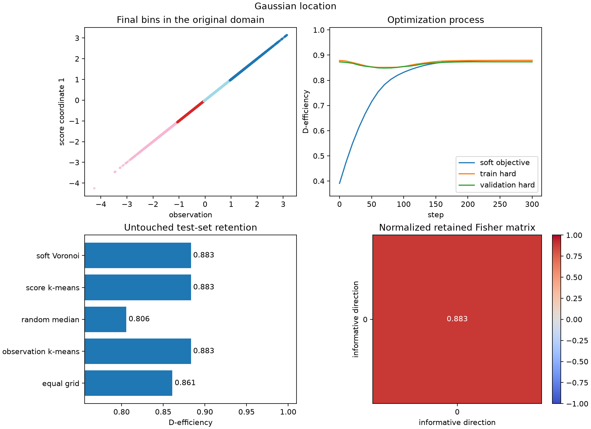
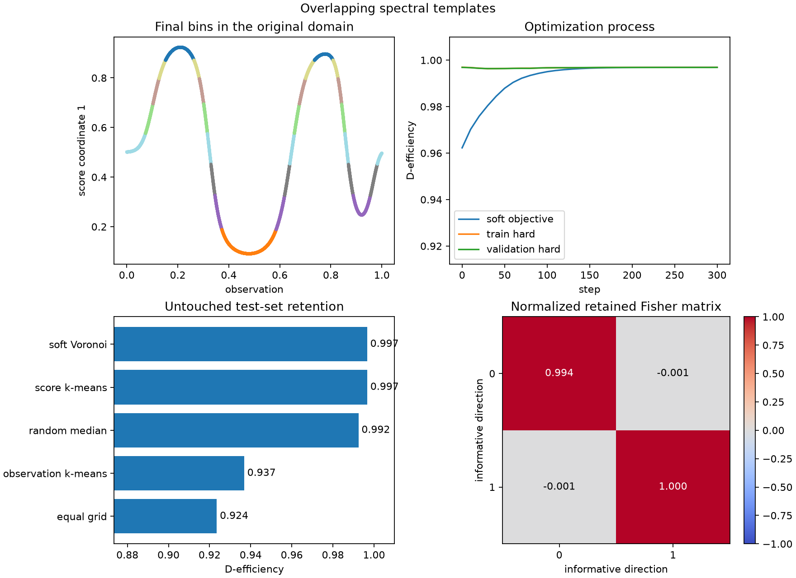

# Evidence gallery

All figures and JSON summaries in this directory are generated by the matching
scripts in `examples/`. The executable notebooks teach the corresponding
workflow step by step: they inspect the data, expose score construction, call
the public ScoreQuant API directly, and interpret the resulting diagnostics.

```bash
JAX_ENABLE_X64=1 MPLBACKEND=Agg uv run python -m examples.gaussian_location
JAX_ENABLE_X64=1 MPLBACKEND=Agg uv run python -m examples.spectral_templates
JAX_ENABLE_X64=1 MPLBACKEND=Agg uv run python -m examples.spatial_sources
JAX_ENABLE_X64=1 MPLBACKEND=Agg \
  uv run python -m examples.cell_population \
  --fixture examples/data/flowcyt_fixture.npz --quick
```

The headline metric is D-efficiency: the geometric mean of the retained-information eigenvalues. It lies between zero and one when the Fisher invariants hold.

## Gaussian location



## Overlapping spectral templates



## Overlapping spatial sources


These examples establish exact information identities and empirical held-out behavior; they do not claim that either optimizer finds a globally optimal partition.

## FlowCyt cell-population quantification

[](../usecases/cellpopulation.md)

The [complete FlowCyt study](../usecases/cellpopulation.md) uses all 30 patients,
600,000 real cells, a frozen ten-patient test cohort, competing partitions, a
downstream mixture likelihood, uncertainty checks, and machine-readable
evidence. The command above is its small integration path; the page documents
the reproducible all-patient run.
