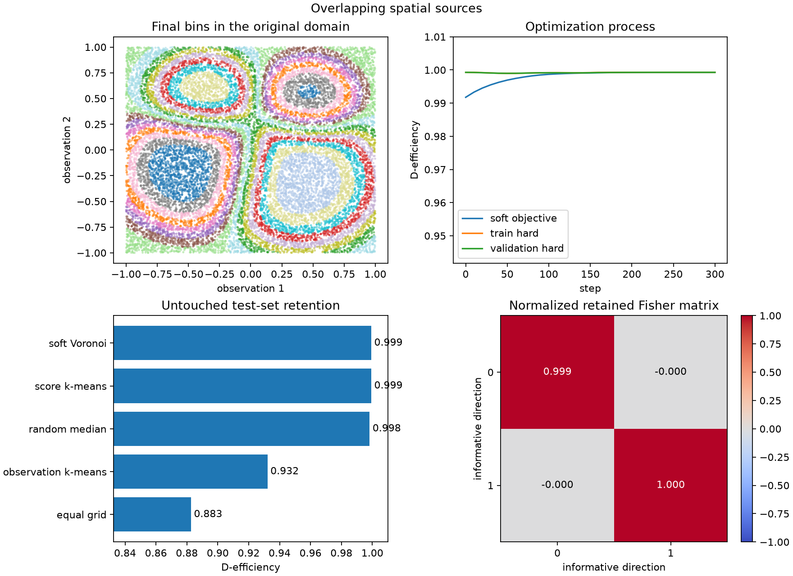

# Information-preserving binning

FisherBin learns a finite hard partition of continuous or high-dimensional events while preserving information about parameters of a linear intensity model.

[Start with the user workflow](user-workflow.md){ .md-button .md-button--primary }

<div class="grid cards" markdown>

-   **Explicit statistical workflow**

    Keep physical variables, component values, scores, and hard bins visible as separate representations.

-   **JAX-first optimization**

    Use deterministic weighted score k-means or differentiable D-optimal soft Voronoi fitting.

-   **Evidence, not optimizer claims**

    Inspect held-out Fisher retention, occupancies, center motion, and final hardened partitions.

</div>

## The workflow

```text
physical variables X
    -- component model --> component values Phi
    -- reference theta0 --> scores Phi / (Phi @ theta0)
    -- FisherBin --> hard bin labels
```

Start directly from evaluated components when that is what your simulation or template pipeline already produces:

```python
import fisherbin as fb

result = fb.fit_components(
    Phi,
    coefficients=theta0,
    weights=mc_weights,
    n_bins=16,
    config=fb.SoftVoronoiConfig(seed=7),
)

print(result.report())
data_bins = result.predict(Phi_data)
```

Components need not be normalized probability densities. FisherBin requires a finite, strictly positive reference intensity and finite nonnegative integration weights.

## See the complete process

The committed [synthetic evidence gallery](gallery/index.md) exercises analytic identities, nonlinear score mappings, importance weights, independent validation and test samples, and competing baselines.

[](gallery/index.md)

!!! note "Pre-release project"

    FisherBin is currently installed from source. The mathematical v0.1 core is feature-complete; packaging and release hardening are tracked in the [roadmap](roadmap.md).
