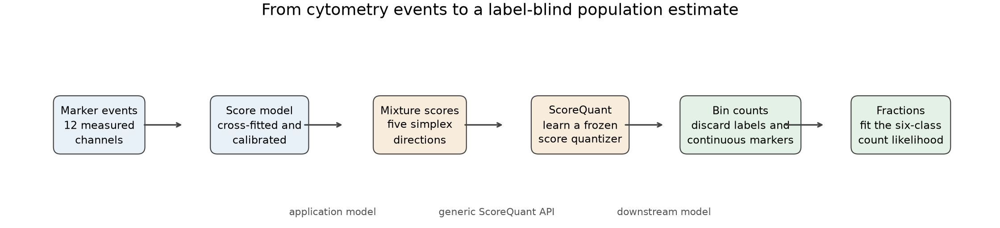

# Learning information-aware cell gates: a complete FlowCyt study

Flow cytometry produces a cloud of cells, not a row of population fractions.
Each cell carries twelve marker measurements. The practical result, however, is
often only six numbers: the proportions of T cells, B cells, monocytes, mast
cells, hematopoietic stem/progenitor cells (HSPCs), and everything else.

This study asks a deliberately hard compression question:

> Can we replace 200,000 held-out twelve-dimensional test events with a few
> integer bin counts and still recover the population fractions?

The answer on the frozen FlowCyt experiment is yes. The operating point uses
eight learned hard bins. The tables below report both local information
retention and held-out fraction error; neither quantity substitutes for the
other. Eight bins retain 98.5% of the supplied-score surrogate information and
reach 0.00193 macro RMSE. The selected unbinned classifier-ratio baseline is
slightly better at 0.00173 RMSE, as the exact-information ordering suggests it
should be when ratio bias is sufficiently controlled.

Those numbers are not fixture results. They come from all 30 FlowCyt patients,
with 20 reference patients and ten frozen held-out test patients. The reproducible
bounded study contains 600,000 real cells sampled from 21,254,866 upstream
events.



The important boundary is visible in the figure. The classifier is not
ScoreQuant. Neither is the downstream mixture likelihood. ScoreQuant receives
score vectors and returns a frozen score quantizer. This makes the example useful
for cytometry users and for developers adapting the same API to another domain.

## Result at a glance

The predeclared acceptance gate required learned score partitions to beat the
median random score partition in held-out D-efficiency for at least five of six
bin counts, and to be no worse than marker k-means in population RMSE for at
least four. The result was 6/6 for both tests.

| Bins | Soft Voronoi RMSE | Score k-means RMSE | Marker k-means RMSE | Random RMSE median | Supplied-score D-efficiency | Random D-efficiency median |
| ---: | ---: | ---: | ---: | ---: | ---: | ---: |
| 5 | 0.03000 | 0.00501 | 0.04186 | 0.02998 | 0.391 | 0.001 |
| 8 | **0.00193** | 0.00209 | 0.02889 | 0.01870 | 0.985 | 0.016 |
| 10 | 0.00202 | 0.00206 | 0.04758 | 0.01147 | 0.990 | 0.060 |
| 15 | 0.00204 | 0.00217 | 0.03332 | 0.01046 | 0.995 | 0.099 |
| 20 | 0.00212 | 0.00243 | 0.03220 | 0.00730 | 0.996 | 0.260 |
| 30 | 0.00260 | 0.00280 | 0.04990 | 0.00697 | **0.998** | 0.324 |

Eight bins are the useful knee in this experiment and give the lowest learned-
partition RMSE. Five bins are an explicit negative result, but not an optimizer
mystery: they cannot identify five independent fractions from a fixed-total
count likelihood. Thirty bins preserve more local supplied-score information
but contain an empty held-out bin and do not improve the downstream estimate.
More bins are not automatically better, and the hard result—not the soft
objective—is what matters.

At the eight-bin operating point, the exact finite-D exchange scan runs on the
same 27,607-row partition subset as the quantizer fits. It starts from the
trace-k-means labels and accepts no relocation: the best remaining log-determinant
gain is (-7.15\times10^{-8}), so the initial partition is already exchange-stable
at the configured tolerance. Its supplied-score D-efficiency is 0.98705 on the
partition rows and 0.98528 after compiling and evaluating the rule on held-out
events. Compilation reproduces every positive-weight training label, has zero
geometry gap, and reaches 0.00209 downstream RMSE. This is evidence of agreement
between two solver paths on this dataset, not evidence that exact exchange
improves the initialization.


The lower-left panel shows each estimated target fraction against the expert
fraction for the ten test patients. The lower-right panel does not project the
five-dimensional partition. It shows
\(P(k\mid B_j,\theta_0)\), the reference population composition of each of the
eight gates. This projection-free summary explains the statistical role of each
gate.

The complete numeric record is committed as
[`cell_population.json`](assets/cell_population.json). It includes every
method/bin result, per-patient estimates, calibration and shift diagnostics,
reference-only closure and uncertainty coverage, run settings, timings, source
provenance, and acceptance decisions.

## Why five bins fail

There are six population fractions constrained to sum to one, so the downstream
fit has five free parameters. A patient contributes five bin counts when
`n_bins=5`, but their sum is the fixed number of sampled cells. Only four bin
frequencies are independent. In general, a fixed-total mixture of \(K\) classes
needs at least \(K\) bins:

\[
B-1\geq K-1.
\]

The reference-only audit confirms the algebra for every seed from 2026 through
2035. Both score k-means and soft Voronoi have conditional information rank four
at five bins and rank five at six and eight bins. The five-bin D-efficiency for
the fixed-total likelihood is therefore zero, even though the unconditioned
supplied-score diagnostic in the table is nonzero.

This discrepancy is informative. An intensity or Poisson model can use the
total event rate and therefore has \(B\) count coordinates. The FlowCyt patient
fit conditions on 20,000 cells and has only \(B-1\). Approximate classifier
scores also have a nonzero mean, so an unconditioned second moment can appear to
contain a fifth direction that the downstream likelihood cannot use.

The machine evidence includes a direct null-space witness: two different
six-class compositions produce the same five bin probabilities to
\(5.6\times10^{-17}\). For six and eight bins the template contrasts are full
rank, with condition numbers about 4.83 and 5.43 respectively.

## The real data behind the experiment

FlowCyt contains 30 bone-marrow samples and five expert-annotated target
populations. We retain the remaining cells as a sixth `other` component. This
matters: removing `other` using the expert labels would leak the answer before
inference starts.

The public corpus stores every patient/population pair in a separate FCS file.
Downloading and unpacking the complete archive is unnecessary for this bounded
study. The acquisition command reads FCS metadata first, allocates exactly
20,000 cells per patient in proportion to the upstream component totals, and
then range-reads 16 deterministic strata within every nonempty component.
Largest-remainder allocation keeps every sampled population fraction within
\(3.4\times10^{-5}\) of its full-file fraction.

This is component-stratified acquisition, not label-blind acquisition. The
expert component totals determine how many rows are read so that rare classes
are not lost to coarse network sampling. Once the 600,000-row dataset is
assembled, test labels are absent from classifier fitting, score calibration,
partition learning, template estimation, and mixture inference. They return
only for the final comparison with expert fractions.


The shaded bars are the ten test patients. The target composition varies
substantially: T cells range from roughly 2.7% to 17.3% across the cohort, while
mast cells are often below 0.02%. This is one reason an ordinary random row split
would be misleading. The split must happen by patient.

The exact frozen patient split is:

- reference: 1, 2, 3, 4, 7, 10, 12, 13, 14, 16, 17, 18, 19, 21, 22, 24, 25, 26, 27, 29;
- test: 5, 6, 8, 9, 11, 15, 20, 23, 28, 30.

Within the reference cohort, five four-patient folds produce out-of-fold score
predictions. Calibration selection is nested: each outer patient fold is absent
from classifier fitting and from the inner out-of-fold calibration used to
score it. Disjoint deterministic row roles are then used for partition fitting,
validation diagnostics, and bin-template estimation. Validation rows never
affect gradients, stopping, or checkpoint selection.

## From class probabilities to mixture scores

Let \(p_k(x)\) be the marker density of population \(k\). A patient is modelled
as

\[
p(x\mid\theta)=\sum_{k=1}^{6}\theta_k p_k(x),
\qquad \theta_k\geq 0,
\qquad \sum_k\theta_k=1.
\]

Only five fractions are independent. Taking `other` as the reference component
gives five score directions at the reference composition \(\theta_0\):

\[
s_a(x)=
\frac{p_a(x)-p_6(x)}
     {\sum_k\theta_{0k}p_k(x)},
\qquad a=1,\ldots,5.
\]

The component densities are not known analytically. We estimate their ratios
with a patient-cross-fitted `HistGradientBoostingClassifier`. If \(q_k(x)\) is
a class posterior learned with training prior \(\pi_k\), then

\[
\frac{p_k(x)}{p_{\text{train}}(x)}=\frac{q_k(x)}{\pi_k}.
\]

The common event density cancels in the score formula. This is the key bridge:
we can build the five statistical score coordinates without fitting a general
twelve-dimensional density model.

The audit compares three strategies fixed before the test cohort is evaluated:
raw posteriors with declared uniform training priors, raw posteriors with priors
estimated from inner out-of-fold marginals, and temperature-scaled posteriors
with the same prior-consistency correction. It selects the smallest outer-fold
macro RMSE, preferring the simpler strategy when values differ by at most
\(10^{-6}\). Candidate errors, the selected strategy, priors, temperature, and
ratio-normalization residuals are stored in the JSON evidence.

After selection, one final classifier is trained on all reference patients and
used by the frozen held-out evaluation. The nested audit selected raw
posteriors with the declared uniform training priors: outer-fold macro RMSE was
0.00298, compared with 0.00308 for OOF prior correction and 0.01122 for the
temperature-scaled candidate. The final temperature is therefore 1.0. Fisher
information does not make an upstream score estimator correct.

### What the normalization residual means

For exact density ratios, every component ratio integrates to one under the
declared training mixture. The selected raw-declared strategy misses that
closure by as much as 0.217, and its weighted mean-score norm at \(\theta_0\) is
0.178. This is model bias, not compression loss.

The OOF-prior strategies force the six component integrals to one on the same
reference sample, to numerical precision. That does not make their ratios
correct point by point: the raw OOF-prior candidate still has mean-score norm
0.162 and slightly worse nested RMSE, while temperature scaling increases the
norm to 1.225 and performs much worse. Marginal normalization is therefore a
useful closure check, but not a sufficient calibration criterion.

No ratio is silently renormalized after selection. The evidence records all
three residuals, reference-fold errors, and patient-level dispersion. The test
cohort is not used to choose among them.

## The ScoreQuant API boundary

This use case learns a reusable rule from externally estimated scores, so it
uses an explicit `ScoreSample` and `fit_quantizer`:

```python
quantizer = sq.fit_quantizer(
    sq.ScoreSample(reference_scores[partition_rows], integration_weights),
    validation=sq.ScoreSample(reference_scores[validation_rows], validation_weights),
    n_bins=8,
    criterion=sq.DOptimality(),
    config=sq.SoftVoronoiConfig(
        seed=2026,
        n_init=4,
        max_steps=160,
    ),
)

test_bins = quantizer.predict_scores(test_scores)
held_out_report = quantizer.evaluate_scores(test_scores)
print(held_out_report.geometric_mean_retention)
```

There are five practical API rules hidden in this short block:

1. Pass raw statistical scores. Do not center them; the origin has statistical
   meaning.
2. Use nonnegative measure weights to define the reference integration measure.
   Here they give every patient equal influence within a class and reproduce
   \(\theta_0\) across classes.
3. Treat validation as a diagnostic. ScoreQuant deliberately does not use it to
   choose centers.
4. Freeze the result and call `predict_scores` on scores in the same parameter order.
5. Inspect both information and occupancy. A high D-efficiency does not prevent
   a held-out bin from becoming empty.

The same algebra is available through `MixturePosteriorTransform` and
`ClassifierScore`. Classifier training, calibration, and the downstream
likelihood remain application code. Evaluated linear components first pass
through `scores_from_components`; callable components use `ObservationSample`
with `LinearComponentScore`.

## Turning hard labels into fractions

After the partition is frozen, an independent labelled reference subset
estimates the template matrix

\[
A_{jk}=P(B_j\mid k).
\]

Templates are averaged per patient so that a large sample cannot dominate the
cohort. A Jeffreys pseudocount of \(1/2\) prevents an unseen class/bin pair from
making the likelihood exactly zero. For test-patient bin counts \(n_j\), the
downstream likelihood is

\[
\log L(\theta)=
\sum_j n_j\log\left(\sum_k A_{jk}\theta_k\right).
\]

Its local identifiability is controlled by the five template contrasts
\(A_{:a}-A_{:\mathrm{other}}\). Their singular values, effective rank, and
condition number are now part of the evidence. This check happens before a
covariance or convergence flag is interpreted.

The example solves this concave simplex problem with deterministic EM. Local
covariance is computed in the five free directions and lifted back to all six
fractions. Singular directions are projected with a pseudoinverse; no ridge is
allowed to invent information. Every reported patient likelihood converged; the
slowest learned-partition fit required 1,198 iterations at five bins.

This likelihood is application code under `examples/cell_population/`. It
consumes the generic hard labels but is not part of ScoreQuant's public API.

### Reference-only pseudo-patients

The downstream pipeline is also tested without consulting the frozen test
cohort. Eleven compositions cover \(\theta_0\) and a factor-of-two change in
each target fraction. For each composition, twenty deterministic pseudo-patients
of 20,000 events are sampled only from reference validation rows.

At six bins, all 220 pseudo-patient likelihoods converge. Soft Voronoi reaches
0.000657 macro RMSE and score k-means reaches 0.000728. At eight bins the values
are 0.000754 and 0.000865. The unbinned classifier-ratio fit reaches 0.000972.
The binned results can be better here because their templates are independently
estimated from labelled reference rows; this is low-dimensional recalibration
of an approximate ratio model, not information created by discarding events.

Five-bin score k-means reaches 0.00231 but remains non-identifiable. Five-bin
soft Voronoi reaches 0.00733 and none of its 220 fits meets the convergence
tolerance. Even with exact expected bin counts, the five-bin soft likelihood
does not converge for any of the eleven compositions. With six or eight bins,
all expected-count fits converge and recover the known fractions to about
\(10^{-7}\).

## What was compared

Every hard method receives the same number of outputs and feeds the same
downstream likelihood:

| Representation | Question it answers |
| --- | --- |
| Finite D assignment on the 27,607-row partition sample | How much can exact positive-gain relocation improve a fixed table, and does verified compilation reproduce its labels? |
| Score k-means | How strong is weighted clustering after Fisher whitening? |
| Soft Voronoi | Does direct differentiable D-optimal fitting help? |
| Marker k-means | Is ordinary clustering in twelve-marker space sufficient? |
| One leading score direction | How much is lost by a one-dimensional gate variable? |
| Two marker-PCA coordinates on a grid | How does naive axis-aligned gating behave? |
| Random score Voronoi, 20 repeats | Is score space alone enough without learning centers? |
| Unbinned classifier-ratio likelihood | What happens when the selected approximate density ratios are trusted directly? |

The exact finite-D solver is now part of the normative 600k workflow, but its
optimization table contains the same bounded 27,607 partition rows used by the
other learned rules—not all 600,000 events. Its candidate scan is vectorized
over rows and bins, while accepted moves still trigger a fresh exact scan. The
result is therefore a full-workflow finite-assignment reference, not a claim of
an all-corpus optimizer or a streaming implementation.

The near equality of score k-means and soft Voronoi is a useful result. The
Fisher transform already supplies a strong geometry, and weighted k-means is a
competitive default here. The study supports score-aware partitioning; it does
not establish universal superiority of one optimizer.

An unbinned classifier-ratio baseline can be worse than a learned hard
partition when its ratio model is biased. This would not mean that discarding
data creates information. With
exact component likelihood ratios, unbinned Fisher information is the upper
bound and the matrix ordering is verified in the synthetic oracle test. Here
the unbinned fit trusts estimated classifier ratios directly, while the binned
pipeline re-estimates \(P(B_j\mid k)\) from independent labelled reference rows.
Hard bins can therefore act as a low-dimensional recalibration and regularizer
for an imperfect ratio model. Supplied-score retention measures local compression loss
for the estimated scores; estimator bias and downstream RMSE are different
quantities.

After the reference-only calibration audit, the frozen test result now follows
the expected direction: the unbinned classifier-ratio macro RMSE is 0.00173,
compared with 0.00193 for eight hard bins. The earlier reversal was caused by
the chosen temperature-scaled ratio model, not by a failure of the information
inequality.

## Per-population behavior

At the eight-bin operating point, the held-out RMSE values are:

| Population | RMSE |
| --- | ---: |
| T cells | 0.00429 |
| B cells | 0.00112 |
| Monocytes | 0.00160 |
| Mast cells | 0.00028 |
| HSPCs | 0.00235 |
| Other | 0.00640 |

The small absolute mast-cell RMSE needs care. The true mast fraction is usually
only a few events in a 20,000-cell patient sample, and some patients have none
after proportional rounding. Absolute RMSE therefore looks small even when the
relative error is poor. This is a general warning for rare mixture components:
one summary number cannot replace the per-class table.

## Uncertainty: validate the interior, mark the boundary

The uncertainty check now uses the frozen 30-bin reference templates and no
test patients. For each of two known compositions, it draws 1,000 multinomial
pseudoexperiments of 20,000 events and compares empirical variation with the
local Fisher covariance.


At the reference composition, T cells, B cells, monocytes, HSPCs, and `other`
remain interior. Their local-to-empirical standard-error ratios range from
1.018 to 1.041, and their nominal 68% Wald coverages range from 0.684 to 0.713.
That is the regime where the quadratic calculation has a clear interpretation.

Mast cells are different. Their reference fraction is 0.00019—only 3.8 expected
events in a 20,000-cell patient—and 44.2% of constrained estimates lie within
half an event of the simplex boundary. The audit labels this result
`boundary_dominated` and publishes neither a standard-error ratio nor Wald
coverage for it. There is no artificial denominator.

As a controlled check, the second composition raises the mast fraction to
0.005. Boundary hits disappear; the local-to-empirical error ratio is 1.012 and
coverage is 0.689. This isolates the failure as a boundary problem rather than
a general covariance bug. A profile-likelihood or another constrained interval
construction is still required when inference on the reference-like mast
fraction matters.

## Patient shift and empty bins

The test cohort is measurably shifted even though it comes from the same
benchmark. After the frozen reference transform, the median absolute marker
shift is 0.123 robust-scale units, the maximum channel shift is 0.225, and the
mean score shift has Euclidean norm 0.809.

At 30 bins, one learned bin is empty on the held-out cohort even though
D-efficiency remains above 0.998. That combination is possible because
the remaining occupied bins preserve the five informative score directions.
Operationally, however, empty bins are a warning about transport and template
stability. This is another reason to prefer eight bins for this dataset.

## Reproduce the research

Install the complete development environment:

```bash
uv sync --all-extras --all-groups --locked
```

For the fast CI-scale integration workflow, use the committed 34,554-cell
fixture:

```bash
JAX_ENABLE_X64=1 MPLBACKEND=Agg \
  uv run python -m examples.cell_population \
  --fixture examples/data/flowcyt_fixture.npz \
  --quick
```

For the complete all-patient study, first build the ignored 600,000-cell sample
directly from the public FCS files:

```bash
uv run python -m examples.cell_population \
  --download-sample flowcyt-results/flowcyt_sample_20000.npz \
  --max-per-patient 20000 \
  --sample-blocks 16 \
  --download-workers 12
```

Then run the frozen research settings:

```bash
JAX_ENABLE_X64=1 MPLBACKEND=Agg \
  uv run python -m examples.cell_population \
  --fixture flowcyt-results/flowcyt_sample_20000.npz \
  --full \
  --bins 5 8 10 15 20 30 \
  --output-dir docs/usecases/assets
```

The full CSV corpus can be reconstructed directly from the public component
FCS files. The downloader streams each component instead of materializing a
patient in memory, writes atomically, and records every row count and SHA-256:

```bash
uv run python -m examples.cell_population \
  --download-full-csv-dir flowcyt-results/data_original \
  --download-chunk-rows 200000 \
  --download-workers 6
```

This produced all 30 `Case_*.csv` files: 21,254,866 events and about 3.9 GB of
CSV data. The files remain ignored local evidence. The separate chunked audit
then reads every row, compares per-patient class fractions and marker moments
with the frozen 600k sample, and makes no fit, calibration, or tuning decision:

```bash
uv run python -m examples.cell_population \
  --data-dir flowcyt-results/data_original \
  --transport-audit-sample flowcyt-results/flowcyt_sample_20000.npz \
  --transport-audit-output flowcyt-results/full_transport_audit.json \
  --transport-audit-chunksize 200000
```

The completed audit found a maximum absolute patient/class fraction error of
\(3.39\times10^{-5}\) and a maximum absolute standardized marker-mean error of
0.0296. Thus the deterministic component-stratified sample is exceptionally
accurate for class composition and within 0.03 pooled standard deviations for
every audited patient/marker mean. This validates the bounded measure as a
transport approximation for the reported low-order moments; it does **not**
prove that every nonlinear score-space boundary or rare tail is transported
equally well.


The committed [JSON evidence](assets/flowcyt_transport_audit.json) contains the
SHA-256 and row count of every full-corpus CSV, the bounded-sample digest, and
all patient-level diagnostics. The compact [CSV table](assets/flowcyt_transport_audit.csv)
supports independent plotting. These are stress-audit results, not another
opportunity to choose the frozen patient split, classifier, calibration, bin
count, or quantizer.

The connection to the theory is precise. The information identity in
[Chapter 3](../book/03-hard-label-information.md) depends on cell masses and
score first moments, while the empirical-consistency statement in
[Chapter 10](../book/10-randomized-consistency.md) requires control of the
underlying score law. Class fractions and marker means are useful necessary
transport diagnostics, but they are not sufficient statistics for arbitrary
learned score providers. The held-out score-information, occupancy, geometry,
and downstream checks above remain indispensable.

The bounded sample SHA-256 is
`a08e9bf183fe32b913e155d413eeacfdb65c7f99017a42e69c4b91bdde20d987`.
The JSON evidence records elapsed time, peak resident memory, and per-stage
timings for the exact run that generated the figures.

The [FlowCyt paper](https://proceedings.mlr.press/v248/bini24a.html) describes
the benchmark and expert populations. The data and derived samples are licensed
under [CC BY-NC-SA 4.0](https://creativecommons.org/licenses/by-nc-sa/4.0/),
separately from ScoreQuant's MIT-licensed code. The generated manifest records
the source URLs, file totals, sampling settings, and digest.

## What this study establishes

On this frozen all-patient sample, a handful of score-aware hard gates preserve
the parameter information that ordinary marker-space partitions miss. Eight
bins are already enough for a practical result. The study also shows the limits
clearly: score calibration matters, fixed-total identifiability must be checked
separately from an intensity-information objective, high information retention
does not prevent empty transported bins, and local Fisher errors fail for
fractions on the simplex boundary.

That combination is the useful result. ScoreQuant is not a classifier and not a
mixture fitter. It is the compression layer between them, and this case shows
how to build, test, diagnose, and reproduce that layer on real data.
