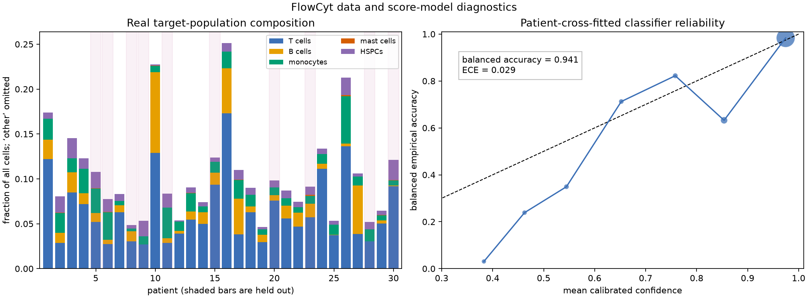
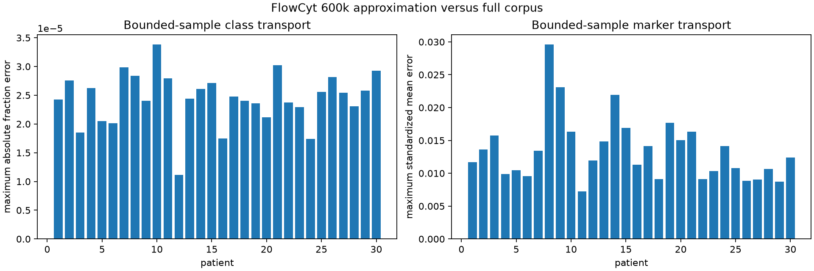

# Problem and data

FlowCyt contains 30 bone-marrow samples and five expert-annotated target
populations. We retain the remaining cells as a sixth `other` component. This
matters: removing `other` using the expert labels would leak the answer before
inference starts.

## Licence and provenance

The [FlowCyt paper](https://proceedings.mlr.press/v248/bini24a.html) describes
the benchmark and its expert populations. The data, and therefore every sample
derived from them in this study — the committed CI fixture included — are
licensed under
[CC BY-NC-SA 4.0](https://creativecommons.org/licenses/by-nc-sa/4.0/),
separately from ScoreQuant's MIT-licensed code. Copyright belongs to Lorenzo
Bini, Fatemeh Nassajian Mojarrad, Margarita Liarou, Thomas Matthes, and Stéphane
Marchand-Maillet. The upstream corpus lives in the
[FlowCyt classification benchmark repository](https://github.com/VIPER-GENEVA/FlowCyt-Classification-Benchmark).

Every generated manifest records the source URLs, file totals, sampling
settings, and digest, so a derived sample can always be traced back to the
licensed original. Redistribution of the derived samples carries the same
non-commercial share-alike terms as the source.

## The bounded 600,000-cell sample

The public corpus stores every patient/population pair in a separate FCS file.
Downloading and unpacking the complete archive is unnecessary for this bounded
study. The acquisition command reads FCS metadata first, allocates exactly
20,000 cells per patient in proportion to the upstream component totals, and
then range-reads 16 deterministic strata within every nonempty component.
Largest-remainder allocation keeps every sampled population fraction within
\(3.4\times10^{-5}\) of its full-file fraction.

```bash
uv run python -m examples.cell_population \
  --download-sample flowcyt-results/flowcyt_sample_20000.npz \
  --max-per-patient 20000 \
  --sample-blocks 16 \
  --download-workers 12
```

This is component-stratified acquisition, not label-blind acquisition. The
expert component totals determine how many rows are read so that rare classes
are not lost to coarse network sampling. Once the 600,000-row dataset is
assembled, test labels are absent from classifier fitting, score calibration,
partition learning, template estimation, and mixture inference. They return only
for the final comparison with expert fractions.

The bounded sample SHA-256 is
`a08e9bf183fe32b913e155d413eeacfdb65c7f99017a42e69c4b91bdde20d987`. The file
itself is deliberately not committed; the digest and the command above are what
make it reproducible.

## The frozen patient split



The shaded bars are the ten test patients. The target composition varies
substantially: T cells range from roughly 2.7% to 17.3% across the cohort, while
mast cells are often below 0.02%. This is one reason an ordinary random row split
would be misleading. The split must happen by patient.

The exact frozen patient split is:

- reference: 1, 2, 3, 4, 7, 10, 12, 13, 14, 16, 17, 18, 19, 21, 22, 24, 25, 26, 27, 29;
- test: 5, 6, 8, 9, 11, 15, 20, 23, 28, 30.

Within the reference cohort, five four-patient folds produce out-of-fold score
predictions. Calibration selection is nested: each outer patient fold is absent
from classifier fitting and from the inner out-of-fold calibration used to score
it. Disjoint deterministic row roles are then used for partition fitting,
validation diagnostics, and bin-template estimation. Validation rows never
affect gradients, stopping, or checkpoint selection.

The reference composition \(\theta_0\) that the integration measure reproduces
is dominated by `other`, which is what makes the five target directions worth
learning at all:

| Population | Reference fraction |
| --- | ---: |
| T cells | 0.0711 |
| B cells | 0.0196 |
| Monocytes | 0.0150 |
| Mast cells | 0.00019 |
| HSPCs | 0.00812 |
| Other | 0.8860 |

## The committed CI fixture

Continuous integration never touches the 600,000-cell sample. It uses a small
committed fixture, `examples/data/flowcyt_fixture.npz`, with 34,554 cells drawn
from the same 30 patients under the same frozen split. Its licence and
provenance notes live beside it in `examples/data/README.md`, and its sampling
details are recorded in `examples/data/flowcyt_fixture.json`.

```bash
JAX_ENABLE_X64=1 MPLBACKEND=Agg \
  uv run python -m examples.cell_population \
  --fixture examples/data/flowcyt_fixture.npz \
  --quick
```

The fixture is class-balanced rather than composition-faithful, so its reference
composition is near-uniform across the five target populations. Fixture-scale
numbers therefore demonstrate that the code path runs and that the qualitative
conclusions hold; they are not the study's quantitative result. Every published
number in this section states which of the two scales it came from.

## The full-corpus transport audit

The full CSV corpus can be reconstructed directly from the public component FCS
files. The downloader streams each component instead of materializing a patient
in memory, writes atomically, and records every row count and SHA-256:

```bash
uv run python -m examples.cell_population \
  --download-full-csv-dir flowcyt-results/data_original \
  --download-chunk-rows 200000 \
  --download-workers 6
```

This produced all 30 `Case_*.csv` files: 21,254,866 events and about 3.9 GB of
CSV data. The files remain ignored local evidence. The separate chunked audit
then reads every row, compares per-patient class fractions and marker moments
with the frozen 600k sample, and makes no fit, calibration, or tuning decision:

```bash
uv run python -m examples.cell_population \
  --data-dir flowcyt-results/data_original \
  --transport-audit-sample flowcyt-results/flowcyt_sample_20000.npz \
  --transport-audit-output flowcyt-results/full_transport_audit.json \
  --transport-audit-chunksize 200000
```

The completed audit found a maximum absolute patient/class fraction error of
\(3.39\times10^{-5}\) and a maximum absolute standardized marker-mean error of
0.0296. Thus the deterministic component-stratified sample is exceptionally
accurate for class composition and within 0.03 pooled standard deviations for
every audited patient/marker mean. This validates the bounded measure as a
transport approximation for the reported low-order moments; it does **not** prove
that every nonlinear score-space boundary or rare tail is transported equally
well.



```python
import json
from pathlib import Path

transport = json.loads(Path("docs/usecases/assets/flowcyt_transport_audit.json").read_text())

assert transport["full_corpus"]["rows"] == 21_254_866
assert len(transport["full_corpus"]["files"]) == 30
assert round(transport["maximum_absolute_class_fraction_error"], 7) == 3.39e-05
assert round(transport["maximum_absolute_standardized_feature_mean_error"], 4) == 0.0296
assert "no tuning" in transport["purpose"]
```

The committed [JSON evidence](../assets/flowcyt_transport_audit.json) contains
the SHA-256 and row count of every full-corpus CSV, the bounded-sample digest,
and all patient-level diagnostics. The compact
[CSV table](../assets/flowcyt_transport_audit.csv) supports independent
plotting. These are stress-audit results, not another opportunity to choose the
frozen patient split, classifier, calibration, bin count, or quantizer.

The connection to the theory is precise. The information identity in
[Chapter 5](../../book/ch05-information-after-binning.md) depends on cell masses
and score first moments, while the empirical-consistency statement in
[Chapter 12](../../book/ch12-soft-rules.md) requires control of the underlying
score law. Class fractions and marker means are useful necessary transport
diagnostics, but they are not sufficient statistics for arbitrary learned score
providers. The held-out score-information, occupancy, geometry, and downstream
checks in [Quantization at scale](quantization.md) remain indispensable.
