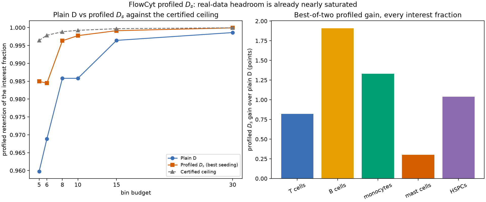

# One fraction of interest: profiled \(D_s\) on real data

The rest of this study treats all five target fractions symmetrically. A
reported measurement rarely does. A bone-marrow report is usually written around
one number — most often the CD34+ progenitor burden — with the rest of the
composition present, unknown, and never quoted. That is a nuisance-parameter
problem, and it is what `ProfiledDOptimality` exists for.

This page runs that criterion against plain `DOptimality` on exactly the rows,
weights, and splits the [quantization page](quantization.md) uses, adds the
certified efficient-score ceiling, and then asks the only question that settles
the matter: does the interval the measurement actually reports get narrower?

The short answer on FlowCyt is **no**, and the certificate explains why. Plain D
already retains 98.6% of the profiled information about the HSPC fraction, the
certified ceiling for eight bins is 99.9%, and the free-label profiled partition
that captures four fifths of that 1.3-point headroom does so by discarding 95
points of information about every other fraction — and cannot be turned into a
rule at all.

The synthetic counterpart of this page,
[nuisance-profiled-ds](../../examples/nuisance-profiled-ds.md), is the case where
the same criterion pays off. Reading the two together is the point: profiled
\(D_s\) is not a better criterion, it is a different question, and whether it is
worth asking depends on how much headroom plain D has left.



The left panel is the [bin-budget sweep](#the-bin-budget-and-where-the-initializer-earns-its-place):
plain D, the better of the two profiled seedings, and the certified ceiling, all against the
bin budget on the 600,000-cell sample. The gap between the orange and grey lines is
exactly the headroom table below quotes; it narrows from five bins to thirty. The right
panel is the [all-five-fractions sweep](#all-five-fractions): the best-of-two profiled gain
over plain D, in points, for every declared fraction of interest at the eight-bin operating
point.

## The nuisance parameterization is derived, not invented

Nothing here is a new model. The [score page](scores.md) already established
that the study's score matrix carries one column per free fraction of

\[
\theta=(\theta_{\mathrm T},\theta_{\mathrm B},\theta_{\text{mono}},
\theta_{\text{mast}},\theta_{\text{HSPC}}),
\qquad
\theta_{\text{other}}=1-\textstyle\sum_a\theta_a,
\]

with

\[
s_a(x)=\frac{p_a(x)-p_{\text{other}}(x)}{\sum_k\theta_{0k}p_k(x)}
=\frac{\partial}{\partial\theta_a}\log p(x\mid\theta)\bigg|_{\theta_0}.
\]

So column \(a\) *is* the score of fraction \(a\), and the sixth component is
already eliminated by the sum constraint. Declaring column \(a\) of interest and
the remaining four columns nuisance therefore means exactly one thing: report
\(\theta_a\) with the rest of the marrow composition floating. The Schur
complement `ProfiledDOptimality` maximizes is the same Schur complement the
downstream profile likelihood forms. No reparameterization, no invented
calibration nuisance, no approximation.

Two consequences follow immediately, and both are constraints rather than
choices.

- `efficient_score_bound` certifies a ceiling for **one** interest column,
  because a multivariate efficient score would need a multivariate D solver and
  the result would be a heuristic rather than a certificate. So the study
  declares one fraction at a time and sweeps all five.
- The headline fraction is fixed before any result is looked at. HSPCs are
  chosen on clinical grounds — the CD34+ compartment is the standard readout —
  and because their reference fraction, 0.00812, is far enough from zero that
  the downstream local covariance stays interpretable. Mast cells, at 0.00019,
  are the fraction the [uncertainty audit](quantization.md#uncertainty-validate-the-interior-mark-the-boundary)
  already flags as boundary dominated. The full five-fraction sweep is published
  below so nobody has to take the choice on trust.

## Two criteria, the same 27,607 rows

Both criteria see the same weighted score table: the 27,607-row partition
subsample, weighted to reproduce \(\theta_0\) with equal patient influence
inside each class. The bin budget is the study's operating point, eight.

<!-- snippet: skip -->
```python
interest = (4,)  # HSPCs
config = sq.DExchangeConfig(seed=2026, n_init=8)

plain = sq.optimize_partition(
    partition_scores,
    weights=partition_weights,
    n_bins=8,
    criterion=sq.DOptimality(),
    config=config,
)
bound = sq.efficient_score_bound(
    partition_scores,
    interest=interest,
    weights=partition_weights,
    n_bins=8,
    config=sq.ScalarDPConfig(seed=2026, max_rows=27_607),
)
profiled = sq.optimize_partition(
    partition_scores,
    weights=partition_weights,
    n_bins=8,
    criterion=sq.ProfiledDOptimality(interest),
    config=config,
    initial_labels=bound.labels,
)
```

All numbers in the tables below come from the **600,000-cell bounded sample**
unless a row says otherwise, and are asserted from
[`flowcyt_profiled_ds.json`](../assets/flowcyt_profiled_ds.json) at the end of
this page.

| Labeling | HSPC fraction alone | All five fractions | Relocations | Scans | Seconds |
| --- | ---: | ---: | ---: | ---: | ---: |
| Plain D | 0.98580 | 0.98705 | 0 | 1 | 1.7 |
| Profiled \(D_s\), generic seeding | **0.99631** | 0.03716 | 11,894 | 1,144 | 10.1 |
| Profiled \(D_s\), ceiling-initialized | 0.99618 | 0.00196 | 1,155 | 331 | 2.8 |
| Certified ceiling | 0.99883 | — | — | — | 18.0 |

Read the two retention columns against each other. Profiling gains **1.05
points** of information about the HSPC fraction and gives up **95.0 points**
about the other four. That is not a defect of the optimizer; it is the criterion
doing exactly what it was asked to do. The whole five-dimensional score space is
collapsed onto the one efficient-score direction that carries HSPC information,
and the rest of the geometry stops mattering.

Whether that trade is acceptable depends entirely on what will be written down.
On FlowCyt it is not, for a reason the next two sections make precise.

## The certified ceiling says there is almost nothing to win

`efficient_score_bound` builds the full-data efficient score
\(\hat s=s_\psi-B^\ast s_\lambda\), partitions that one-dimensional coordinate
exactly by weighted interval dynamic programming, and returns the resulting
between-cell moment as a ceiling on the profiled objective of *every* eight-cell
rule of the whole five-dimensional score space. It is a certificate, not an
estimate.

At eight bins the ceiling is 0.99883. Plain D is already at 0.98580, so the
entire headroom any criterion could ever recover is **1.30 points**. The
generically seeded profiled partition captures 80.7% of it and stops 0.00252 nats
short of the ceiling; the ceiling-initialized run stops 0.00265 nats short.

That is the number that turns "profiling did not help much" into a statement.
Without the certificate, a 1.05-point gain would be an invitation to tune the
solver harder. With it, the remaining 0.25 points is provably all that is left,
and it is worth less than the 95 points being spent to chase it.

The certificate is cheap relative to the study but not free: the exact scalar
dynamic program is quadratic in the number of distinct efficient-score atoms, so
on 27,607 rows it cost seconds rather than milliseconds. The
[budget sweep](#the-bin-budget-and-where-the-initializer-earns-its-place) below
records what it cost at each budget.

## The bin budget, and where the initializer earns its place

| Bins | Plain D | \(D_s\), generic seeding | \(D_s\), ceiling-initialized | Certified ceiling | Plain D, all five | \(D_s\), all five |
| ---: | ---: | ---: | ---: | ---: | ---: | ---: |
| 5 | 0.95979 | 0.98494 | 0.98241 | 0.99642 | 0.10714 | 0.00076 |
| 6 | 0.96887 | 0.98445 | 0.98352 | 0.99786 | 0.98161 | 0.00031 |
| 8 | 0.98580 | 0.99631 | 0.99618 | 0.99883 | 0.98705 | 0.00196 |
| 10 | 0.98580 | 0.99701 | 0.99775 | 0.99923 | 0.99190 | 0.00774 |
| 15 | 0.99642 | 0.99708 | 0.99913 | 0.99969 | 0.99635 | 0.00413 |
| 30 | 0.99861 | 0.99941 | 0.99992 | 0.99993 | 0.99908 | 0.01008 |

Taking the better of the two profiled runs at each budget, the gain over plain D
is 2.51 points at five bins, 1.56 at six, 1.05 at eight, 1.19 at ten, 0.27 at
fifteen, and 0.13 at thirty. It is not monotone — both sides are local searches,
and eight bins happens to be a good budget for plain D and ten a slightly worse
one — but the direction is unambiguous, and so is the reason: the certified
headroom itself shrinks from 3.66 points at five bins to 0.13 at thirty, and by
thirty bins the profiled run has taken 99% of everything that was ever there.

Two caveats belong with this table rather than after it. The five-bin row is
below the identifiability threshold, so its 2.51-point gain is a gain in a
quantity the patient likelihood cannot use — the [next
section](#what-the-fixed-total-likelihood-actually-sees) makes that precise. And
the last two columns do not shrink at all: the profiled partition is catastrophic
for the other four fractions at every single budget.

The ceiling's own interval labels are also an initializer, and what they buy
splits cleanly in two:

| Bins | Certified gap, generic | Certified gap, initialized | Relocations, generic | Relocations, initialized | Scans, generic | Scans, initialized |
| ---: | ---: | ---: | ---: | ---: | ---: | ---: |
| 5 | 0.011588 | 0.014155 | 28,537 | 394 | 3,483 | 73 |
| 6 | 0.013533 | 0.014478 | 14,521 | 506 | 2,653 | 224 |
| 8 | 0.002524 | 0.002652 | 11,894 | 1,155 | 1,144 | 331 |
| 10 | 0.002229 | 0.001485 | 10,610 | 799 | 177 | 425 |
| 15 | 0.002616 | 0.000562 | 650 | 709 | 30 | 383 |
| 30 | 0.000527 | 0.000015 | 408 | 1,295 | 56 | 470 |

At small budgets the initializer buys **cost**: at five bins, 394 accepted
relocations instead of 28,537, and 73 scans instead of 3,483, for a slightly
worse optimum. At ten bins and above it buys **quality**: at thirty bins it
closes the certified gap by a factor of 34.

Neither effect is a guarantee, and the table says so plainly in both directions.
Supplied labels replace the seeding of the first restart only, so the other
restarts still explore — and at five, six, and eight bins one of those generic
restarts lands slightly higher than the ceiling's own labels do. Profiled
exchange is a local search; starting it inside the geometry of the relaxed
problem it is trying to beat is a good heuristic, not a theorem, and the
certificate is what makes the difference legible.

Wall clock is machine dependent, but its shape is not: the exact scalar dynamic
program is quadratic in the number of distinct efficient-score atoms, so on
27,607 rows it cost roughly 16 seconds at eight bins and 58 at thirty on the
machine that produced this evidence.

## What the fixed-total likelihood actually sees

`profiled_information_report` follows the library's uncentered intensity
convention. The FlowCyt patient fit conditions on 20,000 cells, so it sees the
fixed-total information instead — the same subtraction of the global mean score
that makes [five bins fail](quantization.md#why-five-bins-fail) for the joint
fit. Profiling does not change that, and the two conventions do not always
agree.

| Bins | \(D_s\) profiled retention (intensity) | Plain D, fixed total | \(D_s\), fixed total | Retained fixed-total rank |
| ---: | ---: | ---: | ---: | ---: |
| 5 | 0.98241 | **0.00000** | **0.00000** | 4 |
| 6 | 0.98352 | 0.96887 | 0.96854 | 5 |
| 8 | 0.99618 | 0.98580 | 0.99618 | 5 |
| 30 | 0.99992 | 0.99861 | 0.99992 | 5 |

Two things worth stating out loud.

At five bins the intensity-convention column reads 0.98241 while the quantity the
measurement depends on is exactly zero. Profiling changes what you optimize, not
what you can identify: with only four independent bin frequencies, no amount of
nuisance projection makes the HSPC fraction estimable while the other four
fractions float. That is the same wall the joint fit hits, arriving from a
different direction.

At six bins the criterion improves the intensity-convention profiled retention
from 0.96887 to 0.98352 and, in the fixed-total convention that matters, moves
it from 0.96887 to 0.96854 — very slightly *down*, while its all-five retention
collapses to 0.00031. Six bins is a budget at which profiled \(D_s\) is strictly
harmful on this problem. From eight bins upward the two conventions agree to
five decimals, and the criterion's gain is real but small.

## The rule you could actually deploy

Everything above labels one fixed sample. `PartitionResult` has no
`predict_scores`, on purpose. An exchange-stable plain-D partition compiles —
[Chapter 8](../../book/ch08-d-optimality.md)'s Theorem 3 guarantees its labels
*are* the training realization of a Mahalanobis nearest-cell rule. A profiled
partition has no such guarantee, and
[Chapter 10](../../book/ch10-profiled-ds.md) exhibits a finite table whose
globally optimal profiled labeling violates the geometry it induces, so the
library refuses to invent one. A reusable profiled rule has to be *fitted* as
one, which `SoftVoronoiConfig` does.

| Rule | Held out, HSPC alone | Held out, all five | Occupied bins | HSPC RMSE | Mean 68% half-width | Seconds |
| --- | ---: | ---: | ---: | ---: | ---: | ---: |
| Plain D, compiled exchange | 0.98782 | 0.98528 | 8 | 0.002751 | 0.000882 | 0.6 |
| Profiled \(D_s\), soft Voronoi | 0.98665 | 0.97186 | 8 | 0.002340 | 0.000885 | 0.9 |

This is the table the page exists for, and it reports a flat result.

The half-width is the number the measurement would quote: the local 68% interval
for the HSPC fraction with the other five floating, averaged over the ten
held-out patients. The profiled rule's interval is **0.33% wider**, not narrower.
Its realized HSPC RMSE is lower by \(4.1\times10^{-4}\), but ten patients cannot
resolve a difference that small, and the RMSE is a property of the re-estimated
template model rather than of the score-space objective — the two are different
quantities, exactly as the
[unbinned-baseline discussion](quantization.md#what-was-compared) explains.

The reason the deployable rule shows none of the free-label partition's 1.05-point
gain is structural: the soft profiled fit is restricted to nearest-center cells,
and inside that family the profiled optimum is essentially the plain-D optimum.
Its held-out all-five retention drops by 1.34 points for nothing. The
free-label profiled partition that does capture the gain is not a rule and never
will be.

Note that the held-out columns use the empirical test measure — one unit of
weight per cell — while the training columns use the \(\theta_0\) integration
measure. They are different measures, which is why a held-out number can exceed
its training counterpart without anything being wrong.

## All five fractions

The comparison does not depend on the fraction chosen. Plain D is the same
partition in every row; only the declared interest column changes.

| Interest fraction | \(\theta_0\) | Plain D | \(D_s\), generic | \(D_s\), initialized | Ceiling | Gain | \(D_s\), all five |
| --- | ---: | ---: | ---: | ---: | ---: | ---: | ---: |
| T cells | 0.07113 | 0.99044 | 0.99889 | 0.99865 | 0.99958 | +0.00821 | 0.00511 |
| B cells | 0.01959 | 0.97842 | 0.99812 | 0.99752 | 0.99920 | +0.01910 | 0.00690 |
| Monocytes | 0.01498 | 0.98479 | 0.99844 | 0.99811 | 0.99949 | +0.01332 | 0.00216 |
| Mast cells | 0.00019 | 0.99600 | 0.99881 | 0.99902 | 0.99989 | +0.00303 | 0.00002 |
| HSPCs | 0.00812 | 0.98580 | 0.99631 | 0.99618 | 0.99883 | +0.01038 | 0.00196 |

Every fraction tells the same story with different numbers. The largest gain is
B cells at 1.9 points, and even there plain D starts within 2.1 points of a
ceiling it cannot exceed, and the profiled partition pays 98 points of all-five
retention for the improvement. No fraction is an exception.

## Does it hold at CI scale?

The frozen 34,554-cell fixture runs the same study in about 100 seconds and
reproduces every qualitative conclusion, with the caveat the
[data page](data.md#the-committed-ci-fixture) states: the fixture is
class-balanced, so its reference composition is near-uniform and its absolute
retentions are higher throughout.

| Quantity, HSPCs at 8 bins | Frozen CI fixture (34,554 cells) | Bounded sample (600,000 cells) |
| --- | ---: | ---: |
| Plain D, profiled retention | 0.99539 | 0.98580 |
| \(D_s\) best of two seedings | 0.99924 | 0.99631 |
| Certified ceiling | 0.99967 | 0.99883 |
| Profiled gain | +0.00385 | +0.01051 |
| All-five retention given up | 0.87705 | 0.94989 |
| Half-width ratio, \(D_s\) rule over D rule | 1.0177 | 1.0033 |

Both scales agree that the profiled criterion improves its own objective, that
the improvement is bounded by a certificate that is already nearly saturated,
that the cost in all-five retention is severe, and that the deployable profiled
rule's downstream interval is *wider* rather than narrower.

## Every number on this page

```python
import json
from pathlib import Path

evidence = json.loads(Path("docs/usecases/assets/flowcyt_profiled_ds.json").read_text())
sample, fixture = evidence["sample_scale"], evidence["fixture_scale"]

# Provenance: the two scales, and the digest of the bounded sample.
assert sample["run"]["provenance"]["scale"] == "600,000-cell bounded sample"
assert sample["run"]["rows"]["total"] == 600_000
assert sample["run"]["rows"]["partition"] == 27_607
assert (
    sample["run"]["provenance"]["sample_sha256"]
    == "a08e9bf183fe32b913e155d413eeacfdb65c7f99017a42e69c4b91bdde20d987"
)
assert fixture["run"]["provenance"]["scale"] == "frozen CI fixture"
assert fixture["run"]["rows"]["total"] == 34_554

# The declared nuisance parameterization.
assert sample["interest_index"] == 4
assert sample["interest_population"] == "HSPCs"
assert sample["nuisance_populations"] == ["T cells", "B cells", "monocytes", "mast cells"]
assert sample["reference_component"] == "other"
assert round(sample["reference_composition"][4], 5) == 0.00812

partitions = {row["key"]: row for row in sample["partitions"]}
plain = partitions["d_partition"]
seeded = partitions["ds_partition_seeded"]
initialized = partitions["ds_partition_initialized"]

assert round(plain["profiled_retention"], 5) == 0.98580
assert round(plain["full_retention"], 5) == 0.98705
assert plain["accepted_moves"] == 0 and plain["scans"] == 1
assert round(seeded["profiled_retention"], 5) == 0.99631
assert round(seeded["full_retention"], 5) == 0.03716
assert seeded["accepted_moves"] == 11_894 and seeded["scans"] == 1_144
assert round(initialized["profiled_retention"], 5) == 0.99618
assert round(initialized["full_retention"], 5) == 0.00196
assert initialized["accepted_moves"] == 1_155 and initialized["scans"] == 331

# The trade, and the certified headroom it lives inside.
gain = seeded["profiled_retention"] - plain["profiled_retention"]
given_up = plain["full_retention"] - seeded["full_retention"]
headroom = sample["bound"]["ceiling_retention"] - plain["profiled_retention"]
assert round(gain, 5) == 0.01051
assert round(given_up, 5) == 0.94989
assert round(sample["bound"]["ceiling_retention"], 5) == 0.99883
assert round(headroom, 5) == 0.01303
assert round(gain / headroom, 3) == 0.807
assert round(sample["bound"]["seeded_gap"], 6) == 0.002524
assert round(sample["bound"]["initialized_gap"], 6) == 0.002652

# The bin-budget sweep, including the fixed-total convention.
budgets = {row["n_bins"]: row for row in sample["budget_sweep"]}
assert sorted(budgets) == [5, 6, 8, 10, 15, 30]
for n_bins, row in budgets.items():
    assert row["d_profiled_retention"] <= row["ceiling_retention"] + 1e-9
    assert row["ds_initialized_retention"] <= row["ceiling_retention"] + 1e-9

five = budgets[5]
assert five["fixed_total_rank_d"] == 4 and five["fixed_total_rank_ds"] == 4
assert five["d_fixed_total_retention"] == 0.0
assert five["ds_initialized_fixed_total_retention"] == 0.0
assert round(five["ds_initialized_retention"], 5) == 0.98241

six = budgets[6]
assert six["fixed_total_rank_ds"] == 5
assert round(six["d_fixed_total_retention"], 5) == 0.96887
assert round(six["ds_initialized_fixed_total_retention"], 5) == 0.96854
assert six["ds_initialized_fixed_total_retention"] < six["d_fixed_total_retention"]
assert round(six["ds_initialized_full_retention"], 5) == 0.00031

best_gain = {
    n_bins: max(row["ds_seeded_retention"], row["ds_initialized_retention"])
    - row["d_profiled_retention"]
    for n_bins, row in budgets.items()
}
assert [round(100 * best_gain[n], 2) for n in (5, 6, 8, 10, 15, 30)] == [
    2.51,
    1.56,
    1.05,
    1.19,
    0.27,
    0.13,
]
headroom_by_bins = {
    n_bins: row["ceiling_retention"] - row["d_profiled_retention"]
    for n_bins, row in budgets.items()
}
assert round(100 * headroom_by_bins[5], 2) == 3.66
assert round(100 * headroom_by_bins[30], 2) == 0.13
assert round(best_gain[30] / headroom_by_bins[30], 2) == 0.99

assert round(budgets[30]["initialized_gap"], 6) == 0.000015
assert round(budgets[30]["seeded_gap"] / budgets[30]["initialized_gap"]) == 34
assert budgets[5]["seeded_moves"] == 28_537 and budgets[5]["initialized_moves"] == 394
# Wall clock is machine dependent; only its order of magnitude is published.
assert 5.0 < budgets[8]["bound_seconds"] < 40.0
assert budgets[30]["bound_seconds"] > budgets[8]["bound_seconds"]

# The deployable rules and the interval they imply.
rules = {row["key"]: row for row in sample["rules"]}
d_rule, ds_rule = rules["d_rule"], rules["ds_rule"]
assert d_rule["solver"] == "DExchangeConfig" and ds_rule["solver"] == "SoftVoronoiConfig"
assert round(d_rule["test_profiled_retention"], 5) == 0.98782
assert round(ds_rule["test_profiled_retention"], 5) == 0.98665
assert round(d_rule["test_full_retention"], 5) == 0.98528
assert round(ds_rule["test_full_retention"], 5) == 0.97186
assert d_rule["test_occupied_bins"] == ds_rule["test_occupied_bins"] == 8
assert round(d_rule["downstream"]["interest_rmse"], 6) == 0.002751
assert round(ds_rule["downstream"]["interest_rmse"], 6) == 0.002340
assert round(d_rule["downstream"]["mean_half_width"], 6) == 0.000882
assert round(ds_rule["downstream"]["mean_half_width"], 6) == 0.000885
# The profiled rule's reported interval is wider, not narrower.
half_width_ratio = (
    ds_rule["downstream"]["mean_half_width"] / d_rule["downstream"]["mean_half_width"]
)
assert round(half_width_ratio, 4) == 1.0033
assert ds_rule["downstream"]["converged_patients"] == 10

# Every fraction, not just the declared one.
sweep = {row["population"]: row for row in sample["interest_sweep"]}
assert list(sweep) == ["T cells", "B cells", "monocytes", "mast cells", "HSPCs"]
assert round(sweep["B cells"]["gain"], 5) == 0.01910
assert max(round(row["gain"], 5) for row in sweep.values()) == 0.01910
for row in sweep.values():
    assert row["ds_initialized_retention"] <= row["ceiling_retention"] + 1e-9
    assert row["ds_full_retention"] < 0.01

# The fixture-scale replication.
fixture_partitions = {row["key"]: row for row in fixture["partitions"]}
fixture_rules = {row["key"]: row for row in fixture["rules"]}
assert round(fixture_partitions["d_partition"]["profiled_retention"], 5) == 0.99539
assert round(fixture_partitions["ds_partition_seeded"]["profiled_retention"], 5) == 0.99924
assert round(fixture["bound"]["ceiling_retention"], 5) == 0.99967
fixture_ratio = (
    fixture_rules["ds_rule"]["downstream"]["mean_half_width"]
    / fixture_rules["d_rule"]["downstream"]["mean_half_width"]
)
assert round(fixture_ratio, 4) == 1.0177
assert fixture_ratio > 1.0 and half_width_ratio > 1.0
```

## What this establishes, and what it does not

**Task and door.** Sample partitioning is the main event — `optimize_partition`
under both criteria — with space quantization brought in through `fit_quantizer`
to supply the held-out and downstream columns. The door is unchanged from the
rest of the study: [Door 3](../../examples/door3-classifier.md), a trained
classifier converted to mixture scores.

**Criteria and solvers.** `DOptimality` and `ProfiledDOptimality` with the exact
positive-gain exchange, the exact scalar dynamic program inside
`efficient_score_bound`, and `SoftVoronoiConfig` for the reusable profiled rule —
every pairing one the dispatch table declares.

**The result.** On FlowCyt, at the study's operating point, `ProfiledDOptimality`
should not be used. That conclusion is supported rather than asserted: the
certified ceiling bounds the total available gain at 1.30 points, the free-label
profiled partition recovers 80.7% of it while destroying 95 points of everything
else, and the only deployable profiled object — the soft rule — reports an
interval 0.33% wider than plain D's. Recommending against a feature on measured
evidence is a use of the feature, not an argument against having it.

**The honest caveats.**

- Every retention here is retention of the *supplied* score law, with
  `information_kind` equal to `supplied_score_surrogate`. The
  [score page](scores.md#the-surrogate-information-caveat) explains why that is
  a bounded claim, and it bounds this page's claims too.
- The downstream half-widths come from re-estimated templates and a fixed-total
  multinomial likelihood, not from the score-space Fisher matrix. They are the
  right quantity to compare, and they are not the quantity either criterion
  optimizes.
- Ten held-out patients cannot resolve RMSE differences of order
  \(10^{-4}\). The interval widths, which are computed rather than sampled, are
  the load-bearing comparison.
- The certified ceiling applies to eight-cell rules of *this* weighted score
  table. It transfers to a different sample, a different weighting, or a
  different bin budget only by being recomputed, which is why the sweep
  recomputes it at every budget.
- There is no compile bridge for \(D_s\) and there will not be one. The finite
  profiled optimum is not forced into the geometry it induces; the exact
  rational counterexample is
  [ds-geometry-counterexample](../../examples/ds-geometry-counterexample.md).

## Reproduce

The study honors `SCOREQUANT_EXAMPLE_FAST` and runs at either scale. The
fixture-scale run takes about 100 seconds end to end:

```bash
JAX_ENABLE_X64=1 MPLBACKEND=Agg \
  uv run python -m examples.cell_population \
  --profiled --quick \
  --fixture examples/data/flowcyt_fixture.npz
```

The bounded-sample run splits into a preparation stage and the study itself, so a
long run resumes from the cached score table instead of refitting the classifier:

```bash
JAX_ENABLE_X64=1 MPLBACKEND=Agg \
  uv run python -m examples.cell_population \
  --profiled-prepare-only --full \
  --fixture flowcyt-results/flowcyt_sample_20000.npz \
  --profiled-cache flowcyt-results/profiled_inputs_sample.npz

JAX_ENABLE_X64=1 MPLBACKEND=Agg \
  uv run python -m examples.cell_population \
  --profiled --full \
  --fixture flowcyt-results/flowcyt_sample_20000.npz \
  --profiled-cache flowcyt-results/profiled_inputs_sample.npz
```

Preparation took 139 seconds and the study 432 seconds for the published run.
Both commands merge their scale into
[`flowcyt_profiled_ds.json`](../assets/flowcyt_profiled_ds.json) without
disturbing the other.
