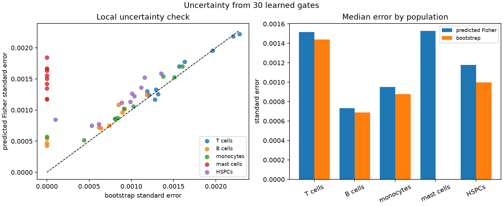

# Quantization at scale

This is where ScoreQuant enters. Everything before it — the classifier, the
calibration audit, the score algebra — is application code described on the
[score page](scores.md). Everything after it — templates, the mixture
likelihood, the coverage study — is application code too. In between there is
one call.

## The API boundary

This use case learns a reusable rule from externally estimated scores, so it
uses an explicit `ScoreSample` and `fit_quantizer`:

<!-- snippet: skip -->
```python
quantizer = sq.fit_quantizer(
    sq.ScoreSample(reference_scores[partition_rows], integration_weights),
    validation=sq.ScoreSample(reference_scores[validation_rows], validation_weights),
    n_bins=8,
    criterion=sq.DOptimality(),
    config=sq.SoftVoronoiConfig(
        seed=2026,
        n_init=4,
        max_steps=160,
    ),
)

test_bins = quantizer.predict_scores(test_scores)
held_out_report = quantizer.evaluate_scores(test_scores)
print(held_out_report.geometric_mean_retention)
```

There are five practical API rules hidden in this short block:

1. Pass raw statistical scores. Do not center them; the origin has statistical
   meaning.
2. Use nonnegative measure weights to define the reference integration measure.
   Here they give every patient equal influence within a class and reproduce
   \(\theta_0\) across classes.
3. Treat validation as a diagnostic. ScoreQuant deliberately does not use it to
   choose centers.
4. Freeze the result and call `predict_scores` on scores in the same parameter
   order.
5. Inspect both information and occupancy. A high D-efficiency does not prevent
   a held-out bin from becoming empty.

The same algebra is available through `ratios_from_posteriors` and
`mixture_scores_from_ratios`, or as a provider through
`DensityRatioScore.from_classifier`. Evaluated linear components first pass
through `scores_from_components`; callable components use `ObservationSample`
with `LinearComponentScore`.

## What it costs on 600,000 cells

The complete research run — six bin counts, eight representations at each,
twenty random-partition repeats, and the full reference-only closure suite —
took 207.8 seconds of wall clock and 1,867 MB of peak resident memory on one
machine. The breakdown is the interesting part:

| Stage | Seconds |
| --- | ---: |
| Score model, cross-fitting, and score construction | 144.5 |
| All partitions and baselines, 5 bins | 8.1 |
| All partitions and baselines, 8 bins | 4.1 |
| All partitions and baselines, 10 bins | 3.6 |
| All partitions and baselines, 15 bins | 3.9 |
| All partitions and baselines, 20 bins | 4.7 |
| All partitions and baselines, 30 bins | 5.7 |
| Reference-only scientific closure | 33.1 |
| **Total** | **207.8** |

Seventy percent of the run is the upstream classifier. The whole
partition-and-baseline sweep — every learned partition and quantizer at all six
bin counts, together with the five competing representations, the twenty random
repeats, and the downstream mixture fit of all ten held-out patients against
200,000 events — is 30 seconds. That is the practical answer to "does the default
path work at large N": it is not the part you wait for.

The learned rules are fitted on a bounded, deterministically capped subsample of
the reference cohort rather than on all 400,000 reference rows, and prediction
then runs on everything:

| Role | Rows |
| --- | ---: |
| Reference cohort | 400,000 |
| Partition fitting | 27,607 |
| Validation diagnostics (never used to choose centers) | 13,796 |
| Bin-template estimation | 99,999 |
| Frozen held-out cohort | 200,000 |

```python
import json
from pathlib import Path

metrics = json.loads(Path("docs/usecases/assets/cell_population.json").read_text())
run = metrics["run"]

assert run["rows"] == {
    "reference": 400_000,
    "test": 200_000,
    "partition": 27_607,
    "validation": 13_796,
    "templates": 99_999,
}
assert round(run["elapsed_seconds"], 1) == 207.8
assert round(run["timings_seconds"]["score_model_and_scores"], 1) == 144.5
assert round(run["peak_rss_megabytes"]) == 1867
```

## Retention against the bin budget

The three columns below measure the same quantity on three different row sets.
Train and validation use the reference integration measure; the held-out column
uses the empirical test measure, so it is a transport statement rather than a
generalization gap in the usual sense.

| Bins | Train | Validation | Held out | Smallest held-out bin | Hardening gap |
| ---: | ---: | ---: | ---: | ---: | ---: |
| 5 | 0.1555 | 0.1587 | 0.3911 | 39 | \(-6.5\times10^{-7}\) |
| 8 | 0.9869 | 0.9874 | 0.9846 | 6 | \(-4.6\times10^{-6}\) |
| 10 | 0.9911 | 0.9923 | 0.9903 | 6 | \(+2.4\times10^{-6}\) |
| 15 | 0.9960 | 0.9963 | 0.9952 | 6 | \(+3.9\times10^{-6}\) |
| 20 | 0.9974 | 0.9971 | 0.9963 | **0** | \(-3.8\times10^{-6}\) |
| 30 | 0.9990 | 0.9992 | 0.9984 | **0** | \(-1.6\times10^{-6}\) |

The hardening gap — the difference between the soft objective the optimizer
descends and the hard partition it finally reports — never exceeds
\(4\times10^{-6}\) in absolute value. The soft rule is not flattering itself.

```python
for n_bins, train, held_out, smallest in (
    (5, 0.1555, 0.3911, 39),
    (8, 0.9869, 0.9846, 6),
    (20, 0.9974, 0.9963, 0),
    (30, 0.9990, 0.9984, 0),
):
    row = metrics[f"soft_voronoi:{n_bins}"]
    assert round(row["train_d_efficiency"], 4) == train
    assert round(row["held_out_d_efficiency"], 4) == held_out
    assert row["minimum_bin_count"] == smallest
    assert abs(row["hardening_gap"]) < 5e-6
```

## Why five bins fail

There are six population fractions constrained to sum to one, so the downstream
fit has five free parameters. A patient contributes five bin counts when
`n_bins=5`, but their sum is the fixed number of sampled cells. Only four bin
frequencies are independent. In general, a fixed-total mixture of \(K\) classes
needs at least \(K\) bins:

\[
B-1\geq K-1.
\]

The reference-only audit confirms the algebra for every seed from 2026 through
2035. Both score k-means and soft Voronoi have conditional information rank four
at five bins and rank five at six and eight bins. The five-bin D-efficiency for
the fixed-total likelihood is therefore exactly zero, even though the
unconditioned supplied-score diagnostic in the table above is 0.391.

This discrepancy is informative. An intensity or Poisson model can use the total
event rate and therefore has \(B\) count coordinates. The FlowCyt patient fit
conditions on 20,000 cells and has only \(B-1\). Approximate classifier scores
also have a nonzero mean, so an unconditioned second moment can appear to
contain a fifth direction that the downstream likelihood cannot use.

The machine evidence includes a direct null-space witness: for the five-bin soft
Voronoi partition, two six-class compositions separated by 0.041 in Euclidean
norm produce bin probabilities agreeing to \(3.5\times10^{-18}\). For six and
eight bins the template contrasts are full rank, with condition numbers 4.83 and
5.56.

```python
closure = metrics["scientific_closure"]
identifiability = closure["template_identifiability"]

five = identifiability["soft_voronoi:5"]
assert five["effective_rank"] == 4 and five["full_rank"] is False
assert five["nonidentifiability_witness"]["maximum_bin_probability_difference"] < 1e-17
assert round(five["nonidentifiability_witness"]["fraction_separation_norm"], 3) == 0.041
assert closure["fixed_total_information"]["soft_voronoi:5"]["d_efficiency"] == 0.0

assert round(identifiability["soft_voronoi:6"]["condition_number"], 2) == 4.83
assert round(identifiability["soft_voronoi:8"]["condition_number"], 2) == 5.56
assert closure["seed_stability"]["seeds"] == list(range(2026, 2036))
```

## The exact finite-D exchange and its compile bridge

At the eight-bin operating point, the exact finite-D exchange scan runs on the
same 27,607-row partition subset as the quantizer fits. It starts from the
trace-k-means labels and accepts no relocation: the best remaining
log-determinant gain is \(-7.15\times10^{-8}\), so the initial partition is
already exchange-stable at the configured tolerance. Its supplied-score
D-efficiency is 0.98705 on the partition rows and 0.98528 after compiling and
evaluating the rule on held-out events. Compilation reproduces every
positive-weight training label, has zero geometry gap, and reaches 0.00209
downstream RMSE.

This is evidence of agreement between two solver paths on this dataset, not
evidence that exact exchange improves the initialization.

```python
finite_d = metrics["finite_d_exchange:8"]

assert finite_d["exchange_stable"] is True
assert finite_d["accepted_moves"] == 0
assert finite_d["best_remaining_gain"] <= 0
assert finite_d["compiled_training_labels_reproduced"] is True
assert finite_d["geometry_gap"] == 0.0
assert round(finite_d["finite_assignment_d_efficiency"], 5) == 0.98705
assert round(finite_d["held_out_d_efficiency"], 5) == 0.98528
assert round(finite_d["target_macro_rmse"], 5) == 0.00209
```

## What was compared

Every hard method receives the same number of outputs and feeds the same
downstream likelihood:

| Representation | Question it answers | Held-out macro RMSE at 8 bins |
| --- | --- | ---: |
| Finite D assignment on the 27,607-row partition sample | How much can exact positive-gain relocation improve a fixed table, and does verified compilation reproduce its labels? | 0.00209 |
| Score k-means | How strong is weighted clustering after Fisher whitening? | 0.00209 |
| Soft Voronoi | Does direct differentiable D-optimal fitting help? | 0.00193 |
| Marker k-means | Is ordinary clustering in twelve-marker space sufficient? | 0.02889 |
| One leading score direction | How much is lost by a one-dimensional gate variable? | 0.01809 |
| Two marker-PCA coordinates on a grid | How does naive axis-aligned gating behave? | 0.08333 |
| Random score Voronoi, 20 repeats | Is score space alone enough without learning centers? | 0.01870 (median) |
| Unbinned classifier-ratio likelihood | What happens when the selected approximate density ratios are trusted directly? | 0.00173 |

The exact finite-D solver is part of the normative 600k workflow, but its
optimization table contains the same bounded 27,607 partition rows used by the
other learned rules — not all 600,000 events. Its candidate scan is vectorized
over rows and bins, while accepted moves still trigger a fresh exact scan. The
result is therefore a full-workflow finite-assignment reference, not a claim of
an all-corpus optimizer or a streaming implementation.

The near equality of score k-means and soft Voronoi is a useful result. The
Fisher transform already supplies a strong geometry, and weighted k-means is a
competitive default here. The study supports score-aware partitioning; it does
not establish universal superiority of one optimizer.

An unbinned classifier-ratio baseline can be worse than a learned hard partition
when its ratio model is biased. That would not mean discarding data creates
information. With exact component likelihood ratios, unbinned Fisher information
is the upper bound and the matrix ordering is verified in the synthetic oracle
test. Here the unbinned fit trusts estimated classifier ratios directly, while
the binned pipeline re-estimates \(P(B_j\mid k)\) from independent labelled
reference rows. Hard bins can therefore act as a low-dimensional recalibration
and regularizer for an imperfect ratio model. After the reference-only
calibration audit, the frozen test result follows the expected direction: the
unbinned classifier-ratio macro RMSE is 0.00173, against 0.00193 for eight hard
bins.

## Turning hard labels into fractions

After the partition is frozen, an independent labelled reference subset
estimates the template matrix

\[
A_{jk}=P(B_j\mid k).
\]

Templates are averaged per patient so that a large sample cannot dominate the
cohort. A Jeffreys pseudocount of \(1/2\) prevents an unseen class/bin pair from
making the likelihood exactly zero. For test-patient bin counts \(n_j\), the
downstream likelihood is

\[
\log L(\theta)=
\sum_j n_j\log\left(\sum_k A_{jk}\theta_k\right).
\]

Its local identifiability is controlled by the five template contrasts
\(A_{:a}-A_{:\mathrm{other}}\). Their singular values, effective rank, and
condition number are part of the evidence. This check happens before a
covariance or convergence flag is interpreted.

The example solves this concave simplex problem with deterministic EM. Local
covariance is computed in the five free directions and lifted back to all six
fractions. Singular directions are projected with a pseudoinverse; no ridge is
allowed to invent information.

Convergence tracks identifiability exactly as it should. At eight bins and above,
all ten patient likelihoods converge for every learned partition, and the
slowest needs 68 iterations. At five bins the soft-Voronoi partition is the
non-identifiable case, and two of its ten patient fits exhaust the 10,000-
iteration cap; five-bin score k-means still converges, but takes up to 983
iterations to do it. The 10,000-iteration cap is also reached by one patient
under the one-dimensional score baseline at 30 bins.

```python
assert metrics["soft_voronoi:8"]["likelihood_convergence"] == {
    "converged_patients": 10,
    "total_patients": 10,
    "maximum_iterations": 68,
}
assert metrics["soft_voronoi:5"]["likelihood_convergence"]["converged_patients"] == 8
assert metrics["soft_voronoi:5"]["likelihood_convergence"]["maximum_iterations"] == 10_000
assert metrics["score_kmeans:5"]["likelihood_convergence"] == {
    "converged_patients": 10,
    "total_patients": 10,
    "maximum_iterations": 983,
}
```

This likelihood is application code under `examples/cell_population/`. It
consumes the generic hard labels but is not part of ScoreQuant's public API.

### Reference-only pseudo-patients

The downstream pipeline is also tested without consulting the frozen test cohort.
Eleven compositions cover \(\theta_0\) and a factor-of-two change in each target
fraction. For each composition, twenty deterministic pseudo-patients of 20,000
events are sampled only from reference validation rows.

At six bins, all 220 pseudo-patient likelihoods converge. Soft Voronoi reaches
0.000657 macro RMSE and score k-means reaches 0.000728. At eight bins the values
are 0.000754 and 0.000865. The unbinned classifier-ratio fit reaches 0.000972.
The binned results can be better here because their templates are independently
estimated from labelled reference rows; this is low-dimensional recalibration of
an approximate ratio model, not information created by discarding events.

Five-bin score k-means reaches 0.00231 but remains non-identifiable. Five-bin
soft Voronoi reaches 0.00733 and none of its 220 fits meets the convergence
tolerance. With six or eight bins, all expected-count fits converge and recover
the known fractions to about \(10^{-7}\).

```python
pseudo = closure["pseudo_patients"]

assert pseudo["protocol"]["source"] == "reference_validation_rows_only"
assert pseudo["protocol"]["repeats_per_composition"] == 20
assert len(pseudo["by_composition"]) == 11
assert pseudo["methods"]["soft_voronoi:5"]["converged_pseudo_patients"] == 0
assert pseudo["methods"]["soft_voronoi:6"]["converged_pseudo_patients"] == 220
assert round(pseudo["methods"]["soft_voronoi:6"]["target_macro_rmse"], 6) == 0.000657
assert round(pseudo["methods"]["score_kmeans:8"]["target_macro_rmse"], 6) == 0.000865
assert round(pseudo["methods"]["unbinned_classifier_ratio"]["target_macro_rmse"], 6) == 0.000972
```

## Per-population behavior

At the eight-bin operating point, the held-out RMSE values are:

| Population | RMSE |
| --- | ---: |
| T cells | 0.00429 |
| B cells | 0.00112 |
| Monocytes | 0.00160 |
| Mast cells | 0.00028 |
| HSPCs | 0.00235 |
| Other | 0.00640 |

The small absolute mast-cell RMSE needs care. The true mast fraction is usually
only a few events in a 20,000-cell patient sample, and some patients have none
after proportional rounding. Absolute RMSE therefore looks small even when the
relative error is poor. This is a general warning for rare mixture components:
one summary number cannot replace the per-class table.

## Uncertainty: validate the interior, mark the boundary

The uncertainty check uses the frozen 30-bin reference templates and no test
patients. For each of two known compositions, it draws 1,000 multinomial
pseudoexperiments of 20,000 events and compares empirical variation with the
local Fisher covariance.



At the reference composition, T cells, B cells, monocytes, HSPCs, and `other`
remain interior. Their local-to-empirical standard-error ratios range from 0.987
to 1.041, and their nominal 68% Wald coverages range from 0.676 to 0.700. That
is the regime where the quadratic calculation has a clear interpretation, and
the systematic undercoverage of a few points is itself worth reading: a nominal
68% Wald interval on a simplex is an approximation even in the interior.

Mast cells are different. Their reference fraction is 0.00019 — only 3.8 expected
events in a 20,000-cell patient — and 45.2% of constrained estimates lie within
half an event of the simplex boundary. The audit labels this result
`boundary_dominated` and publishes neither a standard-error ratio nor Wald
coverage for it. There is no artificial denominator.

As a controlled check, the second composition raises the mast fraction to 0.005.
Boundary hits disappear entirely; the local-to-empirical error ratio is 0.973 and
coverage is 0.675 — squarely inside the interior range above. This isolates the
failure as a boundary problem rather than a general covariance bug. A profile-
likelihood or another constrained interval construction is still required when
inference on the reference-like mast fraction matters.

```python
uncertainty = metrics["uncertainty"]
assert uncertainty["protocol"]["source"] == "frozen_reference_templates"
assert uncertainty["protocol"]["draws_per_scenario"] == 1_000

reference_mast = uncertainty["scenarios"]["reference_like"]["classes"]["mast cells"]
assert reference_mast["status"] == "boundary_dominated"
assert reference_mast["interior_standard_error_ratio"] is None
assert reference_mast["interior_68_percent_coverage"] is None
assert round(reference_mast["boundary_hit_fraction"], 3) == 0.452

enriched_mast = uncertainty["scenarios"]["mast_enriched"]["classes"]["mast cells"]
assert enriched_mast["status"] == "interior"
assert enriched_mast["boundary_hit_fraction"] == 0.0
assert round(enriched_mast["interior_standard_error_ratio"], 3) == 0.973
assert round(enriched_mast["interior_68_percent_coverage"], 3) == 0.675

interior = [
    row
    for name, row in uncertainty["scenarios"]["reference_like"]["classes"].items()
    if row["status"] == "interior"
]
ratios = [row["interior_standard_error_ratio"] for row in interior]
assert round(min(ratios), 3) == 0.987 and round(max(ratios), 3) == 1.041
```

## Patient shift and empty bins

The test cohort is measurably shifted even though it comes from the same
benchmark. After the frozen reference transform, the median absolute marker shift
is 0.123 robust-scale units, the maximum channel shift is 0.225, and the mean
score shift has Euclidean norm 0.809.

At 20 and at 30 bins, the soft-Voronoi rule leaves at least one bin empty on the
held-out cohort even though its D-efficiency stays above 0.996. That combination
is possible because the remaining occupied bins preserve the five informative
score directions. Operationally, however, empty bins are a warning about
transport and template stability, and score k-means keeps a minimum of one event
per bin at the same budgets. This is another reason to prefer eight bins for
this dataset.

```python
shift = metrics["shift"]
assert round(shift["median_absolute_standardized_marker_shift"], 3) == 0.123
assert round(shift["maximum_absolute_standardized_marker_shift"], 3) == 0.225
assert round(shift["score_mean_shift_norm"], 3) == 0.809

assert metrics["soft_voronoi:20"]["minimum_bin_count"] == 0
assert metrics["soft_voronoi:30"]["minimum_bin_count"] == 0
assert metrics["score_kmeans:20"]["minimum_bin_count"] == 1
assert metrics["score_kmeans:30"]["minimum_bin_count"] == 1
```

## Reproduce the run

Install the complete development environment:

```bash
uv sync --all-extras --all-groups --locked
```

For the fast CI-scale integration workflow, use the committed 34,554-cell
fixture:

```bash
JAX_ENABLE_X64=1 MPLBACKEND=Agg \
  uv run python -m examples.cell_population \
  --fixture examples/data/flowcyt_fixture.npz \
  --quick
```

For the complete all-patient study, first build the ignored 600,000-cell sample
as described on the [data page](data.md#the-bounded-600000-cell-sample), then run
the frozen research settings:

```bash
JAX_ENABLE_X64=1 MPLBACKEND=Agg \
  uv run python -m examples.cell_population \
  --fixture flowcyt-results/flowcyt_sample_20000.npz \
  --full \
  --bins 5 8 10 15 20 30 \
  --output-dir docs/usecases/assets
```

The JSON evidence records elapsed time, peak resident memory, and per-stage
timings for the exact run that generated the figures.
