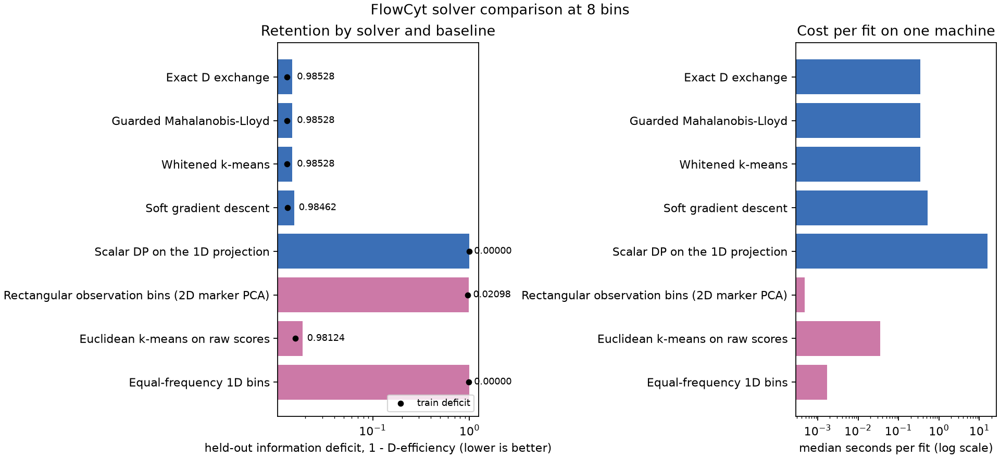

# Solver comparison: real data

[`solver-shootout`](../../examples/solver-shootout.md) runs every solver the dispatch
table accepts, plus the three canonical baselines from `examples.baselines`, on one
synthetic problem built so a single score direction carries almost everything. This page
repeats that exercise on FlowCyt itself: the same 27,607-row partition subsample and
200,000-row held-out cohort every other page in this section uses, split by the frozen
patient cohorts `examples.cell_population.data.REFERENCE_PATIENTS` and
`TEST_PATIENTS` declare.

Two questions carry over unanswered from the synthetic page. Do the small differences
among information-aware solvers survive an estimated classifier score and a genuinely
shifted held-out cohort? And does the near-tie between the exact scalar dynamic program
and everything else survive contact with a score law that is not confined to one line?
The answer to the second question is no, and the reason is the headline result of this
page.



The left panel is the held-out information deficit, \(1-D\text{-efficiency}\), on a log
axis so the two-orders-of-magnitude gap between the information-aware cluster and the
scalar dynamic program stays visible; the black dot on each bar marks that method's
training deficit. The right panel is the median wall-clock cost per fit on one machine, log
scale, colored the same way: blue for a ScoreQuant solver, pink for a canonical baseline.

## The rows, exactly

Every solver and baseline below is fitted on the study's partition subsample and scored
on its frozen held-out cohort — the identical rows [quantization.md](quantization.md) and
[profiled.md](profiled.md) use, at the study's eight-bin operating point.

| Role | Frozen CI fixture | 600,000-cell bounded sample |
| --- | ---: | ---: |
| Partition-fitting rows | 7,038 | 27,607 |
| Held-out rows (empirical test measure) | 20,480 | 200,000 |

Training retention is measured under the reference integration weights that reproduce
\(\theta_0\); held-out retention is measured under the empirical test measure — one unit
of weight per cell — exactly as [profiled.md](profiled.md#the-rule-you-could-actually-deploy)
explains for its own rule table.

<!-- snippet: skip -->
```python
import scorequant as sq
from examples.cell_population.solvers import SEED, load_solver_inputs

inputs = load_solver_inputs("flowcyt-results/solver_inputs_sample.npz")
source = sq.ScoreSample(inputs.partition_scores, inputs.partition_weights)

for name, criterion, config in [
    ("Exact D exchange", sq.DOptimality(), sq.DExchangeConfig(seed=SEED, n_init=8)),
    (
        "Guarded Mahalanobis-Lloyd",
        sq.DOptimality(),
        sq.MahalanobisLloydConfig(seed=SEED, n_init=8),
    ),
    ("Whitened k-means", sq.NormalizedTrace(), sq.KMeansConfig(seed=SEED, n_init=8)),
    (
        "Soft gradient descent",
        sq.DOptimality(),
        sq.SoftVoronoiConfig(seed=SEED, n_init=8, max_steps=160, record_every=20),
    ),
]:
    rule = sq.fit_quantizer(source, n_bins=8, criterion=criterion, config=config)
    held_out = rule.evaluate_scores(inputs.test_scores).geometric_mean_retention
    print(name, held_out)
```

The scalar dynamic program needs a different input — one score coordinate — so it takes
the leading weighted-variance direction of the training scores
(`examples.synthetic_problems.separable_1d_direction`, the same helper the synthetic
shootout uses) and is then scored against the full five-column score law, exactly like
every other method. The equal-frequency baseline shares that same direction, so the two
scalar methods are compared on the same coordinate. This module adds nothing to the
library; every retention number below comes from `scorequant.information_report`, never
hand-rolled algebra.

## Retention and search effort, 600,000-cell bounded sample

| Method | Solver | Train | Held out | Search effort | Seconds | Ratio |
| --- | --- | ---: | ---: | --- | ---: | ---: |
| Exact D exchange | `DExchangeConfig` | 0.98705 | 0.98528 | 1 scan, 0 accepted moves | 0.343 | 1.01 |
| Guarded Mahalanobis-Lloyd | `MahalanobisLloydConfig` | 0.98705 | 0.98528 | 1 Lloyd step, 1 scan, 0 accepted moves | 0.346 | 1.01 |
| Whitened k-means | `KMeansConfig` | 0.98705 | 0.98528 | 6 Lloyd iterations | 0.341 | **1.00** |
| Soft gradient descent | `SoftVoronoiConfig` | 0.98691 | 0.98462 | 160 Adam steps | 0.531 | 1.56 |
| Scalar DP on the 1D projection | `ScalarDPConfig` | \(4.9\times10^{-6}\) | \(2.2\times10^{-6}\) | exact (no local search) | 15.867 | 46.5 |
| Rectangular observation bins | baseline | 0.04076 | 0.02098 | — | 0.001 | 0.001 |
| Euclidean k-means on raw scores | baseline | 0.98415 | 0.98124 | — | 0.035 | 0.10 |
| Equal-frequency 1D bins | baseline | 0.01554 | \(5.4\times10^{-10}\) | — | 0.002 | 0.005 |

Timing methodology is unchanged from the synthetic shootout: one machine, one process,
one warm-up call per method to absorb JAX tracing and compilation, then the median of
three timed repetitions. Absolute seconds live in the JSON with a machine note; only
ratios (relative to the fastest information-aware fit, whitened k-means) belong in prose.
`scans` and `accepted_moves` describe exact-exchange work, `lloyd_iterations` describes
guarded batch relabelings, and `iterations` describes a k-means or soft-Voronoi trace
length — the library never merges these counters, and neither does this table.

Exact D exchange, guarded Mahalanobis-Lloyd, and whitened k-means agree to five decimals:
0.98705 training, 0.98528 held out. That is not a coincidence
worth re-deriving — it is the same partition [quantization.md](quantization.md#the-exact-finite-d-exchange-and-its-compile-bridge)'s
`finite_d_exchange:8` entry already reports, reached independently by exchange, by the
guarded batch step handing off to exchange, and by weighted k-means converging to the
same basin.

## Does it hold at CI scale?

The frozen 34,554-cell fixture runs the same eight comparisons in about six seconds.

| Method | Held out, frozen fixture | Held out, bounded sample |
| --- | ---: | ---: |
| Exact D exchange | 0.97876 | 0.98528 |
| Guarded Mahalanobis-Lloyd | 0.97876 | 0.98528 |
| Whitened k-means | 0.97876 | 0.98528 |
| Soft gradient descent | 0.97649 | 0.98462 |
| Scalar DP on the 1D projection | 0.08814 | \(2.2\times10^{-6}\) |
| Rectangular observation bins | 0.13883 | 0.02098 |
| Euclidean k-means on raw scores | 0.97107 | 0.98124 |
| Equal-frequency 1D bins | 0.00011 | \(5.4\times10^{-10}\) |

Four of five information-aware solvers, and the Euclidean baseline, tell the same story
at both scales: near-tied, comfortably ahead of every baseline. The scalar family does
not, and that disagreement is itself the finding — the next section explains it rather
than averaging it away.

## Every number on this page

```python
import json
from pathlib import Path

evidence = json.loads(Path("docs/usecases/assets/flowcyt_solvers.json").read_text())
sample, fixture = evidence["sample_scale"], evidence["fixture_scale"]

assert sample["run"]["provenance"]["scale"] == "600,000-cell bounded sample"
assert sample["run"]["rows"]["partition"] == 27_607
assert sample["run"]["rows"]["test"] == 200_000
assert fixture["run"]["provenance"]["scale"] == "frozen CI fixture"
assert fixture["run"]["rows"]["partition"] == 7_038
assert fixture["n_bins"] == sample["n_bins"] == 8

sample_methods = {row["key"]: row for row in sample["methods"]}
fixture_methods = {row["key"]: row for row in fixture["methods"]}
assert (
    set(sample_methods)
    == set(fixture_methods)
    == {
        "d_exchange",
        "mahalanobis_lloyd",
        "whitened_kmeans",
        "soft_voronoi",
        "scalar_dp",
        "rectangular_observation_bins",
        "euclidean_kmeans_scores",
        "equal_frequency_1d",
    }
)

# The three exchange-stable-basin solvers agree to five decimals on the sample.
tied = ["d_exchange", "mahalanobis_lloyd", "whitened_kmeans"]
for key in tied:
    assert round(sample_methods[key]["train_retention"], 5) == 0.98705
    assert round(sample_methods[key]["held_out_retention"], 5) == 0.98528
assert sample_methods["d_exchange"]["exchange_stable"] is True
assert sample_methods["d_exchange"]["scans"] == 1
assert sample_methods["d_exchange"]["accepted_moves"] == 0
assert sample_methods["mahalanobis_lloyd"]["lloyd_iterations"] == 1
assert sample_methods["whitened_kmeans"]["iterations"] == 6
assert round(sample_methods["soft_voronoi"]["held_out_retention"], 5) == 0.98462
assert sample_methods["soft_voronoi"]["iterations"] == 160

# Fastest information-aware fit anchors every ratio.
fastest_key = min(
    (key for key, row in sample_methods.items() if row["family"] == "information_aware"),
    key=lambda key: sample_methods[key]["seconds"],
)
assert fastest_key == "whitened_kmeans"
assert sample_methods[fastest_key]["seconds_ratio"] == 1.0

# The scalar family collapses on the anisotropic sample and only partly on the
# near-isotropic, class-balanced fixture.
assert round(sample_methods["scalar_dp"]["held_out_retention"], 5) == 0.0
assert sample_methods["scalar_dp"]["held_out_retention"] < 1e-4
assert round(sample_methods["equal_frequency_1d"]["held_out_retention"], 5) == 0.0
assert round(fixture_methods["scalar_dp"]["held_out_retention"], 5) == 0.08814

# Every information-aware solver but the scalar dynamic program beats every
# baseline held out, at both scales; the scalar program loses to all three.
for methods in (sample_methods, fixture_methods):
    baselines = [row for row in methods.values() if row["family"] == "baseline"]
    best_baseline = max(row["held_out_retention"] for row in baselines)
    for key in ("d_exchange", "mahalanobis_lloyd", "whitened_kmeans", "soft_voronoi"):
        assert methods[key]["held_out_retention"] > best_baseline
    assert methods["scalar_dp"]["held_out_retention"] < best_baseline

# Euclidean k-means on raw scores is the closest baseline and the cheapest solid option.
assert round(sample_methods["euclidean_kmeans_scores"]["held_out_retention"], 5) == 0.98124
gap = (
    sample_methods["d_exchange"]["held_out_retention"]
    - sample_methods["euclidean_kmeans_scores"]["held_out_retention"]
)
assert round(gap, 5) == 0.00404
```

## What actually separates real data from the synthetic shootout

The synthetic shootout's problem has two components, so its whole score cloud lies on
one affine line by construction — the page proves this identity before using it. FlowCyt's
five score columns carry no such constraint. The unbinned Fisher matrix's eigenvalues on
the 600,000-cell sample are

\[
15.0,\ 48.8,\ 65.0,\ 110.6,\ 3905.5,
\]

a 260-fold spread between the leading and trailing directions — anisotropic, but not
remotely rank one. A one-dimensional projection captures the leading direction almost
perfectly and next to nothing of the other four:

<!-- snippet: skip -->
```python
import numpy as np
import scorequant as sq
from examples.cell_population.solvers import load_solver_inputs
from examples.synthetic_problems import separable_1d_direction

inputs = load_solver_inputs("flowcyt-results/solver_inputs_sample.npz")
scores, weights = inputs.partition_scores, inputs.partition_weights
direction = separable_1d_direction(scores, weights)
rule = sq.fit_quantizer(
    sq.ScoreSample((scores @ direction)[:, None], weights),
    n_bins=8,
    criterion=sq.DOptimality(),
    config=sq.ScalarDPConfig(seed=2026, max_rows=len(scores)),
)
report = sq.information_report(
    scores, rule.predict_scores((scores @ direction)[:, None]), weights, n_bins=8
)
print(report.retained_eigenvalues)
```

The five retained eigenvalue ratios are approximately
\(3.7\times10^{-8}\), \(1.9\times10^{-7}\), \(9.9\times10^{-5}\), \(1.1\times10^{-4}\), and
\(0.9999\). One direction is essentially fully retained; the other four are not. The
`geometric_mean_retention` a D-efficiency number multiplies all five ratios together, so
four near-zero factors drag the aggregate to \(3.8\times10^{-5}\) even though the leading
direction alone looks almost perfect. This is not a defect of the scalar dynamic program —
within its one declared coordinate it is still the exact global optimum — it is what
"exact on one axis" costs when the axis is not the whole story. The snippet above needs
the uncommitted 600,000-cell cache and the full-cost dynamic program, so it is not run in
CI; the retained eigenvalues it prints are transcribed here and are also computable from
the smaller, committed CI fixture at the cost of a different, less anisotropic geometry
(next section).

The frozen CI fixture disagrees in degree because it disagrees in geometry: its reference
cohort is class-balanced by construction (`data.md`'s [CI fixture
section](data.md#the-committed-ci-fixture) states this), so its own Fisher eigenvalues
span only

\[
5.1,\ 5.3,\ 5.4,\ 9.4,\ 31.1,
\]

a six-fold spread rather than 260-fold. A near-isotropic score cloud has much less to lose
along the four directions a 1D projection ignores, which is why the fixture's scalar-DP
row reads 0.08814 held out instead of collapsing to machine noise. Neither number is
"more correct"; they measure the same solver against two genuinely different geometries,
and the gap between them is itself evidence that a solver's rank on one dataset does not
transfer to another without checking the eigenvalue spread first.

## Where the baselines land

Rectangular observation bins on the two leading marker-PCA coordinates lose badly at both
scales (0.02098 sample, 0.13883 fixture held out) — consistent with the marker-space grid
[quantization.md](quantization.md#what-was-compared) already reports losing to every
score-space method. Equal-frequency bins on the shared 1D projection fail for the same
reason the scalar dynamic program does: a fixed marginal coordinate cannot see the other
four directions, however evenly it splits the one it has.

Euclidean k-means on raw scores is the one baseline that holds up: 0.98124 held out on the
sample, only 0.00404 behind exact D exchange, and roughly ten times cheaper. That gap is
close enough to matter for a quick check and far enough that it is not a substitute — the
same caveat [solver-shootout.md](../../examples/solver-shootout.md#claim-2-the-metric-matters-but-you-have-to-look-where-it-can-act)
raises about unweighted, unwhitened clustering: it ignores the reference measure, and it
has no invariance guarantee if a future score-model version changes the relative units of
the five columns. On FlowCyt today the gap is small because the classifier's score
columns already sit on comparable scales; nothing in the baseline itself would tell you if
that stopped being true.

The starkest number in the table is not a comparison among baselines, though. At both
scales, the exact scalar dynamic program — an information-aware, ScoreQuant-dispatched
solver — loses held out to two of the three naive baselines: rectangular observation bins,
which ignores the score law entirely, and Euclidean k-means on raw scores. It edges out
only the equal-frequency baseline, and both of those numbers are themselves catastrophic
(\(2.2\times10^{-6}\) against \(5.4\times10^{-10}\) on the sample — a four-orders-of-
magnitude margin between two numbers that both round to zero). "Exact" described one
coordinate faithfully and said nothing about the other four; a solver that looks at raw
twelve-marker space and ignores the score law can still beat a solver that is exact on the
wrong-sized subspace of the right one. Family membership in the dispatch table is not a
retention guarantee by itself; the guarantee is scoped to the geometry the solver actually
searches.

## Practical recommendation

Use exact D exchange or whitened k-means as the default for this study: they are tied to
five decimals, both cost about a third of a second on 27,607 rows, and D exchange
additionally compiles into a certified Mahalanobis rule when it terminates
exchange-stable, which it does here. Guarded Mahalanobis-Lloyd adds nothing beyond that —
it reaches the identical basin at the identical cost, one Lloyd step from the same
k-means++ seed. Soft gradient descent is not wrong, but it has no reason to earn its 1.56x
cost premium here; it exists for criteria exact exchange cannot serve, and `DOptimality`
is not one of them on this problem.

Do not reach for a one-dimensional method — the exact scalar dynamic program or the
equal-frequency baseline — without first checking the score law's eigenvalue spread. Both
are exact or well-defined within their single coordinate, and both were competitive on the
synthetic shootout's deliberately rank-one problem. On FlowCyt's genuinely
five-dimensional, 260-fold-anisotropic score law, both are the worst methods in the table
by four orders of magnitude. Euclidean k-means on raw scores is a defensible quick
baseline when reaching for the full metric is inconvenient, provided the score columns'
relative units are trusted to stay fixed; it is not a substitute for the Fisher-aware
family when that trust is not available.

## Reproduce

The fixture-scale run takes about six seconds:

```bash
JAX_ENABLE_X64=1 MPLBACKEND=Agg \
  uv run python -m examples.cell_population \
  --solvers --quick \
  --fixture examples/data/flowcyt_fixture.npz
```

The bounded-sample run splits into a preparation stage and the comparison itself, so a
long run resumes from the cached score table instead of refitting the classifier:

```bash
JAX_ENABLE_X64=1 MPLBACKEND=Agg \
  uv run python -m examples.cell_population \
  --solvers-prepare-only --full \
  --fixture flowcyt-results/flowcyt_sample_20000.npz \
  --solvers-cache flowcyt-results/solver_inputs_sample.npz

JAX_ENABLE_X64=1 MPLBACKEND=Agg \
  uv run python -m examples.cell_population \
  --solvers --full \
  --fixture flowcyt-results/flowcyt_sample_20000.npz \
  --solvers-cache flowcyt-results/solver_inputs_sample.npz
```

Preparation took 139 seconds and the comparison itself 91 seconds for the published run.
Both commands merge their scale into
[`flowcyt_solvers.json`](../assets/flowcyt_solvers.json) without disturbing the other, and
the full-scale run also refreshes the committed figure at the top of this page.
