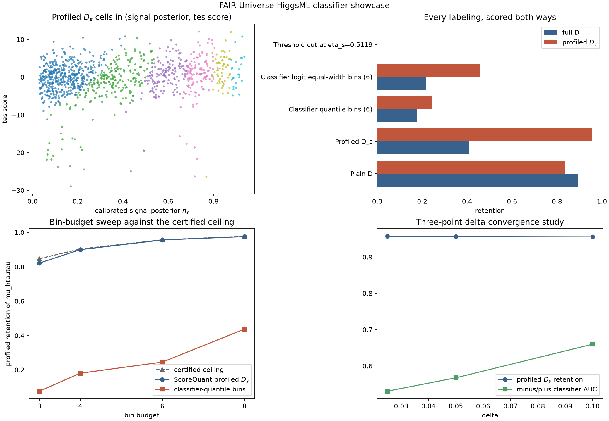

# HEP classifier study: a tau-energy-scale nuisance from the FAIR Universe HiggsML dataset

This page walks [Door 3](../../three-doors.md) (classifier to density ratios to scores) through
profiled \(D_s\) on a real particle-physics dataset: the
[FAIR Universe HiggsML Uncertainty Challenge](https://doi.org/10.5281/zenodo.15131565) public
sample, with an explicit tau-energy-scale (`tes`) nuisance. It follows the same module shape as
[the FlowCyt study](../flowcyt/index.md) and the analytic
[Michelson interferometer page](../../examples/michelson-phase.md) it is modeled on, but is the
project's only example that estimates a nuisance-shape score column through the library's
central-difference door, `CentralLogRatioScore`, rather than a closed-form or classifier-ratio
column alone.

## The measurement

The model is an extended linear intensity over the fixture's 1,000 events,

$$\lambda(x;\mu,\nu,\alpha)=\mu\,s(x;\alpha)+\nu\,b(x;\alpha),$$

with reference point \(\theta_0=(1,1,1)\) and three parameters: \(\mu\), the `htautau` signal
rate (**of interest**); \(\nu\), the combined background rate (nuisance, normalization); and
\(\alpha\), the tau energy scale `tes` (nuisance, shape).

**Why the backgrounds are collapsed.** `ztautau`, `ttbar`, and `diboson` are collapsed into one
background component. This is forced, not chosen: the committed sample carries 634 `ztautau`,
26 `ttbar`, and 4 `diboson` rows -- far too few of the latter two to support separate rate
normalizations. A reader who knows the challenge will expect the three background normalizations
upstream's `systematics.py` exposes; this study measures one combined background rate instead.

## Data and provenance

The fixture (`examples/data/hep_higgsml_fixture.npz`, 0.59 MB) holds seven row-aligned feature
matrices of the same 1,000 events, one per committed `tes` value, `tes` in
`{0.90, 0.95, 0.975, 1.00, 1.025, 1.05, 1.10}`, alongside Monte Carlo event weights and process
labels. `examples/hep_classifier/fixture.py` is the recorded build procedure -- it is **never**
run by the example, the tests, or CI -- and its sibling `.json` records provenance as three
separate facts, not one collapsed licence line:

- **Where the bytes came from:** `input_data/FAIR_Universe_HiggsML_data.parquet` in
  `FAIR-Universe/HEP-Challenge` at commit `31816a0d8c8dda03d4b28d9e824674821756962b`.
- **That the code repository carries no licence file.** The bytes were fetched from a repository
  with no licence of its own.
- **Which record the CC-BY-4.0 claim is made under:** the Zenodo archival record for the public
  dataset, DOI [`10.5281/zenodo.15131565`](https://doi.org/10.5281/zenodo.15131565), CC-BY-4.0 --
  not the code repository.

**Why `dopostprocess=False`.** Upstream's `tes` transformation rescales `PRI_had_pt`, recoils the
missing transverse momentum against the rescaled tau four-vector, and recomputes every derived
column from the shifted primaries -- ten of the twenty-eight feature columns respond. Upstream
then re-applies the `PRI_had_pt > 26` selection, which drops 169 of the 1,000 rows at
`tes = 0.90`. That is an acceptance change: the density ratio between a shifted-down and a
shifted-up sample would diverge at the selection threshold, and a central-difference estimate over
1,000 events cannot resolve it. The fixture holds the selection fixed
(`dopostprocess=False`) so every variant keeps the same 1,000 rows. This example therefore
measures the **shape** sensitivity of the features to the tau energy scale, not the acceptance
sensitivity -- a deliberate modelling choice, not an oversight.

## The classifier-to-score bridge

Two classifiers, through two different ratio doors:

- **The rate columns** (`mu_htautau`, `nu_background`) come from a signal-vs-background classifier
  through `DensityRatioScore.from_classifier` under
  `IntensityParameterization(coefficients=[1 - f, f])`, where `f` is the weighted signal fraction.
  Once the ratio is known the rate score is closed-form, so it is never finite-differenced.
- **The `tes` column** has no closed form: `tes` is a deterministic transformation of the
  features, so a `tes = 1 - delta` and a `tes = 1 + delta` sample are built from the same fixture
  rows, and a classifier trained to separate them feeds `CentralLogRatioScore` -- the library's
  central-difference door, and this project's first example to exercise it.

Both classifiers are cross-fitted **out-of-fold with one fold id per event**, reused by both
`tes` copies of that event. Two failure modes produce plausible-looking wrong numbers if this is
missed:

- **Fold leakage inverts the `tes` score.** Eighteen of the twenty-eight feature columns do not
  respond to `tes` at all, so under a plain per-row split the classifier memorizes an event from
  its static columns and answers with the label of the copy it trained on -- the *opposite* one.
  The design record measured an out-of-fold AUC of 0.3424 (below chance) with a plain
  `StratifiedKFold`, and 0.5733 once folds are grouped by event.
- **Raw Monte Carlo weights make the signal invisible.** Background events carry weight up to
  1584, signal as little as 3; the weighted signal fraction is ~0.001. Both classifiers train on
  per-class normalized weights with declared priors `(0.5, 0.5)`; the physical rate ratio enters
  through the `IntensityParameterization` coefficients, never through the priors -- the library's
  own doctrine that importance ratios are source weights, not provider inputs.

```python
from examples.hep_classifier import SCHEMA, load_fixture, load_provenance

data = load_fixture()
provenance = load_provenance()

assert data.n_events == 1_000
assert int(data.is_signal.sum()) == 336
assert SCHEMA.parameters == ("mu_htautau", "nu_background", "tes")
assert SCHEMA.select("mu_htautau") == (0,)
assert provenance["source_license"] == "CC-BY-4.0"
assert provenance["license_record_doi"] == "10.5281/zenodo.15131565"
```

The composed provider implements `scorequant.ScoreProvider` directly rather than subclassing a
built-in -- the two halves go through different ratio doors, and only their concatenated output is
a valid three-column score table:

```python
from examples.hep_classifier.experiment import run_study

study = run_study(n_folds=3, max_iter=60, soft_steps=80, budgets=(3, 6))
partitions = {row["key"]: row for row in study.metrics["partitions"]}

assert partitions["ds_partition"]["profiled_retention"] > max(
    partitions["classifier_quantile"]["profiled_retention"],
    partitions["classifier_logit_equal_width"]["profiled_retention"],
)
```

## The central prediction

Binning on the signal posterior \(\eta_s\) alone should lose profiled information, because
\(\eta_s\) is built to separate signal from background and knows nothing about `tes`: the region
where the signal concentrates is also where the tau energy scale moves events most, so profiling
over `tes` eats what those bins carry. **This is a prediction, not a guaranteed result** -- the
programme has precedent for negative results, and a walkthrough that quotes a number the run did
not produce is worth nothing.

Every labeling below is reported twice: full-\(D\) retention (the whole three-parameter Fisher
matrix) and profiled-\(D_s\) retention (the information about \(\mu\) alone, after \(\nu\) and
`tes` are Schur-completed out). The disagreement between the two columns is the entire reason a
profiled criterion exists.

| Labeling | Bins | Full \(D\) retention | Profiled \(D_s\) retention |
| --- | --- | --- | --- |
| Plain \(D\) | 6 | 0.8925 | 0.8370 |
| Profiled \(D_s\) | 6 | 0.4084 | **0.9560** |
| Classifier-quantile bins | 6 | 0.1782 | 0.2454 |
| Classifier logit equal-width bins | 6 | 0.2166 | 0.4552 |
| Threshold cut at \(\eta_s=0.5119\) | 2 | 0.0000 | 0.0000 |

The measured gap is large and in the predicted direction, **but how much of it you get depends on
how the classifier output is binned, and that turns out to matter more than one might expect.**
Equal-frequency cells of \(\eta_s\) retain 0.2454 of the profiled information; equal-width cells of
\(\operatorname{logit}\eta_s\) retain 0.4552 -- a spread of 0.2098 between two binnings of the
*same* posterior. A calibrated posterior on a 0.1% signal fraction piles up near zero, so
equal-width cells in \(\eta_s\) itself waste most of their range and the logit spreads that pile
out.

The honest headline is therefore the gap against the **strongest** of the two, not the first one
tried: profiled \(D_s\) retains **0.5008** more profiled information than the best one-dimensional
binning of the classifier output at the same six-bin budget. Quoted against the equal-frequency
baseline alone the gap reads 0.7106, and that number is real but flattering -- it measures the
weaker baseline's difficulty as much as the method's advantage.

What survives the stronger comparison is the point: even the best binning of \(\eta_s\) still gives
up half the profiled information, because \(\eta_s\) is one-dimensional and none of its
dimensions is the nuisance direction. No binning of a signal-versus-background score can recover
what that score never encoded.

Both criteria also show the usual trade -- each wins decisively on its own objective and gives up
substantially on the other (plain \(D\) gives up 0.4841 of full retention to gain 0.1190 of
profiled retention). The naive two-bin significance cut retains essentially nothing on either
criterion: with only two cells and three parameters, its between-cell covariance cannot resolve
both nuisance directions, the same failure mode the [Michelson
page](../../examples/michelson-phase.md) shows for aliased equal-width segments.

`efficient_score_bound` supplies the certified ceiling. At six bins, ScoreQuant's profiled
partition (`DExchangeConfig(seed=11)`, seeded from the bound's own labels) lands within 0.0009 of
that ceiling -- it is not merely better than the naive baseline, it is close to the best any
six-cell rule of this score space could do.

The sweep's baseline column is the equal-frequency binning, the weaker of the two; read it as the
shape of the trend across budgets, not as the headline gap.

| Bins | Profiled \(D_s\) (ScoreQuant) | Classifier-quantile bins | Certified ceiling | Certified gap |
| --- | --- | --- | --- | --- |
| 3 | 0.8214 | 0.0765 | 0.8469 | 0.0306 |
| 4 | 0.8998 | 0.1808 | 0.9035 | 0.0041 |
| 6 | 0.9560 | 0.2454 | 0.9569 | 0.0009 |
| 8 | 0.9757 | 0.4374 | 0.9772 | 0.0016 |

## The delta convergence study

`delta` is the finite-difference half-offset the central-log-ratio classifier is trained at, and
**it is a numerical differentiation step, not the physical tau-energy-scale uncertainty**, which
is nearer 1-3%. The score is the derivative of the log density at `tes = 1` whatever prior width
`tes` carries downstream, and reading these numbers as a physics uncertainty claim would be wrong.

The headline `delta = 0.05` is checked against `delta = 0.025` and `delta = 0.10`, the three
points the committed fixture carries:

| \(\delta\) | Minus/plus classifier AUC | Near-\(0.5\) fraction | Profiled \(D_s\) retention | Certified ceiling |
| --- | --- | --- | --- | --- |
| 0.025 | 0.5307 | 0.101 | 0.9567 | 0.9595 |
| 0.05 | 0.5674 | 0.091 | 0.9560 | 0.9569 |
| 0.10 | 0.6598 | 0.055 | 0.9552 | 0.9561 |

Two things are worth separating here, and neither was tuned to agree. The minus/plus classifier's
own discrimination task grows markedly easier with `delta` (AUC 0.53 to 0.66, exactly the large,
non-noise-limited deformation D3 measured directly against upstream's code), and the fraction of
events with an undecided (near-\(0.5\)) posterior falls by nearly half. Yet the *downstream*
quantity this example reports -- profiled retention of \(\mu\) at a fixed six-bin budget -- barely
moves: 0.9560 at the headline `delta = 0.05` against 0.9567 at `delta = 0.025`, a gap of 0.0007.
The pointwise correlation between the two `tes` score columns is only moderate (0.63) --
individual events' estimated scores shift with `delta` more than the aggregate retention number
does -- but the partition built from either agrees on what matters for this measurement. This
example's `delta` choice is not noise-limited at fixture scale, and the doc page states that
plainly rather than tuning `delta` until it was.

## Reusable rule

Finite profiled-\(D_s\) labels have no compile bridge (unlike an exchange-stable plain-\(D\)
partition), so a reusable rule is fitted with `fit_quantizer`/`SoftVoronoiConfig` instead, on
classifiers trained on every event (D8: "the classifier is trained inside the example"). At 1,000
events the fixture has no separate held-out split, so this number is explicitly in-sample: train
full retention 0.9730, train profiled retention 0.99999 (the soft fit essentially saturates its
own criterion), hardening gap \(-6\times10^{-12}\) -- numerically zero, meaning the deployed hard
rule reproduces the soft objective's own optimum almost exactly.



## Discussion

**Task:** both -- fixed-sample partitioning (`optimize_partition`) for the headline comparison and
the sweep, then a reusable rule (`fit_quantizer`) for the deployable route. **Door:** 3, classifier
to density ratios to scores, through two different ratio doors on the same provider --
`DensityRatioScore.from_classifier` for the rate columns and `CentralLogRatioScore` for the
nuisance-shape column, the project's first executed example of the latter. **Criterion / solver:**
`DOptimality` and `ProfiledDOptimality(interest=("mu_htautau",))` with `DExchangeConfig` for the
finite partitions, `SoftVoronoiConfig` for the reusable rule -- the same compatibility pairing
[`nuisance-profiled-ds`](../../examples/nuisance-profiled-ds.md) and
[`michelson-phase`](../../examples/michelson-phase.md) use, and for the same reason: finite
profiled-\(D_s\) labels have no canonical inductive rule to compile into.

Every number on this page is read from the committed evidence JSON
(`docs/examples/assets/hep-classifier.json`), regenerated deterministically by
`uv run python -m examples.hep_classifier` and pinned in `tests/test_evidence_suite.py`. The
matching notebook,
[`hep_classifier.ipynb`](https://github.com/VitalyVorobyev/scorequant/blob/main/examples/notebooks/hep_classifier.ipynb),
runs the classifier-to-score bridge live at fast-mode scale and re-derives the same tables.
